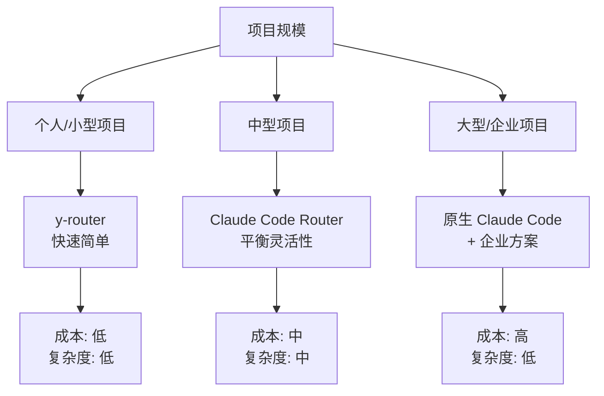
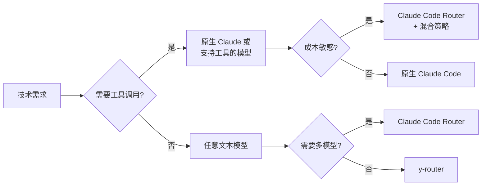
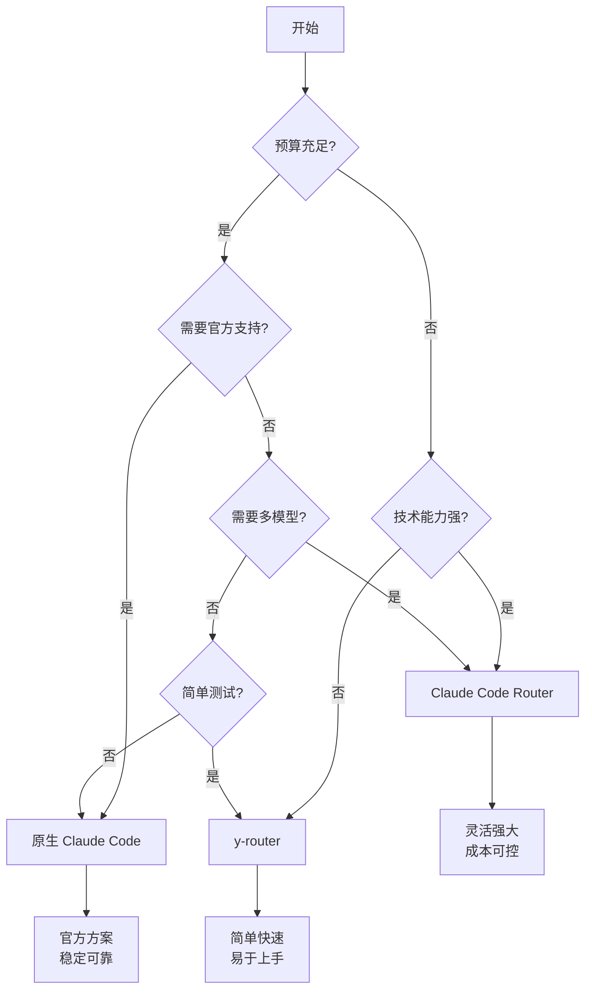

# Task 5: 路由解决方案对比与推荐

## 解决方案对比表

| 特性 | y-router | Claude Code Router | 原生 Claude Code |
|------|----------|-------------------|-----------------|
| **复杂度** | 简单 | 中等-复杂 | 无需配置 |
| **功能丰富度** | 基础 | 高级 | 完整 |
| **模型支持** | OpenRouter 兼容 | 多提供商 | 仅 Anthropic |
| **配置方式** | 环境变量 | JSON 配置文件 | API Key |
| **路由策略** | 单一 | 多维度智能路由 | 不适用 |
| **成本** | 依赖选择的模型 | 可使用免费模型 | 按 Anthropic 定价 |
| **部署难度** | 简单 | 中等 | 无需部署 |
| **社区支持** | 有限 | 活跃 | 官方支持 |

## 详细功能对比

### y-router 特点

**优势**：
- 轻量级解决方案，易于理解和部署
- 一键安装脚本，快速上手
- 支持 Docker 和 Cloudflare Workers 部署
- 适合快速测试和原型开发

**劣势**：
- 功能相对基础，缺乏高级路由能力
- 模型兼容性问题较多
- 缺乏详细的错误处理机制
- 社区支持和文档相对较少

**适用场景**：
- 快速测试 OpenRouter 模型
- 简单的成本优化需求
- 不需要复杂路由逻辑的项目

### Claude Code Router 特点

**优势**：
- 功能丰富，支持智能路由
- 多提供商支持（OpenRouter、DeepSeek、Ollama 等）
- API 密钥轮换机制
- 自定义 transformer 和路由逻辑
- 可使用多个免费模型（Kimi-K2、Qwen3-Coder 等）
- 活跃的社区和持续更新

**劣势**：
- 配置相对复杂
- 学习曲线较陡
- 可能存在并发限制（如 iFlow 限制）
- 第三方解决方案的稳定性考虑

**适用场景**：
- 需要复杂路由策略的企业项目
- 多模型协同工作
- 成本敏感且需要灵活性的项目
- 需要使用特定非 Anthropic 模型的场景

## 使用建议矩阵

### 根据项目规模选择



### 根据技术需求选择



## 具体推荐方案

### 场景 1：个人开发者测试

**推荐**：y-router
```bash
# 快速开始
bash -c "$(curl -fsSL https://cc.yovy.app/install.sh)"
export ANTHROPIC_API_KEY="your-openrouter-key"
claude "帮我写代码"
```

### 场景 2：初创公司成本优化

**推荐**：Claude Code Router + 免费模型组合
```json
{
  "Router": {
    "default": "iflow,Kimi-K2",  // 免费
    "think": "openrouter,anthropic/claude-3.5-sonnet",  // 付费但强大
    "background": "ollama,qwen2.5-coder:latest"  // 本地免费
  }
}
```

### 场景 3：企业级应用

**推荐**：原生 Claude Code + 官方企业方案
- 使用 AWS Bedrock 或 Google Vertex AI
- 配置企业级安全和合规
- 利用官方支持和 SLA

### 场景 4：研究和实验

**推荐**：Claude Code Router + 自定义路由
```javascript
// 实验性路由逻辑
module.exports = async function router(req, config) {
  // A/B 测试不同模型
  const useExperimental = Math.random() > 0.5;
  if (useExperimental) {
    return "deepseek,deepseek-reasoner";
  }
  return "openrouter,anthropic/claude-3.5-sonnet";
};
```

## 迁移路径建议

### 从 y-router 迁移到 Claude Code Router

1. **评估需求**：确认是否需要高级功能
2. **准备配置**：将环境变量转换为 JSON 配置
3. **测试兼容性**：验证模型支持
4. **逐步迁移**：先在开发环境测试

### 从第三方迁移到原生

1. **成本评估**：计算 ROI
2. **功能对比**：确认原生满足需求
3. **数据迁移**：导出配置和历史
4. **平滑过渡**：保持两个系统并行运行一段时间

## 风险与注意事项

### 使用第三方路由的风险

1. **数据安全**：请求经过第三方服务
2. **服务稳定性**：依赖第三方可用性
3. **功能限制**：某些 Claude Code 功能可能不支持
4. **更新延迟**：可能无法及时获得最新功能

### 缓解措施

1. **自托管部署**：使用自己的服务器
2. **多方案备份**：准备故障转移方案
3. **定期评估**：监控性能和成本
4. **社区参与**：关注更新和问题

## 最终建议

### 决策流程图



## 总结

1. **y-router** 适合快速开始和简单需求
2. **Claude Code Router** 提供最佳的灵活性和成本控制
3. **原生 Claude Code** 提供最佳的稳定性和官方支持
4. 选择应基于项目规模、预算、技术需求和团队能力
5. 建议从简单方案开始，根据需求逐步升级

## 参考资源

- [y-router GitHub](https://github.com/luohy15/y-router)
- [Claude Code Router GitHub](https://github.com/musistudio/claude-code-router)
- [Claude Code 官方文档](https://docs.anthropic.com/en/docs/claude-code)
- [社区最佳实践](https://www.anthropic.com/engineering/claude-code-best-practices)