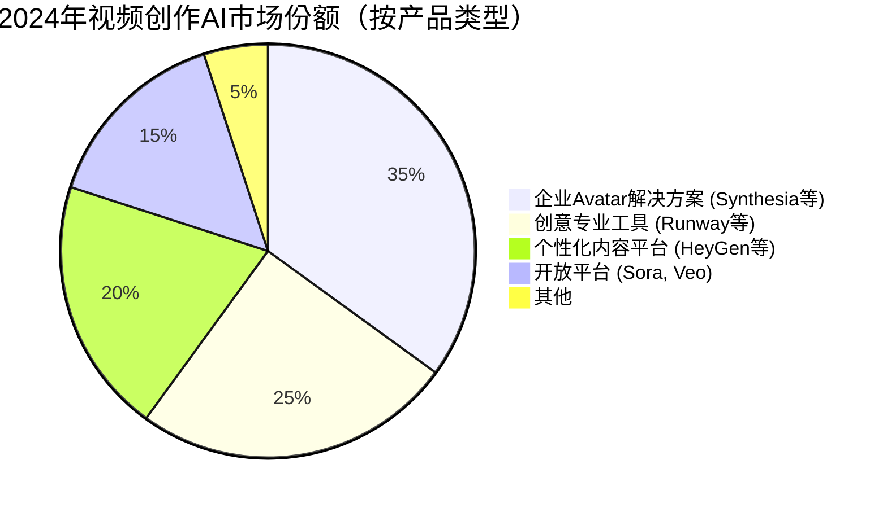
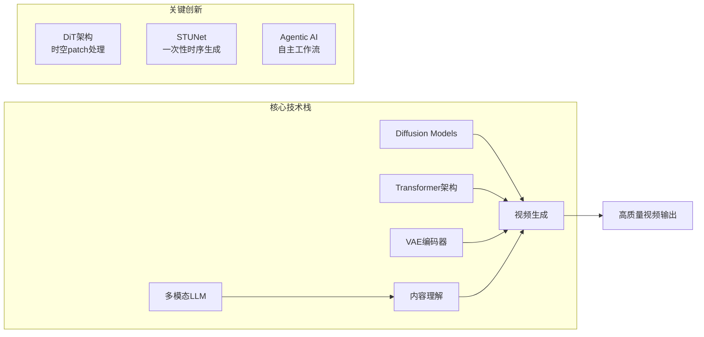
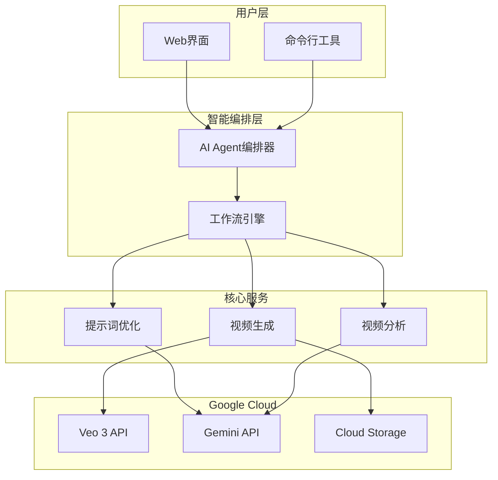

# 视频创作 Agent 调研报告

## 执行摘要

本研究针对视频创作 Agent 产品进行了全面调研，涵盖市场定位、核心技术以及基于 Google API 的技术架构设计。研究发现，2024年视频创作 AI 市场正处于爆发式增长期，市场规模从2024年的6.148亿美元预计将增长到2032年的25.629亿美元。领先产品如 Synthesia、HeyGen、Runway 和 OpenAI Sora 各有专长，而 Google 的 Veo 3 模型提供了强大的 API 支持，适合快速搭建演示系统。

## 研究背景

视频创作 Agent 代表了生成式 AI 的前沿应用，通过文本或图像输入自动生成高质量视频内容。本研究旨在：
- 了解当前视频创作 Agent 产品的市场格局
- 分析支撑这些产品的核心技术
- 设计一个基于 Google API 的视频创作 Agent 演示系统架构

## 主要发现

### 1. 市场格局与产品定位

根据 [Fortune Business Insights 的市场报告](https://www.fortunebusinessinsights.com/ai-video-generator-market-110060)，视频创作 AI 市场呈现以下特征：

**市场领导者分布：**


主要产品定位：
- **Synthesia**：企业培训和沟通，拥有最逼真的AI虚拟形象
- **HeyGen**：个性化虚拟形象创建，支持40+语言唇形同步
- **Runway**：专业创作者工具，提供高级运动控制
- **OpenAI Sora**：突破性的长视频生成（可达1分钟）
- **Google Veo 3**：集成生态系统，原生音频生成

详细分析见 [产品定位研究报告](./reports/task-1-video-agent-products-positioning.md)

### 2. 核心技术架构

现代视频创作 Agent 主要基于以下技术栈：



技术突破点：
- **Diffusion Transformer (DiT)**：OpenAI Sora 采用，实现分钟级视频生成
- **Space-Time U-Net**：Lumiere 创新，一次生成完整时序
- **多模态基础模型**：视觉-语言模型融合，实现深度理解

深入技术分析见 [核心技术研究报告](./reports/task-2-core-technologies.md)

### 3. Google API 生态系统

Google 提供了完整的视频创作 API 解决方案：

**Veo 3 模型能力：**
- 8秒 1080p 视频生成
- 原生音频同步生成
- 文本到视频、图像到视频
- $0.75/秒的定价模型

**API 访问方式：**
| 接入方式 | 适用场景 | 定价 | 特点 |
|---------|---------|------|------|
| Gemini API | 快速原型 | $19.99/月起 | 简单集成，快速上手 |
| Vertex AI | 企业应用 | 按用量计费 | SLA保证，高级配额管理 |

完整 API 指南见 [Google API 研究报告](./reports/task-3-google-apis-video-creation.md)

### 4. 技术架构设计

基于研究，我们设计了一个完整的视频创作 Agent Demo 架构：



架构特点：
- **智能Agent编排**：自动优化提示词，规划生成流程
- **异步处理**：支持并发视频生成任务
- **缓存优化**：相似内容复用，降低成本
- **可扩展设计**：支持水平扩展和多区域部署

详细架构设计见 [技术架构设计报告](./reports/task-4-technical-architecture-design.md)

## 快速开始指南

### 环境准备

```bash
# 1. 安装 Python SDK
pip install google-genai google-cloud-storage redis fastapi

# 2. 设置 API 密钥
export GEMINI_API_KEY="your-api-key"
export GOOGLE_APPLICATION_CREDENTIALS="path/to/credentials.json"
```

### 基础示例代码

```python
from google import genai
from google.genai import types

# 初始化客户端
client = genai.Client(api_key=GEMINI_API_KEY)

# 生成视频
async def create_video(prompt: str):
    operation = await client.models.generate_videos(
        model="veo-3.0-generate-001",
        prompt=prompt,
        config=types.GenerateVideoConfig(
            duration_seconds=8,
            resolution="1080p",
            include_audio=True
        )
    )
    
    # 等待完成
    while not operation.done:
        await asyncio.sleep(10)
        operation = client.operations.get(name=operation.name)
    
    return operation.result.generated_samples[0].video.uri
```

## 实施建议

### 第一阶段：MVP 开发（1-2周）
1. 搭建基础 API 集成
2. 实现简单的文本到视频生成
3. 添加基础的提示词优化

### 第二阶段：功能增强（2-4周）
1. 实现智能 Agent 编排
2. 添加视频分析和质量评估
3. 集成缓存和存储系统

### 第三阶段：产品化（4-8周）
1. 构建完整的用户界面
2. 实现批量处理和队列管理
3. 添加监控和性能优化

## 成本估算

基于 Google API 定价：

| 场景 | 月度使用量 | 预估成本 |
|------|-----------|---------|
| 开发测试 | 100个8秒视频 | ~$600 |
| 小规模应用 | 1000个8秒视频 | ~$6,000 |
| 生产环境 | 10000个8秒视频 | ~$60,000 |

*注：实际成本可通过缓存、批处理等优化策略降低30-50%*

## 技术挑战与解决方案

### 挑战1：生成时间长
- **问题**：单个视频生成需要2-5分钟
- **解决**：实现异步处理队列，批量并发生成

### 挑战2：成本控制
- **问题**：API调用成本高
- **解决**：智能缓存、提示词优化、分辨率分级

### 挑战3：质量保证
- **问题**：生成内容质量不稳定
- **解决**：多模态分析反馈循环，自动质量评分

## 市场机会

根据研究，视频创作 Agent 在以下领域具有巨大潜力：

1. **企业培训**：自动化培训视频制作，节省90%成本
2. **营销内容**：个性化广告视频批量生成
3. **教育科技**：交互式教学视频自动创建
4. **社交媒体**：UGC内容辅助创作工具
5. **电商展示**：产品视频自动化生成

## 总结与展望

视频创作 Agent 技术正处于快速发展期，以 Diffusion Transformer 为代表的新架构不断突破视频生成的质量和时长限制。Google 的 Veo 3 API 提供了成熟的技术基础，配合智能编排和优化策略，可以快速构建功能完善的视频创作 Agent 演示系统。

未来发展趋势：
- **更长视频**：从秒级向分钟级发展
- **实时生成**：降低延迟，实现即时创作
- **交互式生成**：用户可实时调整生成过程
- **多模态融合**：视频、音频、3D内容统一生成

## 研究报告目录

- [产品市场定位分析](./reports/task-1-video-agent-products-positioning.md)
- [核心技术深度解析](./reports/task-2-core-technologies.md)  
- [Google API 完整指南](./reports/task-3-google-apis-video-creation.md)
- [技术架构设计方案](./reports/task-4-technical-architecture-design.md)

## 参考资源

- [Google Veo 官方文档](https://ai.google.dev/gemini-api/docs/video)
- [Gemini API 快速入门](https://ai.google.dev/gemini-api/docs/quickstart)
- [视频生成模型对比](https://github.com/showlab/Awesome-Video-Diffusion)
- [多模态 AI 架构指南](https://www.bentoml.com/blog/multimodal-ai-a-guide-to-open-source-vision-language-models)

---

*研究完成日期：2025年1月*  
*研究团队：AI Research Assistant*