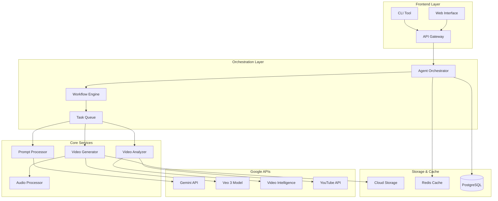

# Technical Architecture Design for Video Creation Agent Demo

## System Overview

This architecture design presents a comprehensive solution for building a video creation agent demo using Google APIs, incorporating best practices from industry leaders and leveraging modern AI orchestration patterns.

## Architecture Diagram



## Core Components

### 1. Frontend Layer

#### Web Interface
```typescript
// React + TypeScript Frontend
interface VideoRequest {
  prompt: string;
  style?: 'cinematic' | 'animated' | 'documentary';
  duration?: 4 | 6 | 8;
  resolution?: '720p' | '1080p';
  audioEnabled?: boolean;
}

const VideoCreationForm: React.FC = () => {
  const [request, setRequest] = useState<VideoRequest>({
    prompt: '',
    duration: 8,
    resolution: '1080p',
    audioEnabled: true
  });
  
  const handleSubmit = async () => {
    const response = await fetch('/api/v1/generate', {
      method: 'POST',
      body: JSON.stringify(request)
    });
    // Handle response
  };
};
```

#### API Gateway
```python
# FastAPI implementation
from fastapi import FastAPI, BackgroundTasks
from pydantic import BaseModel

app = FastAPI()

class VideoGenerationRequest(BaseModel):
    prompt: str
    style: str = "cinematic"
    duration: int = 8
    resolution: str = "1080p"
    audio_enabled: bool = True

@app.post("/api/v1/generate")
async def generate_video(
    request: VideoGenerationRequest,
    background_tasks: BackgroundTasks
):
    job_id = str(uuid.uuid4())
    background_tasks.add_task(
        orchestrator.process_request, 
        job_id, 
        request
    )
    return {"job_id": job_id, "status": "processing"}
```

### 2. Agent Orchestration Layer

#### Intelligent Agent Orchestrator
```python
import asyncio
from typing import Dict, List
from dataclasses import dataclass

@dataclass
class AgentTask:
    task_type: str
    payload: Dict
    dependencies: List[str] = None

class VideoCreationOrchestrator:
    def __init__(self):
        self.gemini_client = genai.Client(api_key=GEMINI_KEY)
        self.workflow_engine = WorkflowEngine()
        self.task_queue = AsyncTaskQueue()
    
    async def process_request(self, job_id: str, request: VideoGenerationRequest):
        # Step 1: Analyze and enhance prompt
        enhanced_prompt = await self.enhance_prompt(request.prompt)
        
        # Step 2: Create workflow plan
        workflow = self.create_workflow(enhanced_prompt, request)
        
        # Step 3: Execute workflow
        result = await self.workflow_engine.execute(workflow)
        
        # Step 4: Store results
        await self.store_results(job_id, result)
    
    async def enhance_prompt(self, prompt: str) -> Dict:
        """Use Gemini to analyze and enhance the prompt"""
        response = await self.gemini_client.models.generate_content(
            model='models/gemini-2.5-flash',
            contents=[{
                "parts": [{
                    "text": f"""Analyze this video prompt and enhance it with:
                    1. Subject details
                    2. Action descriptions
                    3. Style specifications
                    4. Camera movements
                    
                    Original prompt: {prompt}
                    
                    Return as JSON with fields: subject, action, style, camera"""
                }]
            }]
        )
        return json.loads(response.text)
```

#### Workflow Engine
```python
class WorkflowEngine:
    def __init__(self):
        self.stages = {
            'analyze': self.analyze_requirements,
            'generate': self.generate_video,
            'enhance': self.enhance_video,
            'publish': self.publish_video
        }
    
    async def execute(self, workflow: Dict) -> Dict:
        results = {}
        for stage in workflow['stages']:
            if stage['parallel']:
                # Execute parallel tasks
                tasks = [
                    self.stages[task['type']](task['params'])
                    for task in stage['tasks']
                ]
                stage_results = await asyncio.gather(*tasks)
            else:
                # Execute sequential tasks
                stage_results = []
                for task in stage['tasks']:
                    result = await self.stages[task['type']](task['params'])
                    stage_results.append(result)
            
            results[stage['name']] = stage_results
        
        return results
```

### 3. Core Video Generation Service

#### Video Generator with Google Veo
```python
from google import genai
from google.genai import types
import asyncio

class VideoGenerationService:
    def __init__(self):
        self.client = genai.Client(api_key=GEMINI_API_KEY)
        self.storage_client = storage.Client()
        
    async def generate_video(self, enhanced_prompt: Dict, config: Dict) -> str:
        """Generate video using Veo 3"""
        
        # Construct optimized prompt
        final_prompt = self._construct_prompt(enhanced_prompt)
        
        # Start video generation
        operation = await self.client.models.generate_videos(
            model="veo-3.0-generate-001",
            prompt=final_prompt,
            config=types.GenerateVideoConfig(
                duration_seconds=config.get('duration', 8),
                resolution=config.get('resolution', '1080p'),
                include_audio=config.get('audio_enabled', True)
            )
        )
        
        # Poll for completion with exponential backoff
        video_url = await self._poll_operation(operation)
        
        # Store in Cloud Storage
        stored_url = await self._store_video(video_url)
        
        return stored_url
    
    def _construct_prompt(self, enhanced: Dict) -> str:
        """Build optimized prompt from enhanced components"""
        return f"{enhanced['style']} shot of {enhanced['subject']} {enhanced['action']}. Camera: {enhanced['camera']}"
    
    async def _poll_operation(self, operation, max_wait=300):
        """Poll with exponential backoff"""
        wait_time = 5
        total_wait = 0
        
        while total_wait < max_wait:
            if operation.done:
                return operation.result.generated_samples[0].video.uri
            
            await asyncio.sleep(wait_time)
            total_wait += wait_time
            wait_time = min(wait_time * 1.5, 30)  # Cap at 30 seconds
            
            operation = self.client.operations.get(name=operation.name)
        
        raise TimeoutError("Video generation timed out")
```

### 4. Video Analysis and Enhancement

#### Video Understanding Service
```python
class VideoAnalysisService:
    def __init__(self):
        self.gemini_client = genai.Client()
        self.video_intelligence = videointelligence.VideoIntelligenceServiceClient()
    
    async def analyze_generated_video(self, video_url: str) -> Dict:
        """Analyze video for quality and content"""
        
        # Use Gemini for semantic analysis
        semantic_analysis = await self._gemini_analysis(video_url)
        
        # Use Video Intelligence for technical analysis
        technical_analysis = await self._technical_analysis(video_url)
        
        return {
            'semantic': semantic_analysis,
            'technical': technical_analysis,
            'quality_score': self._calculate_quality_score(
                semantic_analysis, 
                technical_analysis
            )
        }
    
    async def _gemini_analysis(self, video_url: str) -> Dict:
        """Use Gemini for semantic video understanding"""
        response = await self.gemini_client.models.generate_content(
            model='models/gemini-2.5-flash',
            contents=[{
                "parts": [
                    {"file_data": {"file_uri": video_url}},
                    {"text": "Analyze this video for: 1) Content accuracy 2) Visual quality 3) Narrative coherence"}
                ]
            }]
        )
        return json.loads(response.text)
```

### 5. Storage and Caching Layer

#### Distributed Caching Strategy
```python
import redis
import json
from typing import Optional

class CacheManager:
    def __init__(self):
        self.redis_client = redis.Redis(
            host='localhost', 
            port=6379, 
            decode_responses=True
        )
        self.ttl = 3600  # 1 hour
    
    async def get_cached_video(self, prompt_hash: str) -> Optional[str]:
        """Check if similar video exists"""
        cached = self.redis_client.get(f"video:{prompt_hash}")
        if cached:
            return json.loads(cached)
        return None
    
    async def cache_video(self, prompt_hash: str, video_data: Dict):
        """Cache generated video metadata"""
        self.redis_client.setex(
            f"video:{prompt_hash}",
            self.ttl,
            json.dumps(video_data)
        )
```

### 6. Database Schema

```sql
-- PostgreSQL schema for video agent
CREATE TABLE video_jobs (
    id UUID PRIMARY KEY DEFAULT gen_random_uuid(),
    user_id VARCHAR(255),
    prompt TEXT NOT NULL,
    enhanced_prompt JSONB,
    status VARCHAR(50) DEFAULT 'pending',
    config JSONB,
    created_at TIMESTAMP DEFAULT CURRENT_TIMESTAMP,
    updated_at TIMESTAMP DEFAULT CURRENT_TIMESTAMP
);

CREATE TABLE generated_videos (
    id UUID PRIMARY KEY DEFAULT gen_random_uuid(),
    job_id UUID REFERENCES video_jobs(id),
    video_url TEXT NOT NULL,
    thumbnail_url TEXT,
    duration_seconds INTEGER,
    resolution VARCHAR(10),
    has_audio BOOLEAN,
    analysis_results JSONB,
    created_at TIMESTAMP DEFAULT CURRENT_TIMESTAMP
);

CREATE INDEX idx_video_jobs_status ON video_jobs(status);
CREATE INDEX idx_video_jobs_user_id ON video_jobs(user_id);
```

## Deployment Architecture

### Container Configuration
```yaml
# docker-compose.yml
version: '3.8'

services:
  api:
    build: ./api
    environment:
      - GEMINI_API_KEY=${GEMINI_API_KEY}
      - GOOGLE_APPLICATION_CREDENTIALS=/app/credentials.json
    ports:
      - "8000:8000"
    depends_on:
      - redis
      - postgres
  
  worker:
    build: ./worker
    environment:
      - GEMINI_API_KEY=${GEMINI_API_KEY}
    depends_on:
      - redis
      - postgres
    scale: 3
  
  redis:
    image: redis:7-alpine
    ports:
      - "6379:6379"
  
  postgres:
    image: postgres:15
    environment:
      - POSTGRES_DB=video_agent
      - POSTGRES_USER=agent
      - POSTGRES_PASSWORD=${DB_PASSWORD}
    volumes:
      - postgres_data:/var/lib/postgresql/data
    ports:
      - "5432:5432"

volumes:
  postgres_data:
```

### Kubernetes Deployment (Production)
```yaml
apiVersion: apps/v1
kind: Deployment
metadata:
  name: video-agent-api
spec:
  replicas: 3
  selector:
    matchLabels:
      app: video-agent-api
  template:
    metadata:
      labels:
        app: video-agent-api
    spec:
      containers:
      - name: api
        image: gcr.io/project-id/video-agent-api:latest
        resources:
          requests:
            memory: "512Mi"
            cpu: "500m"
          limits:
            memory: "1Gi"
            cpu: "1000m"
        env:
        - name: GEMINI_API_KEY
          valueFrom:
            secretKeyRef:
              name: api-secrets
              key: gemini-key
```

## Monitoring and Observability

```python
# Monitoring implementation
from prometheus_client import Counter, Histogram, Gauge
import logging

# Metrics
video_generation_counter = Counter(
    'video_generations_total', 
    'Total number of videos generated'
)
video_generation_duration = Histogram(
    'video_generation_duration_seconds',
    'Time spent generating videos'
)
active_jobs = Gauge(
    'active_video_jobs',
    'Number of active video generation jobs'
)

class MonitoredVideoService:
    @video_generation_duration.time()
    async def generate_video(self, request):
        active_jobs.inc()
        try:
            result = await self._generate(request)
            video_generation_counter.inc()
            return result
        finally:
            active_jobs.dec()
```

## Security Considerations

```python
# Security middleware
from fastapi import HTTPException, Security
from fastapi.security import HTTPBearer, HTTPAuthorizationCredentials

security = HTTPBearer()

async def verify_token(credentials: HTTPAuthorizationCredentials = Security(security)):
    token = credentials.credentials
    # Verify JWT token
    if not verify_jwt(token):
        raise HTTPException(status_code=403, detail="Invalid authentication")
    return token

# Rate limiting
from slowapi import Limiter
from slowapi.util import get_remote_address

limiter = Limiter(key_func=get_remote_address)

@app.post("/api/v1/generate")
@limiter.limit("10/hour")
async def generate_video(request: VideoGenerationRequest):
    # Implementation
    pass
```

## Cost Optimization Strategies

1. **Prompt Caching**: Cache similar prompts to avoid regeneration
2. **Resolution Tiering**: Start with 720p for testing, upgrade to 1080p for final
3. **Batch Processing**: Group similar requests for efficient processing
4. **Regional Deployment**: Deploy in regions with lower API costs
5. **Smart Polling**: Use exponential backoff to reduce API calls

## Performance Metrics

Expected performance based on Google API specifications:
- **Video Generation Time**: 2-5 minutes per 8-second video
- **Concurrent Jobs**: 10-50 depending on quota
- **API Response Time**: < 500ms for job submission
- **Storage Upload**: < 10 seconds for 8-second video

## Scalability Considerations

1. **Horizontal Scaling**: Worker nodes can be scaled based on queue depth
2. **Queue Management**: Use Redis or Cloud Pub/Sub for reliable job queuing
3. **Storage Sharding**: Distribute videos across multiple storage buckets
4. **CDN Integration**: Use Cloud CDN for global video delivery

This architecture provides a robust, scalable foundation for a video creation agent demo that can be quickly prototyped and later scaled to production workloads.