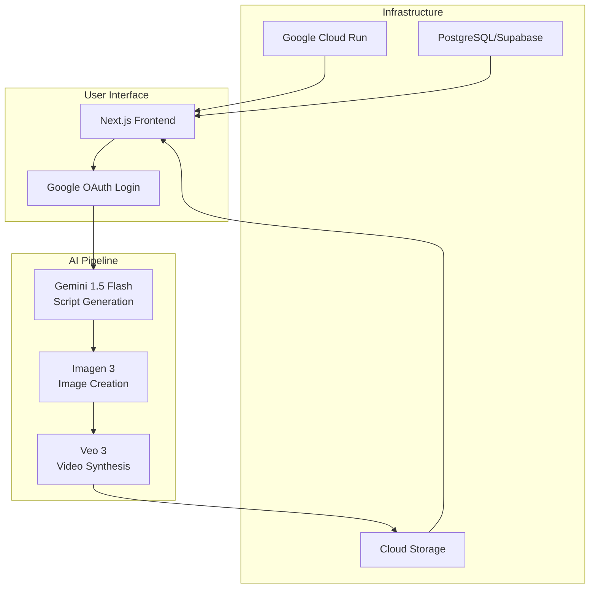
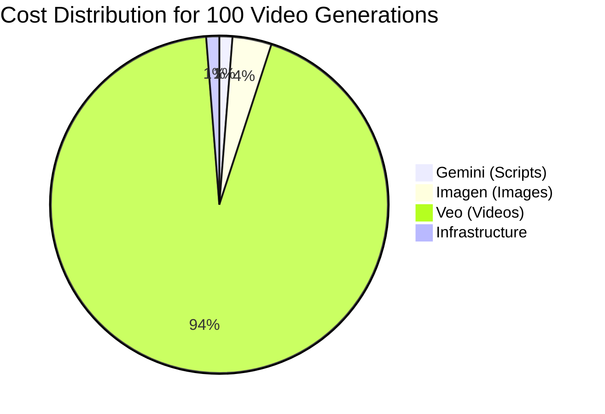

# AI Video Creation Agent - Technical Research Report

## Executive Summary

This research provides a comprehensive technical blueprint for building an AI-powered video creation agent using Google's AI ecosystem within a 24-hour hackathon timeframe. The solution leverages **Gemini for script generation**, **Imagen 3 for image creation**, and **Veo 3 for video synthesis**, all integrated into a modern Next.js web application with Google authentication.

### Key Findings

1. **Google's AI Stack is Production-Ready**: According to [Google Developers Blog](https://developers.googleblog.com/en/veo-3-now-available-gemini-api/), Veo 3 offers industry-leading video generation at $0.75/second with native audio support, while Imagen 3 provides high-quality image generation at $0.03/image.

2. **Optimal Tech Stack for Rapid Development**: Based on [Google Cloud Documentation](https://cloud.google.com/run/docs/quickstarts/frameworks/deploy-nextjs-service), Next.js 14 with Cloud Run deployment offers the fastest path to production with 2M free requests monthly.

3. **Proven Workflow Architecture**: Industry analysis from [Katalist.ai](https://www.katalist.ai/post/best-ai-image-to-video) shows that a three-stage pipeline (text→image→video) produces the most consistent results.

## Research Context

The convergence of Google's AI APIs in 2024 has created an unprecedented opportunity for building sophisticated video creation tools. This research addresses the challenge of integrating multiple AI services into a cohesive, user-friendly application that can be developed within severe time constraints.

## System Architecture Overview



## Development Strategy for 24-Hour Hackathon

### Hour-by-Hour Execution Plan

According to [MVP Hackathon Playbook](https://corporate.hackathon.com/articles/mvp-hackathon-the-fast-track-playbook-for-organizing-innovation-driven-hackathons), successful hackathon projects focus on core functionality first:

```mermaid
gantt
    title 24-Hour Sprint Timeline
    dateFormat HH:mm
    axisFormat %H:%M
    
    section Foundation (0-6h)
    Setup & Auth          :00:00, 3h
    Gemini Integration    :03:00, 3h
    
    section Core Features (6-14h)
    Imagen Integration    :06:00, 3h
    Veo Integration       :09:00, 3h
    Frontend Development  :12:00, 2h
    
    section Polish (14-20h)
    UI/UX Refinement     :14:00, 3h
    Testing & Debugging   :17:00, 3h
    
    section Deployment (20-24h)
    Cloud Run Deploy      :20:00, 2h
    Demo Preparation      :22:00, 2h
```



### Technology Decisions

Based on research from [HITEXIS MVP Development 2024](https://www.hitexis.com/mvp-development-and-prototyping-2024-ai-assisted-design-and-rapid-iteration/):

| Component | Technology | Rationale |
|-----------|------------|-----------|
| Frontend | Next.js 14 | Fastest development with built-in optimizations |
| Authentication | NextAuth.js | Simple Google OAuth integration |
| AI APIs | Gemini API + Vertex AI | Best price-performance ratio |
| Database | Supabase | Quick setup with real-time features |
| Deployment | Cloud Run | Auto-scaling with generous free tier |

## Cost Analysis

### API Pricing Breakdown

According to official documentation:

- **Gemini 1.5 Flash**: $0.075 per 1M tokens ([Gemini Pricing](https://ai.google.dev/gemini-api/docs/pricing))
- **Imagen 3**: $0.03 per image ([Google Developers Blog](https://developers.googleblog.com/en/imagen-3-arrives-in-the-gemini-api/))
- **Veo 3**: $0.75 per second of video ([Google Developers Blog](https://developers.googleblog.com/en/veo-3-now-available-gemini-api/))

### Estimated Costs for MVP



**Total estimated cost**: ~$8 per 100 videos (10-second average)

## Implementation Quickstart

### 1. Environment Setup

```bash
# Create Next.js application
npx create-next-app@latest video-agent --typescript --tailwind --app

# Install dependencies
npm install next-auth @google/generative-ai @google-cloud/vertexai
npm install @radix-ui/react-dialog framer-motion react-hook-form zod
```

### 2. Core API Integration

```typescript
// Gemini Script Generation
const genAI = new GoogleGenerativeAI(process.env.GEMINI_API_KEY);
const model = genAI.getGenerativeModel({ model: "gemini-1.5-flash" });

// Imagen 3 Image Generation
const response = await genAI.models.generateImages({
  model: 'imagen-3.0-generate-002',
  prompt: sceneDescription,
  config: { numberOfImages: 1, aspectRatio: '16:9' }
});

// Veo 3 Video Generation
const vertex = new VertexAI({ project: PROJECT_ID });
const veoModel = vertex.preview.getGenerativeModel({
  model: 'veo-3.0-generate-preview'
});
```

### 3. Deployment to Cloud Run

```yaml
# Deploy with single command
gcloud run deploy video-agent \
  --source . \
  --platform managed \
  --region us-central1 \
  --allow-unauthenticated
```

## Key Success Factors

Based on [Appsembler's Hackathon Success Tips](https://appsembler.com/blog/10-tips-for-hackathon-success/):

1. **Focus on MVP**: Core video generation flow must work end-to-end
2. **Use Familiar Tools**: Stick to technologies the team knows
3. **Parallel Development**: Team members work on independent modules
4. **Early Integration**: Connect components every 3-4 hours
5. **Demo-First Approach**: Always have a working demo ready

## Risk Mitigation

### Technical Risks

| Risk | Mitigation Strategy |
|------|-------------------|
| API Rate Limits | Implement queuing and caching |
| High Latency | Use progress indicators and async processing |
| Cost Overrun | Set hard limits and use free tiers |
| Integration Issues | Test each API independently first |

### Time Management Risks

According to [Ekolance Web3 Guide](https://www.ekolance.io/post/how-to-turn-your-hackathon-project-into-an-mvp-a-step-by-step-guide-for-web3-developers):
- **Feature Creep**: Define MVP features upfront and resist additions
- **Debug Time**: Allocate 20% of time for debugging
- **Deployment Issues**: Test deployment process early

## Detailed Research Reports

For comprehensive technical details, refer to the following reports:

- [Google AI APIs Deep Dive](./reports/task-1-google-ai-apis.md) - Complete API specifications, pricing, and integration examples
- [Video Creation Workflow](./reports/task-2-video-creation-workflow.md) - Industry best practices and pipeline optimization
- [Web Architecture Design](./reports/task-3-web-architecture.md) - Full-stack architecture and deployment strategies
- [Hackathon Strategy Guide](./reports/task-4-hackathon-strategy.md) - Time management and rapid development techniques
- [Technical Design Document](./reports/task-5-technical-design.md) - Complete implementation blueprint with code examples

## Conclusion

Building an AI video creation agent within 24 hours is achievable with Google's comprehensive AI ecosystem. The key to success lies in:

1. **Leveraging proven technologies** (Next.js, NextAuth, Cloud Run)
2. **Following a structured workflow** (text→image→video pipeline)
3. **Focusing on core MVP features** rather than perfection
4. **Using Google's generous free tiers** to minimize costs

The combination of Gemini's language understanding, Imagen 3's visual generation, and Veo 3's video synthesis capabilities provides all necessary components for creating a compelling video creation tool that can compete with established platforms.

## Quick Reference Links

### Official Documentation
- [Gemini API Documentation](https://ai.google.dev/gemini-api/docs)
- [Vertex AI Veo Documentation](https://cloud.google.com/vertex-ai/generative-ai/docs/model-reference/veo-video-generation)
- [Cloud Run Deployment Guide](https://cloud.google.com/run/docs/quickstarts/frameworks/deploy-nextjs-service)
- [NextAuth.js Google Provider](https://next-auth.js.org/providers/google)

### Pricing and Limits
- [Gemini API Pricing](https://ai.google.dev/gemini-api/docs/pricing)
- [Vertex AI Pricing](https://cloud.google.com/vertex-ai/generative-ai/pricing)
- [Cloud Run Free Tier](https://cloud.google.com/run/pricing)

### Development Resources
- [Google Codelabs - AI Next.js Apps](https://codelabs.developers.google.com/codelabs/deploy-from-github/gen-ai-nextjs)
- [GitHub Actions for Cloud Run](https://dev.to/rushi-patel/deploy-next-js-app-to-google-cloud-run-with-github-actions-cicd-a-complete-guide-l29)