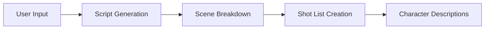
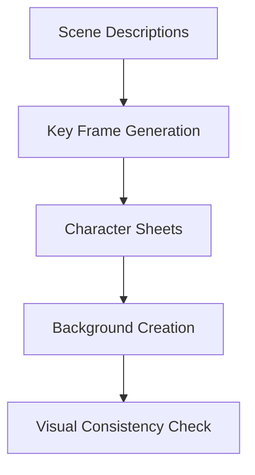
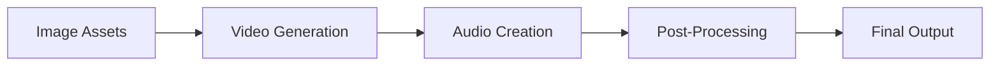
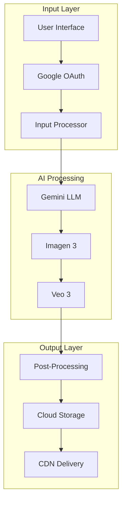

# Video Creation Workflow and Pipeline Architecture

## Executive Summary

Creating an effective AI-powered video generation workflow requires careful orchestration of multiple AI models, with a focus on maintaining consistency, quality, and user experience throughout the pipeline.

## 1. Industry Best Practices for AI Video Creation

### Image-to-Video Workflow Excellence

According to [Flux AI's Ultimate Guide](https://flux-ai.io/blog/detail/The-Ultimate-Guide:-Image-to-Video-Creation-with-Runway-Gen-3-and-Flux-AI-bd83acb1e3d9/), the key to successful video creation lies in starting with high-quality images:

- **Foundation Quality**: "Starting with high-quality images is crucial - tools utilize ChatGPT for generating prompts, transforming simple prompts into complex ones that are well understood by Stable Diffusion"
- **Consistency**: "The ability to keep scenes and characters consistent allows creators to build full stories instead of just single images"

### Platform Performance Insights

Based on [Katalist.ai's comparative analysis](https://www.katalist.ai/post/best-ai-image-to-video):

- **Stable Diffusion Video** surprisingly leads in efficiency, achieving impressive results within 2-3 generations
- **Runway and Pika** require multiple attempts and toggling between modes
- **Google Veo** leads in 4K photorealism with integrated audio
- **Processing Requirements**: SDV needs robust GPU (Nvidia 4080 RTX requires ~120 seconds for 2-second video at 1344x768px)

## 2. Optimal Workflow Architecture

### Three-Stage Pipeline

According to [Runway Academy](https://academy.runwayml.com/gen3-alpha/using-image-to-video-in-gen3-alpha) and industry practices:

#### Stage 1: Pre-Production (LLM-Driven)


**Key Activities:**
- Parse user requirements using Gemini LLM
- Generate detailed scene descriptions
- Create character profiles with visual references
- Develop shot-by-shot storyboard text

#### Stage 2: Asset Generation (Image Creation)


According to [Segmind's Guide](https://blog.segmind.com/creating-ai-videos-with-runway-gen-3-image-to-video/):
- Generate establishing shots first
- Create character reference sheets
- Produce background plates
- Maintain consistent style parameters

#### Stage 3: Video Production


## 3. Professional Hybrid Workflows

### Art-Directed Animation Workflow

Based on industry practices documented in [Katalist.ai](https://www.katalist.ai/post/best-ai-image-to-video):

1. **Key-Frame Generation**
   - Use consistent seeds for cohesive look
   - Create character sheets and establishing shots
   - Export to video model for dynamic motion

2. **Motion Application**
   - For character animation: Kuaishou Kling recommended
   - For camera movements: Runway Director Mode
   - For photorealism: Google Veo with integrated audio

### Marketing Campaign Workflow

According to professional practices:

1. **Hero Concept Creation**
   - Use Google Veo for high-quality initial version
   - Leverage photorealism and integrated audio

2. **Variation Generation**
   - Import into Runway for video-to-video processing
   - Apply different visual styles
   - Use "Erase & Replace" for product swaps

## 4. Technical Implementation Guidelines

### Prompt Engineering Best Practices

According to [Google Cloud Veo Documentation](https://cloud.google.com/vertex-ai/generative-ai/docs/video/video-gen-prompt-guide):

**Effective Prompting:**
- Use descriptive language with specific adjectives
- Provide context and background information
- Reference specific artistic styles
- Keep prompts focused on primary action

**Example Structure:**
```
"[Camera movement], [Subject description], [Action], 
[Environment], [Lighting], [Style reference]"
```

### Quality Optimization Techniques

Based on [Runway Gen-3 Documentation](https://help.runwayml.com/hc/en-us/articles/33350169138323-Creating-with-Video-to-Video-on-Gen-3-Alpha-and-Turbo):

1. **Input Quality**
   - Minimum 720p resolution (1280x720)
   - Aspect ratio: 16:9 or 9:16
   - Clear, detailed source images

2. **Processing Parameters**
   - Straightforward, focused prompts
   - Single primary action per generation
   - Iterative refinement approach

## 5. Pipeline Implementation for Google Stack

### Recommended Architecture



### Processing Flow

1. **User Input Processing**
   - Authenticate via Google OAuth
   - Capture video requirements
   - Parse into structured format

2. **Content Generation**
   - Gemini generates script and descriptions
   - Imagen 3 creates visual assets
   - Veo 3 produces video segments

3. **Assembly and Delivery**
   - Combine video segments
   - Apply transitions
   - Store in Cloud Storage
   - Deliver via CDN

## 6. Performance Optimization

### Parallel Processing Strategy

According to best practices from [Medium - Runway ML](https://medium.com/@moba1720902/runway-ml-and-future-of-generative-ai-powered-visual-effects-5ea91f5588b6):

- Generate multiple image variations simultaneously
- Process video segments in parallel
- Implement queue management for API calls
- Cache frequently used assets

### Post-Processing Enhancement

Based on industry recommendations:

1. **Resolution Upscaling**
   - Use AI upscaling tools (Topaz Video AI mentioned)
   - Target 4K output from 1080p source
   - Increase frame rate to 60fps

2. **Artifact Removal**
   - Apply noise reduction
   - Stabilize shaky segments
   - Color correction and grading

## 7. Error Handling and Fallbacks

### Retry Logic

- Implement exponential backoff for API failures
- Store intermediate results
- Provide fallback options for each stage
- User notification for processing delays

### Quality Assurance

- Automated content moderation
- Visual consistency validation
- Audio-video sync verification
- Final quality checks before delivery

## References

- [Flux AI - Ultimate Guide to Image-to-Video](https://flux-ai.io/blog/detail/The-Ultimate-Guide:-Image-to-Video-Creation-with-Runway-Gen-3-and-Flux-AI-bd83acb1e3d9/)
- [Katalist.ai - Best AI Image to Video](https://www.katalist.ai/post/best-ai-image-to-video)
- [Runway Academy - Gen-3 Alpha](https://academy.runwayml.com/gen3-alpha/using-image-to-video-in-gen3-alpha)
- [Google Cloud - Veo Prompt Guide](https://cloud.google.com/vertex-ai/generative-ai/docs/video/video-gen-prompt-guide)
- [Segmind - Creating AI Videos with Runway Gen-3](https://blog.segmind.com/creating-ai-videos-with-runway-gen-3-image-to-video/)
- [Medium - Runway ML and Future of VFX](https://medium.com/@moba1720902/runway-ml-and-future-of-generative-ai-powered-visual-effects-5ea91f5588b6)