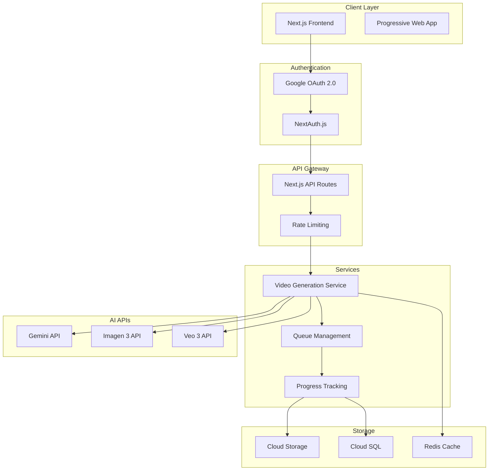
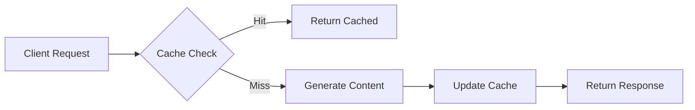

# Web Application Architecture for AI Video Creation Service

## Executive Summary

Building a production-ready web application for AI video creation requires a modern, scalable architecture leveraging Google Cloud services, with Next.js as the frontend framework and Cloud Run for serverless deployment.

## 1. Technology Stack Recommendations

### Frontend Framework: Next.js 14/15

According to [Google Cloud Documentation](https://cloud.google.com/run/docs/quickstarts/frameworks/deploy-nextjs-service), Next.js is officially supported with comprehensive quickstart guides:

**Key Benefits:**
- Server-side rendering for better SEO
- API routes for backend logic
- Built-in optimization features
- Excellent TypeScript support
- App Router for modern React patterns

### Deployment Platform: Google Cloud Run

Based on [Google Cloud Run Documentation](https://cloud.google.com/run):

**Advantages:**
- Fully managed serverless platform
- Automatic scaling from 0 to N
- Pay-per-use pricing model
- Built-in HTTPS and custom domains
- Container-based deployment

**Free Tier Benefits:**
According to community guides, Cloud Run offers "two million free requests every month, with several websites hosted using this solution without paying a single cent"

## 2. Application Architecture

### System Design



### Component Breakdown

#### Frontend Components
- **Landing Page**: Product showcase and authentication
- **Dashboard**: User project management
- **Video Creator**: Multi-step wizard interface
- **Gallery**: Generated video library
- **Settings**: API key management and preferences

#### Backend Services
- **Authentication Service**: Google OAuth integration
- **Generation Service**: Orchestrates AI API calls
- **Queue Service**: Manages async video processing
- **Storage Service**: Handles file uploads/downloads
- **Notification Service**: Real-time progress updates

## 3. Authentication Implementation

### Google OAuth with NextAuth.js

According to [NextAuth.js Documentation](https://next-auth.js.org/providers/google) and [Medium Guide](https://medium.com/@morerahul620/next-auth-setup-in-next-js-with-google-provider-app-router-d19c67a4ca16):

**Setup Requirements:**
1. Google Cloud Console configuration
2. OAuth 2.0 Client ID creation
3. Authorized redirect URIs:
   - Production: `https://{YOUR_DOMAIN}/api/auth/callback/google`
   - Development: `http://localhost:3000/api/auth/callback/google`

**Implementation Considerations:**
According to [Medium - Next.js 15 Compatibility](https://medium.com/@bonfacealfonce/fixing-next-js-14-15-and-react-19-18-compatibility-issues-with-next-auth-and-google-provider-d0258542bbcb):
- Next.js 15 works best with React 18
- Avoid React 19 due to NextAuth compatibility issues
- Use environment variables for credentials

## 4. Deployment Strategy

### Google Cloud Run Deployment

Based on [Google Codelabs](https://codelabs.developers.google.com/codelabs/deploy-from-github/gen-ai-nextjs):

**Deployment Process:**
1. **Containerization**
   - Cloud Run automatically builds Dockerfile
   - Supports source code deployment
   - Handles Node.js dependencies

2. **Continuous Deployment**
   - GitHub integration available
   - Automatic deployments on push
   - Environment variable management

3. **Configuration**
   ```yaml
   # cloud-run.yaml
   apiVersion: serving.knative.dev/v1
   kind: Service
   metadata:
     name: video-agent
   spec:
     template:
       spec:
         containers:
         - image: gcr.io/PROJECT_ID/video-agent
           env:
           - name: NODE_ENV
             value: production
           resources:
             limits:
               cpu: '2'
               memory: '2Gi'
   ```

### Database Integration

According to [Google Codelabs - Cloud SQL](https://codelabs.developers.google.com/codelabs/deploy-application-with-database/cloud-sql-nextjs):

**Cloud SQL for PostgreSQL:**
- Managed PostgreSQL instance
- Private IP connectivity
- Automatic backups
- High availability options

## 5. Performance Optimization

### Caching Strategy



**Implementation Layers:**
1. **CDN Level**: Static assets and generated videos
2. **Redis Cache**: API responses and session data
3. **Browser Cache**: Progressive Web App features
4. **Database Cache**: Query result caching

### Scaling Considerations

Based on Cloud Run capabilities:
- **Auto-scaling**: 0 to 1000 concurrent requests
- **Cold Start Optimization**: Keep minimum instances warm
- **Regional Deployment**: Multi-region for global access
- **Load Balancing**: Automatic distribution

## 6. Security Architecture

### API Security

**Key Management:**
- Store API keys in Secret Manager
- Rotate credentials regularly
- Implement usage quotas
- Monitor for anomalies

**Request Security:**
- Rate limiting per user
- CORS configuration
- Input validation
- Output sanitization

### Data Protection

- HTTPS enforcement
- Encryption at rest
- Secure file uploads
- GDPR compliance measures

## 7. Monitoring and Analytics

### Observability Stack

**Google Cloud Operations:**
- Cloud Logging for application logs
- Cloud Monitoring for metrics
- Error Reporting for exceptions
- Cloud Trace for performance

**Custom Metrics:**
- Video generation success rate
- API usage by endpoint
- User engagement metrics
- Cost per generation

## 8. Cost Optimization

### Strategies for Hackathon Budget

According to deployment guides:

1. **Free Tier Utilization**
   - Cloud Run: 2M requests/month free
   - Cloud Storage: 5GB free
   - Gemini API: Free tier for testing

2. **Cost Controls**
   - Set billing alerts
   - Implement usage quotas
   - Use batch processing
   - Cache aggressively

3. **Development Mode**
   - Use development APIs
   - Limit video resolution
   - Reduce generation count
   - Implement queuing

## 9. Development Workflow

### Local Development Setup

```bash
# Environment setup
npm create next-app@latest video-agent
cd video-agent
npm install next-auth @google-cloud/storage

# Environment variables
echo "GOOGLE_CLIENT_ID=xxx" >> .env.local
echo "GOOGLE_CLIENT_SECRET=xxx" >> .env.local
echo "NEXTAUTH_SECRET=xxx" >> .env.local
```

### CI/CD Pipeline

According to [DEV Community Guide](https://dev.to/rushi-patel/deploy-next-js-app-to-google-cloud-run-with-github-actions-cicd-a-complete-guide-l29):

**GitHub Actions Workflow:**
- Automated testing on PR
- Build and push to Container Registry
- Deploy to Cloud Run on merge
- Environment-specific deployments

## References

- [Google Cloud Run Quickstart](https://cloud.google.com/run/docs/quickstarts/frameworks/deploy-nextjs-service)
- [Google Codelabs - Deploy Gen AI Next.js](https://codelabs.developers.google.com/codelabs/deploy-from-github/gen-ai-nextjs)
- [NextAuth.js Google Provider](https://next-auth.js.org/providers/google)
- [Cloud SQL with Next.js](https://codelabs.developers.google.com/codelabs/deploy-application-with-database/cloud-sql-nextjs)
- [DEV Community - Cloud Run CI/CD](https://dev.to/rushi-patel/deploy-next-js-app-to-google-cloud-run-with-github-actions-cicd-a-complete-guide-l29)
- [Medium - NextAuth Setup Guide](https://medium.com/@morerahul620/next-auth-setup-in-next-js-with-google-provider-app-router-d19c67a4ca16)
- [Medium - Next.js 15 Compatibility](https://medium.com/@bonfacealfonce/fixing-next-js-14-15-and-react-19-18-compatibility-issues-with-next-auth-and-google-provider-d0258542bbcb)