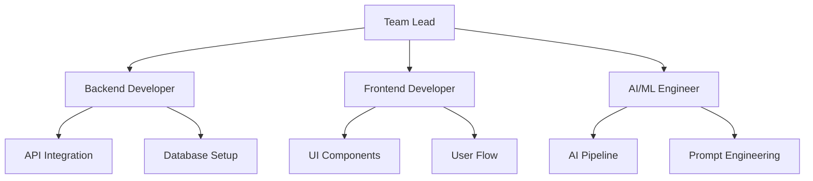

# 24-Hour Hackathon Development Strategy

## Executive Summary

Successfully building a video creation agent in 24 hours requires strategic planning, rapid prototyping techniques, and efficient use of modern development tools with a focus on delivering a functional MVP.

## 1. Time Management Framework

### Hour-by-Hour Breakdown

According to [Appsembler's Hackathon Success Tips](https://appsembler.com/blog/10-tips-for-hackathon-success/):

```mermaid
gantt
    title 24-Hour Development Timeline
    dateFormat HH:mm
    axisFormat %H:%M
    
    section Planning
    Team Formation & Setup    :00:00, 1h
    Architecture Design        :01:00, 1h
    
    section Core Development
    Authentication Setup       :02:00, 2h
    AI API Integration        :04:00, 4h
    Frontend Development      :08:00, 4h
    
    section Integration
    Pipeline Assembly         :12:00, 3h
    Testing & Debugging       :15:00, 3h
    
    section Polish
    UI/UX Refinement         :18:00, 2h
    Deployment               :20:00, 2h
    
    section Presentation
    Demo Preparation         :22:00, 1h
    Final Testing            :23:00, 1h
```



### Task Prioritization

Based on [MVP Hackathon Playbook](https://corporate.hackathon.com/articles/mvp-hackathon-the-fast-track-playbook-for-organizing-innovation-driven-hackathons):

**Must Have (Hours 0-12):**
- Google authentication working
- Basic UI with input form
- Single AI API integration (start with Gemini)
- Simple video generation flow

**Should Have (Hours 12-18):**
- Image generation integration
- Video generation with Veo
- Progress tracking
- Basic error handling

**Nice to Have (Hours 18-24):**
- Advanced UI features
- Multiple generation options
- Gallery view
- Export functionality

## 2. Rapid Development Techniques

### Technology Stack Selection

According to [Ekolance Web3 Guide](https://www.ekolance.io/post/how-to-turn-your-hackathon-project-into-an-mvp-a-step-by-step-guide-for-web3-developers):

"Build using technologies you're already familiar with—such as MERN, Python with Flask, or Firebase—so you can prioritize functionality over firefighting bugs"

**Recommended Stack for Speed:**
- **Frontend**: Next.js with Tailwind CSS
- **Auth**: NextAuth.js with Google provider
- **APIs**: Direct integration with Gemini/Vertex AI
- **Database**: Supabase or Firebase (if needed)
- **Deployment**: Vercel or Cloud Run

### AI-Assisted Development

According to [HITEXIS MVP Development 2024](https://www.hitexis.com/mvp-development-and-prototyping-2024-ai-assisted-design-and-rapid-iteration/):

**Leverage AI Tools:**
- GitHub Copilot for code generation
- ChatGPT for boilerplate creation
- AI-driven UI components from v0.dev
- Automated testing with AI assistance

"Tools like GitHub Copilot or AI-driven features in Figma can generate code and interface suggestions from simple prompts"

## 3. MVP Feature Prioritization

### Core Features Matrix

Based on [Rapid MVP Development Guide](https://www.netguru.com/blog/rapid-mvp-development):

| Feature | Priority | Time Estimate | Complexity |
|---------|----------|---------------|------------|
| Google Login | Critical | 2 hours | Low |
| Text Input Form | Critical | 1 hour | Low |
| LLM Integration | Critical | 3 hours | Medium |
| Image Generation | High | 3 hours | Medium |
| Video Generation | High | 4 hours | High |
| Progress Display | Medium | 2 hours | Low |
| Download Feature | Medium | 1 hour | Low |
| Gallery View | Low | 2 hours | Medium |
| Settings Page | Low | 1 hour | Low |

### Feature Creep Prevention

According to [Corporate Hackathon Guide](https://corporate.hackathon.com/articles/mvp-hackathon-the-fast-track-playbook-for-organizing-innovation-driven-hackathons):

"Consensus Early: Everyone decides upfront what the MVP will include, reducing arguments later. Prevents Feature Creep: With only a month, side projects and nice-to-have features don't get in"

## 4. Team Organization Strategy

### Role Distribution (4-Person Team)

Based on hackathon best practices:



**Responsibilities:**
- **Team Lead**: Architecture, coordination, deployment
- **Backend Dev**: Authentication, API routes, data flow
- **Frontend Dev**: UI/UX, forms, display components
- **AI/ML Engineer**: AI API integration, prompt optimization

### Communication Protocol

According to [Appsembler](https://appsembler.com/blog/10-tips-for-hackathon-success/):

"Applications like Trello, Asana, or features within Learning Management Systems offer platforms where tasks can be organized, assigned, and monitored in real-time"

**Tools:**
- Slack/Discord for instant messaging
- GitHub Projects for task tracking
- Figma for design collaboration
- Shared Google Doc for documentation

## 5. Development Shortcuts

### Starter Templates and Boilerplates

**Quick Setup Commands:**
```bash
# Create Next.js app with TypeScript and Tailwind
npx create-next-app@latest video-agent --typescript --tailwind --app

# Install essential packages
npm install next-auth @google-cloud/aiplatform 
npm install @radix-ui/react-dialog @radix-ui/react-progress
npm install react-hook-form zod
```

### Pre-built Components

According to [We Observed Hackathon Ideas](https://weobserved.com/simple-hackathon-project-ideas.html):

**Use Component Libraries:**
- shadcn/ui for modern React components
- Headless UI for accessible components
- Framer Motion for animations
- React Query for data fetching

### Low-Code Accelerators

Based on [Payline Data MVP Iteration](https://paylinedata.com/blog/rapid-mvp-iteration):

"Low-code tools have revolutionized MVP development by expediting the process from concept to prototype"

**Recommended Tools:**
- Retool for admin panels
- Zapier for quick integrations
- Vercel for instant deployment
- Railway for database provisioning

## 6. Testing and Quality Assurance

### Continuous Testing Approach

According to [HITEXIS](https://www.hitexis.com/mvp-development-and-prototyping-2024-ai-assisted-design-and-rapid-iteration/):

"Even at MVP stage, products are launched to a subset of real users or internal beta groups. Feedback is immediately fed back into the prototype for the next iteration"

**Testing Strategy:**
- Unit tests for critical functions only
- Manual testing for user flows
- API testing with Postman/Thunder Client
- Quick user testing with team members

## 7. Deployment Strategy

### Rapid Deployment Options

**Recommended Approach:**
1. **Vercel** (Fastest)
   - One-click deployment
   - Automatic SSL
   - Preview deployments
   - Environment variables

2. **Google Cloud Run** (More control)
   - Containerized deployment
   - Auto-scaling
   - Google ecosystem integration

### Environment Configuration

```env
# .env.local
GOOGLE_CLIENT_ID=xxx
GOOGLE_CLIENT_SECRET=xxx
NEXTAUTH_URL=http://localhost:3000
NEXTAUTH_SECRET=xxx
GEMINI_API_KEY=xxx
VERTEX_AI_PROJECT=xxx
```

## 8. Presentation Preparation

### Demo Strategy

According to [Airmeet Hackathon Ideas](https://www.airmeet.com/hub/blog/38-amazing-hackathon-project-ideas-to-implement-in-2025/):

"Storytelling makes your project more engaging and memorable. Clearly define the problem, explain your solution, and highlight the impact"

**Demo Structure:**
1. Problem statement (30 seconds)
2. Solution overview (1 minute)
3. Live demonstration (3 minutes)
4. Technical architecture (1 minute)
5. Future potential (30 seconds)

### Backup Plans

- Pre-recorded demo video
- Screenshots of key features
- Local environment backup
- Mobile hotspot for internet

## 9. Common Pitfalls to Avoid

### Technical Pitfalls

Based on hackathon experiences:

1. **Over-engineering**: Keep architecture simple
2. **New technology**: Stick to familiar tools
3. **Perfect code**: Focus on working, not perfect
4. **Complex features**: MVP over completeness

### Time Management Pitfalls

According to [UpGrad Hackathon Ideas](https://www.upgrad.com/blog/hackathon-project-ideas/):

"Avoid choosing project ideas that won't be completed on time. Instead, focus on a Minimum Viable Product (MVP)"

## 10. Success Metrics

### Definition of Done

**MVP Checklist:**
- [ ] User can authenticate with Google
- [ ] User can input video requirements
- [ ] System generates at least one video
- [ ] User can view/download result
- [ ] Application is deployed and accessible
- [ ] Demo is prepared and tested

### Judging Criteria Optimization

Focus areas based on typical hackathon judging:
- **Innovation**: Novel use of AI APIs
- **Technical Implementation**: Clean, working code
- **User Experience**: Intuitive interface
- **Business Potential**: Clear use case
- **Presentation**: Compelling story

## References

- [Appsembler - 10 Tips for Hackathon Success](https://appsembler.com/blog/10-tips-for-hackathon-success/)
- [Corporate Hackathon - MVP Playbook](https://corporate.hackathon.com/articles/mvp-hackathon-the-fast-track-playbook-for-organizing-innovation-driven-hackathons)
- [HITEXIS - MVP Development 2024](https://www.hitexis.com/mvp-development-and-prototyping-2024-ai-assisted-design-and-rapid-iteration/)
- [Netguru - Rapid MVP Development](https://www.netguru.com/blog/rapid-mvp-development)
- [Ekolance - Hackathon to MVP Guide](https://www.ekolance.io/post/how-to-turn-your-hackathon-project-into-an-mvp-a-step-by-step-guide-for-web3-developers)
- [Payline Data - Rapid MVP Iteration](https://paylinedata.com/blog/rapid-mvp-iteration)
- [Airmeet - Hackathon Project Ideas](https://www.airmeet.com/hub/blog/38-amazing-hackathon-project-ideas-to-implement-in-2025/)
- [UpGrad - Hackathon Project Ideas](https://www.upgrad.com/blog/hackathon-project-ideas/)