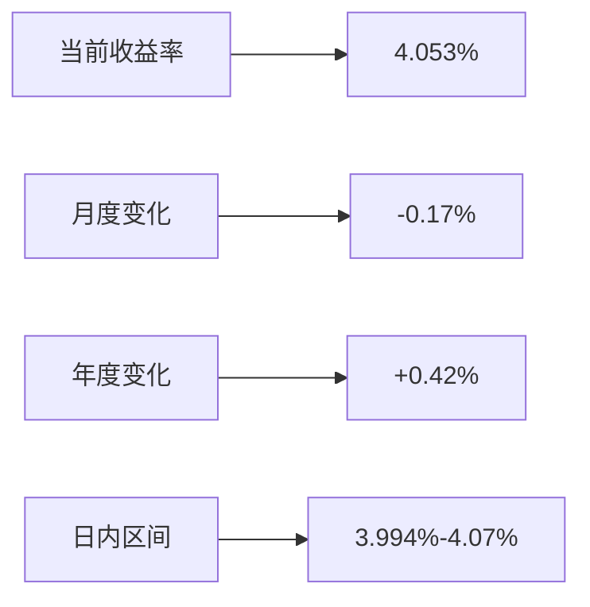
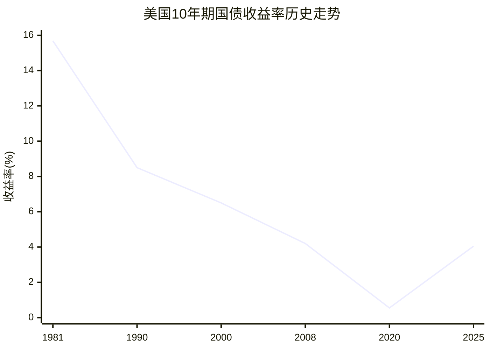
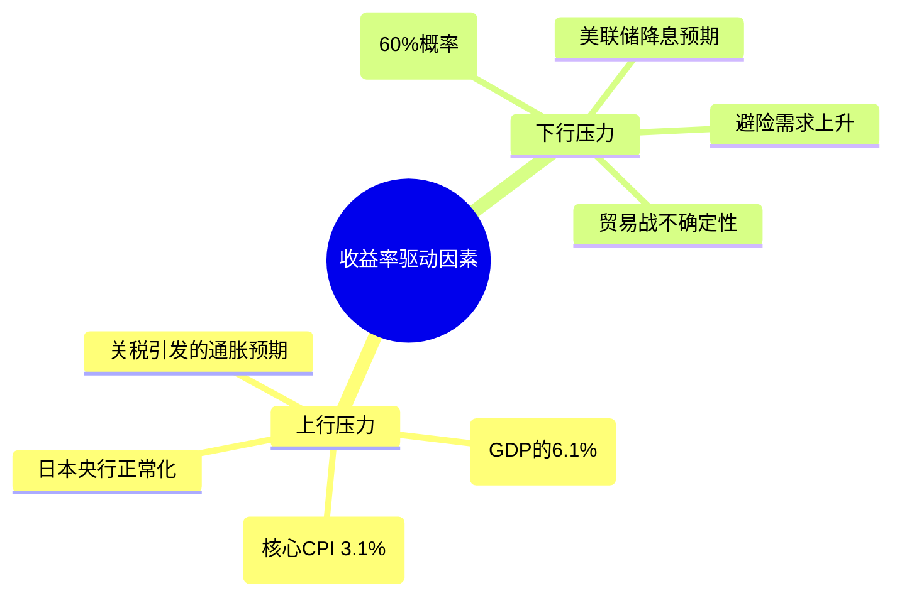
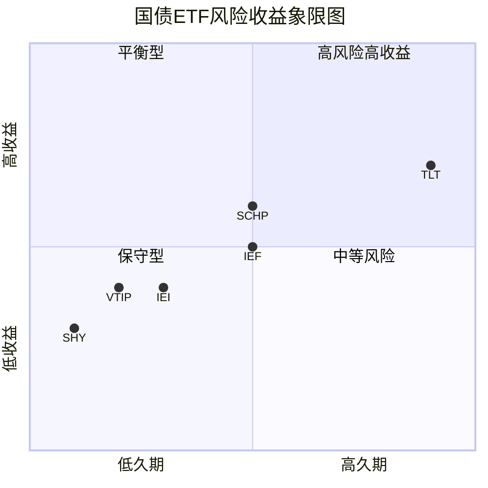
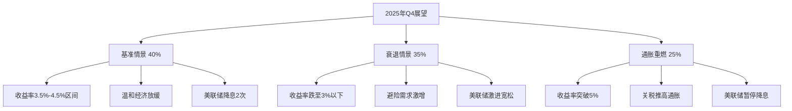

# 美国10年期国债综合分析报告

## 执行摘要

美国10年期国债收益率目前处于**4.05%**水平（2025年9月），位于历史中位数附近。经历了2022-2024年史上最长的收益率曲线倒挂后，市场正处于关键转折点。主要风险包括通胀持续性、贸易战影响、以及潜在的经济衰退。投资者应关注多个预警信号，并通过适当的ETF工具进行配置。

## 研究背景

本报告全面分析了美国10年期国债的：
- 当前市场状态和近期表现
- 长期历史趋势（1980-2025年）
- 影响收益率的短期事件
- 关键预警信号和风险指标
- 可投资的国债ETF选择
- 需要监控的核心经济指标

## 关键发现

### 1. 当前市场状态

根据[CNBC市场数据](https://www.cnbc.com/quotes/US10Y)，10年期美债收益率当前关键指标：



**收益率曲线状态**：经历史上最长倒挂期（2022年10月至2024年12月）后，目前10年-2年利差为**+0.59%**，已恢复正常化。

### 2. 历史趋势分析



关键历史节点：
- **1981年10月**：历史最高点15.68%（沃尔克抗通胀时期）
- **2020年8月**：历史最低点0.55%（疫情期间）
- **当前位置**：约为40年中位数水平

### 3. 短期市场驱动因素

#### 主要事件影响



### 4. 预警信号监控

#### 关键风险指标状态

| 风险指标 | 当前状态 | 警戒水平 | 风险等级 |
|---------|---------|---------|---------|
| 收益率曲线斜率 | +0.59% | 近期去倒挂 | **高** |
| 实际收益率 | 2.15% | 超历史均值 | **高** |
| 财政赤字/GDP | 6.1% | 超过6% | **高** |
| 制造业PMI | 48.7 | 连续6个月<50 | **中** |
| 通胀预期 | 2.4% | 高于目标 | **中** |

详细分析请参见：[预警信号和风险指标报告](./reports/task-4-warning-signals.md)

### 5. ETF投资工具比较

#### 主要国债ETF特征对比



**2025年资金流向趋势**：
- 短期ETF（SHY、VGSH）：资金流入
- 中期ETF（IEF、IEI）：混合
- 长期ETF（TLT）：流出24亿美元
- TIPS ETF（SCHP、VTIP）：稳定需求

详细ETF分析请参见：[国债ETF投资工具分析](./reports/task-5-treasury-etfs.md)

### 6. 核心监控指标

#### 经济数据发布日历

```mermaid
gantt
    title 月度重要数据发布时间表
    dateFormat X
    axisFormat %d
    section 就业数据
    非农就业(NFP)    :1, 1
    初请失业金(周四)  :active, 4, 11, 18, 25
    section 通胀数据
    CPI发布          :12, 1
    PPI发布          :13, 1
    section 美联储
    FOMC会议         :16, 2
    section 其他
    ISM制造业PMI     :3, 1
```

关键指标详情请参见：[核心经济指标监控](./reports/task-6-key-indicators.md)

## 投资建议

### 基于当前环境的策略建议

1. **核心配置**（60%）
   - IEF或GOVT提供平衡敞口
   - 久期约7-8年，适中风险

2. **战术配置**（25%）
   - VTIP或STIP提供通胀保护
   - 实际收益率处于16年高位

3. **风险管理**（15%）
   - SHY或VGSH提供稳定性
   - 作为现金替代品

4. **当前避免**
   - TLT除非专门对冲衰退风险
   - 长久期在利率不确定性下风险过高

### 关键行动阈值

- **立即行动**：10年期收益率突破4.5%或跌破3.5%
- **提高警惕**：实际收益率超过2.5%
- **调整组合**：如衰退概率超70%，提升信用质量

## 未来展望

### 2025年剩余时间关键事件

1. **9月16-17日**：美联储FOMC会议（可能降息）
2. **10月14日**：关税法律挑战截止日
3. **11月**：最高法院关税听证会
4. **全年**：市场预期4次25基点降息

### 三种情景分析



## 风险提示

1. **收益率曲线信号**：历史上最长倒挂后的正常化，衰退风险仍高
2. **政策不确定性**：美联储在通胀和增长之间权衡困难
3. **地缘政治风险**：贸易战升级可能性和法律挑战
4. **财政可持续性**：赤字扩大需要持续大量国债发行
5. **全球溢出效应**：日本央行紧缩和全球同步收益率上升

## 数据更新说明

本报告基于2025年9月的最新市场数据。建议投资者：
- 每月关注CPI/PPI数据发布
- 每周跟踪初请失业金人数
- 密切关注美联储官员讲话
- 监控收益率曲线形态变化

## 详细研究报告目录

1. [当前状态和近期表现分析](./reports/task-1-current-status.md)
2. [长期历史趋势分析（1980-2025）](./reports/task-2-long-term-trends.md)
3. [短期市场驱动事件](./reports/task-3-short-term-events.md)
4. [预警信号和风险指标](./reports/task-4-warning-signals.md)
5. [国债ETF投资工具分析](./reports/task-5-treasury-etfs.md)
6. [核心经济指标监控指南](./reports/task-6-key-indicators.md)

---

*报告生成日期：2025年9月13日*
*数据来源：美联储、美国财政部、彭博社、CNBC、Trading Economics等权威机构*