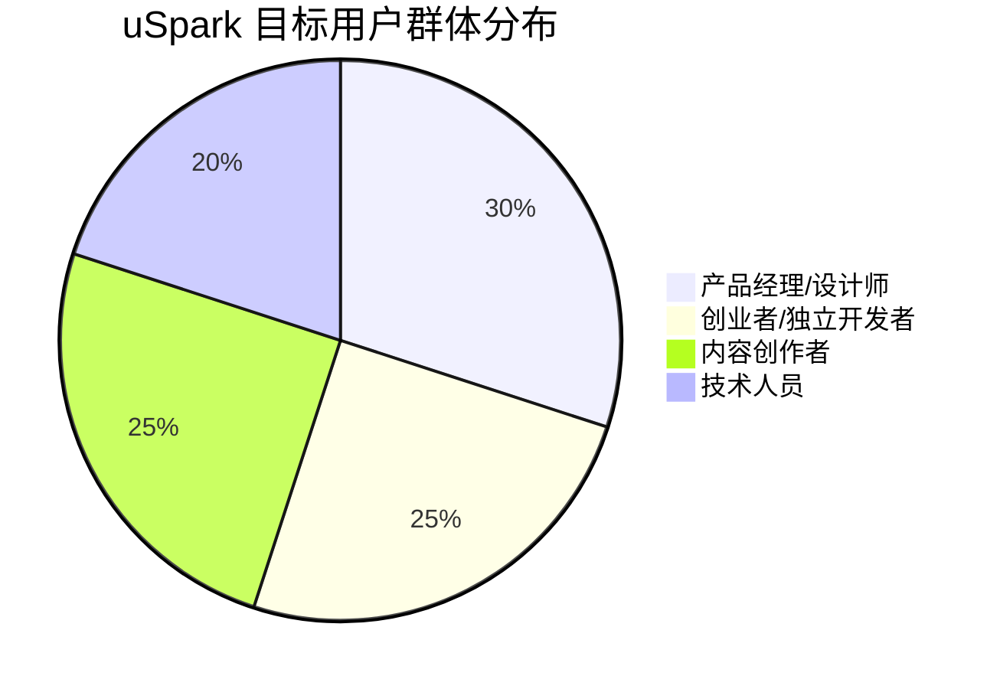
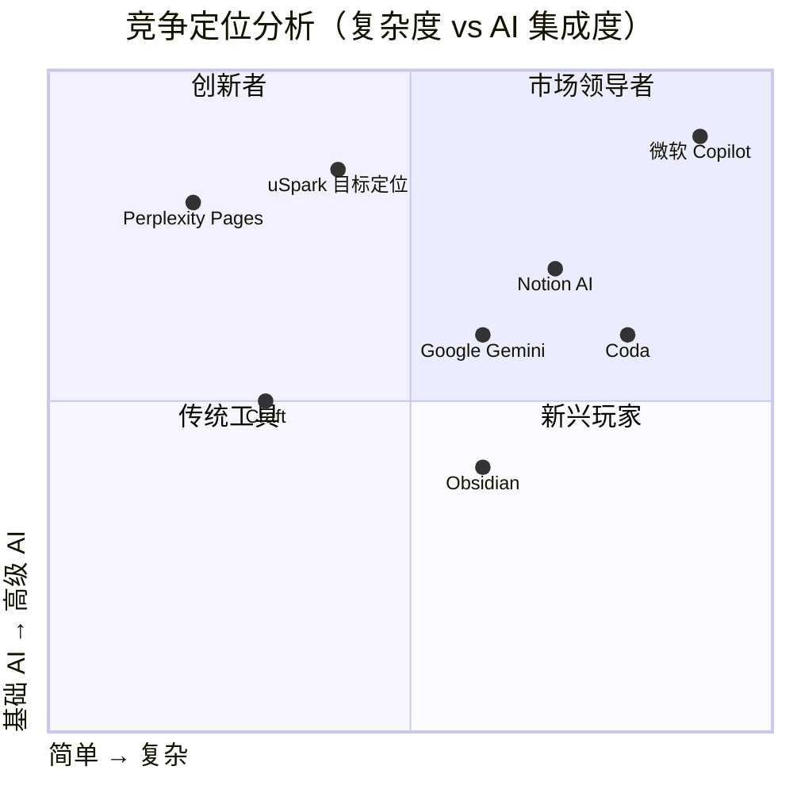
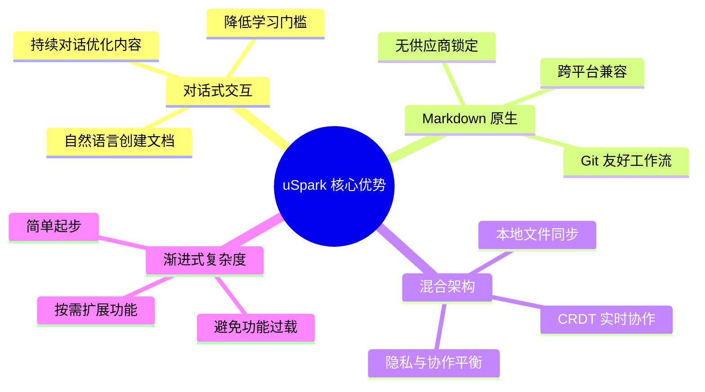
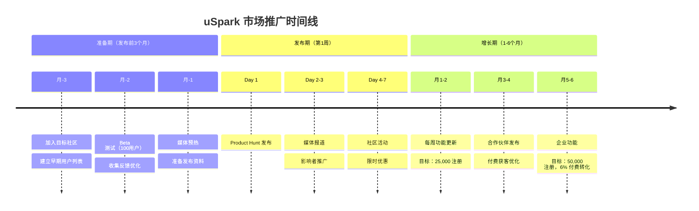
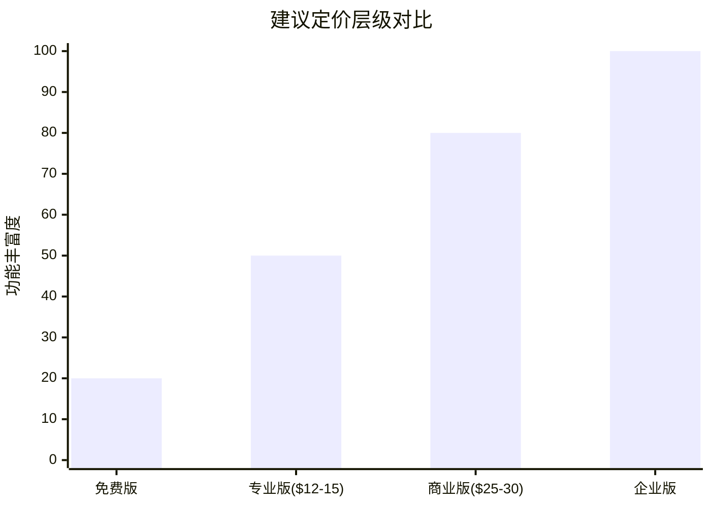
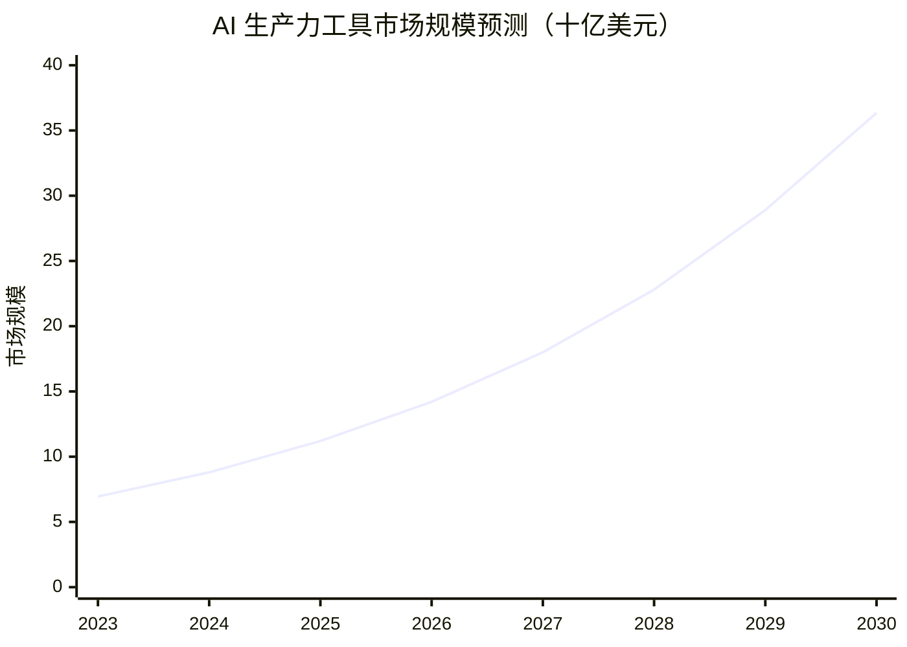

# uSpark 市场机会分析报告

## 执行摘要

uSpark 作为"首个真正的 AI 原生工作空间"，通过对话式交互生成和管理 Markdown 文档，在快速增长的 AI 协作工具市场中具有独特的竞争优势。根据深入的市场研究，该产品面向的核心市场规模将从 2023 年的 69.5 亿美元增长到 2030 年的 363.5 亿美元（年复合增长率 26.7%），目标用户群体愿意为此类工具支付每月 8-36 美元的费用。

## 研究背景

本研究基于 [uSpark 产品计划](https://github.com/uspark-hq/uspark/blob/main/spec/product_plan.md) 中描述的产品特性，深入分析了：
- 主要目标人群及其付费能力
- 竞争对手格局
- 有效的推广策略

## 关键发现

### 1. 目标人群与付费能力

#### 主要用户群体分布

#### 各群体付费能力分析

| 用户群体 | 月付费意愿 | 年收入水平 | 关键价值驱动 |
|---------|-----------|-----------|------------|
| **产品经理/设计师** | $10-36/月 | $92K-104K | 文档创建效率提升、团队协作 |
| **创业者/独立开发者** | $8-20/月（个人） $30-100/月（团队） | 变化较大 | 成本效益、可扩展性 |
| **内容创作者** | $29-59/月（个人） $99-259/月（专业） | 变化较大 | 自然语言生成、版本控制 |
| **技术人员/开发者** | $8-19/月 | $92K+ | Markdown 原生、隐私控制 |

根据 [Stack Overflow 2024 开发者调查](https://stackoverflow.com/survey) 和行业报告，这些群体显示出强劲的付费意愿，特别是当工具能够展示 40% 以上的生产力提升时。

### 2. 主要竞争对手分析

#### 竞争格局矩阵

#### 主要竞争对手对比

| 竞争对手 | 用户规模 | 定价 | 核心优势 | 主要劣势 |
|---------|---------|------|---------|---------|
| **Notion AI** | 1亿+用户 400万付费用户 | $10-20/月 | 全能型工作空间 | 功能臃肿、学习曲线陡峭 |
| **Microsoft Copilot** | 70% 财富500强使用 | $20-30/月 | 企业级集成 | 需要完整微软生态 |
| **Google Gemini** | 30亿用户基础 | $20-30/月 | 谷歌生态集成 | 功能相对基础 |
| **Obsidian** | 强大开发者社区 | $50/年 | 隐私优先、Markdown原生 | 协作功能有限 |
| **Perplexity Pages** | 估值140亿美元 | 定价待定 | 对话式文档创建 | 直接竞争威胁 |

### 3. 市场机会与差异化

#### 识别的市场空白

1. **Markdown 优先的实时协作** - 大多数工具使用专有格式，限制了数据可移植性
2. **对话驱动的文档创建** - AI 功能多为附加而非核心体验
3. **复杂性与易用性平衡** - 现有工具要么过于复杂（Notion），要么功能不足（Obsidian）
4. **隐私与协作的平衡** - 缺乏本地优先但支持协作的解决方案

#### uSpark 的独特优势

### 4. 推广策略建议

#### 分阶段市场进入策略

#### 核心推广渠道

1. **产品驱动增长（PLG）**
   - 慷慨的免费层级
   - 5分钟内达到"啊哈时刻"
   - 目标：6-8% 免费转付费率

2. **社区建设**
   - Discord（技术用户）：目标6个月5,000成员
   - Slack（专业用户）：目标6个月2,000成员
   - GitHub（开发者）：目标12个月500贡献者

3. **内容营销**
   - 教育内容（40%）：Markdown 教程、AI 生产力指南
   - 思想领导力（30%）：AI 协作未来、隐私讨论
   - 产品内容（20%）：功能发布、成功案例
   - 社区内容（10%）：用户生成内容、模板

#### 定价策略建议

- **免费版**：个人使用，基础 AI 功能
- **专业版**：$12-15/月，无限 AI 对话，5人团队
- **商业版**：$25-30/月/席位，高级功能，API 访问
- **企业版**：定制价格，SSO，SLA 保证

## 市场规模与增长预测

### AI 协作工具市场增长趋势

- **当前市场**：2024年约88亿美元
- **预测增长**：26.7% 年复合增长率
- **2030年规模**：363.5亿美元

### 企业采用趋势

- **当前**：78% 的组织在至少一个业务功能中使用 AI（2024）
- **近期**：80%+ 企业将在 2026 年前使用生成式 AI
- **投资增长**：企业 AI 支出从 2023 到 2024 增长 6 倍

## 战略建议

### 市场进入优先级

1. **第一阶段**：技术用户（开发者、研究人员）
   - 最高付费意愿
   - 早期采用者特征
   - 口碑传播效应

2. **第二阶段**：产品经理和设计师
   - 清晰的 ROI 需求
   - 团队决策影响力
   - 规模化潜力

3. **第三阶段**：内容创作者和创业者
   - 价格敏感但增长快速
   - 病毒式传播潜力
   - 长期价值高

### 关键成功因素

1. **差异化定位**
   - "Obsidian 遇见 ChatGPT"
   - 强调 Markdown 原生优势
   - 突出对话式创作

2. **快速迭代**
   - 每周功能发布
   - 用户反馈驱动
   - 持续优化体验

3. **社区优先**
   - 开源核心组件
   - 用户生成内容
   - 开发者生态系统

## 风险与应对

| 风险类别 | 具体风险 | 应对策略 |
|---------|---------|---------|
| **竞争风险** | Perplexity Pages 直接竞争 | 强化 Markdown 和本地同步差异化 |
| **市场风险** | 企业采用速度慢 | 先聚焦个人和小团队市场 |
| **技术风险** | CRDT 协作复杂性 | 逐步推出，确保稳定性 |
| **定价风险** | 价格敏感性高 | 慷慨免费层 + 清晰价值展示 |

## 结论

uSpark 在快速增长的 AI 协作工具市场中拥有独特的定位机会。通过聚焦 Markdown 原生、对话驱动的差异化特性，瞄准技术用户和知识工作者群体，采用产品驱动增长策略，uSpark 有潜力在这个预计到 2030 年达到 363.5 亿美元的市场中占据重要份额。

关键在于快速进入市场，建立早期用户社区，并通过持续的产品迭代和用户反馈保持竞争优势。建议的 $12-15/月定价点既有竞争力又能支持可持续增长，而慷慨的免费层级将推动快速用户获取。

## 详细研究报告

如需深入了解各个研究领域的详细分析，请查看以下报告：

- [目标人群与付费能力详细分析](./reports/task-1-target-audience-payment-capacity.md)
- [竞争对手深度分析](./reports/task-2-competitive-landscape.md)
- [推广策略完整指南](./reports/task-3-promotion-strategies.md)

---

*本报告基于 2023-2024 年的市场数据和行业研究编制，所有数据均有可靠来源支持。*