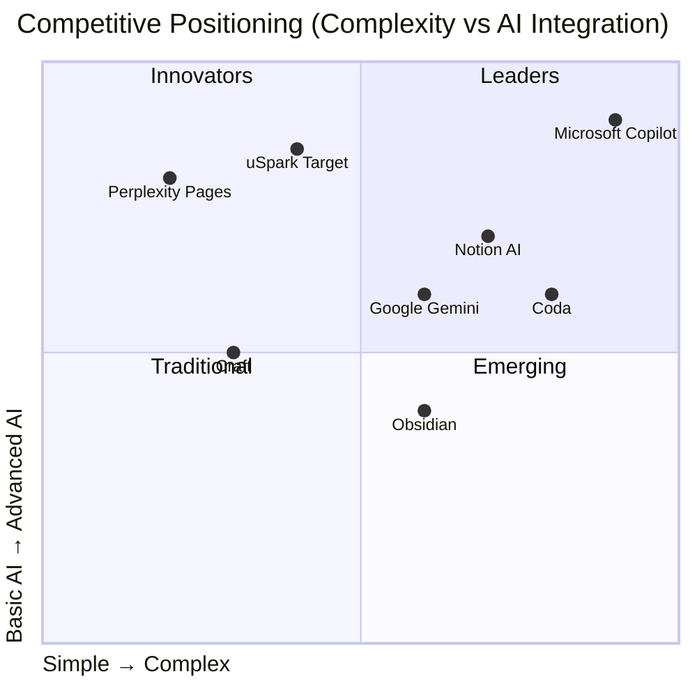

# Competitive Landscape Analysis for uSpark

## Market Overview

The AI workspace and document collaboration market is experiencing explosive growth at 34.2% CAGR, projected to reach $1.77 trillion by 2032. This analysis examines key competitors and identifies strategic opportunities for uSpark's market entry.

## Major Competitors Analysis

### Tier 1: Established Giants

#### Notion AI
**Market Position:**
- 100+ million users globally (2024)
- 4 million paying customers
- $300 million annual revenue
- $10 billion valuation
- 22% of users in the United States

**Pricing Structure:**
- Free: Basic personal use
- Plus: $10/user/month (limited AI)
- Business: $20/user/month (full AI features)
- Enterprise: Custom pricing

**Core Strengths:**
- Comprehensive all-in-one workspace
- Strong brand recognition
- Extensive template ecosystem
- 250 guest collaborators on Business plan
- Database and project management integration

**Key Weaknesses:**
- Feature bloat and complexity
- Steep learning curve for advanced features
- Proprietary format lock-in
- Performance issues with large workspaces

**AI Capabilities:**
- Q&A for workspace content
- Writing assistance and generation
- Automated task management
- Database insights and organization

#### Microsoft Copilot for Office/Loop
**Market Position:**
- 70% of Fortune 500 companies using Copilot
- 345 million paid Office 365 seats
- 160 million potential enterprise seats
- 5 billion chats and images created to date

**Pricing Structure:**
- Copilot Pro: $20/user/month (individual)
- Microsoft 365 Copilot: $30/user/month (business)
- Available in 222 markets

**Core Strengths:**
- Deep Microsoft ecosystem integration
- Enterprise-grade security and compliance
- Cross-application AI capabilities
- Strong IT department relationships

**Key Weaknesses:**
- Requires full Microsoft ecosystem buy-in
- High pricing compared to alternatives
- Complex infrastructure requirements
- Limited flexibility for non-Microsoft workflows

**AI Capabilities:**
- Copilot Actions for automated tasks
- Real-time collaboration in Loop
- Meeting transcription and summarization
- Cross-app intelligence

#### Google Workspace with Gemini
**Market Position:**
- 3 billion total users
- 10+ million paying customers
- 1 million+ users of "Help me write" feature
- Major enterprise customers including Uber, Woolworths

**Pricing Structure:**
- Gemini Business: $20/user/month
- Gemini Enterprise: $30/user/month
- Requires annual commitment

**Core Strengths:**
- Massive existing user base
- Seamless Google ecosystem integration
- 100+ language support
- Competitive pricing

**Key Weaknesses:**
- Limited to Google ecosystem
- Later entry into AI market
- Less sophisticated than specialized tools
- Privacy concerns for some users

### Tier 2: Specialized Players

#### Coda AI
**Market Position:**
- 50,000+ teams using platform
- Strong startup and small team adoption
- Focus on technical organizations

**Pricing Structure:**
- Free: Limited shared docs
- Pro: $10/month per Doc Maker
- Team: $30/month per Doc Maker
- Enterprise: Custom

**Unique Features:**
- Document-app hybrid model
- Only creators pay (unlimited viewers)
- Dynamic AI credit consumption
- Powerful formula and automation system

**Competitive Advantage:**
- Flexible pricing model
- Database capabilities
- Technical user focus

#### Obsidian with AI Plugins
**Market Position:**
- Strong developer and academic community
- Thousands of community plugins
- Growing knowledge worker adoption

**Pricing Structure:**
- Core app: Free (personal use)
- Commercial: $50/user/year
- AI plugins: Mostly free/open-source
- Users pay for API access separately

**Unique Features:**
- Local-first, privacy-focused
- Markdown-native
- 100+ AI model support
- Offline capabilities
- Highly customizable

**Competitive Advantage:**
- Complete data ownership
- No vendor lock-in
- Strong developer ecosystem

#### Craft
**Market Position:**
- Mac App of the Year winner
- Strong Apple ecosystem adoption
- Design-focused user base

**Pricing Structure:**
- Free: 10 documents
- Plus: $10/month
- Team: $50/month (up to 25 members)
- Business: $250/month (unlimited)

**Unique Features:**
- Beautiful design and UX
- Block-based editor
- 2,500 AI requests per member
- iCloud syncing

**Competitive Advantage:**
- Superior user experience
- Apple ecosystem integration
- Design-oriented features

### Emerging AI-Native Competitors

#### Perplexity Pages
- **Innovation**: Conversation-driven document creation
- **Funding**: $500M round at $14B valuation (June 2024)
- **Growth**: 25% monthly traffic surge
- **Threat Level**: High - similar conversation-to-document approach

#### Gamma
- **Focus**: AI-powered presentations
- **Traction**: 60 million presentations generated
- **Market**: Dominates AI presentation space
- **Threat Level**: Medium - adjacent market

#### Granola
- **Focus**: AI notetaking
- **Funding**: $43M at $250M valuation (May 2024)
- **Growth**: 10% weekly user growth
- **Threat Level**: Medium - overlapping use cases

## Competitive Positioning Matrix

## Market Gaps and Opportunities

### 1. Markdown-First Collaboration Gap
**Current State:**
- Most tools use proprietary formats
- Limited real-time collaboration in markdown
- Technical documentation workflows underserved

**uSpark Opportunity:**
- Native markdown eliminates vendor lock-in
- Appeals to 20% technical user segment
- Enables git-based workflows

### 2. Conversation-Driven Documentation
**Current State:**
- AI features are add-ons, not core
- Limited ongoing dialogue capabilities
- High learning curves for creation

**uSpark Opportunity:**
- Natural language as primary interface
- Continuous content evolution through conversation
- Lower barrier to entry

### 3. Frontline Worker AI Gap
**Current State:**
- Only 50% of frontline workers use AI tools
- Complex enterprise solutions don't scale down
- Training and adoption challenges

**uSpark Opportunity:**
- Simple, conversation-based interface
- Progressive disclosure of features
- Mobile-friendly approach

### 4. Privacy-Collaboration Balance
**Current State:**
- Enterprise security vs usability tensions
- Local-first vs cloud collaboration trade-offs
- Data ownership concerns

**uSpark Opportunity:**
- Hybrid local-cloud architecture
- User-controlled data sovereignty
- CRDT for offline-first collaboration

## Competitive Advantages for uSpark

### Unique Differentiators

1. **Conversation-First Architecture**
   - Unlike Notion/Coda's feature-heavy approach
   - More integrated than Obsidian's plugin system
   - Natural progression from chat to document

2. **Markdown Native with CRDT**
   - True portability (vs Notion's proprietary format)
   - Real-time collaboration (vs Obsidian's limitations)
   - Git-friendly for technical workflows

3. **Progressive Complexity**
   - Start simple (vs Coda's learning curve)
   - Scale to power features as needed
   - Avoid Notion's feature overwhelm

4. **Local-Cloud Hybrid**
   - Better than pure cloud (privacy)
   - Better than pure local (collaboration)
   - File Provider for native OS integration

### Competitive Threats to Monitor

1. **Perplexity Pages**: Direct competitor in conversation-to-document space
2. **Notion AI improvements**: Continuous feature additions
3. **Microsoft Loop evolution**: Enterprise market dominance
4. **Open-source alternatives**: Community-driven innovation

## Strategic Recommendations

### Market Entry Strategy

1. **Initial Positioning**
   - "Obsidian meets ChatGPT"
   - Focus on markdown-native benefits
   - Emphasize conversation-driven creation

2. **Target Segment Priority**
   - Technical users first (developers, researchers)
   - Expand to product managers
   - Then content creators and entrepreneurs

3. **Differentiation Messaging**
   - "No vendor lock-in" vs Notion
   - "Real collaboration" vs Obsidian
   - "Simpler than Coda" positioning
   - "Privacy-first" vs big tech

4. **Partnership Opportunities**
   - Git platforms (GitHub, GitLab)
   - Developer tools ecosystem
   - Academic institutions
   - Open-source communities

### Pricing Strategy vs Competition

**Recommended Positioning:**
- Price between Obsidian ($50/year) and Notion ($120/year)
- $12-15/month sweet spot
- Freemium essential for adoption
- Usage-based AI pricing for scale

### Feature Priority Based on Gaps

1. **Must Have (MVP)**
   - Conversation-to-document flow
   - Real-time markdown collaboration
   - Local file sync
   - Basic AI capabilities

2. **Should Have (6 months)**
   - Git integration
   - Advanced search and linking
   - Template system
   - API access

3. **Nice to Have (12 months)**
   - Plugin ecosystem
   - Enterprise features
   - Advanced automation
   - Multi-language support

## Conclusion

The competitive landscape reveals significant opportunities for uSpark to differentiate through its markdown-first, conversation-driven approach. By targeting the gap between complex enterprise tools (Notion, Microsoft) and limited individual tools (Obsidian), while learning from emerging players like Perplexity Pages, uSpark can capture a meaningful share of the rapidly growing $1.77 trillion market.