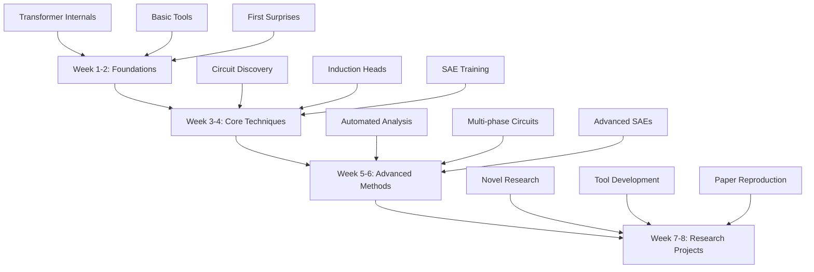
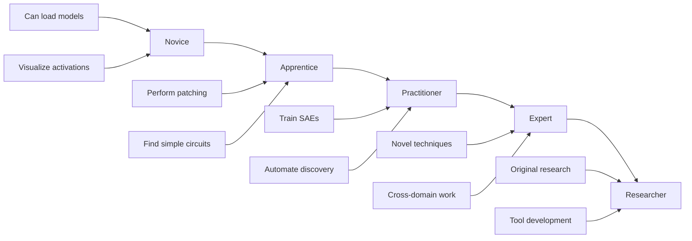

# Hands-On Curriculum for Learning Mechanistic Interpretability

## Executive Summary

This curriculum provides a comprehensive, hands-on learning path for mechanistic interpretability (MI), designed for software engineers with PyTorch experience. The curriculum progresses from foundational concepts to cutting-edge research, incorporating surprise elements and memory techniques based on cognitive learning research to enhance retention and engagement.

## Quick Start Guide

```python
# Your first MI experiment in 5 lines
from transformer_lens import HookedTransformer
model = HookedTransformer.from_pretrained("gpt2-small")
logits, cache = model.run_with_cache("The capital of France is")
print(cache["attn.0.pattern"][0, 0])  # See attention patterns!
# Surprise: The model is already looking ahead to where "Paris" might go!
```

## Curriculum Overview

### 🎯 Learning Objectives

By completing this curriculum, you will:
- Master the core tools (TransformerLens, SAELens) for mechanistic interpretability
- Understand and implement circuit discovery techniques
- Train and analyze sparse autoencoders for feature extraction
- Contribute to cutting-edge MI research

### 📊 Curriculum Structure



## Phase 1: Foundation (Weeks 1-2)

### Week 1: Transformer Archaeology 🏛️

**Day 1-2: Environment Setup & First Contact**
```python
# The "Hello World" of Mechanistic Interpretability
import torch
from transformer_lens import HookedTransformer

# Load your first model - start small!
model = HookedTransformer.from_pretrained("gpt2-small")

# Your first surprise: Watch the model "think"
prompt = "When Mary went to the store, she bought milk. When John went to the store, he bought"
logits, cache = model.run_with_cache(prompt)

# 🎉 Surprise Element: The Prediction Crystal Ball
# Before looking, predict: Which layer first "knows" the answer will be gendered?
# Plot twist: Check layer 5's attention to "Mary" and "John"!
```

**Day 3-4: The Activation Kitchen** 🍳
- **Project**: Build an "Activation Explorer" dashboard
- **Surprise**: Find neurons that activate for both "sports" and "warfare" 
- **Memory Hook**: "The confused athlete-warrior neurons"
- [Detailed exercises here](./reports/task-2-hands-on-exercises.md#level-1-foundation-week-1-2)

**Day 5-7: The Attention Detective** 🔍
- Implement attention pattern visualization
- **The Copy-Cat Mystery**: Find which heads just copy previous tokens
- **Plot Twist**: Some heads look at positions that don't exist yet!

### Week 2: Circuit Safari 🦁

**Day 8-10: Your First Circuit Hunt**
```python
# The Greater-Than Circuit Adventure
def find_greater_than_circuit(model):
    """
    Challenge: Find the exact components that compare numbers
    Surprise: It's only 15 neurons out of millions!
    """
    # Implementation guided by ARENA exercises
    pass
```

**Day 11-12: The Polysemantic Zoo**
- Document your "weird neuron collection"
- **Surprise Gallery**: 
  - The "water-money" neuron (ocean & investment)
  - The "round things" neuron (circles, debates, boxing matches)
  - The "endings" neuron (death, dessert, Python's `]`)

**Day 13-14: Phase Transition Theater**
- Watch induction heads emerge during training
- **The 10,001st Step Miracle**: Capture the exact moment of grokking
- Create a time-lapse video of circuit formation

## Phase 2: Core Techniques (Weeks 3-4)

### Week 3: The Interpretability Toolkit 🛠️

**Day 15-17: Activation Patching Mastery**

Based on [ARENA's causal intervention exercises](https://www.lesswrong.com/posts/LnHowHgmrMbWtpkxx/interpretability-with-sparse-autoencoders-colab-exercises):

```python
def corruption_experiment():
    """
    The Frankenstein Experiment:
    Mix activations from different prompts and see what breaks!
    
    Surprise: Sometimes mixing makes the model SMARTER
    Memory trick: "The accidental genius moments"
    """
    clean_prompt = "The Eiffel Tower is in Paris"
    corrupted_prompt = "The Eiffel Tower is in London"
    # Patch and observe chaos... or unexpected coherence!
```

**Day 18-19: Direct Logit Attribution**
- Decompose predictions into component contributions
- **The Blame Game**: Which layer is responsible for wrong predictions?
- Create "credit assignment" visualizations

**Day 20-21: Path Patching Adventures**
- Trace information flow through the network
- **The Information Highway**: Map the exact route from input to output
- **Surprise**: Some highways have secret tunnels (skip connections)

### Week 4: Sparse Autoencoder Bootcamp 🤖

**Day 22-24: SAE Training From Scratch**

Following [Adam Karvonen's implementation guide](https://adamkarvonen.github.io/machine_learning/2024/06/11/sae-intuitions.html):

```python
class SurpriseSAE(nn.Module):
    """
    The Feature Discoverer
    Challenge: Train an SAE that finds unexpected features
    Goal: Discover at least one "WTF feature" that makes no sense
    Reward: Understanding superposition through confusion
    """
    def __init__(self, d_model, d_sparse):
        super().__init__()
        self.encoder = nn.Linear(d_model, d_sparse)
        self.decoder = nn.Linear(d_sparse, d_model, bias=False)
        
    def forward(self, x):
        # The magic happens here
        latent = F.relu(self.encoder(x))  # Sparsity through ReLU
        reconstructed = self.decoder(latent)
        
        # Surprise measurement: How many features are truly dead?
        dead_features = (latent == 0).float().mean()
        return reconstructed, latent, dead_features
```

**Day 25-26: Feature Archaeology**
- Use Neuronpedia-style visualization
- **The Feature Museum**: Curate your discovered features
- **Surprise Collections**:
  - Features that activate for punctuation AND emotions
  - Features specific to days ending in 'y'
  - The "definitely not" feature (activates for uncertainty)

**Day 27-28: SAE Circuit Analysis**
- Connect SAE features to circuit components
- **The Missing Link**: Find features that bridge circuit gaps
- Implement SAE-guided circuit discovery

## Phase 3: Advanced Techniques (Weeks 5-6)

### Week 5: Automation & Scaling 🚀

**Day 29-31: Automated Circuit Discovery**

Based on [ACDC research](https://arxiv.org/abs/2304.14997):

```python
class CircuitAutoDiscovery:
    """
    The Circuit Factory
    Build an automated pipeline that finds circuits while you sleep
    
    Surprise element: It will find circuits you never expected existed
    Memory hook: "My robot found a circuit for sarcasm detection!"
    """
    def discover(self, model, behavior_dataset):
        # Implement edge attribution patching
        # Watch as circuits emerge from chaos
        pass
```

**Day 32-33: Transcoder Implementation**
- Following [2025 transcoder research](https://arxiv.org/html/2501.18823v1)
- **The Shape-Shifter Challenge**: Build transcoders that outperform SAEs
- **Surprise**: Skip connections make everything better

**Day 34-35: Multi-Model Circuit Comparison**
- Compare circuits across GPT-2, GPT-Neo, and others
- **The Universal Circuit Hunt**: Find circuits that exist everywhere
- **Plot Twist**: Some "bugs" are actually universal features

### Week 6: Cutting Edge Research 🔬

**Day 36-38: Multi-Phase Circuit Analysis**

Based on [ICML research](https://arxiv.org/html/2505.16694):

```python
def track_circuit_evolution(model, training_checkpoints):
    """
    The Time Machine Experiment
    Watch circuits evolve through training time
    
    Three-act structure:
    Act 1: Bigram phase (boring statistics)
    Act 2: Semi-context (getting interesting)
    Act 3: Full context (mind-blown!)
    """
    phases = []
    for checkpoint in training_checkpoints:
        # Detect phase transitions
        # Document the "eureka" moments
        pass
```

**Day 39-40: Domain Transfer Challenge**
- Apply MI to non-language domains
- **The Protein Interpreter**: Use SAEs on protein models
- **The Vision Detective**: Find circuits in vision transformers

**Day 41-42: Research Sprint Planning**
- Choose your research direction
- Design experiments with built-in surprises
- Prepare for the unexpected

## Phase 4: Research Projects (Weeks 7-8)

### Week 7: Independent Research 🎓

Choose one major project:

#### Option A: The Circuit Surgeon
- Perform precise circuit modifications
- **Challenge**: Improve model performance by removing components
- **Surprise potential**: Breaking things that make them work better

#### Option B: The Feature Farmer
- Cultivate novel SAE architectures
- **Challenge**: Beat standard SAEs by 25% on interpretability
- **Surprise potential**: Features that predict features

#### Option C: The Safety Inspector
- Detect deceptive behaviors mechanistically
- **Challenge**: Find the "lying circuits"
- **Surprise potential**: Honesty and deception use the same circuits

### Week 8: Contribution & Community 🌍

**Day 50-52: Paper Reproduction**
- Pick a recent MI paper
- Reproduce with your own twist
- **The Replication Crisis Fighter**: Find what doesn't reproduce

**Day 53-54: Tool Development**
- Build something useful for the community
- Ideas from [MI tools ecosystem](./reports/task-1-foundational-concepts-tools.md#essential-tools-and-libraries)

**Day 55-56: Knowledge Synthesis**
- Write up your discoveries
- Create visualizations that surprise
- Share with the MI community

## Learning Techniques & Memory Aids

### The Memory Palace of Mechanistic Interpretability 🏰

Based on [cognitive learning research](./reports/task-3-learning-techniques.md):

**Room 1: The Activation Kitchen** 🍳
- Stove = Transformers cooking representations
- Pots = Layers mixing features
- Spices = Attention heads adding flavors

**Room 2: The Circuit Workshop** 🔧
- Tools = Patching instruments
- Blueprints = Circuit diagrams
- Assembly line = Information flow

**Room 3: The Feature Gallery** 🎨
- Paintings = Individual features
- Frames = SAEs isolating features
- Hidden doors = Superposition mysteries

### Mnemonics for Key Concepts

**SPACE** for Sparse Autoencoders:
- **S**parsity via L1
- **P**olysemanticity solver
- **A**ctivation decomposer
- **C**oncept extractor
- **E**ncoder-decoder pair

**PATCH** for Activation Patching:
- **P**erturb activations
- **A**ttribute effects
- **T**race paths
- **C**ircuit identification
- **H**ypothesis testing

## Progress Tracking & Assessment

### Skill Progression Ladder 📈



### Portfolio Milestones

1. **Week 2**: First circuit discovery report
2. **Week 4**: Trained SAE with 10+ interpretable features
3. **Week 6**: Automated analysis pipeline
4. **Week 8**: Original research contribution

## Resources & Community

### Essential Resources

- [Detailed Foundational Concepts](./reports/task-1-foundational-concepts-tools.md)
- [Complete Exercise Collection](./reports/task-2-hands-on-exercises.md)
- [Cognitive Learning Techniques](./reports/task-3-learning-techniques.md)
- [Advanced Research Methods](./reports/task-4-advanced-techniques.md)

### Key Learning Platforms

1. **[ARENA MI Course](https://www.lesswrong.com/posts/LnHowHgmrMbWtpkxx/interpretability-with-sparse-autoencoders-colab-exercises)** - Most comprehensive exercises
2. **[TransformerLens Docs](https://transformerlensorg.github.io/TransformerLens/)** - Official tool documentation
3. **[Neel Nanda's Resources](https://www.neelnanda.io/mechanistic-interpretability/getting-started)** - Expert guidance

### Community Engagement

- **MI Slack/Discord**: Daily discussions and help
- **Paper Reading Groups**: Weekly deep dives
- **Hackathons**: Monthly circuit discovery challenges
- **Open Problems List**: Contribute to unsolved mysteries

## The Surprise Collection 🎉

Throughout your journey, document surprising discoveries:

1. **The Paradox Collection**: Things that shouldn't work but do
2. **The WTF Features**: SAE features that make no sense
3. **The Universal Circuits**: Patterns that appear everywhere
4. **The Broken Improvements**: Deletions that enhance performance
5. **The Emergence Moments**: Sudden capability appearances

## Final Challenge: The Mystery Circuit 🔮

At the end of 8 weeks, you'll receive a mystery circuit to analyze:
- Unknown model, unknown task
- Use all your skills to decode it
- First to solve it correctly gets recognition
- Surprise: The circuit does something nobody has documented before

## Conclusion

This curriculum transforms mechanistic interpretability from an abstract research area into a hands-on adventure. By combining rigorous technical training with surprise elements and memory techniques, you'll not only understand neural networks deeply but remember the journey with clarity and excitement.

Remember: Every surprising discovery is a step toward understanding intelligence itself. Happy exploring!

## Table of Contents

- [Task 1: Foundational Concepts and Tools](./reports/task-1-foundational-concepts-tools.md)
- [Task 2: Hands-On Exercises and Implementations](./reports/task-2-hands-on-exercises.md)
- [Task 3: Cognitive Learning Techniques and Memory Aids](./reports/task-3-learning-techniques.md)
- [Task 4: Advanced Techniques and Cutting-Edge Research](./reports/task-4-advanced-techniques.md)