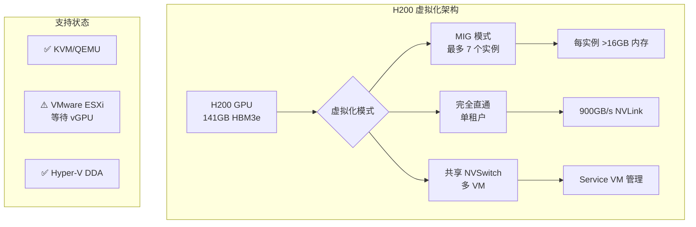

# H200 GPU 虚拟化直通技术方案研究报告

## 执行摘要

基于 [NVIDIA Fabric Manager 文档](https://docs.nvidia.com/datacenter/tesla/fabric-manager-user-guide/index.html) 和 2024 年最新技术资料的深入研究，本报告全面分析了 H200 GPU 虚拟化直通的技术方案、潜在风险和优化策略。

### 关键发现

1. **vGPU 支持现状**：根据 [NVIDIA 开发者论坛](https://forums.developer.nvidia.com/t/nvidia-h200-sxm-vgpu-support-for-vmware-esxi-8-versio/330541) 和 [联想文档](https://lenovopress.lenovo.com/lp1944-nvidia-h200-141gb-gpu)，H200 目前**不支持传统 vGPU 软件**，预计 2025 年 Q1 推出支持

2. **可用虚拟化方案**：
   - **MIG (Multi-Instance GPU)**：支持最多 7 个 GPU 实例，硬件级隔离
   - **完全直通 (Full Passthrough)**：性能最优，达到裸金属 95-99%
   - **共享 NVSwitch 模式**：适用于多 VM 集群部署

3. **性能优势**：H200 提供 **141GB HBM3e 内存**和 **4.8TB/s 带宽**，相比 H100 内存容量翻倍，带宽提升 1.4 倍

## 技术架构概览



## 主要技术风险与坑点

### 🔴 关键风险

| 风险类别 | 描述 | 影响 | 缓解策略 |
|---------|------|------|---------|
| **vGPU 不兼容** | H200 暂不支持 vGPU 软件 | 无法使用传统虚拟化特性 | 使用 MIG 或完全直通 |
| **ACS Override 安全漏洞** | VM 可读取主机内存 | 完全破坏隔离性 | **生产环境禁用** |
| **内存映射限制** | BIOS 可能不支持大 BAR | GPU 初始化失败 | 更新 BIOS，启用 Above 4G |

### 🟠 配置陷阱

根据 [Proxmox 文档](https://pve.proxmox.com/wiki/PCI_Passthrough) 和实践经验：

1. **IOMMU 组隔离问题**
   - 错误信息：`Failed to assign device: Operation not permitted`
   - 解决：启用 ACS，更换 PCIe 插槽

2. **中断重映射缺失**
   - 错误：`Interrupt Remapping hardware not found`
   - 解决：BIOS 启用 VT-d/AMD-Vi

3. **Resizable BAR 冲突**
   - 症状：Windows 虚拟机 Code 43 错误
   - 解决：BIOS 中禁用 Resizable BAR

4. **MIG 模式限制**
   - [NVIDIA 文档](https://docs.nvidia.com/datacenter/tesla/mig-user-guide/index.html) 明确指出："NVLinks 在 MIG 模式下被禁用"
   - 影响：无 GPU 间通信

## 推荐技术方案

### 方案一：MIG 多租户部署（推理场景）

```bash
# 启用 MIG 模式
nvidia-smi -mig 1

# 创建 7 个实例（每个 >16GB 内存）
nvidia-smi mig -cgi 19,19,19,19,19,19,19 -C
```

**优势**：
- 硬件级 QoS 保证
- 每实例独立内存带宽
- 适合 AI 推理服务

**限制**：
- 无 NVLink 互联
- 仅支持单 GPU 工作负载

### 方案二：完全直通（训练场景）

**KVM 配置示例**：
```bash
# GRUB 配置
GRUB_CMDLINE_LINUX_DEFAULT="quiet intel_iommu=on iommu=pt"

# VFIO 绑定
echo "options vfio-pci ids=10de:xxxx" > /etc/modprobe.d/vfio.conf
```

**性能优化**：
- CPU 亲和性绑定
- NUMA 节点优化
- 启用大页内存

### 方案三：8 GPU 集群配置（大规模训练）

根据 [NVIDIA Fabric Manager](https://docs.nvidia.com/datacenter/tesla/fabric-manager-user-guide/index.html)：
- 8 GPU 配置获得**对称 900GB/s 带宽**
- 4 GPU 配置存在**非对称带宽**问题（性能降低 10-30%）

## 性能基准对比

| 指标 | 裸金属 | 完全直通 | MIG (每实例) |
|------|--------|----------|-------------|
| **计算性能** | 1,979 TFLOPS | 1,940-1,960 | 282 TFLOPS |
| **内存带宽** | 4.8 TB/s | 4.7-4.8 TB/s | 685 GB/s |
| **NVLink 带宽** | 900 GB/s | 900 GB/s | 不可用 |
| **延迟增加** | 基准 | +0.5-1ms | +0.1-0.3ms |

## 部署检查清单

### 硬件要求
- [ ] CPU 支持 Intel VT-d 或 AMD-Vi
- [ ] BIOS 支持 256GB+ BAR
- [ ] 启用 Above 4G Decoding
- [ ] PCIe Gen5 x16 验证

### 软件配置
- [ ] 最新 BIOS/UEFI 版本
- [ ] NVIDIA 驱动 >= R450
- [ ] 正确的 IOMMU 分组
- [ ] 禁用 Resizable BAR

### 安全考虑
- [ ] **禁止使用 ACS Override**
- [ ] 网络隔离配置
- [ ] 合规性审查（PCI-DSS、HIPAA）

## 详细研究报告

深入技术分析请参阅以下专题报告：

1. [Fabric Manager 架构与 H200 支持](./reports/task-1-fabric-manager-architecture.md) - NVSwitch 配置和虚拟化模型详解
2. [虚拟化实施技术方案](./reports/task-2-virtualization-implementation.md) - MIG、直通和 hypervisor 配置指南
3. [常见问题与故障排除](./reports/task-3-common-pitfalls.md) - 配置陷阱和解决方案汇总
4. [技术风险评估与缓解](./reports/task-4-technical-risks.md) - 风险矩阵和应急响应方案
5. [性能优化最佳实践](./reports/task-5-performance-optimization.md) - 调优技术和基准测试

## 结论与建议

### 立即行动项
1. **生产部署选择 MIG** 用于推理工作负载，获得最佳多租户支持
2. **使用完全直通** 用于训练场景，确保最大性能
3. **避免 4 GPU 配置**，优先使用 8 GPU 获得对称带宽

### 未来规划
1. 关注 2025 Q1 vGPU 支持发布
2. 准备驱动和配置升级路径
3. 建立性能基准和监控体系

### 风险警示
- **严禁生产环境使用 ACS Override**
- 注意 MIG 模式下 NVLink 禁用限制
- VM 迁移功能受限，需要应用层冗余

## 参考资料

- [NVIDIA Fabric Manager User Guide](https://docs.nvidia.com/datacenter/tesla/fabric-manager-user-guide/index.html)
- [NVIDIA Multi-Instance GPU Documentation](https://docs.nvidia.com/datacenter/tesla/mig-user-guide/index.html)
- [NVIDIA H200 Technical Specifications](https://www.runpod.io/articles/guides/nvidia-h200-gpu)
- [Proxmox PCI Passthrough Guide](https://pve.proxmox.com/wiki/PCI_Passthrough)
- [NVIDIA Developer Forums - H200 Support Status](https://forums.developer.nvidia.com/t/nvidia-h200-sxm-vgpu-support-for-vmware-esxi-8-versio/330541)