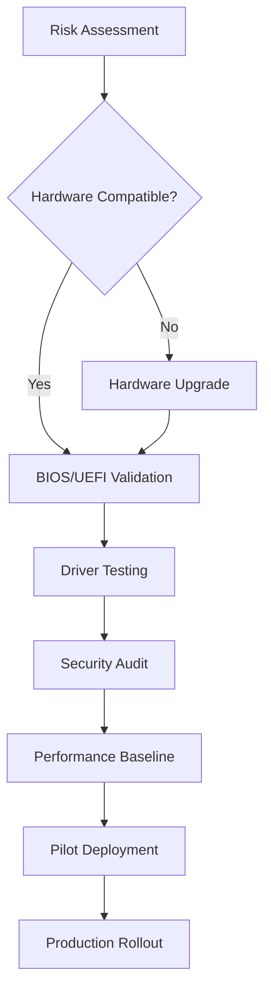
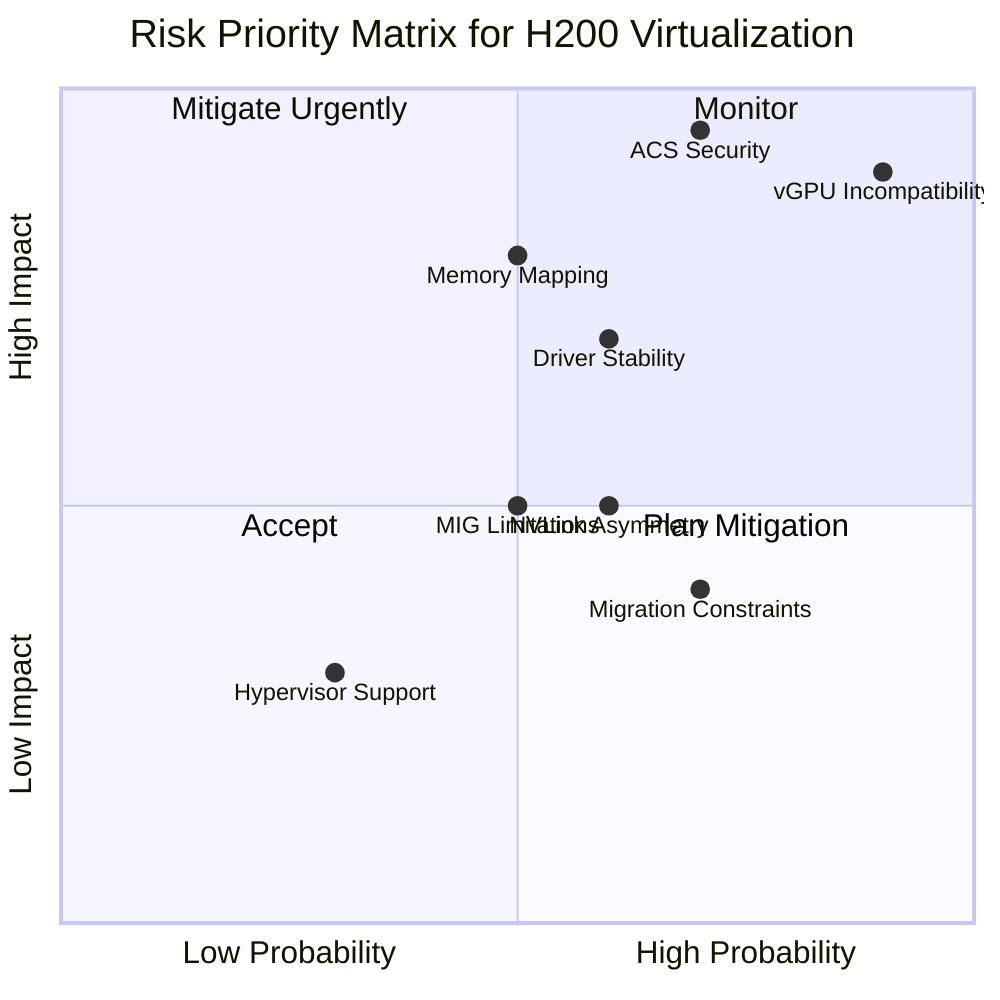

# Task 4: Technical Risks and Mitigation Strategies

## Risk Assessment Matrix for H200 Virtualization

### Critical Risks (High Impact, High Probability)

#### 1. vGPU Software Incompatibility Risk
**Risk Level**: 🔴 Critical

According to [NVIDIA Developer Forums](https://forums.developer.nvidia.com/t/nvidia-h200-sxm-vgpu-support-for-vmware-esxi-8-versio/330541) and [Lenovo documentation](https://lenovopress.lenovo.com/lp1944-nvidia-h200-141gb-gpu):
- **Issue**: vGPU software explicitly not supported on H200
- **Impact**: Cannot use traditional GPU virtualization features
- **Business Impact**: Limited multi-tenancy options, reduced VM density

**Mitigation Strategies**:
1. Use MIG technology for multi-tenant scenarios
2. Implement full passthrough for single-tenant requirements
3. Plan for future vGPU support in roadmap
4. According to [NVIDIA AI Enterprise](https://developer.nvidia.com/blog/nvidia-ai-enterprise-adds-support-for-nvidia-h200-nvl/), vGPU support expected in version 6.1

#### 2. Security Vulnerabilities with ACS Override
**Risk Level**: 🔴 Critical

[Proxmox Forums](https://forum.proxmox.com/threads/pci-gpu-passthrough-on-proxmox-ve-8-installation-and-configuration.130218/) explicitly warn:
> "VM can read all of the Proxmox host memory (and therefore all other VM)"

**Security Implications**:
- Complete compromise of host isolation
- Access to all VM data in memory
- Potential credential theft
- Compliance violations (PCI-DSS, HIPAA)

**Mitigation Strategies**:
1. **Never use ACS override in production**
2. Use proper hardware with native ACS support
3. Implement network segmentation
4. Deploy hardware with proper IOMMU grouping

### High Risks (High Impact, Medium Probability)

#### 3. Memory Mapping Limitations
**Risk Level**: 🟠 High

With H200's 141 GB memory ([RunPod](https://www.runpod.io/articles/guides/nvidia-h200-gpu)):
- **Challenge**: BIOS/UEFI may not support large BAR sizes
- **Impact**: GPU initialization failures, partial memory access
- **Technical Debt**: Legacy system incompatibility

**Mitigation Strategies**:
1. Verify BIOS supports 256GB+ BAR before deployment
2. Enable Above 4G Decoding and 64-bit BAR
3. Use latest motherboard firmware
4. Test with evaluation hardware first

#### 4. Driver Maturity and Stability
**Risk Level**: 🟠 High

As noted in [2024 documentation](https://www.runpod.io/articles/guides/nvidia-h200-gpu):
- **Issue**: H200 launched late 2024, driver ecosystem still evolving
- **Symptoms**: Unexpected crashes, performance issues, feature gaps
- **Impact**: Production instability

**Mitigation Strategies**:
1. Use NVIDIA Enterprise drivers only
2. Maintain driver version consistency
3. Implement staged rollout strategy
4. Keep fallback configuration ready

### Medium Risks (Medium Impact, Medium Probability)

#### 5. NVLink Bandwidth Asymmetry
**Risk Level**: 🟡 Medium

[NVIDIA Fabric Manager documentation](https://docs.nvidia.com/datacenter/tesla/fabric-manager-user-guide/index.html) confirms:
- **Problem**: 4x GPU VMs experience asymmetric bandwidth
- **Impact**: 10-30% performance degradation for certain workloads
- **Affected Workloads**: Distributed training, model parallelism

**Mitigation Strategies**:
1. Use 8x GPU configurations for symmetric bandwidth
2. Profile workloads to identify sensitivity
3. Implement topology-aware scheduling
4. Document performance expectations

#### 6. MIG Mode Limitations
**Risk Level**: 🟡 Medium

According to [NVIDIA MIG Guide](https://docs.nvidia.com/datacenter/tesla/mig-user-guide/index.html):
> "NVLinks are disabled during MIG mode"

**Impact Assessment**:
- No GPU-to-GPU communication in MIG mode
- Limited to single-GPU workloads per instance
- Reduced flexibility for distributed workloads

**Mitigation Strategies**:
1. Use MIG only for inference workloads
2. Deploy separate clusters for training vs inference
3. Implement dynamic MIG mode switching
4. Plan capacity considering limitations

#### 7. VM Migration Constraints
**Risk Level**: 🟡 Medium

[Red Hat documentation](https://docs.redhat.com/en/documentation/red_hat_virtualization/4.3/html/setting_up_an_nvidia_gpu_for_a_virtual_machine_in_red_hat_virtualization/proc_nvidia_gpu_passthrough_nvidia_gpu_passthrough) states:
> "VMs with passed-through devices cannot be migrated"

**Operational Impact**:
- No live migration capability
- Extended maintenance windows
- Reduced high availability
- Complex disaster recovery

**Mitigation Strategies**:
1. Implement application-level redundancy
2. Use container orchestration for stateless workloads
3. Schedule maintenance windows carefully
4. Deploy active-active configurations

### Low Risks (Low Impact or Low Probability)

#### 8. Hypervisor Compatibility Issues
**Risk Level**: 🟢 Low

Current status per platform:
- **VMware ESXi**: Limited support ([NVIDIA Forums](https://forums.developer.nvidia.com/t/nvidia-h200-sxm-vgpu-support-for-vmware-esxi-8-versio/330541))
- **KVM/QEMU**: Full passthrough supported
- **Hyper-V**: Passthrough with DDA supported

**Mitigation Strategies**:
1. Choose KVM for maximum compatibility
2. Monitor vendor roadmaps for updates
3. Maintain heterogeneous hypervisor skills
4. Test thoroughly before commitment

## Risk Mitigation Framework

### Pre-Deployment Risk Mitigation

### Operational Risk Management

| Risk Category | Monitoring Metric | Alert Threshold | Response Plan |
|--------------|------------------|-----------------|---------------|
| **Security** | ACS Override Status | Any Usage | Immediate Remediation |
| **Performance** | GPU Utilization | >95% sustained | Scale Out |
| **Stability** | Driver Errors/Hour | >5 | Rollback Driver |
| **Availability** | VM Uptime | <99.9% | Review Architecture |
| **Capacity** | Memory Usage | >90% | Add Resources |

### Technical Debt Risks

#### Future-Proofing Considerations
Based on [NVIDIA's roadmap](https://developer.nvidia.com/blog/nvidia-ai-enterprise-adds-support-for-nvidia-h200-nvl/):
- vGPU support expected in Q1 2025
- Potential architecture changes with B200 series
- Evolving MIG capabilities

**Strategic Mitigation**:
1. Design for flexibility
2. Avoid vendor lock-in
3. Maintain upgrade paths
4. Document all workarounds

## Compliance and Regulatory Risks

### Data Isolation Requirements
With virtualization security concerns from [Proxmox documentation](https://forum.proxmox.com/threads/pci-gpu-passthrough-on-proxmox-ve-8-installation-and-configuration.130218/):
- **Risk**: Failed compliance audits
- **Standards Affected**: PCI-DSS, HIPAA, GDPR
- **Mitigation**: Use hardware isolation, avoid ACS override

### Performance SLA Risks
Given asymmetric bandwidth issues ([NVIDIA Fabric Manager](https://docs.nvidia.com/datacenter/tesla/fabric-manager-user-guide/index.html)):
- **Risk**: SLA violations for latency-sensitive workloads
- **Mitigation**: Set realistic SLAs, use 8-GPU configurations

## Recommended Risk Management Process

### 1. Initial Assessment Phase
- Hardware compatibility verification
- BIOS/UEFI capability check
- Driver maturity evaluation
- Security posture review

### 2. Pilot Program
- Deploy single node for testing
- Run production-like workloads
- Monitor all risk indicators
- Document issues and workarounds

### 3. Staged Rollout
- Start with non-critical workloads
- Gradually increase scope
- Maintain rollback capability
- Update risk register regularly

### 4. Continuous Monitoring
- Automated security scanning
- Performance anomaly detection
- Driver update testing
- Compliance verification

## Risk Priority Matrix

## Emergency Response Procedures

### Critical Failure Scenarios

1. **Complete GPU Failure**
   - Immediate VM evacuation (if possible)
   - Activate DR site
   - Hardware replacement

2. **Security Breach via ACS**
   - Immediate isolation
   - Forensic analysis
   - Patch and restore

3. **Driver Corruption**
   - Rollback to previous version
   - Clear driver cache
   - Reinstall from known-good source

## References

- [NVIDIA Developer Forums - H200 vGPU Support](https://forums.developer.nvidia.com/t/nvidia-h200-sxm-vgpu-support-for-vmware-esxi-8-versio/330541)
- [Proxmox PCI Passthrough Security Warnings](https://forum.proxmox.com/threads/pci-gpu-passthrough-on-proxmox-ve-8-installation-and-configuration.130218/)
- [NVIDIA Fabric Manager User Guide](https://docs.nvidia.com/datacenter/tesla/fabric-manager-user-guide/index.html)
- [NVIDIA MIG User Guide](https://docs.nvidia.com/datacenter/tesla/mig-user-guide/index.html)
- [NVIDIA AI Enterprise H200 Support](https://developer.nvidia.com/blog/nvidia-ai-enterprise-adds-support-for-nvidia-h200-nvl/)
- [Red Hat Virtualization GPU Documentation](https://docs.redhat.com/en/documentation/red_hat_virtualization/4.3/html/setting_up_an_nvidia_gpu_for_a_virtual_machine_in_red_hat_virtualization/proc_nvidia_gpu_passthrough_nvidia_gpu_passthrough)