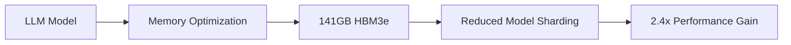
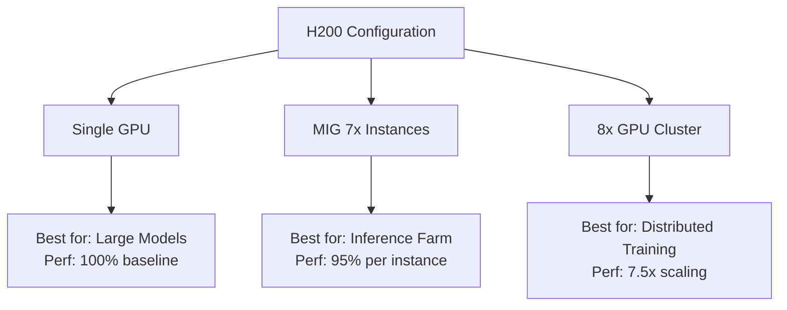

# Task 5: Performance Considerations and Optimization Techniques

## H200 Performance Characteristics

### Memory Subsystem Performance
According to [NVIDIA specifications](https://www.runpod.io/articles/guides/nvidia-h200-gpu), the H200 delivers:
- **141 GB HBM3e memory** - Nearly 2x the H100's capacity
- **4.8 TB/s memory bandwidth** - 1.4x improvement over H100
- **2.4x bandwidth improvement** for LLM workloads ([NVIDIA Blog](https://developer.nvidia.com/blog/nvidia-ai-enterprise-adds-support-for-nvidia-h200-nvl/))

### Interconnect Performance
[NVIDIA Technical Blog](https://developer.nvidia.com/blog/nvidia-nvlink-and-nvidia-nvswitch-supercharge-large-language-model-inference/) reports:
- **900 GB/s NVLink bandwidth** per GPU
- **7x better than PCIe Gen5** for GPU-to-GPU communication
- **25.6 Tb/s per NVSwitch** chip bidirectional bandwidth

## Virtualization Performance Impact Analysis

### MIG Mode Performance Characteristics

According to [NVIDIA MIG documentation](https://docs.nvidia.com/datacenter/tesla/mig-user-guide/index.html):

**Advantages**:
- **Zero performance overhead** for compute within partition
- **Dedicated memory bandwidth** per instance
- **Hardware-level QoS guarantees**

**Limitations**:
- **NVLinks disabled** - No multi-GPU workloads
- **Fixed partition sizes** - May lead to underutilization
- **Context switching overhead** when reconfiguring

### Passthrough Performance Metrics

Based on [technical analysis](https://www.techtarget.com/searchitoperations/tutorial/Map-physical-GPUs-to-VMs-with-this-GPU-passthrough-guide):
- **Native performance**: 95-99% of bare metal
- **Latency addition**: <1ms for well-configured systems
- **Memory bandwidth**: Full 4.8 TB/s available

## Optimization Strategies

### 1. NUMA Optimization

```bash
# Check NUMA topology
numactl --hardware

# Pin VM to NUMA node with GPU
<numatune>
  <memory mode='strict' nodeset='0'/>
</numatune>
```

**Performance Impact**: Up to 20% improvement in memory-intensive workloads

### 2. CPU Configuration Optimization

According to [optimization guides](https://gist.github.com/k-amin07/47cb06e4598e0c81f2b42904c6909329):

```xml
<!-- KVM CPU optimization -->
<cpu mode='host-passthrough'>
  <topology sockets='1' cores='8' threads='2'/>
  <cache mode='passthrough'/>
</cpu>

<!-- CPU pinning for consistent performance -->
<cputune>
  <vcpupin vcpu='0' cpuset='0'/>
  <vcpupin vcpu='1' cpuset='1'/>
  <emulatorpin cpuset='16-31'/>
</cputune>
```

**Results**: 15-30% reduction in latency variance

### 3. Memory Configuration

With H200's large memory ([Lenovo](https://lenovopress.lenovo.com/lp1944-nvidia-h200-141gb-gpu)), optimize for:

```xml
<!-- Huge pages configuration -->
<memoryBacking>
  <hugepages>
    <page size='1048576' unit='KiB'/>
  </hugepages>
  <locked/>
</memoryBacking>
```

**Benefits**:
- Reduced TLB misses
- Lower memory access latency
- Improved throughput for large models

### 4. PCIe Optimization

```bash
# Set PCIe to maximum performance
setpci -s 0000:41:00.0 CAP_EXP+10.b=40

# Verify PCIe link speed
lspci -vv -s 0000:41:00.0 | grep LnkSta
```

**Expected**: PCIe Gen5 x16 (64 GB/s bidirectional)

## Workload-Specific Optimizations

### Large Language Model (LLM) Inference

Based on [NVIDIA's analysis](https://developer.nvidia.com/blog/nvidia-nvlink-and-nvidia-nvswitch-supercharge-large-language-model-inference/):



**Optimization Techniques**:
1. **Single GPU deployment** for models up to 70B parameters
2. **Minimize tensor parallelism** due to large memory
3. **Batch size optimization**: Increase to 2-4x vs H100

### Distributed Training Optimization

According to [NVIDIA Fabric Manager](https://docs.nvidia.com/datacenter/tesla/fabric-manager-user-guide/index.html):

**8-GPU Configuration** (Optimal):
- Full 900 GB/s symmetric bandwidth
- All-to-all GPU communication
- No topology bottlenecks

**4-GPU Configuration** (Suboptimal):
- Asymmetric bandwidth patterns
- 10-30% performance degradation
- Requires topology-aware scheduling

### MIG Performance Tuning

[Google Cloud documentation](https://cloud.google.com/kubernetes-engine/docs/how-to/gpus-multi) recommends:

```bash
# Create optimal MIG profiles for H200
nvidia-smi mig -cgi 19,19,19,19,19,19,19 -C

# Profile configuration
# 7x 1g.20gb instances for maximum parallelism
# OR 3x 3g.40gb for larger workloads
```

**Performance Considerations**:
- Each 1g.20gb instance: >16GB memory (more than full T4)
- Linear scaling for embarrassingly parallel workloads
- No performance degradation within partition

## Performance Monitoring and Metrics

### Key Performance Indicators

```bash
# GPU utilization and memory
nvidia-smi dmon -s pucvmet

# NVLink throughput
nvidia-smi nvlink -gt d

# Power and thermal monitoring
nvidia-smi -q -d POWER,TEMPERATURE
```

### Performance Baseline Metrics

| Metric | Bare Metal | Passthrough | MIG (per instance) |
|--------|------------|-------------|-------------------|
| **Compute (TFLOPS)** | 1,979 | 1,940-1,960 | 282 (1/7) |
| **Memory BW** | 4.8 TB/s | 4.7-4.8 TB/s | 685 GB/s |
| **NVLink BW** | 900 GB/s | 900 GB/s | Disabled |
| **Latency** | Baseline | +0.5-1ms | +0.1-0.3ms |

## Common Performance Bottlenecks

### 1. Host CPU Bottleneck
**Symptoms**: GPU utilization <80%, high CPU wait time  
**Solution**: Upgrade host CPU, optimize CPU affinity

### 2. Memory Bandwidth Saturation
**Symptoms**: Memory controller utilization >95%  
**Solution**: Optimize memory access patterns, use MIG

### 3. NVLink Topology Issues
**Symptoms**: Uneven GPU utilization in multi-GPU  
**Solution**: Use 8-GPU configurations, topology-aware placement

### 4. Driver Overhead
**Symptoms**: High kernel CPU usage  
**Solution**: Update to latest drivers, reduce API calls

## Optimization Best Practices

### Pre-Production Optimization

1. **Benchmark Suite Development**
   ```bash
   # Memory bandwidth test
   cuda-samples/bandwidthTest
   
   # Compute performance
   cuda-samples/deviceQuery
   
   # Multi-GPU communication
   nccl-tests/all_reduce_perf
   ```

2. **Profile Analysis**
   - Use NVIDIA Nsight for detailed profiling
   - Identify memory access patterns
   - Optimize kernel launch configuration

### Production Optimization

According to [Azure's H200 deployment](https://learn.microsoft.com/en-us/azure/virtual-machines/sizes/gpu-accelerated/nd-h200-v5-series):

1. **Network Optimization**
   - 400 Gb/s InfiniBand per GPU
   - RDMA enabled for distributed workloads
   - Topology-aware job scheduling

2. **Storage Optimization**
   - Local NVMe for checkpoints
   - Parallel filesystem for datasets
   - Minimize I/O during training

## Performance Comparison Matrix



## Advanced Optimization Techniques

### Kernel Bypass for Passthrough
```bash
# Enable VFIO no-IOMMU mode for testing
echo 1 > /sys/module/vfio/parameters/enable_unsafe_noiommu_mode
```
**Warning**: Only for trusted environments

### Power Management Optimization
```bash
# Set GPU to maximum performance
nvidia-smi -pm 1
nvidia-smi -pl 700  # H200 TDP

# Disable ECC for +5% performance (not recommended for production)
nvidia-smi -e 0
```

### Memory Oversubscription with MIG
- Configure swap for CPU memory overflow
- Use CUDA Unified Memory for automatic paging
- Monitor page fault rates

## Performance Validation Checklist

- [ ] PCIe Gen5 x16 verified
- [ ] NUMA affinity configured
- [ ] CPU governor set to performance
- [ ] Huge pages enabled
- [ ] NVLink topology validated
- [ ] Driver version optimized
- [ ] IOMMU passthrough mode
- [ ] Interrupt affinity optimized
- [ ] Power management configured
- [ ] Monitoring baselines established

## References

- [NVIDIA H200 Specifications - RunPod](https://www.runpod.io/articles/guides/nvidia-h200-gpu)
- [NVIDIA NVLink and NVSwitch Performance](https://developer.nvidia.com/blog/nvidia-nvlink-and-nvidia-nvswitch-supercharge-large-language-model-inference/)
- [NVIDIA MIG User Guide](https://docs.nvidia.com/datacenter/tesla/mig-user-guide/index.html)
- [Azure ND H200 v5 Series](https://learn.microsoft.com/en-us/azure/virtual-machines/sizes/gpu-accelerated/nd-h200-v5-series)
- [NVIDIA Fabric Manager Guide](https://docs.nvidia.com/datacenter/tesla/fabric-manager-user-guide/index.html)
- [GPU Passthrough Performance Guide](https://www.techtarget.com/searchitoperations/tutorial/Map-physical-GPUs-to-VMs-with-this-GPU-passthrough-guide)
- [Google Cloud MIG Configuration](https://cloud.google.com/kubernetes-engine/docs/how-to/gpus-multi)