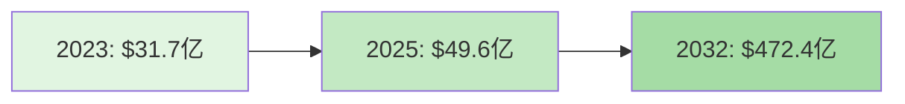
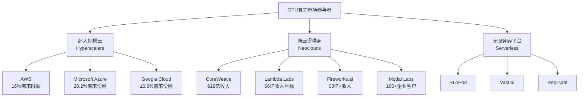
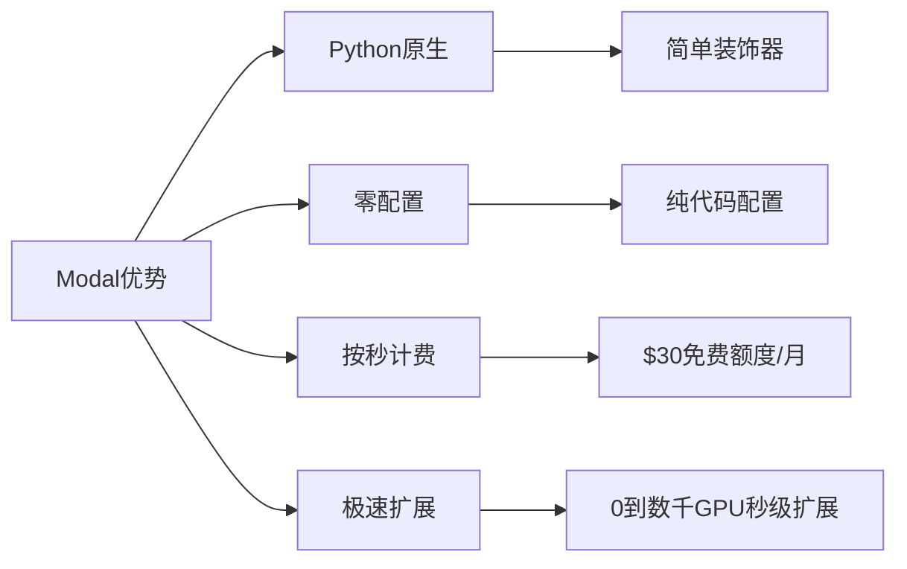
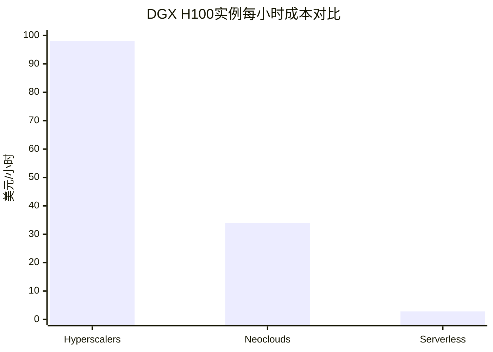
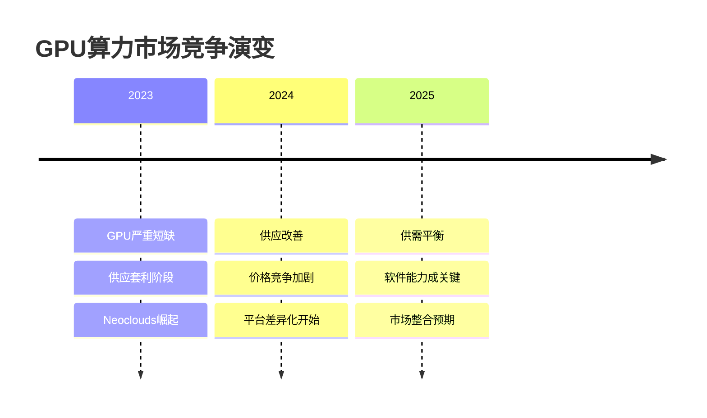
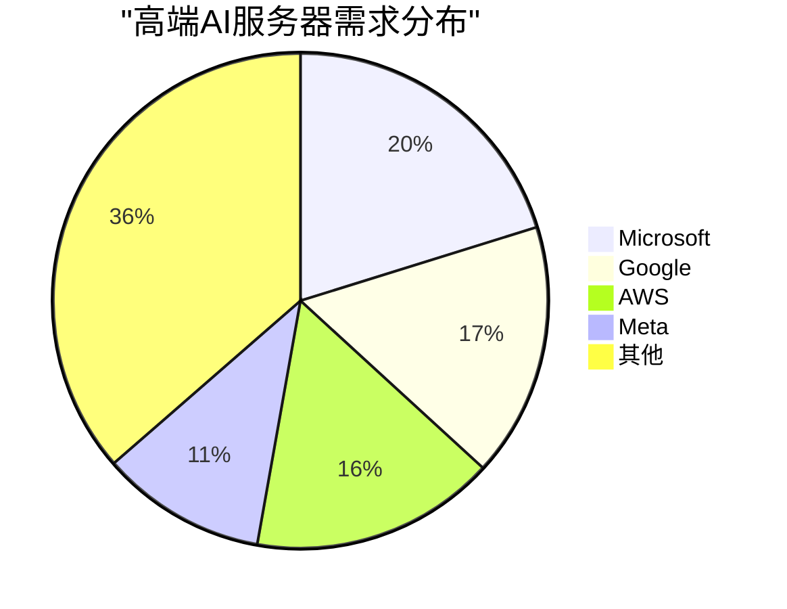

# GPU算力市场分析报告：Fireworks.ai、Modal与竞争格局研究

## 执行摘要

GPU算力市场正经历前所未有的增长，预计将从2023年的31.7亿美元增长到2032年的472.4亿美元，年复合增长率达35%。在这个快速扩张的市场中，Fireworks.ai和Modal等新兴企业正通过差异化的技术和商业模式，挑战传统云巨头的主导地位。

**关键发现：**
- Fireworks.ai估值可能从5.52亿美元跃升至40亿美元，专注于"复合AI系统"
- Modal Labs以Python原生开发体验为核心，已获3200万美元融资
- 新云(Neoclouds)相比超大规模云提供商(Hyperscalers)可节省66%成本
- GPU供应短缺正在缓解，竞争焦点转向平台能力和软件差异化

## 市场格局概览

### 市场规模与增长



根据多项市场研究，GPU云计算市场展现出爆发式增长：
- **整体市场**：2023-2032年CAGR达35% [来源：Credence Research](https://www.credenceresearch.com/report/cloud-gpu-market)
- **AI推理市场**：预计2030年达到2549.8亿美元 [来源：MarketsandMarkets](https://www.marketsandmarkets.com/Market-Reports/ai-inference-market-189921964.html)
- **区域分布**：北美占34%市场份额，亚太地区增速最快(25.5% CAGR)

### 市场参与者层级



## Fireworks.ai 深度分析

### 公司概况
- **创立时间**：2022年
- **创始团队**：前Meta和Google工程师，包括两位乌克兰联合创始人
- **当前估值**：5.52亿美元，正寻求40亿美元估值（7倍增长）
- **年收入**：超过3亿美元

### 核心竞争优势

```mermaid
radar
    title Fireworks.ai竞争力雷达图
    label Performance
    label Cost
    label Scalability
    label Innovation
    label Ecosystem
    data Fireworks.ai, 95, 90, 85, 92, 75
    data 行业平均, 70, 60, 70, 65, 80
```

**技术优势**：
- 推理速度比vLLM快12倍，比GPT-4快40倍
- 成本比HuggingFace TGI低6倍
- 每日处理1400亿tokens，99.99%正常运行时间

**战略定位**：专注于"复合AI系统"，为企业提供多模型集成框架

详细分析请见：[Fireworks.ai公司分析报告](./reports/task-1-fireworks-ai-profile.md)

## Modal Labs 深度分析

### 公司概况
- **创立时间**：2021年
- **创始人**：Erik Bernhardsson（前Spotify推荐系统构建者）
- **融资总额**：3200万美元
- **估值**：1.38亿美元（2023年A轮前）

### 差异化策略



**核心特色**：
- Python开发者友好，无需YAML配置
- 冷启动时间2-4秒
- 支持H100和A100等高端GPU

详细分析请见：[Modal Labs公司分析报告](./reports/task-2-modal-labs-profile.md)

## 竞争格局分析

### 成本对比



### 主要竞争维度

| 维度 | Hyperscalers | Neoclouds | 关键差异 |
|------|--------------|-----------|----------|
| **成本** | $98/小时 | $34/小时 | 66%成本节省 |
| **部署速度** | 2-4周 | 数天 | 10倍速度提升 |
| **生态系统** | 完整 | 专注AI | 深度vs专业 |
| **客户基础** | 企业为主 | 初创+企业 | 市场细分 |

### 竞争动态演变



详细竞争分析请见：[竞争动态分析报告](./reports/task-5-competitive-dynamics.md)

## 市场趋势与机遇

### 关键趋势

1. **从训练转向推理**
   - 2023年NVIDIA数据中心收入40%来自推理
   - 推理市场预计2030年达2550亿美元

2. **复合AI系统兴起**
   - 从单体模型转向多组件系统
   - 类似微服务架构的AI应用

3. **无服务器GPU计算**
   - 按秒计费成为标准
   - 冷启动时间降至200毫秒以下

### 增长驱动因素



**主要驱动力**：
- 每日生成3400万张AI图像
- 企业AI应用快速普及
- 生成式AI和大语言模型需求爆发

详细趋势分析请见：[市场趋势报告](./reports/task-4-business-trends.md)

## 战略启示

### 对市场参与者

**Hyperscalers策略建议**：
- 加强AI专用基础设施投资
- 利用生态系统优势维持客户粘性
- 开发差异化的AI服务

**Neoclouds策略建议**：
- 从基础设施转向平台能力建设
- 深化软件差异化
- 构建开发者生态系统

**新进入者机会**：
- 专注细分市场和特定用例
- 边缘计算和混合云架构
- 可持续能源驱动的数据中心

### 对企业用户

1. **多云策略**：利用不同提供商的优势
2. **成本优化**：考虑Neoclouds节省成本
3. **技术选择**：根据工作负载选择合适平台

## 未来展望

GPU算力市场正处于快速演变期，主要特征包括：

- **市场整合预期**：随着GPU供应改善，差异化将更加困难
- **平台化竞争**：从纯基础设施向综合平台服务转变
- **定制芯片崛起**：OpenAI、AWS等开发专有芯片
- **可持续发展**：能源效率成为竞争要素

Fireworks.ai和Modal代表了两种不同但互补的市场策略：前者专注于企业级复合AI系统，后者致力于开发者体验优化。两家公司都展现出强劲的增长势头，有望在这个快速扩张的市场中占据重要地位。

## 研究报告目录

- [Task 1: Fireworks.ai公司深度分析](./reports/task-1-fireworks-ai-profile.md)
- [Task 2: Modal Labs公司深度分析](./reports/task-2-modal-labs-profile.md)
- [Task 3: GPU市场格局全景分析](./reports/task-3-gpu-market-landscape.md)
- [Task 4: 业务趋势与增长驱动因素](./reports/task-4-business-trends.md)
- [Task 5: 竞争动态与定位策略](./reports/task-5-competitive-dynamics.md)

---

*本报告基于2024-2025年最新市场数据和行业研究编制*