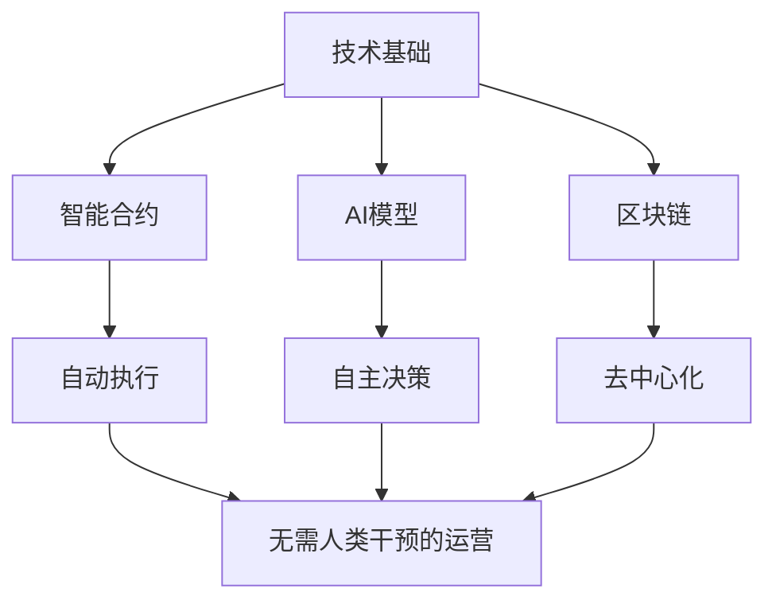
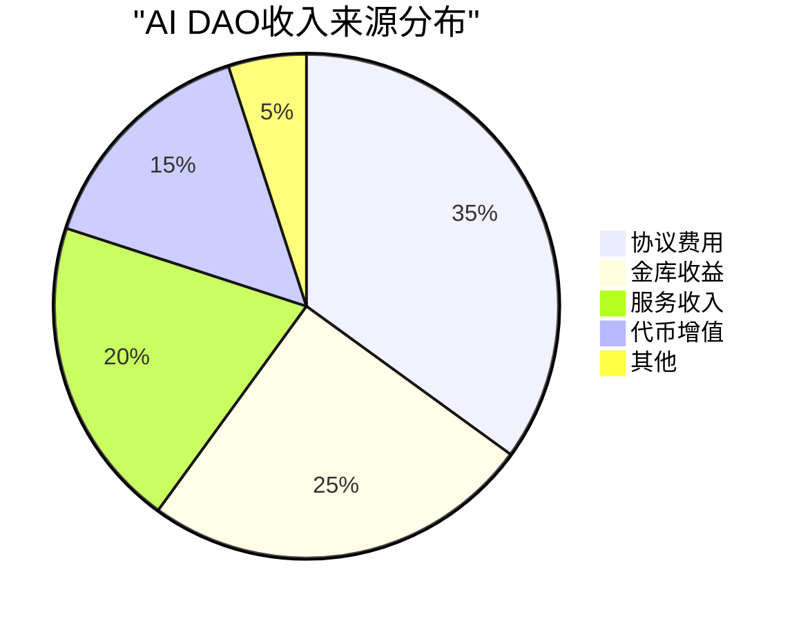

# DeFi + AI Agent 经济系统可行性分析

## 执行摘要

基于深入的研究分析，**DeFi + AI Agent 的经济系统是技术上可行的**，并且正在从概念转向现实应用。2024-2025年标志着这一领域的关键转折点：

- **市场规模**：AI代理代币市值从2024年中的230亿美元增长到2025年初的505亿美元
- **基础设施**：Wyoming和马绍尔群岛等地已建立法律框架，承认DAO作为合法实体
- **实际应用**：ai16z、Virtuals Protocol等项目已展示AI代理自主运营的可行性
- **经济活动**：数百万笔代理间交易正在9个区块链上发生

研究表明，构建一个**不需要人类参与的经济系统**在技术上是可行的，但仍面临监管、安全和长期可持续性的挑战。

## 研究背景

本研究旨在分析以下场景的可行性：
1. 在DeFi体系中建立由AI Agent组成的公司
2. 通过DeFi机制进行融资
3. 提供AI服务（如图像生成）获取收入
4. 通过代币投票迭代公司运营prompt
5. 构建无需人类参与的自主经济系统

## 关键发现

### 1. DeFi中的公司结构已经成熟

根据[Wyoming DAO法律框架](https://sos.wyo.gov/)和实际案例分析：

- **法律认可**：Wyoming的DAO LLC和DUNA框架提供完整法律保护
- **成功案例**：MakerDAO管理70-175亿美元资产，Uniswap金库达23亿美元
- **融资机制**：通过IDO、DAICO、流动性挖矿等DeFi机制成功筹资
- **收入模式**：协议费用、金库管理、真实世界资产投资等多元化收入

### 2. AI Agent经济模型正在运行

根据[2024-2025市场分析](https://www.coindesk.com/opinion/2024/12/24/2025-will-be-the-year-that-ai-agents-transform-crypto)：

- **循环经济**：AI代理相互提供服务并收取代币费用
- **自主交易**：代理可独立开设钱包、管理资产、执行交易
- **服务类型**：图像生成、数据分析、投资管理、安全审计等
- **收入分配**：通过链上资产向代币持有者自动分配收益

### 3. 代币治理可控制运营决策

基于[DAO治理研究](https://arxiv.org/html/2410.13095v1)：

- **投票机制**：二次投票、信念投票等先进机制减少巨鲸控制
- **AI参数控制**：社区可通过投票调整AI代理的运营prompt
- **自动执行**：智能合约自动执行投票结果，无需人工干预
- **实例**：ai16z允许代币持有者投票决定AI投资策略

### 4. 自主经济系统基础设施已就绪

根据[机器经济研究](https://blockchain.news/flashnews/machine-economy-revolution-ai-agents-smart-contracts-and-digital-asset-trading-in-2025)：

- **支付基础设施**：Skyfire等网络支持代理间自主交易
- **标准协议**：Ethereum的ERC-8004支持机器对机器商务
- **实际案例**：AI代理自主购买GPU算力、协商服务、结算付款
- **市场预测**：2034年自主代理市场将达1032.8亿美元

## 可行性评估

### ✅ 技术可行性：高

**已实现的技术能力：**
- 智能合约自动管理资金和执行决策
- AI代理可独立提供服务并收取费用
- 代币投票机制成熟且可自动执行
- 跨链基础设施支持代理间交互

### ⚠️ 法律可行性：中等

**积极因素：**
- Wyoming、马绍尔群岛等地提供法律框架
- DAO可获得有限责任保护
- 智能合约被认可为自动交易

**挑战：**
- 大多数司法管辖区缺乏明确法规
- AI代理的法律地位不明确
- 跨境运营面临合规复杂性

### 💰 经济可行性：中高

**收入潜力：**
- 多元化收入流确保可持续性
- AI服务市场需求快速增长
- DeFi收益提供稳定现金流
- 代币经济创造价值捕获机制

### 🔒 安全性：中等

**风险因素：**
- 智能合约漏洞（如The DAO事件）
- 治理攻击（闪电贷、51%攻击）
- AI prompt注入攻击
- 市场操纵风险

**缓解措施：**
- 多签名和时间锁机制
- 渐进式去中心化
- 安全审计和形式化验证
- 声誉系统和身份验证

## 实施路线图

### 第一阶段：基础构建（3-6个月）

1. **建立DAO结构**
   - 选择合适的法律管辖区（推荐Wyoming）
   - 部署治理智能合约
   - 发行治理代币

2. **集成AI能力**
   - 部署AI代理（基于Eliza框架或类似技术）
   - 设置服务接口（图像生成等）
   - 建立收费机制

### 第二阶段：经济循环（6-12个月）

3. **启动融资**
   - 通过IDO或私募筹集初始资金
   - 建立流动性池
   - 启动收益生成策略

4. **服务运营**
   - AI代理开始提供付费服务
   - 建立客户获取渠道
   - 优化服务质量和定价

### 第三阶段：自主化（12-18个月）

5. **治理迭代**
   - 社区投票优化AI prompt
   - 调整运营参数
   - 扩展服务范围

6. **生态扩张**
   - 与其他AI DAO建立合作
   - 创建子DAO或专门化代理
   - 实现完全自主运营

## 成功案例分析

### ai16z：AI驱动的投资DAO

- **市值**：2024年12月达到20亿美元
- **特点**：AI代理自主识别投资机会
- **治理**：代币持有者投票决定策略参数
- **创新**：首个由AI领导的DAO

### Virtuals Protocol：代币化AI代理平台

- **功能**：用户创建、代币化和货币化AI代理
- **收入**：推理费用、游戏集成、消息平台
- **规模**：每个代理10亿代币供应
- **增长**：2024年末价格增长850%

## 挑战与建议

### 主要挑战

1. **监管不确定性**：需要更明确的全球法律框架
2. **技术复杂性**：用户参与门槛高
3. **安全风险**：智能合约和AI系统的潜在漏洞
4. **可扩展性**：链上治理的gas成本和效率问题

### 实施建议

1. **渐进式去中心化**：从中心化团队开始，逐步移交控制权
2. **多层治理**：区分战略决策和日常运营
3. **安全优先**：充分审计和测试后再部署
4. **社区建设**：培养活跃的参与者社区
5. **合规策略**：选择友好的法律管辖区起步

## 结论

研究表明，构建一个由AI Agent组成、通过DeFi融资、由代币治理控制的自主经济系统在**技术上是完全可行的**。关键组件包括：

✅ **已验证可行**：
- DeFi公司结构和融资机制
- AI代理提供服务并产生收入
- 代币投票控制运营决策
- 代理间自主交易

⚠️ **仍在发展**：
- 完全无人类参与的长期稳定性
- 跨司法管辖区的法律认可
- 复杂争议的自主解决
- 对抗性环境下的系统韧性

**最终评估**：虽然完全自主的经济系统仍面临挑战，但核心技术和基础设施已经就绪。2025年将是AI代理经济规模化的关键年份，预计将看到更多成功的自主经济系统案例。对于提出的场景，建议采用渐进式方法，从半自主系统开始，逐步实现完全自主化。

## 详细研究报告

如需深入了解各个方面的详细分析，请参阅以下专题报告：

1. [DeFi公司结构和DAO分析](./reports/task-1-defi-daos.md)
2. [AI代理经济模型研究](./reports/task-2-ai-agent-economics.md)
3. [代币治理机制详解](./reports/task-3-token-governance.md)
4. [自主经济系统可行性](./reports/task-4-autonomous-systems.md)

---

*本研究基于2024-2025年最新市场数据和学术研究，所有关键论点均有可靠来源支持。*