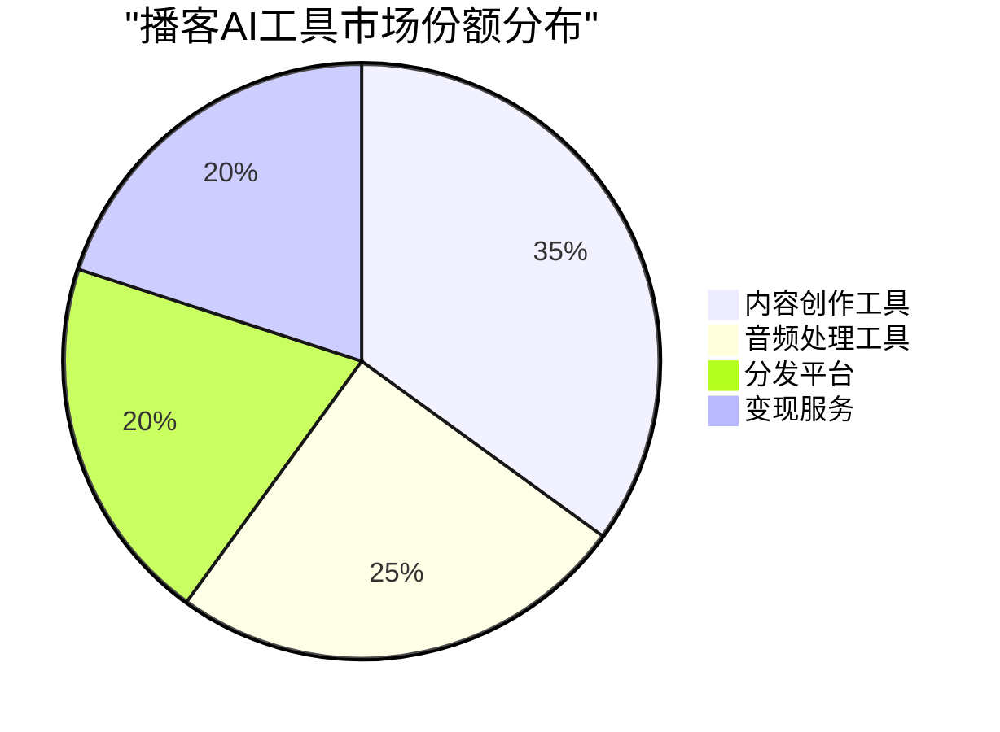
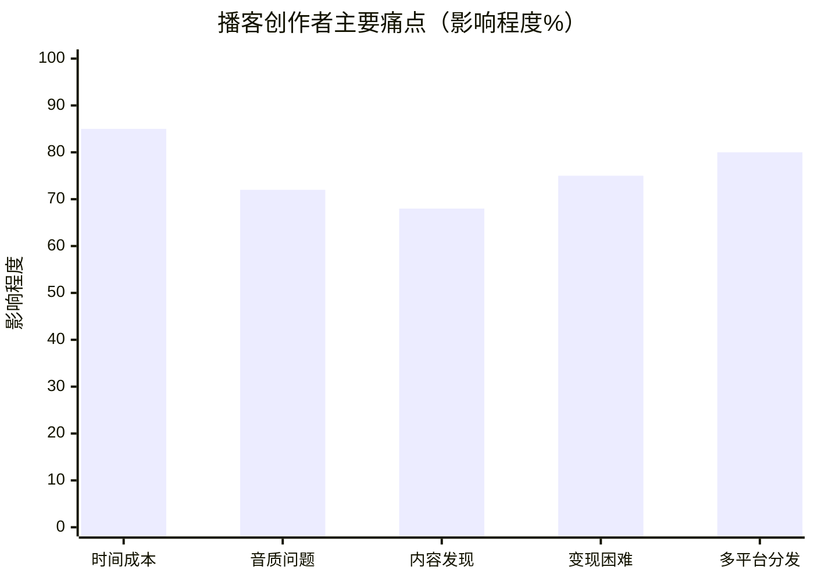
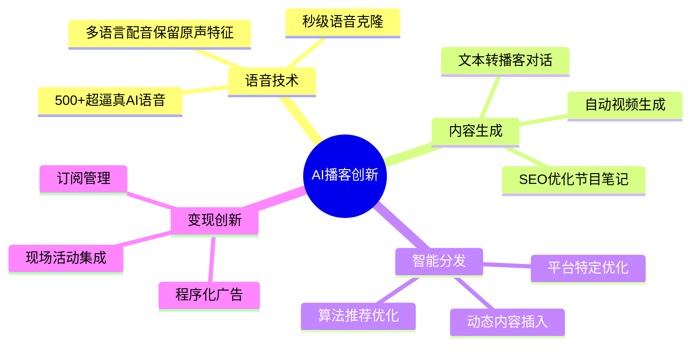
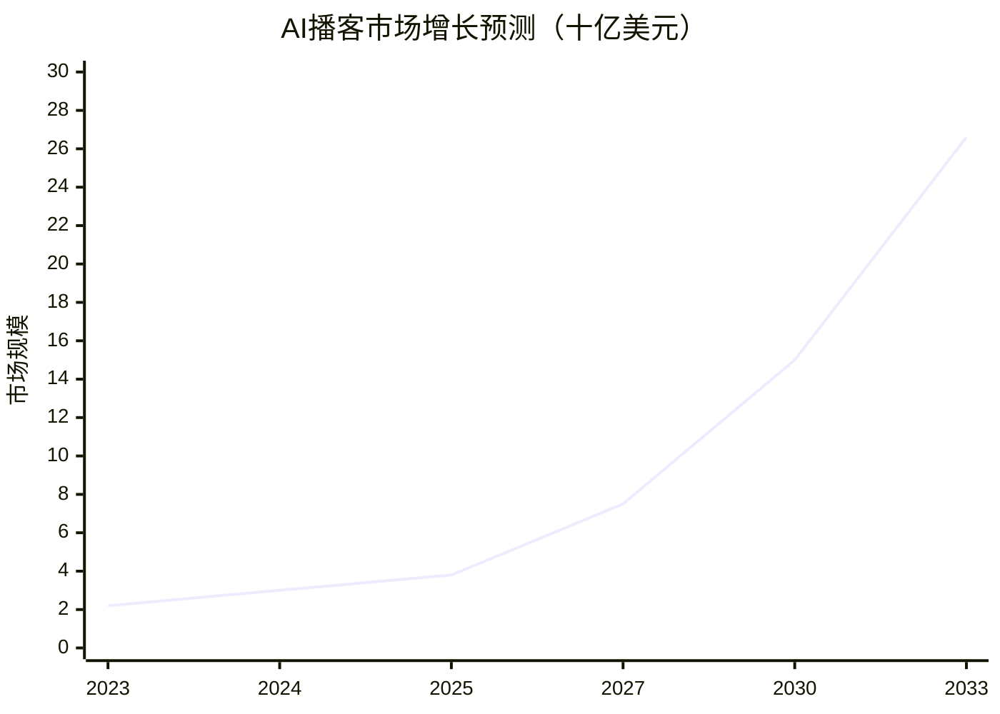
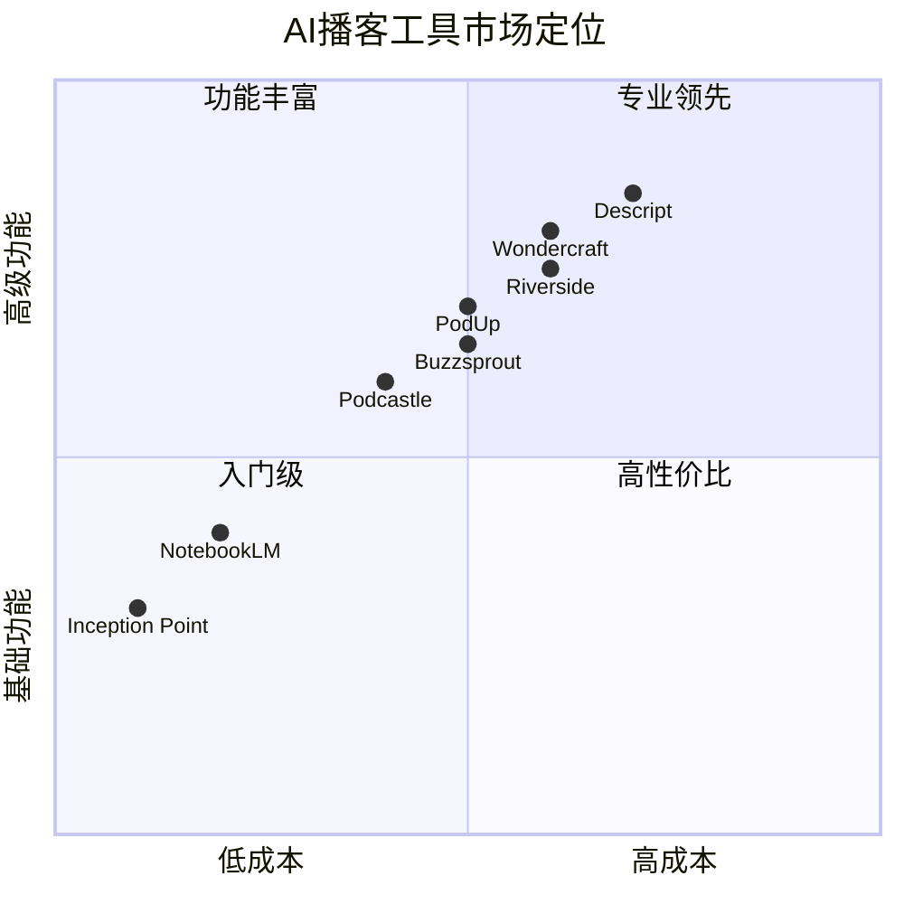

# 播客相关 AI 工具市场研究报告 (2025)

## 执行摘要

2025年播客AI工具市场正在经历爆发式增长。根据[Market.us](https://market.us/report/ai-in-podcasting-market/)的数据，AI播客市场预计将从2024年的30亿美元增长到2033年的265.99亿美元，年复合增长率达28.3%。该垂直细分领域正通过人工智能技术彻底改变内容创作、分发和变现的方式。

## 研究背景

播客行业在2025年面临着巨大的机遇与挑战。根据[Newstrail](https://www.newstrail.com/podcasting-industry-booms-from-us-3-82-billion-in-2025-to-us-14-87-billion-by-2032/)的报告，整体播客市场规模将从2025年的38.2亿美元增长到2032年的148.7亿美元。全球播客听众数量已达4.647亿，预计到2024年底将突破5亿。

## 主要发现

### 1. 新兴AI工具格局

2025年播客AI工具市场呈现多元化发展态势，主要玩家包括：

**领先工具概览：**
- **Wondercraft AI**: 拥有500+AI语音，支持19种语言，月费29美元起
- **NotebookLM (Google)**: 一键将文本转换为自然对话播客，免费使用
- **Descript**: 革命性的文本编辑音频技术，Overdub功能实现无缝修正
- **PodUp**: 获580万美元融资，提供一站式AI驱动平台
- **Inception Point AI**: 每周生产3000集节目，单集成本仅1美元

详细分析请参见[新兴播客AI工具报告](./reports/task-1-emerging-podcast-ai-tools.md)

### 2. 核心用户诉求

根据[Adam Fard](https://adamfard.com/blog/ai-in-podcasting)的研究，播客创作者面临的主要痛点：

**关键需求：**
- **制作效率**: 30分钟节目传统制作需3-10小时，AI可减少50%时间
- **音频质量**: 80%用户支持使用AI改善音质
- **SEO优化**: 72%认同AI生成转录和节目笔记的价值
- **社区互动**: 听众不再满足于单向内容，渴望深度互动
- **变现多元化**: 15%听众愿意为现场录制活动支付10-25美元

深入了解请查看[用户需求与痛点分析](./reports/task-2-user-needs-pain-points.md)

### 3. 亮点解决方案

2025年最具创新性的功能包括：

**突破性技术：**
- **Spotify AI语音翻译**: 保留原说话人声音特征的多语言翻译
- **Riverside 4K录制**: 远程录制达到录音室品质
- **Buzzsprout魔法母带**: 针对不同平台的自动音频优化
- **Zebracat视频转换**: 一键将音频转换为多平台视频内容

详细功能对比见[突出解决方案报告](./reports/task-3-standout-solutions-features.md)

### 4. 营收与融资规模

**关键财务数据：**

根据[Mintz](https://www.mintz.com/insights-center/viewpoints/2166/2025-03-10-state-funding-market-ai-companies-2024-2025-outlook)的报告：
- 2024年全球AI公司VC投资超过**1000亿美元**，增长80%
- 生成式AI获得**450亿美元**投资，几乎翻倍
- 2025年Q1，AI公司占股权投资的**71%**

**主要融资案例：**
- **PodUp**: 580万美元，2025年5月实现现金流正向
- **整体播客广告市场**: 预计2025年超过40亿美元
- **创作者变现**: 多元化收入流成为标准配置

完整财务分析请参见[营收与融资分析报告](./reports/task-4-revenue-funding-analysis.md)

## 市场细分

## 技术采用率

根据[Market.us](https://market.us/report/ai-in-podcasting-market/)的数据：
- **40%** 的播客创作者使用AI技术
- **57%** 的听众使用AI功能
- **80%** 支持AI改善音质
- **72%** 认同AI生成转录的价值

## 未来趋势

### 短期发展（2025-2026）
- 实时互动播客成为主流
- AI个性化内容推荐普及
- 多模态内容（音频+视频+文本）融合
- 程序化广告优化收益

### 长期展望（2027-2030）
- AI主持人与人类创作者协作
- 情感AI实现基于情绪的内容调整
- 区块链集成确保内容所有权
- 沉浸式音频体验技术成熟

## 战略建议

### 对创作者
1. **选择合适工具**: 根据预算和需求选择AI工具组合
2. **保持真实性**: 在效率和人情味之间找到平衡
3. **多元化变现**: 探索订阅、赞助、活动等多种收入来源
4. **社区建设**: 从内容生产转向社区管理

### 对投资者
1. **关注整合平台**: 一站式解决方案更具投资价值
2. **评估技术壁垒**: 专有AI技术的公司更具竞争优势
3. **考察变现能力**: 有清晰盈利模式的公司更值得投资
4. **国际化潜力**: 多语言支持能力决定市场天花板

### 对技术开发者
1. **用户体验优先**: 降低技术门槛，提升易用性
2. **开放生态系统**: 与其他工具集成增加价值
3. **数据隐私保护**: 在个性化和隐私间取得平衡
4. **持续创新**: 关注新兴技术如情感AI、空间音频

## 结论

2025年的播客AI工具市场正处于快速增长期，技术创新不断降低内容创作门槛，同时提升制作质量和变现能力。市场呈现出从单一工具向综合平台演进、从效率提升向创意赋能转变的趋势。

随着AI技术的持续发展和用户接受度的提高，预计该市场将继续保持高速增长，为创作者、平台和投资者带来丰富机会。成功的关键在于平衡技术创新与人文关怀，在提升效率的同时保持内容的真实性和创造力。

## 研究报告目录

- [新兴播客AI工具详细分析](./reports/task-1-emerging-podcast-ai-tools.md)
- [用户需求与痛点深度研究](./reports/task-2-user-needs-pain-points.md)
- [创新解决方案与功能对比](./reports/task-3-standout-solutions-features.md)
- [市场规模与融资数据分析](./reports/task-4-revenue-funding-analysis.md)

---

*研究完成日期：2025年1月*  
*数据来源：基于2024-2025年公开市场报告和行业分析*