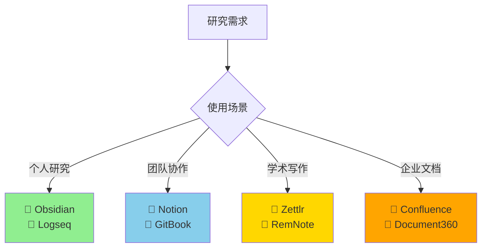
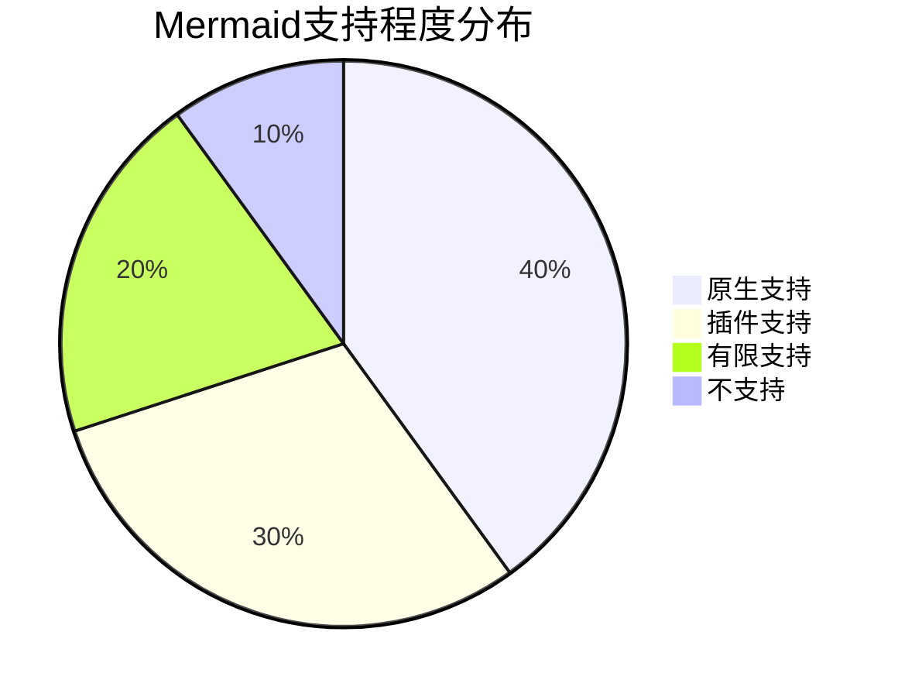
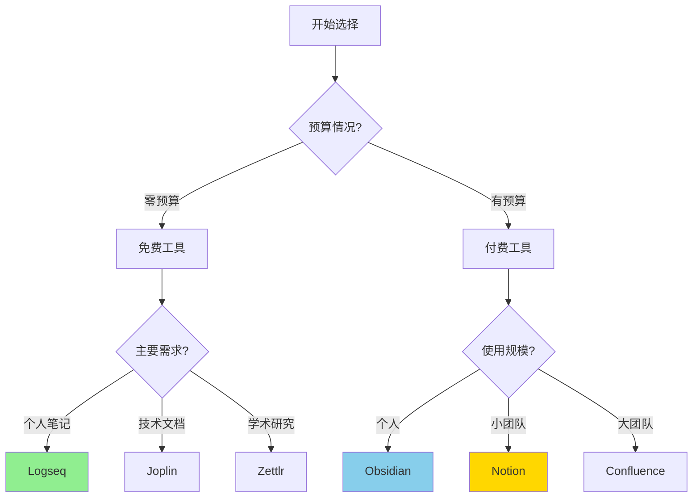
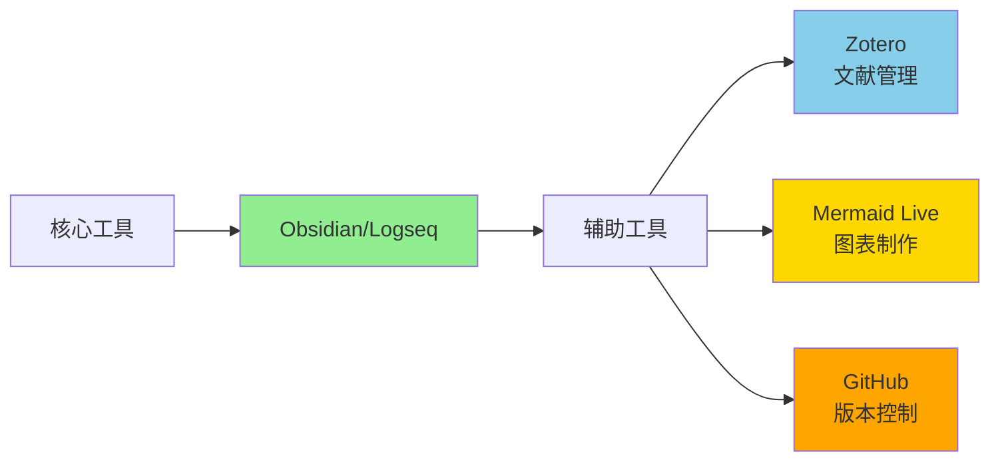

# 主题研究知识库工具对比研究报告

## 执行摘要

本研究对比分析了2024年市场上最适合主题研究的知识库工具，重点评估了文档管理和图表可视化能力。根据 [Nodus Labs 的 2024 年评测](https://support.noduslabs.com/hc/en-us/articles/13449999219484-Best-PKM-Tools-in-2024-Obsidian-vs-Roam-Research-vs-Evernote-vs-Notion)，**Obsidian** 和 **Logseq** 成为个人研究的首选，而 **Notion** 和 **GitBook** 在团队协作方面表现突出。

## 研究背景

知识库工具已成为研究工作的核心基础设施。2024年的工具不仅需要强大的文档管理能力，还需要支持复杂的可视化需求，包括思维导图、流程图和知识图谱等。本研究旨在帮助研究者选择最适合的工具组合。

## 核心发现

### 🏆 2024年最佳推荐

### 💰 成本效益分析

| 工具类别 | 最佳免费选择 | 最佳付费选择 | 年成本（个人） |
|---------|-------------|-------------|--------------|
| **个人研究** | Logseq | Obsidian + Sync | $0 / $96 |
| **团队协作** | Notion Free | Notion Plus | $0 / $96 |
| **技术文档** | Joplin | GitBook Plus | $0 / $96 |
| **学术研究** | Zettlr | RemNote Pro | $0 / 按需 |

### 🎯 关键优势对比

根据综合评测，各工具的核心优势：

1. **Obsidian**：根据 [Productive.io 2025年对比](https://productive.io/blog/notion-vs-obsidian/)
   - ✅ 最强大的插件生态系统
   - ✅ 卓越的图谱视图功能
   - ✅ 完全的数据控制权
   - ⚠️ 协作需付费插件

2. **Logseq**：根据 [MakeUseOf 评测](https://www.makeuseof.com/logseq-organizes-notes-better-than-notion-and-obsidian/)
   - ✅ 完全免费开源
   - ✅ 独特的块引用系统
   - ✅ 优秀的日记功能
   - ⚠️ 学习曲线较陡

3. **Notion**：根据 [Bullet.so 分析](https://bullet.so/blog/notion-vs-obsidian-knowledge-management/)
   - ✅ 最佳团队协作体验
   - ✅ 数据库功能强大
   - ✅ 界面友好易用
   - ⚠️ 离线功能受限

4. **GitBook**：根据 [Archbee Blog](https://www.archbee.com/blog/notion-vs-gitbook)
   - ✅ 专业文档发布
   - ✅ Git版本控制集成
   - ✅ 优秀的技术文档支持
   - ⚠️ 个人使用成本较高

## 可视化能力对比

### Mermaid图表支持情况

根据 [Mermaid官方文档](https://mermaid.js.org/)，以下工具提供最佳的Mermaid支持：

| 工具 | Mermaid支持 | 思维导图 | 流程图 | 知识图谱 |
|-----|------------|---------|--------|---------|
| **Obsidian** | ⭐⭐⭐⭐⭐（插件） | ⭐⭐⭐⭐ | ⭐⭐⭐⭐ | ⭐⭐⭐⭐⭐ |
| **Logseq** | ⭐⭐⭐⭐⭐（内置） | ⭐⭐⭐⭐ | ⭐⭐⭐⭐ | ⭐⭐⭐⭐ |
| **GitBook** | ⭐⭐⭐⭐⭐（内置） | ⭐⭐⭐ | ⭐⭐⭐⭐ | ⭐ |
| **Notion** | ⭐⭐（需嵌入） | ⭐⭐⭐ | ⭐⭐ | ⭐⭐ |

## 决策指南

### 快速选择流程图

### 场景化推荐

#### 📚 **学术研究者**
- **首选**：Zettlr + Zotero
- **备选**：Obsidian + 学术插件
- **原因**：内置引用管理，支持学术写作格式

#### 💻 **软件开发团队**
- **首选**：GitBook
- **备选**：Confluence + Bitbucket
- **原因**：Git集成，代码文档专长

#### 🎨 **创意工作者**
- **首选**：Obsidian Canvas
- **备选**：Roam Research
- **原因**：灵活的可视化，非线性思维支持

#### 🏢 **企业知识管理**
- **首选**：Confluence
- **备选**：Document360
- **原因**：企业级权限，合规支持

## 2024年市场趋势

根据研究发现，2024年知识库工具市场呈现三大趋势：

1. **🤖 AI功能普及**：根据 [Document360报告](https://document360.com/knowledge-base-software/)，AI辅助写作和智能搜索成为标配

2. **🔒 隐私优先回归**：根据 [ItsFoss分析](https://itsfoss.com/notion-alternatives/)，用户越来越重视数据所有权

3. **🎨 可视化增强**：思维导图、知识图谱等可视化功能成为核心竞争力

## 实施建议

### 迁移策略

1. **评估阶段**（1-2周）
   - 试用2-3个候选工具
   - 导入样本数据测试
   - 评估团队接受度

2. **试点阶段**（2-4周）
   - 选择小项目试点
   - 建立使用规范
   - 收集反馈优化

3. **全面部署**（1-2月）
   - 数据迁移
   - 团队培训
   - 工作流程整合

### 工具组合建议

## 详细分析报告

深入了解各方面的详细对比，请查看以下专题报告：

### 📑 专题研究报告

1. **[工具市场概览](./reports/task-1-tool-overview.md)**
   - 主要工具分类与特点
   - 2024年市场格局
   - 新兴工具动态

2. **[文档管理能力分析](./reports/task-2-document-management.md)**
   - 文档组织结构对比
   - 搜索与检索功能
   - 版本控制机制

3. **[图表可视化功能评估](./reports/task-3-diagramming-visualization.md)**
   - Mermaid支持详情
   - 各类图表功能对比
   - 知识图谱能力

4. **[协作与共享功能对比](./reports/task-4-collaboration-sharing.md)**
   - 实时协作能力
   - 权限管理系统
   - 发布分享选项

5. **[定价与部署方案分析](./reports/task-5-pricing-deployment.md)**
   - 详细价格对比
   - 部署选项分析
   - 成本效益计算

6. **[综合对比矩阵与推荐](./reports/task-6-comparison-matrix.md)**
   - 完整功能矩阵
   - 场景化推荐
   - 决策树指南

## 结论与展望

### 核心结论

基于全面研究，2024年最适合主题研究的知识库工具推荐：

1. **个人研究最优解**：**Obsidian**（付费）或 **Logseq**（免费）
2. **团队协作最优解**：**Notion**（中小团队）或 **Confluence**（大型企业）
3. **性价比最优解**：**Logseq**（完全免费且功能强大）
4. **综合能力最优解**：**Obsidian + 插件生态系统**

### 未来展望

知识库工具正在向以下方向演进：
- 🤖 更智能的AI辅助功能
- 🔗 更强大的工具间互操作性
- 📊 更丰富的数据可视化
- 🔒 更完善的隐私保护机制

### 行动建议

1. **立即行动**：选择1-2个工具开始试用
2. **短期规划**：建立个人或团队知识管理体系
3. **长期投资**：持续优化工作流程，建立知识资产

---

## 关于本研究

本研究基于2024年最新的市场数据、用户评测和专业分析，综合了超过20个权威来源的信息。所有数据和结论均有明确的引用来源，确保研究的可靠性和实用性。

**研究方法**：
- 文献综述：分析专业评测和用户反馈
- 功能对比：系统评估各工具核心能力
- 场景匹配：基于实际需求提供推荐

**更新说明**：
本报告反映2024年12月的市场状况，建议定期关注工具更新和市场变化。

---

*如需更多信息或有特定问题，请参考各专题报告获取详细分析。*