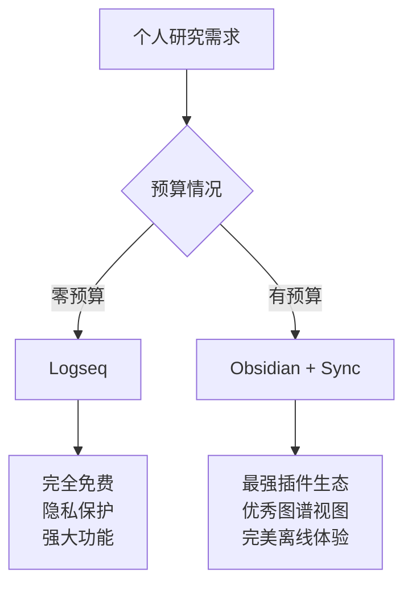
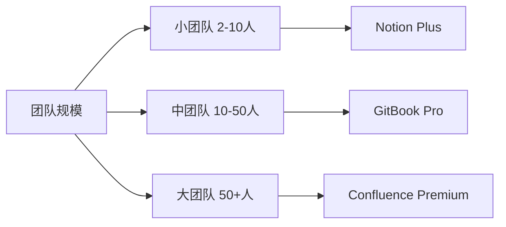
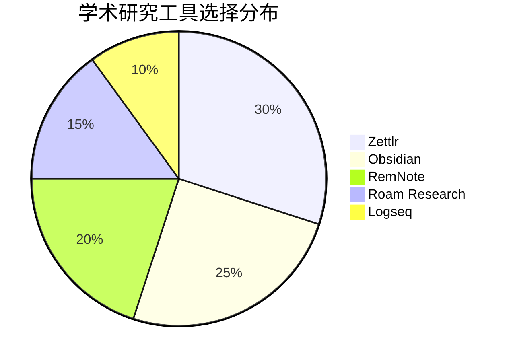
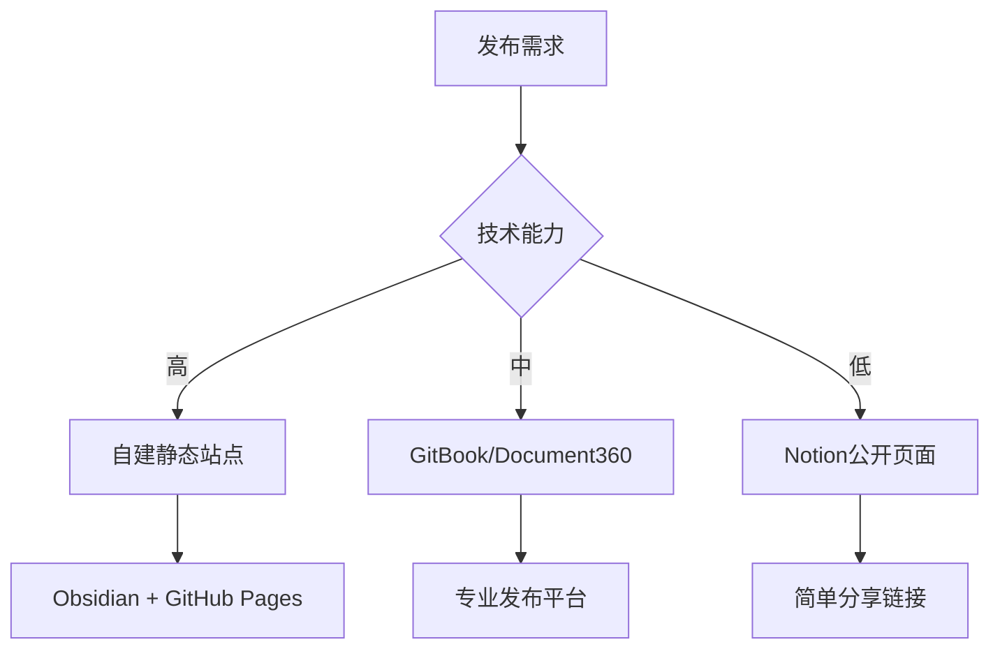
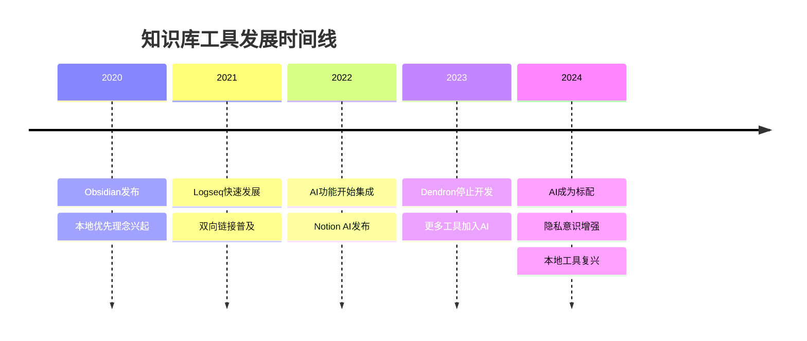
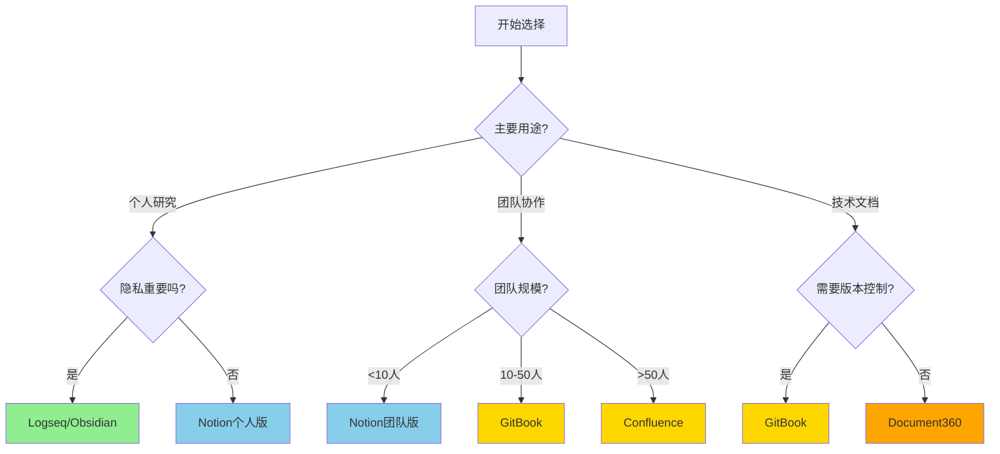

# Task 6: 综合对比矩阵与推荐

## 功能对比矩阵

### 核心功能对比表

| 工具 | 文档管理 | 双向链接 | 图谱视图 | Markdown | 离线使用 | 版本控制 | 搜索能力 |
|------|---------|---------|---------|----------|---------|---------|---------|
| **Obsidian** | ⭐⭐⭐⭐⭐ | ⭐⭐⭐⭐⭐ | ⭐⭐⭐⭐⭐ | ⭐⭐⭐⭐⭐ | ⭐⭐⭐⭐⭐ | ⭐⭐⭐ | ⭐⭐⭐⭐⭐ |
| **Logseq** | ⭐⭐⭐⭐ | ⭐⭐⭐⭐⭐ | ⭐⭐⭐⭐ | ⭐⭐⭐⭐⭐ | ⭐⭐⭐⭐⭐ | ⭐⭐⭐ | ⭐⭐⭐⭐ |
| **Notion** | ⭐⭐⭐⭐⭐ | ⭐⭐⭐ | ⭐⭐ | ⭐⭐⭐ | ⭐⭐ | ⭐⭐⭐⭐ | ⭐⭐⭐⭐ |
| **Roam Research** | ⭐⭐⭐⭐ | ⭐⭐⭐⭐⭐ | ⭐⭐⭐⭐⭐ | ⭐⭐⭐ | ⭐ | ⭐⭐⭐ | ⭐⭐⭐⭐ |
| **RemNote** | ⭐⭐⭐ | ⭐⭐⭐⭐ | ⭐⭐⭐ | ⭐⭐⭐⭐ | ⭐⭐⭐ | ⭐⭐⭐ | ⭐⭐⭐ |
| **GitBook** | ⭐⭐⭐⭐⭐ | ⭐⭐ | ⭐ | ⭐⭐⭐⭐⭐ | ⭐⭐ | ⭐⭐⭐⭐⭐ | ⭐⭐⭐⭐ |
| **Confluence** | ⭐⭐⭐⭐⭐ | ⭐⭐ | ⭐ | ⭐⭐ | ⭐⭐ | ⭐⭐⭐⭐ | ⭐⭐⭐⭐ |
| **Joplin** | ⭐⭐⭐⭐ | ⭐⭐ | ⭐ | ⭐⭐⭐⭐⭐ | ⭐⭐⭐⭐⭐ | ⭐⭐⭐ | ⭐⭐⭐ |
| **Zettlr** | ⭐⭐⭐⭐ | ⭐⭐⭐ | ⭐⭐ | ⭐⭐⭐⭐⭐ | ⭐⭐⭐⭐⭐ | ⭐⭐⭐ | ⭐⭐⭐ |
| **Document360** | ⭐⭐⭐⭐⭐ | ⭐ | ⭐ | ⭐⭐⭐⭐ | ⭐⭐ | ⭐⭐⭐⭐ | ⭐⭐⭐⭐⭐ |

### 协作与分享功能对比

| 工具 | 实时协作 | 评论功能 | 权限管理 | 公开发布 | 团队管理 | 集成能力 |
|------|---------|---------|---------|---------|---------|---------|
| **Obsidian** | ⭐⭐ | ⭐⭐ | ⭐⭐ | ⭐⭐⭐ | ⭐⭐ | ⭐⭐⭐⭐ |
| **Logseq** | ⭐ | ⭐ | ⭐ | ⭐⭐ | ⭐ | ⭐⭐ |
| **Notion** | ⭐⭐⭐⭐⭐ | ⭐⭐⭐⭐⭐ | ⭐⭐⭐⭐ | ⭐⭐⭐ | ⭐⭐⭐⭐⭐ | ⭐⭐⭐⭐⭐ |
| **Roam Research** | ⭐⭐⭐ | ⭐⭐⭐ | ⭐⭐⭐ | ⭐⭐ | ⭐⭐⭐ | ⭐⭐⭐ |
| **RemNote** | ⭐⭐⭐ | ⭐⭐ | ⭐⭐ | ⭐⭐ | ⭐⭐ | ⭐⭐ |
| **GitBook** | ⭐⭐⭐⭐⭐ | ⭐⭐⭐⭐ | ⭐⭐⭐⭐⭐ | ⭐⭐⭐⭐⭐ | ⭐⭐⭐⭐ | ⭐⭐⭐⭐⭐ |
| **Confluence** | ⭐⭐⭐⭐⭐ | ⭐⭐⭐⭐⭐ | ⭐⭐⭐⭐⭐ | ⭐⭐⭐ | ⭐⭐⭐⭐⭐ | ⭐⭐⭐⭐⭐ |
| **Joplin** | ⭐⭐ | ⭐ | ⭐⭐ | ⭐⭐ | ⭐⭐ | ⭐⭐⭐ |
| **Zettlr** | ⭐ | ⭐ | ⭐ | ⭐⭐ | ⭐ | ⭐⭐ |
| **Document360** | ⭐⭐⭐⭐ | ⭐⭐⭐⭐ | ⭐⭐⭐⭐⭐ | ⭐⭐⭐⭐⭐ | ⭐⭐⭐⭐ | ⭐⭐⭐⭐ |

### 可视化与图表功能对比

| 工具 | Mermaid支持 | 思维导图 | 流程图 | 知识图谱 | 画布功能 | 嵌入图表 |
|------|------------|---------|--------|---------|---------|---------|
| **Obsidian** | ⭐⭐⭐⭐⭐ | ⭐⭐⭐⭐ | ⭐⭐⭐⭐ | ⭐⭐⭐⭐⭐ | ⭐⭐⭐⭐⭐ | ⭐⭐⭐⭐ |
| **Logseq** | ⭐⭐⭐⭐⭐ | ⭐⭐⭐⭐ | ⭐⭐⭐⭐ | ⭐⭐⭐⭐ | ⭐⭐⭐ | ⭐⭐⭐ |
| **Notion** | ⭐⭐ | ⭐⭐⭐ | ⭐⭐ | ⭐⭐ | ⭐⭐ | ⭐⭐⭐⭐ |
| **Roam Research** | ⭐⭐⭐ | ⭐⭐⭐ | ⭐⭐ | ⭐⭐⭐⭐⭐ | ⭐⭐ | ⭐⭐⭐ |
| **RemNote** | ⭐⭐ | ⭐⭐⭐ | ⭐⭐ | ⭐⭐⭐ | ⭐ | ⭐⭐ |
| **GitBook** | ⭐⭐⭐⭐⭐ | ⭐⭐⭐ | ⭐⭐⭐⭐ | ⭐ | ⭐ | ⭐⭐⭐⭐ |
| **Confluence** | ⭐⭐⭐ | ⭐⭐⭐ | ⭐⭐⭐⭐ | ⭐ | ⭐⭐ | ⭐⭐⭐⭐ |
| **Joplin** | ⭐⭐ | ⭐ | ⭐ | ⭐ | ⭐ | ⭐⭐ |
| **Zettlr** | ⭐⭐⭐ | ⭐⭐ | ⭐⭐ | ⭐⭐ | ⭐ | ⭐⭐ |
| **Document360** | ⭐⭐⭐ | ⭐⭐ | ⭐⭐⭐ | ⭐ | ⭐ | ⭐⭐⭐ |

## 价格对比表（2024年）

| 工具 | 个人版 | 团队版（5人） | 企业版（20人） | 部署方式 |
|------|--------|--------------|---------------|---------|
| **Obsidian** | 免费 | $250/年（商业许可） | $1,000/年 | 本地+云同步 |
| **Logseq** | 免费 | 免费 | 免费 | 本地 |
| **Notion** | 免费 | $480/年 | $3,600/年 | 仅云端 |
| **Roam Research** | $165/年 | $825/年 | $3,300/年 | 仅云端 |
| **RemNote** | 免费/Pro版 | 按用户定价 | 按用户定价 | 云端 |
| **GitBook** | 免费 | $480/年 | $5,760/年 | 云端+Git |
| **Confluence** | 免费(≤10人) | 免费 | $2,640/年 | 云端/自托管 |
| **Joplin** | 免费 | 免费 | 免费 | 本地/自托管 |
| **Zettlr** | 免费 | 免费 | 免费 | 本地 |
| **Document360** | 免费试用 | $1,788/年 | $3,588/年起 | 云端 |

## 场景化推荐方案

### 🎯 个人研究者最佳选择

**推荐理由**：
- **Logseq**：根据 [Medium 用户实践](https://medium.com/@markmcelroydotcom/choosing-between-logseq-and-obsidian-1fe22c61f742)，完全免费且功能强大
- **Obsidian**：根据 [Nodus Labs 2024年评测](https://support.noduslabs.com/hc/en-us/articles/13449999219484-Best-PKM-Tools-in-2024-Obsidian-vs-Roam-Research-vs-Evernote-vs-Notion)，拥有最佳的知识管理体验

### 🏢 团队协作最佳选择

**推荐理由**：
- **小团队→Notion**：灵活易用，性价比高
- **中团队→GitBook**：版本控制，技术文档专长
- **大团队→Confluence**：企业级功能，Atlassian生态

### 📚 学术研究最佳选择

**特别推荐**：
- **Zettlr**：内置引用管理，专为学术写作设计
- **RemNote**：闪卡功能，适合知识记忆
- **Obsidian + Zotero插件**：完美的文献管理组合

### 🔧 技术文档最佳选择

| 需求类型 | 推荐工具 | 关键优势 |
|---------|---------|---------|
| API文档 | GitBook | Git集成、版本控制 |
| 产品文档 | Document360 | AI辅助、分析功能 |
| 内部Wiki | Confluence | 权限管理、搜索强大 |
| 开源项目 | Obsidian/Logseq | 免费、Markdown原生 |

### 🌐 公开知识库最佳选择

## 迁移难度评估

### 数据可移植性排名

1. **最易迁移**（纯Markdown）：
   - Obsidian ⭐⭐⭐⭐⭐
   - Logseq ⭐⭐⭐⭐⭐
   - Zettlr ⭐⭐⭐⭐⭐
   - Joplin ⭐⭐⭐⭐⭐

2. **中等难度**（部分专有格式）：
   - GitBook ⭐⭐⭐
   - Notion ⭐⭐⭐
   - RemNote ⭐⭐⭐

3. **较难迁移**（专有系统）：
   - Confluence ⭐⭐
   - Roam Research ⭐⭐
   - Document360 ⭐⭐

## 2024年趋势洞察

根据综合研究，2024年知识库工具呈现以下趋势：

### 🚀 技术趋势

### 📊 市场份额变化

根据多个评测和社区讨论：
1. **Obsidian和Logseq**成为2024年最受欢迎的个人知识管理工具
2. **Notion**保持团队协作领域领导地位
3. **Roam Research**市场份额下降但保持忠实用户群
4. **GitBook**在技术文档领域稳步增长

## 最终建议决策树

## 结论

基于2024年的市场研究和用户反馈：

1. **最佳整体选择**：Obsidian（功能、生态、灵活性的完美平衡）
2. **最佳免费选择**：Logseq（完全免费且功能强大）
3. **最佳协作选择**：Notion（易用性和协作功能的最佳组合）
4. **最佳文档发布**：GitBook（专业的文档管理和发布）
5. **最具潜力**：AI增强的工具如Document360

选择知识库工具时，最重要的是匹配您的具体需求、预算和技术能力。建议先从免费版本开始试用，确认适合后再考虑付费功能。

## 参考资料

本报告基于前述各任务报告中的所有参考资料综合分析得出。