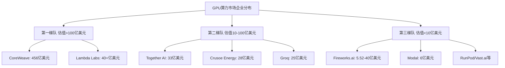
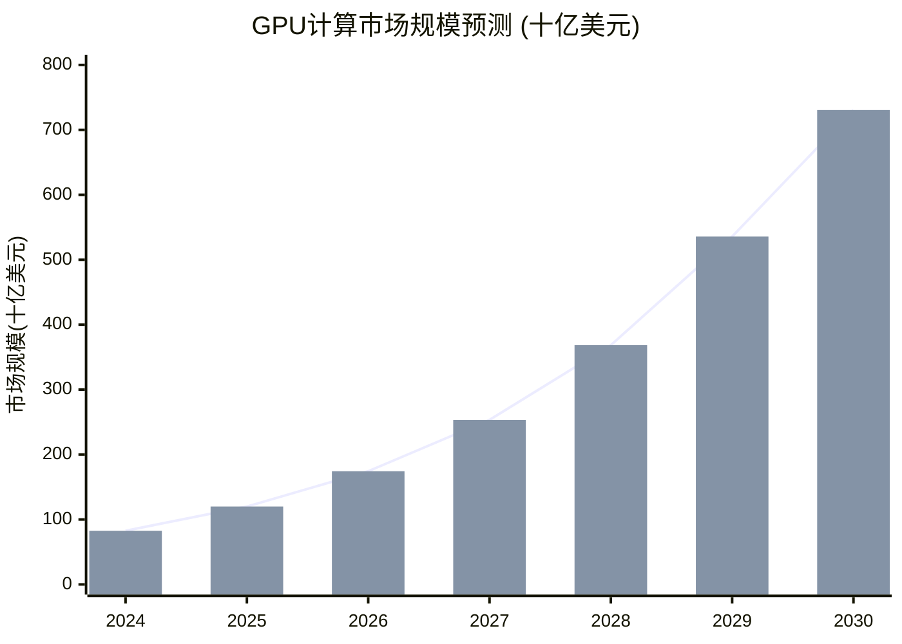
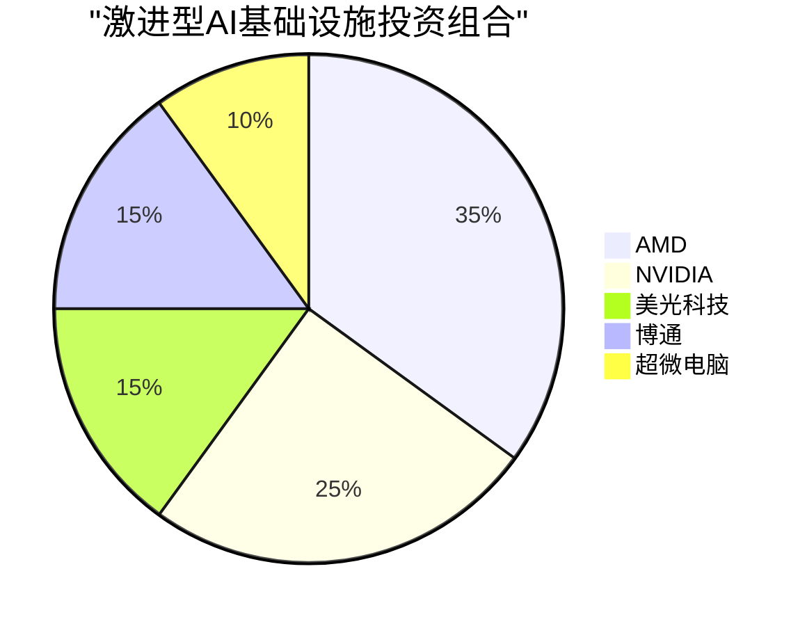
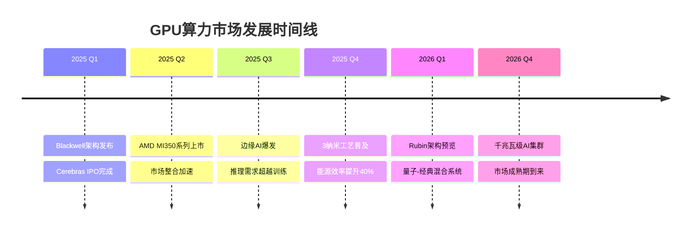

# GPU算力市场深度分析报告 (2024-2026)

## 执行摘要

GPU计算基础设施市场正经历爆发式增长，预计将从2025年的826.8亿美元增长到2030年的3525.5亿美元，年复合增长率达33.65%。本报告深入分析了Fireworks.ai、Modal等主要GPU算力企业的市场格局、竞争优势、投资机会及未来发展趋势。

根据[NVIDIA预测](https://www.datacenterfrontier.com/machine-learning/article/55315014/nvidia-forecasts-34-trillion-ai-market-driving-next-wave-of-infrastructure)，未来5年AI基础设施市场规模将达到3-4万亿美元，代表着前所未有的投资机会。

## 一、主要GPU算力企业分析

### 1.1 市场领导者概览

本研究识别并分析了15家以上的主要GPU计算企业，按估值规模分为三个梯队：

### 1.2 重点企业深度分析

#### **Fireworks.ai** ⭐ 高增长明星
- **估值：** 5.52亿美元（2024年7月），寻求40亿美元C轮
- **年度经常性收入：** 1.3亿美元（2025年5月），同比增长20倍
- **核心优势：** 
  - 业界最快的推理速度
  - PyTorch团队背景（前Meta工程师）
  - 已实现盈利，单位经济效益良好
- **投资方：** NVIDIA、AMD、红杉资本、Benchmark

#### **Modal** - 无服务器创新者
- **估值：** 6亿美元
- **收入轨迹：** 2023年2000万 → 2024年6000万 → 2025年预计1.5亿美元
- **独特定位：** Python原生无服务器平台，按秒计费
- **目标客户：** AI和数据科学团队

#### **Together AI** - 综合平台
- **估值：** 33亿美元（2025年2月）
- **用户基础：** 45万+开发者
- **战略优势：** 支持200+开源模型，与Dell、Meta合作
- **融资：** 总计5.335亿美元

#### **CoreWeave** - 规模巨头
- **市值：** 456亿美元
- **收入：** 2024年约20亿美元，2025年TTM 35.3亿美元
- **基础设施：** 32个数据中心，25万个GPU
- **风险：** 77%收入来自前2大客户（62%来自微软）

#### **Crusoe Energy** - 可持续计算
- **估值：** 28亿美元，寻求100亿美元估值
- **2025年预计收入：** 9.98亿美元（262%增长）
- **独特模式：** 利用废弃天然气进行GPU计算
- **环境影响：** 防止220亿立方英尺天然气燃烧

详细的企业分析请查看：[完整企业概况报告](./reports/task-1-company-profiles.md)

## 二、市场格局与竞争态势

### 2.1 市场规模与增长

### 2.2 细分市场分析

| 细分市场 | 2024规模 | 2030预测 | 年复合增长率 |
|---------|----------|----------|-------------|
| 数据中心GPU | 873.2亿美元 | 2280.4亿美元 | 13.7%-35.8% |
| GPU即服务(GPUaaS) | 40.3亿美元 | 318.9亿美元 | 22.98% |
| AI专用GPU | 175.8亿美元 | 1139.3亿美元 | 30.60% |
| 边缘AI基础设施 | 80亿美元 | 350亿美元 | 130%+ |

### 2.3 竞争格局分析

市场呈现多元化竞争格局，不同企业采用差异化策略：

- **性能领先者：** Fireworks.ai（最快推理）、Groq（LPU技术18倍速度）
- **成本领先者：** Vast.ai（P2P模式节省60-80%）、Hyperstack（比传统云便宜75%）
- **创新领先者：** Crusoe（可持续能源）、Modal（无服务器平台）

详细市场分析请查看：[市场分析与竞争格局报告](./reports/task-2-market-analysis.md)

## 三、投资机会与股票推荐

### 3.1 公开市场投资标的

#### **首选股票**

1. **NVIDIA (NVDA)** - 市场主导者
   - 市值：2.8万亿美元
   - 市场份额：90%+
   - 增长预期：未来4个季度收入增长42%+

2. **AMD** - 价值洼地
   - 数据中心收入：37亿美元/季度
   - AI芯片销售：2024年预计超40亿美元
   - 估值相对NVIDIA有显著折扣

3. **Broadcom (AVGO)** - 基础设施关键
   - AI集群网络组件供应商
   - 定制AI芯片设计服务

#### **投资组合建议**

### 3.2 私募市场机会

#### **最值得投资的私营公司**

1. **Fireworks.ai** ⭐⭐⭐⭐⭐
   - 投资潜力：5-10倍回报
   - 理由：20倍收入增长，已盈利

2. **Crusoe Energy** ⭐⭐⭐⭐
   - 投资潜力：3-4倍回报
   - 理由：ESG概念，262%收入增长

3. **Modal** ⭐⭐⭐⭐
   - 投资潜力：5-8倍回报
   - 理由：无服务器趋势，资本效率高

### 3.3 关联股票机会

| 类别 | 股票代码 | 投资理由 |
|------|---------|---------|
| 芯片制造 | TSM | NVIDIA、AMD代工厂 |
| 存储 | MU | AI芯片高带宽内存 |
| 云巨头 | MSFT, GOOGL, AMZN | AI基础设施投资 |
| 服务器 | DELL, SMCI | GPU服务器系统 |

详细投资分析请查看：[投资机会与股票分析报告](./reports/task-3-investment-opportunities.md)

## 四、未来两年发展趋势预测

### 4.1 2025-2026关键趋势

### 4.2 重大变革预测

#### **从训练到推理的转变**
- 2024年：训练占65%，推理占35%
- 2026年：训练占40%，推理占60%

#### **基础设施巨型项目**
- Oracle：2029年收入1140亿美元，FY26资本支出350亿美元
- Meta：Prometheus设施2026年上线（首个千兆瓦级AI超级集群）

#### **市场整合加速**
- 预计2025-2026年将有20-30%的估值调整
- 大型企业收购专业推理公司
- 跨境并购活动增加

### 4.3 风险因素

1. **供应链风险：** 芯片短缺持续到2025年
2. **监管风险：** 出口管制和数据主权法律
3. **技术风险：** 范式转变使当前基础设施过时
4. **市场风险：** 潜在泡沫和调整

详细趋势分析请查看：[行业趋势与2025-2026预测报告](./reports/task-4-future-trends.md)

## 五、投资建议总结

### 5.1 最佳投资标的

| 类别 | 推荐标的 | 投资理由 | 风险等级 |
|------|---------|---------|----------|
| **最佳综合投资** | NVIDIA (NVDA) | 市场主导地位，3-4万亿美元机会 | 中 |
| **最佳价值投资** | AMD | 相对NVIDIA显著折价，AI收入加速 | 中高 |
| **最佳成长投资** | Fireworks.ai (私募) | 20倍收入增长，盈利路径清晰 | 高 |
| **最佳可持续投资** | Crusoe Energy (私募) | 独特ESG角度，262%增长 | 高 |
| **最佳分散投资** | SOXX ETF | 广泛的AI芯片生态系统敞口 | 低 |

### 5.2 投资时间表

**2025年Q1：**
- 建立NVIDIA核心仓位
- 在任何弱势时增持AMD
- 监控Cerebras IPO入场点

**2025年Q2-Q3：**
- 评估Fireworks.ai C轮机会
- 增加基础设施股票（TSM、AVGO）
- 考虑Modal或Together AI私募轮次

**2026年及以后：**
- 转向推理为重点的公司
- 探索边缘计算机会
- 监控并购目标

## 六、结论

GPU计算基础设施市场代表着未来十年最具吸引力的投资机会之一。随着AI基础设施支出预计达到3-4万亿美元，投资者应该：

1. **立即行动：** 在公开市场建立核心仓位
2. **密切关注：** 私募市场机会，特别是Fireworks.ai和Crusoe Energy
3. **做好准备：** 应对2025-2026年的市场整合和技术变革

市场正处于从实验性技术向必需基础设施转变的关键时期，这代表着十年一遇的投资机会窗口。

---

## 研究报告目录

1. [企业深度分析报告](./reports/task-1-company-profiles.md) - 15+家主要GPU计算企业详细概况
2. [市场分析与竞争格局](./reports/task-2-market-analysis.md) - 市场规模、增长动力和竞争态势
3. [投资机会与股票分析](./reports/task-3-investment-opportunities.md) - 公开和私募市场投资标的
4. [行业趋势与未来预测](./reports/task-4-future-trends.md) - 2025-2026年发展趋势和预测

---

*报告生成日期：2025年9月15日*
*数据来源：包括但不限于Statista、Mordor Intelligence、Grand View Research、Precedence Research、公司财报及行业分析报告*