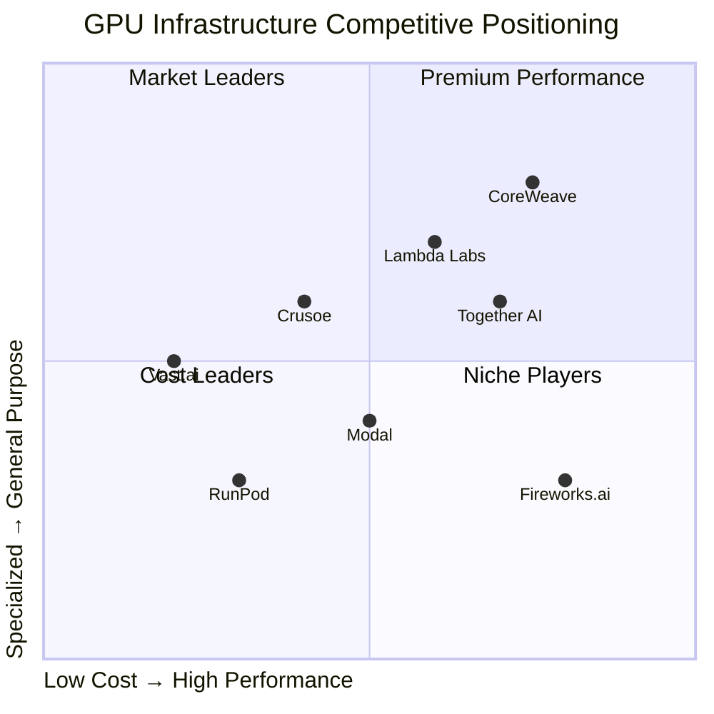

# Task 2: Market Analysis and Competitive Landscape

## Market Size and Growth Trajectory

### Overall GPU Market
The GPU computing market is experiencing unprecedented growth driven by AI demand:

- **2024 Market Size:** $65.3B - $82.68B depending on source
- **2025 Projection:** $119.97B - $171.47B
- **2030 Forecast:** $352.55B - $730.56B
- **CAGR:** 28.22% - 33.65% (2025-2030)

According to [Statista](https://www.statista.com/statistics/1166028/gpu-market-size-worldwide/), the global GPU market was valued at $65.3 billion in 2024. [Mordor Intelligence](https://www.mordorintelligence.com/industry-reports/graphics-processing-unit-market) provides a higher estimate of $82.68 billion for 2025, projecting growth to $352.55 billion by 2030.

### Market Segmentation

#### Data Center GPU Market
- **2024 Size:** $16.94B - $87.32B (varying by source)
- **2025 Projection:** $21.77B - $119.97B
- **2030 Forecast:** $192.68B - $228.04B
- **CAGR:** 13.7% - 35.8%

According to [Grand View Research](https://www.grandviewresearch.com/industry-analysis/data-center-gpu-market-report), the data center GPU market shows particularly strong momentum with enterprise AI adoption.

#### GPU as a Service (GPUaaS)
- **2024 Size:** $4.03B
- **2025 Projection:** $4.96B
- **2034 Forecast:** $31.89B
- **CAGR:** 22.98% (2025-2034)

[Precedence Research](https://www.precedenceresearch.com/gpu-as-a-service-market) indicates the GPUaaS model is gaining traction as companies seek flexible compute options.

#### AI-Specific GPU Market
- **2024 Size:** $17.58B
- **2031 Forecast:** $113.93B
- **CAGR:** 30.60%

According to [Cognitive Market Research](https://www.cognitivemarketresearch.com/gpu-for-ai-market-report), AI-specific GPUs represent the fastest-growing segment.

## Regional Market Dynamics

### North America
- **Market Share:** 43.7% of global GPU market
- **Data Center Share:** 36.2%
- **GPUaaS Share:** 34%+
- **Key Drivers:** Hyperscale cloud providers (AWS, Microsoft, Google, Meta, Oracle)

### Asia-Pacific
- **Growth Rate:** Fastest globally at 37.4% CAGR
- **Data Center CAGR:** 37.6% (2025-2030)
- **Key Markets:** China, India, South Korea, Japan
- **Investment Focus:** National AI policies, semiconductor self-sufficiency

### China Market Specifics
According to market research, China's AI cloud market:
- **2024 Size:** $2.7B (19.6B yuan)
- **2024 Growth:** 55% year-over-year
- **2025 Forecast:** $7.3B (51.8B yuan)
- **2025-2030 CAGR:** 26.8%

## Competitive Landscape Analysis

### Market Leaders by Category

#### Infrastructure Providers

**Tier 1: Hyperscale Leaders**
- **CoreWeave:** $45.6B valuation, 250,000 GPUs, Microsoft partnership
- **Lambda Labs:** $4B+ valuation, 5,000+ customers
- **Crusoe Energy:** $2.8B valuation, sustainable computing model

**Tier 2: Fast-Growing Challengers**
- **Together AI:** $3.3B valuation, 450,000+ developers
- **Fireworks.ai:** $552M valuation, 20x revenue growth
- **Modal:** $600M valuation, serverless focus

**Tier 3: Specialized Players**
- **RunPod:** Developer-focused, 100,000+ users
- **Vast.ai:** P2P marketplace model
- **Hyperstack:** 75% cost savings vs legacy providers

### Competitive Positioning Matrix

### Competitive Advantages by Company

#### Performance Leaders
1. **Fireworks.ai:** Fastest inference, custom kernels
2. **Groq:** 18x faster with LPU technology
3. **Cerebras:** WSE-3 with 900,000 cores

#### Cost Leaders
1. **Vast.ai:** 60-80% cost savings through P2P model
2. **Hyperstack:** 75% cheaper than legacy providers
3. **Lambda Labs:** Significant cost advantages

#### Innovation Leaders
1. **Crusoe Energy:** Sustainable waste energy model
2. **Modal:** Serverless Python-native platform
3. **Together AI:** FlashAttention-3 kernels

## Market Dynamics and Trends

### Key Growth Drivers

1. **AI Model Complexity**
   - GPT-4 class models requiring massive compute
   - Multimodal AI increasing GPU demand
   - Real-time inference requirements

2. **Enterprise Adoption**
   - Oracle projecting $114B revenue by 2029
   - $35B capex planned for FY26
   - Enterprise AI becoming mission-critical

3. **Supply Constraints**
   - NVIDIA H100/H200 supply limitations
   - Driving alternative solutions and providers
   - Creating opportunity for new entrants

### Competitive Threats

1. **Hyperscaler Competition**
   - AWS, Google, Azure expanding GPU offerings
   - Vertical integration threats
   - Custom chip development (TPUs, Trainium)

2. **Chinese Competition**
   - Huawei Ascend chips gaining traction
   - Alibaba, Baidu developing alternatives
   - Potential market fragmentation

3. **Technology Shifts**
   - Shift from training to inference by 2026
   - Edge computing requirements
   - Quantum computing long-term threat

## Investment Landscape

### Funding Patterns
- **Total Investment:** $5B+ across major players (2024-2025)
- **Average Series B:** $50M-$300M
- **Unicorn Threshold:** $1B valuation becoming common

### Strategic Investors
- **NVIDIA:** Investing across multiple platforms
- **AMD:** Strategic investments in inference players
- **Cloud Providers:** AWS, Google, Microsoft backing partners

### M&A Activity
- **NVIDIA-OctoAI:** $250M acquisition (September 2024)
- **CoreWeave-Core Scientific:** $9B acquisition (July 2025)
- **Trend:** Consolidation accelerating in 2025

## Market Forecast 2025-2026

### Growth Projections
According to [NVIDIA forecasts](https://www.datacenterfrontier.com/machine-learning/article/55315014/nvidia-forecasts-34-trillion-ai-market-driving-next-wave-of-infrastructure), the AI infrastructure opportunity will reach $3-4 trillion over the next 5 years.

### Key Trends for 2025-2026
1. **Infrastructure Buildout:** Massive data center expansion
2. **Inference Dominance:** Shift from training to inference workloads
3. **Specialization:** Purpose-built solutions for specific AI tasks
4. **Sustainability Focus:** Energy efficiency becoming critical
5. **Edge Deployment:** Distributed AI infrastructure growth

### Risk Factors
1. **Market Saturation:** Potential overcapacity by 2026
2. **Regulatory Challenges:** Export controls and data sovereignty
3. **Technology Disruption:** New architectures could shift market
4. **Economic Headwinds:** Potential spending slowdown in 2026