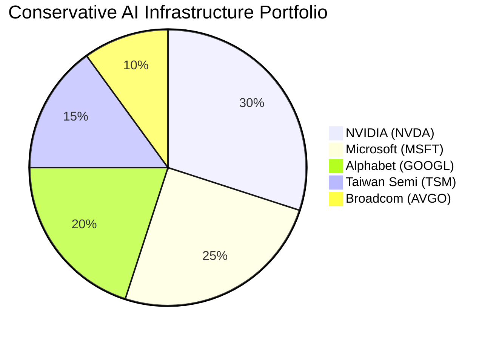
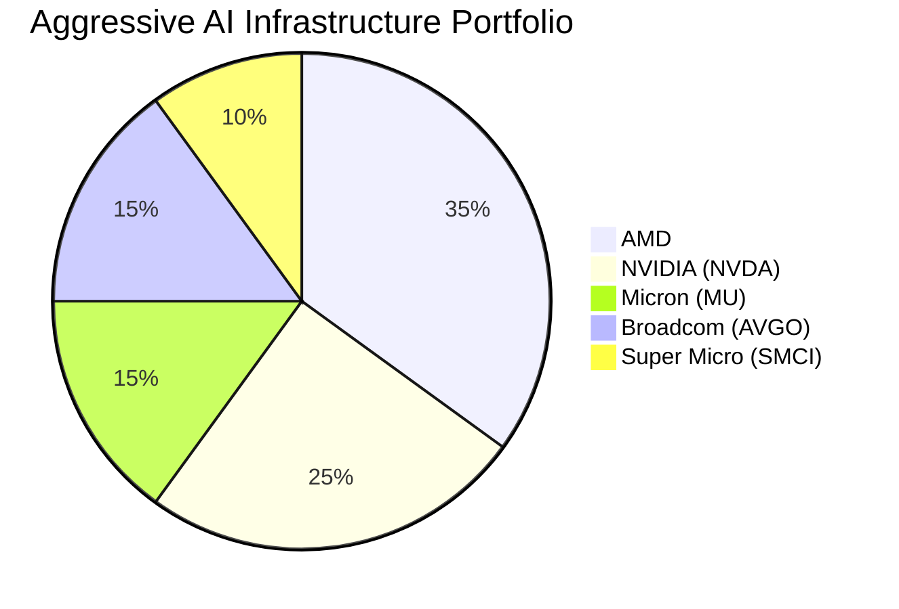

# Task 3: Investment Opportunities and Stock Analysis

## Executive Summary

The GPU computing infrastructure market presents exceptional investment opportunities with projected growth from $82.68B in 2025 to $352.55B by 2030. This report identifies the most promising investment targets across public equities, private companies, and emerging players.

## Public Market Investment Opportunities

### Tier 1: Market Leaders

#### NVIDIA (NVDA)
- **Market Cap:** ~$2.8 trillion
- **Market Share:** 90%+ in GPU space
- **Revenue:** $80B (trailing 4 quarters)
- **Data Center Revenue:** $39.1B (last quarter)
- **Growth Projection:** 42%+ revenue growth over next 4 quarters

**Investment Thesis:**
- Dominant position with Blackwell and upcoming Rubin architectures
- 2.5x performance improvement with 25x better energy efficiency
- $3-4 trillion AI infrastructure opportunity over 5 years per CEO Jensen Huang
- Strong moat with CUDA ecosystem

**Risk Factors:**
- High valuation multiples
- Increasing competition from AMD and custom chips
- Regulatory risks in China market

#### AMD (Advanced Micro Devices)
- **Data Center Revenue:** $3.7B (last quarter)
- **AI Chip Sales:** Projected $4B+ in 2024
- **Key Product:** MI325X and MI350 series

**Investment Thesis:**
- Main NVIDIA alternative with growing market share
- MI355X chip 4x faster than previous generation
- Lower valuation than NVIDIA with higher growth potential
- UALink Consortium positioning for open standards

According to [Morgan Stanley](https://patentpc.com/blog/the-ai-chip-market-explosion-key-stats-on-nvidia-amd-and-intels-ai-dominance), AMD's AI chip sales could surpass $4 billion this year.

### Tier 2: Infrastructure Plays

#### Broadcom (AVGO)
- **Business:** Networking components and custom AI chips
- **Competitive Advantage:** Essential for data transfer in AI clusters
- **Growth Driver:** Custom chip design services

#### Taiwan Semiconductor (TSM)
- **Position:** World's leading foundry
- **Moat:** Manufacturing for NVIDIA, AMD, Apple
- **Growth:** Benefits from all AI chip demand

#### Micron Technology (MU)
- **Product:** High-bandwidth memory for AI chips
- **Growth Driver:** HBM3 memory for next-gen GPUs
- **Oracle Partnership:** Beneficiary of $35B capex plan

### Tier 3: Diversified Tech Giants

#### Microsoft (MSFT)
- **AI Investment:** Largest CoreWeave customer (62% of revenue)
- **Azure Growth:** AI services driving cloud expansion
- **Custom Chips:** Developing Maia AI accelerators

#### Alphabet (GOOGL)
- **TPU Advantage:** Custom tensor processing units
- **Quantum Computing:** Willow chip with 105 qubits
- **Cloud Position:** Third-largest cloud provider

#### Amazon (AMZN)
- **AWS Dominance:** Largest cloud provider
- **Custom Silicon:** Trainium and Inferentia chips
- **Infrastructure:** Massive data center footprint

## Private Market Investment Opportunities

### Top Investment Targets

#### 1. Fireworks.ai
**Valuation:** $552M (seeking $4B)
**Why Invest:**
- 20x revenue growth ($6.5M to $130M ARR)
- Already profitable with strong unit economics
- Strategic backing from NVIDIA and AMD
- Best-in-class inference performance

**Investment Potential:** 5-10x return potential if achieves $4B valuation

#### 2. Together AI
**Valuation:** $3.3B
**Why Invest:**
- 450,000+ developer base
- Revenue growing from $50M to $120M (140% growth)
- Strategic partnerships with Dell, Meta
- Comprehensive AI platform play

**Investment Potential:** 3-5x as AI platform consolidation occurs

#### 3. Crusoe Energy
**Valuation:** $2.8B (seeking $10B)
**Why Invest:**
- Unique sustainable computing model
- 262% revenue growth projected for 2025
- $1.5B commitment from Saudi Arabia
- ESG-friendly AI infrastructure play

**Investment Potential:** 3-4x with sustainability premium

#### 4. Modal
**Valuation:** $600M
**Why Invest:**
- Serverless model aligned with market trends
- Revenue trajectory: $20M → $60M → $150M
- Developer-first approach
- Capital efficient business model

**Investment Potential:** 5-8x as serverless AI scales

### Emerging Opportunities

#### Groq
- **Technology:** LPU chips 18x faster than GPUs
- **Funding:** $367M at $2.5B valuation
- **Catalyst:** $1.5B Saudi commitment
- **Potential:** Revolutionary architecture play

#### Cerebras Systems
- **Status:** Filed for IPO (September 2024)
- **Technology:** Wafer-scale engine
- **Partnership:** Meta Llama API
- **Opportunity:** Public market entry point

## Stock Portfolio Recommendations

### Conservative Portfolio (Lower Risk)

### Aggressive Portfolio (Higher Risk/Return)

### Diversified AI Infrastructure ETFs
1. **Global X Robotics & AI ETF (BOTZ)**
2. **iShares Semiconductor ETF (SOXX)**
3. **VanEck Semiconductor ETF (SMH)**
4. **First Trust Nasdaq AI and Robotics ETF (ROBT)**

## Investment Timeline and Catalysts

### 2025 Catalysts
- NVIDIA Blackwell ramp-up (Q1-Q2 2025)
- Cerebras IPO completion
- AMD MI350 series launch (June 2025)
- Oracle $35B capex deployment

### 2026 Catalysts
- NVIDIA Rubin architecture launch
- Shift from training to inference dominance
- Edge AI infrastructure buildout
- Potential market consolidation

## Risk Analysis

### Market Risks
1. **Valuation Risk:** High multiples across sector
2. **Competition Risk:** Hyperscalers developing custom chips
3. **Regulatory Risk:** Export controls and antitrust
4. **Technology Risk:** Paradigm shifts in AI architecture

### Company-Specific Risks
- **NVIDIA:** Customer concentration, supply constraints
- **AMD:** Execution risk on roadmap
- **Startups:** Funding risk in market downturn
- **CoreWeave:** Negative unit economics, customer concentration

## Investment Recommendations

### Best Overall Investment
**NVIDIA (NVDA)** - Despite high valuation, dominant position in $3-4 trillion opportunity

### Best Value Play
**AMD** - Significant discount to NVIDIA with accelerating AI revenue

### Best Growth Play
**Fireworks.ai** (private) - 20x revenue growth with path to profitability

### Best Sustainable Play
**Crusoe Energy** (private) - Unique ESG angle with 262% growth

### Best Diversified Exposure
**iShares Semiconductor ETF (SOXX)** - Broad exposure to AI chip ecosystem

## Action Plan for Investors

### Immediate Actions (Q1 2025)
1. Establish core position in NVIDIA
2. Build AMD position on any weakness
3. Monitor Cerebras IPO for entry point

### Medium-term (Q2-Q3 2025)
1. Evaluate Fireworks.ai Series C opportunity
2. Add infrastructure plays (TSM, AVGO)
3. Consider Modal or Together AI private rounds

### Long-term (2026+)
1. Shift toward inference-focused companies
2. Explore edge computing opportunities
3. Monitor consolidation for M&A targets

## Conclusion

The GPU computing infrastructure market represents one of the most compelling investment opportunities of the decade. With AI infrastructure spending projected to reach $3-4 trillion, investors should establish positions across public equities, monitor private market opportunities, and prepare for continued consolidation in this rapidly evolving sector.