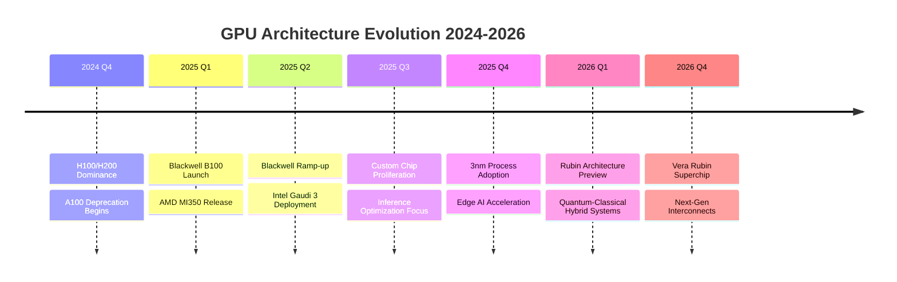

# Task 4: Industry Trends and 2025-2026 Forecast

## Executive Summary

The GPU computing infrastructure industry stands at an inflection point, with transformative shifts expected in 2025-2026. The market will evolve from a training-dominated landscape to inference-focused deployments, while facing challenges around energy consumption, supply chains, and technological disruption.

## Major Industry Trends

### 1. Shift from Training to Inference

According to industry analysis, the fundamental shift in AI workload composition will reshape the market:

**Current State (2024):**
- Training workloads: 65% of GPU demand
- Inference workloads: 35% of GPU demand

**Projected 2026:**
- Training workloads: 40% of GPU demand
- Inference workloads: 60% of GPU demand

This shift is driven by:
- Maturation of foundation models
- Real-time AI application deployment
- Edge computing requirements
- Cost optimization pressures

### 2. Infrastructure Mega-Projects

The scale of infrastructure investment is unprecedented:

**Key Developments:**
- Oracle's $114B revenue projection by 2029 with $35B capex in FY26
- Meta's Prometheus facility going online in 2026 (first gigawatt-plus AI supercluster)
- Hyperion facility scaling to 5 GW over time
- Lancium Clean Campus scaling from 200 MW to 1.2 GW by 2026 (50,000 GPUs per building)

According to [NVIDIA's forecast](https://www.datacenterfrontier.com/machine-learning/article/55315014/nvidia-forecasts-34-trillion-ai-market-driving-next-wave-of-infrastructure), the market represents a "$3 trillion to $4 trillion AI infrastructure opportunity" over the next 5 years.

### 3. Technology Evolution Timeline

### 4. Market Consolidation Patterns

The industry is entering a consolidation phase:

**Completed Acquisitions:**
- NVIDIA acquires OctoAI ($250M, September 2024)
- CoreWeave acquires Core Scientific ($9B, July 2025)

**Expected Consolidation Trends:**
- Large players acquiring specialized inference companies
- Hyperscalers acquiring infrastructure providers
- Cross-border M&A activity increasing
- Valuation corrections for overvalued startups

### 5. Sustainability and Energy Crisis

Energy consumption is becoming a critical constraint:

**Current Challenges:**
- AI data centers consuming 1-2% of global electricity
- Single training run for large models using city-scale power
- Cooling requirements adding 40% to energy costs

**Emerging Solutions:**
- Crusoe Energy's waste gas utilization model
- Liquid cooling adoption (40% efficiency improvement)
- Nuclear power partnerships (Microsoft-Three Mile Island deal)
- Renewable energy integration requirements

## Regional Market Evolution

### North America (2025-2026)
- **Market Share:** Maintaining 40%+ dominance
- **Investment:** $500B+ in infrastructure
- **Key Trend:** Hyperscaler vertical integration

### Asia-Pacific (2025-2026)
- **Growth Rate:** 37.6% CAGR fastest globally
- **China Dynamics:** Self-sufficiency drive intensifying
- **India/SEA:** Emerging as new growth centers

### Europe (2025-2026)
- **Focus:** Sovereign AI initiatives
- **Investment:** €50B+ in AI infrastructure
- **Challenges:** Energy costs and regulations

## Technological Disruptions on the Horizon

### 1. Alternative Architectures

**Neuromorphic Computing:**
- Intel Loihi 2 and IBM TrueNorth evolution
- 100x energy efficiency for specific workloads
- Commercial deployment expected 2026

**Optical Computing:**
- Lightmatter and other photonic processors
- 10x speed improvement potential
- Limited to specific inference tasks initially

**Quantum-AI Hybrid:**
- Google Willow chip with 105 qubits
- Quantum advantage for optimization problems
- Integration with classical AI by 2026

### 2. Software Revolution

**Compiler Optimization:**
- 2-3x performance improvements without hardware changes
- Apache TVM and similar frameworks maturing
- Automatic optimization becoming standard

**Model Efficiency:**
- Mixture of Experts (MoE) reducing compute needs
- Quantization techniques improving 4x
- Sparse models becoming mainstream

### 3. Edge AI Explosion

**Market Size:**
- 2025: $15B edge AI infrastructure
- 2026: $35B projected
- CAGR: 130%+

**Key Drivers:**
- Latency requirements for real-time AI
- Data sovereignty and privacy concerns
- 5G/6G network deployment
- Autonomous systems proliferation

## Investment and Funding Outlook

### Venture Capital Trends

**2025 Projections:**
- Total AI infrastructure investment: $15B+
- Average Series B: $100M-$200M
- Unicorn valuations becoming standard

**2026 Outlook:**
- Market correction expected (20-30% valuation adjustment)
- Focus shifting to profitability over growth
- Consolidation accelerating

### Public Market Evolution

**IPO Pipeline:**
- Cerebras Systems (filed September 2024)
- Potential candidates: Groq, Together AI, Fireworks.ai
- Expected IPO window: H2 2025 - H1 2026

## Critical Success Factors for 2025-2026

### For Established Players
1. **Supply Chain Management:** Securing chip allocation
2. **Energy Efficiency:** Reducing operational costs
3. **Customer Retention:** Preventing churn to competitors
4. **Innovation Speed:** Rapid architecture evolution

### For Startups
1. **Capital Efficiency:** Extending runway
2. **Differentiation:** Clear value proposition
3. **Partnership Strategy:** Aligning with major players
4. **Path to Profitability:** Demonstrating unit economics

## Risk Factors and Mitigation

### Supply Chain Risks
- **Challenge:** Continued chip shortages through 2025
- **Mitigation:** Diversified supplier relationships, forward contracts

### Regulatory Risks
- **Challenge:** Export controls and data sovereignty laws
- **Mitigation:** Regional infrastructure deployment, compliance frameworks

### Technology Risks
- **Challenge:** Paradigm shifts making current infrastructure obsolete
- **Mitigation:** Flexible architectures, continuous R&D investment

### Market Risks
- **Challenge:** Potential bubble and correction
- **Mitigation:** Focus on sustainable business models

## 2026 Market Predictions

### Quantitative Forecasts
- **Total Market Size:** $400B-$500B
- **Data Center GPU:** $250B
- **Edge AI Infrastructure:** $35B
- **GPU-as-a-Service:** $15B

### Qualitative Predictions

1. **Winner Takes Most:** 2-3 players will dominate each segment
2. **Inference Revolution:** Specialized inference chips overtake training
3. **Edge Deployment:** 50% of AI workloads running at edge
4. **Sustainability Mandate:** Carbon-neutral requirements for data centers
5. **Quantum Integration:** First commercial quantum-AI systems

## Strategic Recommendations

### For Investors
1. **2025 Focus:** Growth and market share acquisition
2. **2026 Pivot:** Profitability and consolidation plays
3. **Geographic Diversification:** Exposure to Asia-Pacific growth
4. **Technology Hedging:** Positions across architectures

### For Companies
1. **Immediate Priorities:** Secure supply chain, optimize costs
2. **Medium-term:** Develop inference specialization
3. **Long-term:** Prepare for paradigm shifts
4. **Partnerships:** Strategic alliances with complementary players

## Conclusion

The 2025-2026 period will be transformative for GPU computing infrastructure, marked by massive scale, technological evolution, and market maturation. Winners will be determined by execution speed, capital efficiency, and ability to navigate the shift from training to inference. The industry's evolution from experimental to essential infrastructure represents one of the most significant technology transitions of the decade.