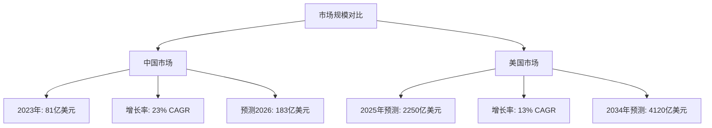
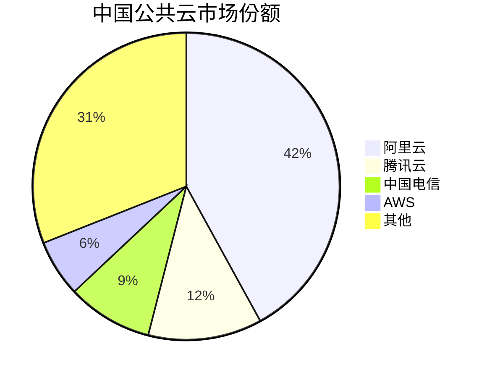
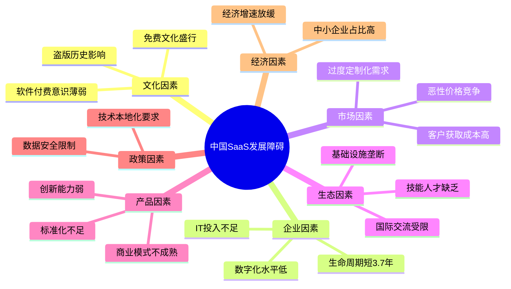
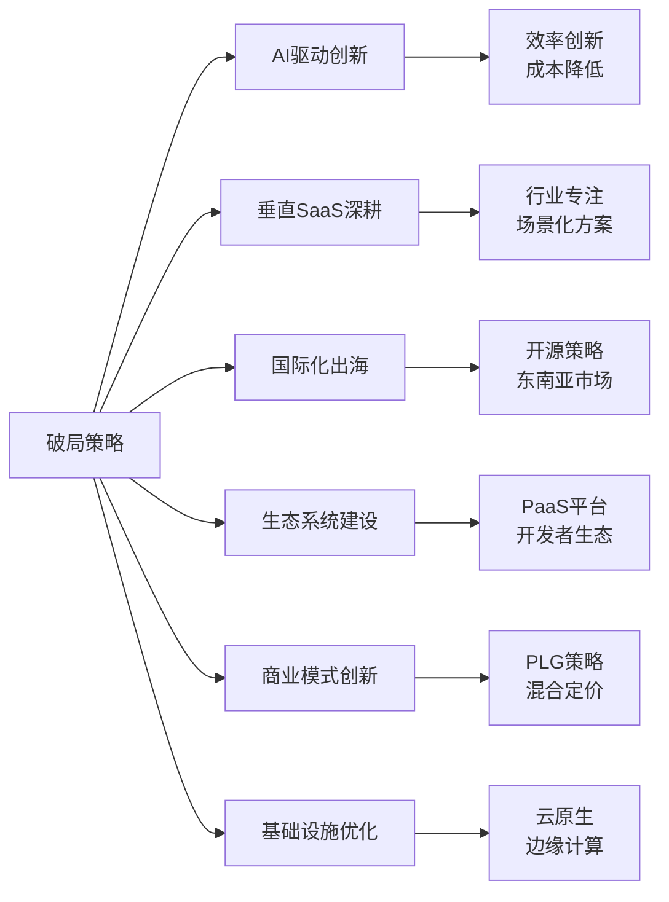
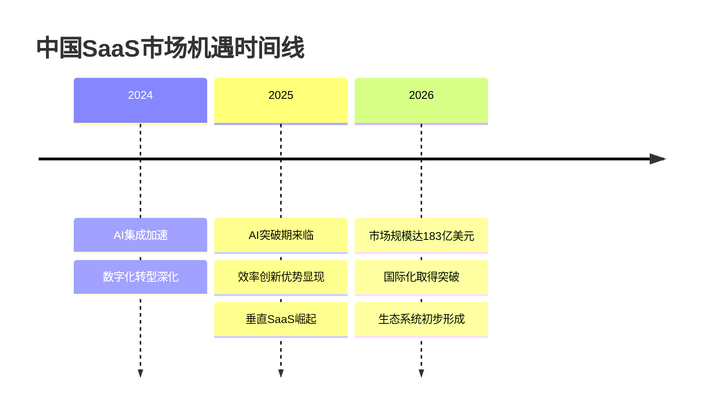

# 中国 SaaS 行业发展不佳的原因分析报告

## 执行摘要

中国 SaaS 行业虽然保持较高增长率（22-23% CAGR），但与美国市场相比存在巨大差距。2023 年中国 SaaS 市场规模约 81 亿美元，仅为美国市场的 3.6%。本报告通过分析典型中国 SaaS 企业发展历程、中美市场对比、根本原因剖析和未来破局方向，为理解中国 SaaS 行业现状提供全面视角。

核心发现：
- **付费文化缺失**是最根本障碍，中国企业软件支出仅为硬件支出的 0.5 倍（美国为 3 倍）
- **企业生命周期短**（平均 3.7 年）导致客户留存困难，商业模式难以持续
- **过度定制化**和价格战使行业整体盈利能力差，连续三年净利润率为负
- **AI 集成**、**垂直化**和**国际化**是最具潜力的破局方向

## 研究背景

中国作为全球第二大经济体，其 SaaS 市场发展却严重滞后。2018 年中国占全球 GDP 的 16% 以上，但仅占全球 IT 支出的 4.2%。这种巨大反差背后的原因值得深入研究。

## 一、中国典型 SaaS 公司发展历程

### 1.1 三大代表企业概况

#### 金蝶国际（1993-至今）
- 2001 年香港上市，IPO 融资 10 亿港元
- 连续 4 年保持 IDC 中国 SaaS ERM 市场第一
- 2023 年营收 56.79 亿元，研发投入 15.78 亿元
- 赋能全球超过 743 万家企业

#### 用友网络（1988-至今）
- 中国第一家通过 SaaS 平台提供 ERP 服务的公司
- 2019 年云服务收入 19.7 亿元，占总收入 23%
- 全球 ERP SaaS 市场排名第 8（Gartner 2021）
- 但全球市场份额仅 0.15%

#### 有赞科技（1995-至今）
- 专注电商 SaaS 解决方案
- 2024 年 8 月更名，显示战略调整
- 业务主要集中在中国市场

详细分析请参见：[中国典型 SaaS 公司发展史分析](./reports/task-1-chinese-saas-companies-history.md)

### 1.2 共同特征
- 起源早但云化转型慢（2010 年后才开始）
- 国际化程度低，主要依赖中国市场
- 市值与美国同类公司差距巨大
- 产品过度定制化，标准化程度低

## 二、中美 SaaS 市场现状对比

### 2.1 市场规模差异（2023-2024）

### 2.2 关键指标对比

| 维度 | 中国 | 美国 | 差异倍数 |
|------|------|------|---------|
| 市场规模 | 81亿美元 | 2250亿美元 | 27.8x |
| 软件/硬件支出比 | 0.5:1 | 3:1 | 6x |
| 企业平均寿命 | 3.7年 | 5.8年 | 1.6x |
| B2B数字化率 | 较低 | 80%（2025） | - |
| 主导厂商 | 本土（阿里、腾讯） | 国际化 | - |

### 2.3 市场结构差异

中国公共云市场份额（2018）：

详细对比分析请参见：[中国与美国 SaaS 市场现状对比分析](./reports/task-2-market-comparison.md)

## 三、发展不佳的根本原因

### 3.1 七大根本原因体系

### 3.2 核心问题剖析

#### 付费文化缺失（最根本）
- 历史上盗版软件广泛使用
- 将软件视为成本而非投资
- 钉钉等免费产品挤压付费空间（1亿用户，700万企业）

#### 企业生命周期短
- 中国中小企业平均寿命 3.7 年 vs 美国 5.8 年
- 高流失率导致 CAC 难以回收
- LTV/CAC 比例失衡

#### 过度定制化陷阱
- 企业要求高度定制化
- 标准化产品难以满足需求
- 定制化导致成本高、难复制、毛利低

详细原因分析请参见：[中国 SaaS 行业发展不佳的根本原因分析](./reports/task-3-root-causes.md)

## 四、未来破局方向

### 4.1 六大破局策略

### 4.2 重点突破方向

#### 1. AI 集成创新
- **案例**：腾讯会议 Q4 2024 收入增长 40%+
- **DeepSeek R1**：560万美元训练成本，展示效率创新
- **预测**：2028年 33% 企业软件将包含代理式 AI

#### 2. 垂直化策略
重点行业：
- 制造业：工业互联网
- 零售业：新零售方案
- 医疗健康：医疗信息化
- 教育：在线教育平台
- 金融科技：合规风控

#### 3. 国际化路径
- 开源策略提升国际影响力
- 东南亚和一带一路市场
- 与国际巨头合作（如用友与Atos）

#### 4. 商业模式创新
- **PLG（产品驱动增长）**：降低 CAC
- **混合定价**：基础免费+增值收费
- **客户成功体系**：提高续费率

详细破局策略请参见：[中国 SaaS 行业未来破局的潜在方向](./reports/task-4-breakthrough-strategies.md)

## 五、关键洞察与建议

### 5.1 市场机遇（2025-2026）

### 5.2 给不同参与者的建议

#### 对 SaaS 企业
1. **选择聚焦**：避免大而全，选择垂直赛道深耕
2. **AI 优先**：将 AI 作为核心竞争力，而非附加功能
3. **国际视野**：通过开源和合作拓展海外市场
4. **效率创新**：学习 DeepSeek 模式，以更低成本实现创新

#### 对投资者
1. **长期视角**：中国 SaaS 需要更长培育期
2. **垂直机会**：关注细分行业的头部玩家
3. **技术驱动**：重点投资有 AI 和技术壁垒的公司

#### 对政策制定者
1. **市场教育**：推动企业数字化意识提升
2. **生态支持**：培养软件人才，完善基础设施
3. **国际合作**：平衡本土化与国际化需求

## 六、结论

中国 SaaS 行业发展不佳是**多层次、系统性问题**的结果，既有文化和历史原因，也有市场结构和商业模式的挑战。但随着：

- AI 技术带来的产品创新机遇
- 企业数字化转型的加速
- 新一代企业家付费意识的提升
- 垂直化和国际化的突破

中国 SaaS 行业有望在 2025-2026 年迎来转折点。成功的关键在于：
1. 摒弃简单复制美国模式
2. 结合中国市场特点创新
3. 以 AI 和效率创新为突破口
4. 构建可持续的商业模式

预计到 2026 年，中国 EA SaaS 市场将达到 183 亿美元，虽然绝对规模仍远低于美国，但在特定垂直领域和技术创新方面，中国 SaaS 企业有机会建立独特优势。

## 研究报告索引

1. [中国典型 SaaS 公司发展史分析](./reports/task-1-chinese-saas-companies-history.md)
2. [中国与美国 SaaS 市场现状对比分析](./reports/task-2-market-comparison.md)
3. [中国 SaaS 行业发展不佳的根本原因分析](./reports/task-3-root-causes.md)
4. [中国 SaaS 行业未来破局的潜在方向](./reports/task-4-breakthrough-strategies.md)

---

*本报告基于 2024-2025 年公开市场数据和行业研究编制*