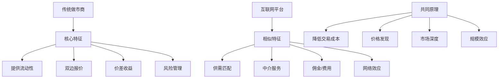

# 互联网经济中的做市商模式研究

## 执行摘要

本研究探讨了做市商在金融市场中通过提供流动性赚取收益的模式，以及在互联网经济中具有相似原理的商业模式。研究发现，互联网平台经济、数据经纪商、程序化广告交易、API经济和注意力经济都展现出与传统做市商相似的特征：通过中介服务提供"流动性"、促进供需匹配、并从价差或佣金中获取收益。

## 研究背景

做市商通过在买卖双方之间提供流动性来维持市场运转，其核心收益来源于买卖价差（bid-ask spread）。在数字经济时代，许多互联网商业模式采用了类似的原理，通过技术手段在不同类型的"市场"中扮演中介角色。

## 核心发现

### 1. 平台经济的流动性提供

根据研究，像Uber、Airbnb、阿里巴巴这样的平台企业通过双边市场网络效应创造价值：

- **规模数据**：截至2024年，共享经济市场预计到2031年将超过1万亿美元
- **网络效应**：平台通过聚合供需双方创造"流动性"，类似做市商在金融市场的作用
- **收益模式**：通过交易佣金（15-30%）获取类似买卖价差的收益

### 2. 数据经纪商的信息做市

数据经纪商市场展现出明显的做市特征：

- **市场规模**：2024年市场规模达2,704亿美元，预计2032年达到4,733.5亿美元
- **中介功能**：在数据源和数据消费者之间提供"信息流动性"
- **价值获取**：通过数据的买入和卖出价差获利

### 3. 程序化广告的实时竞价

数字广告拍卖系统是互联网经济中最纯粹的做市形式：

- **交易速度**：整个竞价过程在200毫秒内完成
- **市场规模**：2024年程序化广告市场达8,331.6亿美元，预计2032年达4.4万亿美元
- **做市机制**：广告交易平台在广告主和发布商之间提供实时匹配

### 4. API经济的基础设施中介

API服务商如Stripe、Twilio、AWS作为技术基础设施的做市商：

- **Stripe市场份额**：占支付市场17%，仅次于PayPal
- **AWS Marketplace增长**：2024年Q3同比增长35%
- **价值创造**：通过简化复杂技术并按使用量收费

### 5. 注意力经济的内容聚合

社交媒体平台作为注意力的做市商：

- **创作者经济规模**：北美市场从2024年的558亿美元预计增长到2034年的3,314亿美元
- **平台主导地位**：社交媒体平台占创作者经济29%以上的市场份额
- **货币化机制**：通过聚合内容创作者和消费者，从广告和交易中获取价值

## 做市商模式的共同特征

## 各模式对比分析

| 模式类型 | 流动性形式 | 主要收益来源 | 2024年市场规模 | 增长率(CAGR) |
|---------|-----------|-------------|--------------|-------------|
| 平台经济 | 供需匹配 | 交易佣金(15-30%) | >1万亿美元(2031预测) | 19.5% |
| 数据经纪 | 信息中介 | 数据价差 | 2,704亿美元 | 7.25% |
| 程序化广告 | 实时竞价 | 广告费差价 | 8,331.6亿美元 | 23.21% |
| API经济 | 技术接入 | 使用费用 | 快速增长中 | 35%(YoY) |
| 注意力经济 | 内容分发 | 广告分成 | 558亿美元 | 19.5% |

## 关键洞察

### 价值创造机制

1. **网络效应放大**：不同于传统做市商，互联网平台通过网络效应实现指数级价值增长
2. **零边际成本**：数字商品和服务的复制成本接近零，提高了利润率
3. **数据驱动优化**：AI和机器学习持续优化匹配效率和定价策略
4. **多边市场**：许多平台同时服务多个用户群体，创造更复杂的价值网络

### 风险与挑战

- **监管压力**：平台垄断和数据隐私问题引发监管关注
- **依赖性风险**：创作者和商家对平台的过度依赖
- **经济波动**：2024-2025年经济不确定性影响广告支出和消费行为
- **技术颠覆**：新技术和商业模式可能颠覆现有平台

## 未来展望

互联网经济中的做市商模式将继续演进：

1. **AI深度整合**：人工智能将进一步提升匹配效率和价值创造
2. **跨平台整合**：平台间的合作与竞争将重塑市场格局
3. **去中心化趋势**：区块链等技术可能挑战中心化平台模式
4. **监管适应**：新的监管框架将影响平台运营和收益模式

## 结论

互联网经济成功地将做市商的核心原理——通过提供流动性和中介服务获取价值——应用到了数字领域。从平台经济到API服务，从数据交易到注意力经济，这些模式都展现出了与传统金融做市商相似的特征，但通过技术创新和网络效应实现了更大规模和更高效率。理解这些相似性有助于认识数字经济的本质，并预测未来的发展趋势。

## 详细研究报告

- [做市商基础原理与收益机制](./reports/task-1-market-making-fundamentals.md)
- [平台经济作为流动性提供者](./reports/task-2-platform-economy-liquidity-providers.md)
- [数据经纪商与信息市场](./reports/task-3-data-brokers-information-markets.md)
- [广告竞价与实时交易市场](./reports/task-4-advertising-auctions-real-time-bidding.md)
- [API经济与基础设施服务](./reports/task-5-api-economy-infrastructure.md)
- [注意力经济与内容聚合模式](./reports/task-6-attention-economy-content-aggregation.md)