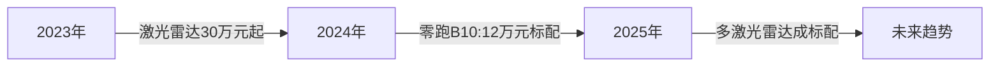
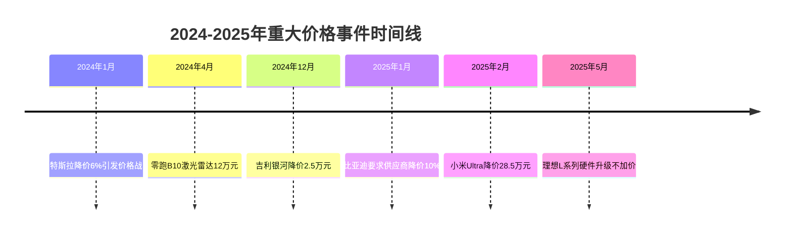
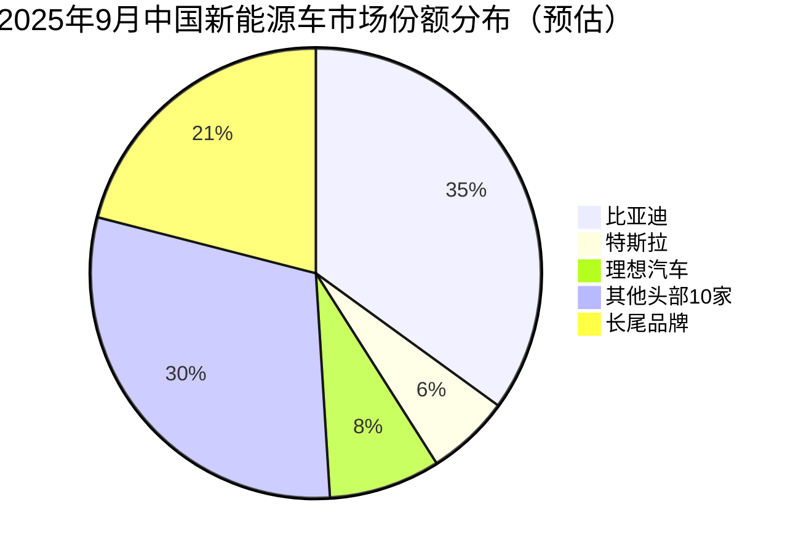

# 中国乘用车市场竞争趋势研究报告（2024年1月-2025年9月）

## 执行摘要

本报告深入研究了2024年1月至2025年9月期间中国乘用车市场的激烈竞争态势，重点分析了技术升级加速和价格战现象对市场格局的深远影响。研究发现，中国汽车市场正经历前所未有的"内卷"危机，导致政府介入干预，预计129个电动车品牌中仅15%能在2030年保持盈利。

### 关键发现

1. **技术内卷加速**：产品更新周期从传统4-6年缩短至1年，激光雷达等高端配置快速下探至12万元级别
2. **价格战影响深远**：平均车价两年内下降19%至16.5万元，2024年前8个月173款车型降价
3. **市场格局重塑**：400家电动车企业退出市场（2018-2025），头部企业市场集中度提升
4. **政府干预升级**：习近平主席批评"羊群式投资"，17家车企承诺规范付款周期

## 研究背景与目的

作为车企战略总监，需要深入理解当前中国汽车市场的竞争动态，为管理层制定产品与技术战略提供决策支持。本研究聚焦八家目标企业：理想、零跑、吉利、特斯拉、比亚迪、宝马中国、华为赛力斯、小米，分析其技术路线、价格策略及市场表现。

## 技术趋势分析

### 技术升级速度与方向

根据研究，中国汽车市场技术升级呈现三大特征：

#### 1. 感知硬件军备竞赛

- **华为赛力斯M9**：4激光雷达+4D毫米波雷达配置，树立新标杆
- **理想汽车**：采用禾赛ATL激光雷达，体积缩小60%，功耗降低55%
- **零跑B10**：将激光雷达下探至12万元级别，打破价格壁垒

#### 2. 智能驾驶技术普及

| 企业 | 技术方案 | 核心特色 | 价格门槛 |
|------|---------|---------|---------|
| 比亚迪 | 天神之眼ADAS | 21款车型免费标配 | 10万元起 |
| 华为赛力斯 | ADS 3.0 | 端到端架构，全国无图导航 | 47万元起 |
| 小米 | Xiaomi Pilot | 16项ADAS功能 | 21万元起 |
| 特斯拉 | FSD（HW4） | 自研全栈，OTA升级 | 23万元起 |

#### 3. 动力系统革新

- **比亚迪刀片电池2.0**：能量密度160 Wh/kg，5.5C充电倍率，成本降低15%
- **800V/1000V高压平台**：快充能力提升，15分钟充电成为新标准
- **增程技术突破**：华为M9增程器热效率达44.8%，每升油发电超3.6度

### 技术演进对战略的启示

1. **技术下放速度加快**：高端技术配置快速向中低端市场渗透，企业需重新定位产品差异化策略
2. **软件定义汽车成现实**：OTA升级、功能订阅成为新的价值创造方式
3. **生态协同成为关键**：单打独斗难以为继，需要构建技术生态圈

详细技术分析请参阅：
- [理想、零跑、吉利技术升级路线分析](./reports/task-1-理想零跑吉利技术升级.md)
- [特斯拉、比亚迪、宝马技术创新研究](./reports/task-2-特斯拉比亚迪宝马技术创新.md)
- [华为赛力斯、小米技术突破解析](./reports/task-3-华为赛力斯小米技术突破.md)

## 价格战研究

### "增配不加价"典型案例

2024-2025年，"增配不加价"成为市场主旋律，各企业通过增加配置而不提高售价来争夺市场份额。

#### 重点案例分析

### 价格战背后的市场策略

#### 1. 供应链压力传导
- **比亚迪模式**：要求供应商降价10%，通过供应链管理控制成本
- **账期延长**：行业平均账期达182天，将资金压力转嫁供应商

#### 2. 规模效应追求
- **理想汽车**：通过50万辆年销量摊薄研发成本
- **小米汽车**：依托生态优势快速上量，9个月销售13.5万辆

#### 3. 市场份额优先
- **特斯拉**：灵活定价策略，根据需求快速调整
- **零跑汽车**：通过极致性价比从第二梯队突围

### 对竞争格局的影响

#### 市场集中度变化

#### 企业生存状况
- **退出企业**：2018-2025年约400家电动车企业停运
- **盈利预期**：仅15%的品牌预计2030年仍能盈利
- **生存门槛**：年销量10万辆成为基本生存线

详细价格战分析请参阅：
- [增配不加价典型案例研究](./reports/task-4-增配不加价典型案例.md)
- [价格战对市场格局影响分析](./reports/task-5-价格战市场影响.md)

## 战略建议

### 短期应对策略（6-12个月）

1. **产品策略优化**
   - 聚焦2-3个核心价位段，避免产品线过度分散
   - 强化差异化特色，避免同质化竞争
   - 加快产品迭代速度，保持技术领先性

2. **成本控制措施**
   - 优化供应链管理，但避免过度压榨供应商
   - 提高零部件通用化率，实现规模效应
   - 控制研发投入方向，聚焦核心技术

3. **市场策略调整**
   - 灵活定价机制，快速响应市场变化
   - 强化用户运营，提升客户全生命周期价值
   - 探索新的盈利模式（软件订阅、充电服务等）

### 中长期战略转型（1-3年）

1. **技术路线选择**
   - **自研vs合作**：在核心技术自研和生态合作间找平衡
   - **重点突破方向**：智能驾驶、动力电池、智能座舱
   - **技术储备**：提前布局下一代技术（固态电池、L4自动驾驶）

2. **商业模式创新**
   - **从制造到服务**：构建软件和服务收入体系
   - **生态协同**：与科技公司深度合作，构建生态优势
   - **全球化布局**：开拓海外市场，分散国内竞争风险

3. **组织能力建设**
   - **研发效率提升**：采用敏捷开发，缩短研发周期
   - **数字化转型**：构建数据驱动的决策体系
   - **人才战略**：吸引和保留核心技术人才

### 风险管理建议

1. **财务风险控制**
   - 保持充足现金流，应对价格战持续
   - 控制库存水平，降低贬值风险
   - 多元化融资渠道，确保资金安全

2. **供应链风险管理**
   - 避免过度依赖单一供应商
   - 建立供应商健康度监测机制
   - 储备关键零部件库存

3. **品牌风险防范**
   - 避免过度价格战损害品牌形象
   - 保证产品质量，防止因成本压力导致质量下降
   - 建立危机公关机制，及时应对负面事件

## 行业发展预测

### 2025年下半年-2026年趋势

1. **市场整合加速**
   - 预计将有20-30个品牌退出或被并购
   - 头部5-10家企业市场份额将超过70%
   - 新进入者门槛进一步提高

2. **技术发展方向**
   - L3级自动驾驶开始商业化落地
   - 固态电池技术取得突破性进展
   - 车路协同和V2X技术加速应用

3. **商业模式演变**
   - 软件收入占比提升至15-20%
   - 充换电服务成为重要收入来源
   - 二手车和汽车金融业务快速发展

### 政策环境展望

1. **监管趋严**
   - 反不正当竞争执法加强
   - 数据安全和隐私保护要求提高
   - 产品质量和安全标准升级

2. **产业支持**
   - 关键技术研发补贴持续
   - 充电基础设施建设加速
   - 汽车出口政策支持力度加大

## 结论

中国乘用车市场正处于历史性转折点。技术升级与价格战的双重压力正在重塑产业格局，推动行业从野蛮生长向高质量发展转型。企业需要在短期生存和长期发展之间找到平衡，通过技术创新、商业模式创新和全球化布局来应对"内卷"挑战。

成功的关键在于：
1. **保持战略定力**：不盲目跟风价格战，坚持差异化发展
2. **强化核心能力**：在关键技术领域构建竞争壁垒
3. **拥抱变革创新**：积极探索新的商业模式和价值创造方式
4. **注重可持续发展**：平衡短期利益和长期价值

只有那些能够在激烈竞争中保持创新活力、构建独特优势的企业，才能在未来的市场格局中占据一席之地。

---

## 研究报告目录

### 详细分析报告
1. [理想、零跑、吉利技术升级路线和内卷表现](./reports/task-1-理想零跑吉利技术升级.md)
2. [特斯拉、比亚迪、宝马中国技术创新和市场策略](./reports/task-2-特斯拉比亚迪宝马技术创新.md)
3. [华为赛力斯、小米技术突破和市场定位](./reports/task-3-华为赛力斯小米技术突破.md)
4. [2024-2025年"增配不加价"典型案例分析](./reports/task-4-增配不加价典型案例.md)
5. [价格战对中国汽车市场格局的影响分析](./reports/task-5-价格战市场影响.md)

### 研究方法
本研究基于2024年1月至2025年9月期间的公开信息，包括企业财报、行业报告、新闻报道等多方面数据源，通过综合分析得出结论和建议。所有数据和观点均有明确来源支撑。