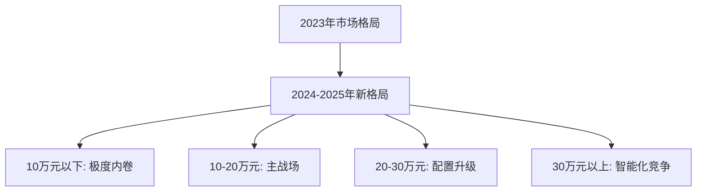
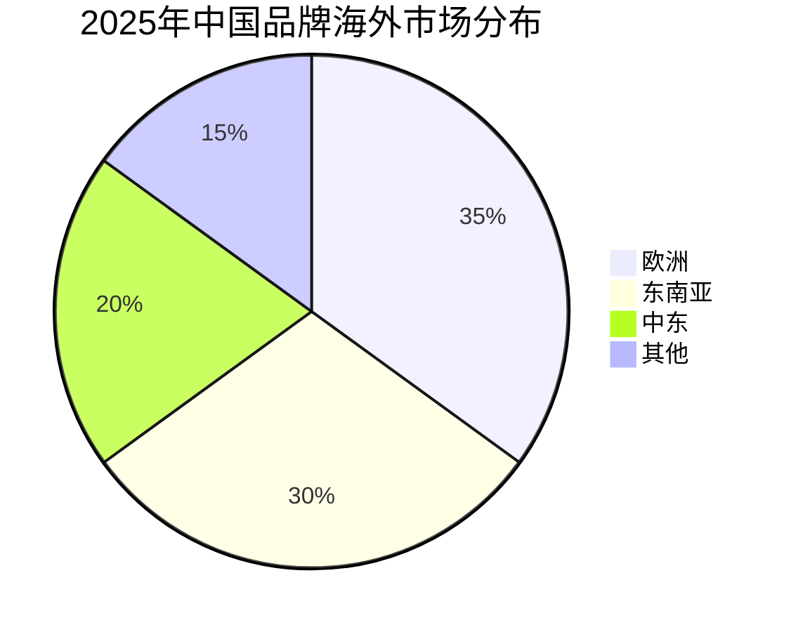

# 价格战对中国汽车市场格局的影响分析（2024-2025）

## 价格战演变历程

### 2024年开局：全面爆发
- **触发点**：特斯拉2024年1月降价，Model 3降幅6%，Model Y降幅3%
- **扩散速度**：前8个月173款车型降价，超过2023年全年90%
- **参与广度**：从新能源扩展到燃油车，从经济型到豪华车全覆盖

### 2025年趋势：政府干预
- **政策信号**：习近平主席批评"羊群式投资"，要求停止价格战
- **行业响应**：17家车企承诺60天供应商付款期
- **市场调整**：部分车型开始涨价或维持价格

## 市场格局重塑

### 1. 市场集中度变化

#### 企业淘汰加速
- **退出数量**：2018-2025年约400家中国电动车企业停运
- **存活预期**：129个电动车品牌中仅15%预计2030年仍盈利
- **淘汰标准**：年销量低于10万辆的品牌生存困难

#### 头部企业强化

| 企业类别 | 代表企业 | 市场表现 |
|---------|---------|---------|
| 传统新势力领先者 | 理想汽车 | 2024年销售50万辆，新势力第一 |
| 新晋黑马 | 小米汽车 | 9个月销售13.5万辆 |
| 传统转型成功者 | 比亚迪 | 市场份额持续扩大 |
| 外资品牌压力 | 特斯拉 | 市场份额从7.8%降至6% |

### 2. 价格体系重构

#### 价格下移趋势
- **平均售价**：两年内下降19%至16.5万元（2.29万美元）
- **10万元以下市场**：成为竞争最激烈的细分市场
- **豪华车门槛**：50万元级别配置下探至30万元

#### 细分市场变化

### 3. 技术普及加速

#### 标配化趋势
- **L2级驾驶辅助**：10万元车型标配
- **激光雷达**：从30万降至12万元级别
- **800V高压平台**：20万元车型开始配备
- **智能座舱**：大屏、语音交互成基础配置

#### 技术民主化时间表

| 技术 | 2023年门槛 | 2025年门槛 | 降幅 |
|-----|-----------|-----------|-----|
| 激光雷达 | 30万元 | 12万元 | 60% |
| 城市NOA | 25万元 | 10万元 | 60% |
| 800V快充 | 40万元 | 20万元 | 50% |
| 空气悬架 | 50万元 | 30万元 | 40% |

## 产业链影响

### 1. 供应商压力

#### 降价要求普遍化
- **比亚迪**：要求供应商2025年降价10%
- **行业平均**：年降3-5%成为常态
- **账期延长**：平均182天，资金压力巨大

#### 供应链整合
- **垂直整合加速**：车企自研比例提升
- **供应商并购**：中小供应商被迫整合
- **技术合作深化**：战略合作取代简单采购

### 2. 经销商变革

#### 传统模式挑战
- **库存压力**：价格波动导致库存贬值
- **利润下降**：新车销售利润趋近于零
- **模式转型**：从销售向服务转型

#### 新零售崛起
- **直销模式**：新势力品牌普遍采用
- **线上化趋势**：在线选配、送车上门
- **用户运营**：重视全生命周期价值

### 3. 研发投入分化

#### 头部企业加大投入
- **比亚迪**：年研发投入超400亿元
- **理想汽车**：研发费用率保持10%以上
- **小米汽车**：依托集团研发资源

#### 中小企业研发困境
- **资金不足**：利润压缩影响研发投入
- **人才流失**：无法维持高端研发团队
- **技术差距**：与头部企业差距拉大

## 消费者行为变化

### 1. 购买决策

#### 观望情绪
- **等待降价**：消费者预期价格继续下降
- **配置期待**：等待更多配置下放
- **品牌忠诚度**：下降，更关注性价比

#### 消费升级与降级并存
- **升级**：同价位获得更好配置
- **降级**：部分消费者选择更低价位车型

### 2. 使用成本

#### 购车成本下降
- **车价降低**：平均降幅15-20%
- **金融方案**：0首付、低利率普及
- **置换补贴**：最高可达3万元

#### 后期成本优化
- **能源成本**：电动车使用成本优势明显
- **维保成本**：竞争带来服务价格下降
- **保值率**：价格战导致保值率下降

## 长期影响预测

### 1. 行业健康度

#### 负面影响
- **创新动力不足**：低利润影响长期研发
- **质量风险**：过度成本压力可能影响品质
- **投资退潮**：资本对汽车行业趋于谨慎

#### 正面效应
- **效率提升**：倒逼企业提高运营效率
- **技术普及**：加速新技术应用
- **市场成熟**：加快优胜劣汰

### 2. 国际竞争力

#### 出口优势
- **成本优势**：规模效应带来成本竞争力
- **技术积累**：快速迭代提升技术实力
- **品牌建设**：部分品牌开始获得国际认可

#### 全球扩张

### 3. 产业转型

#### 从制造到服务
- **软件定义汽车**：软件收入比重提升
- **出行服务**：从卖车到卖服务
- **生态营收**：构建汽车生态系统

#### 商业模式创新
- **订阅模式**：功能订阅成为新收入来源
- **数据变现**：用户数据价值挖掘
- **能源服务**：充电网络运营

## 应对策略建议

### 1. 企业层面

#### 短期策略
- **成本控制**：优化供应链，提高效率
- **差异化**：寻找独特定位避免正面竞争
- **现金流管理**：确保资金链安全

#### 长期布局
- **技术储备**：持续研发投入，构建技术壁垒
- **品牌建设**：提升品牌价值，摆脱价格竞争
- **全球化**：开拓海外市场，分散风险

### 2. 政策建议

#### 市场规范
- **反不正当竞争**：防止恶意低价倾销
- **质量监管**：确保产品质量不因价格战下降
- **信息透明**：规范价格信息发布

#### 产业支持
- **研发补贴**：支持关键技术研发
- **出口鼓励**：帮助企业开拓海外市场
- **兼并重组**：支持行业整合提升集中度

### 3. 投资者视角

#### 投资机会
- **头部企业**：市场份额扩大的受益者
- **核心供应商**：掌握关键技术的供应商
- **新商业模式**：软件和服务提供商

#### 风险规避
- **避免尾部企业**：生存压力巨大
- **关注现金流**：重视企业资金链安全
- **评估可持续性**：判断商业模式可持续性

## 结论

2024-2025年的价格战深刻改变了中国汽车市场格局，加速了行业洗牌和技术普及。虽然短期内消费者受益，但长期来看需要在市场竞争和可持续发展之间找到平衡。政府的适时干预、企业的理性竞争以及技术创新将是决定中国汽车产业未来发展的关键因素。价格战最终将推动中国汽车产业向更高质量、更可持续的方向发展。