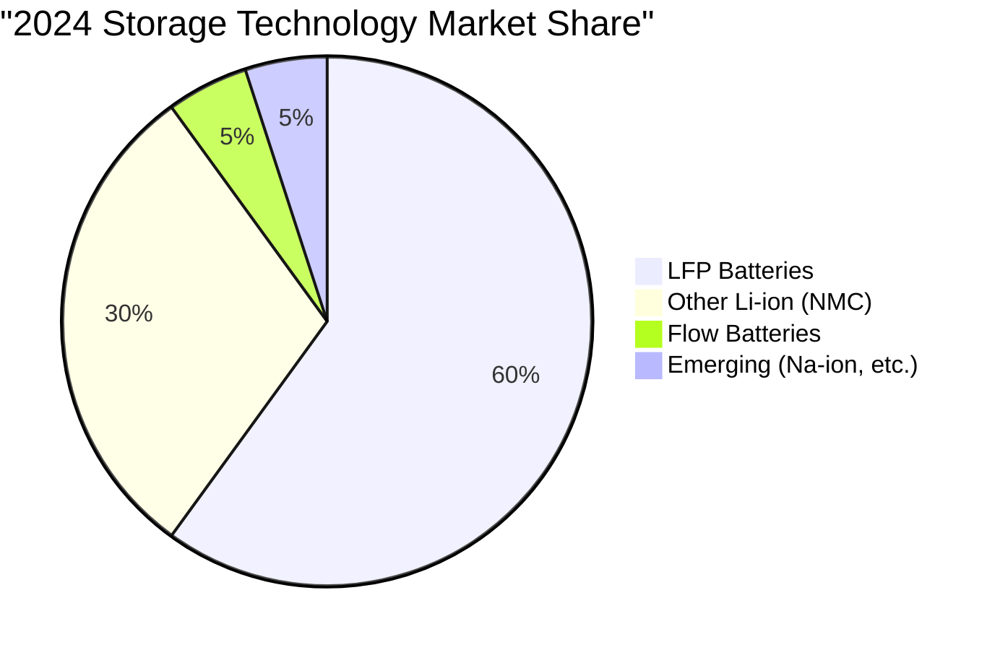
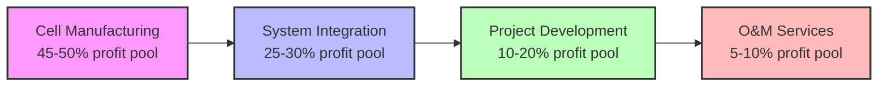
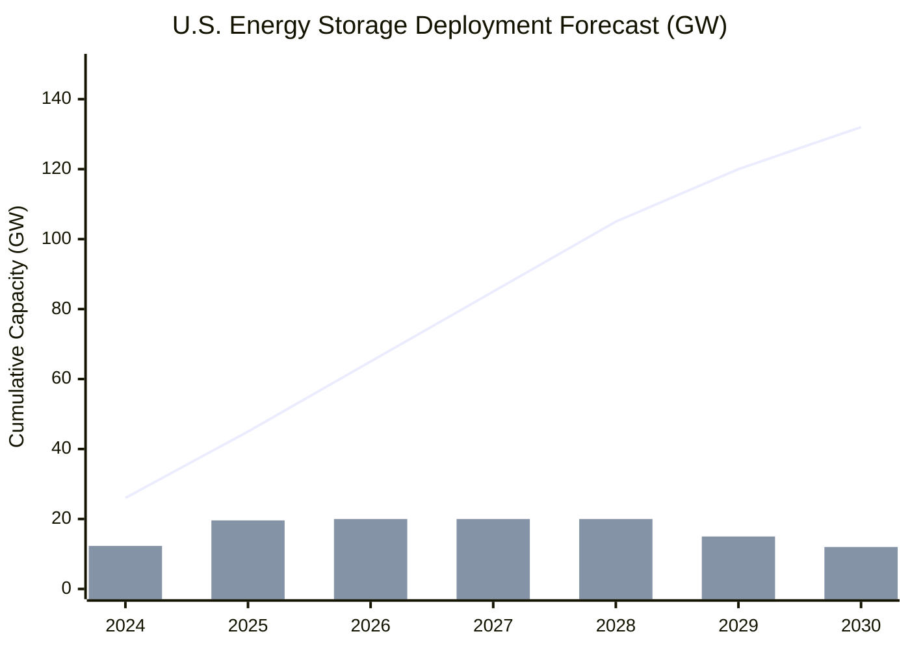
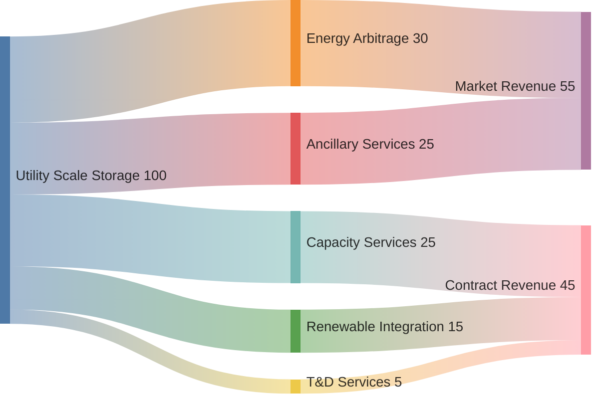
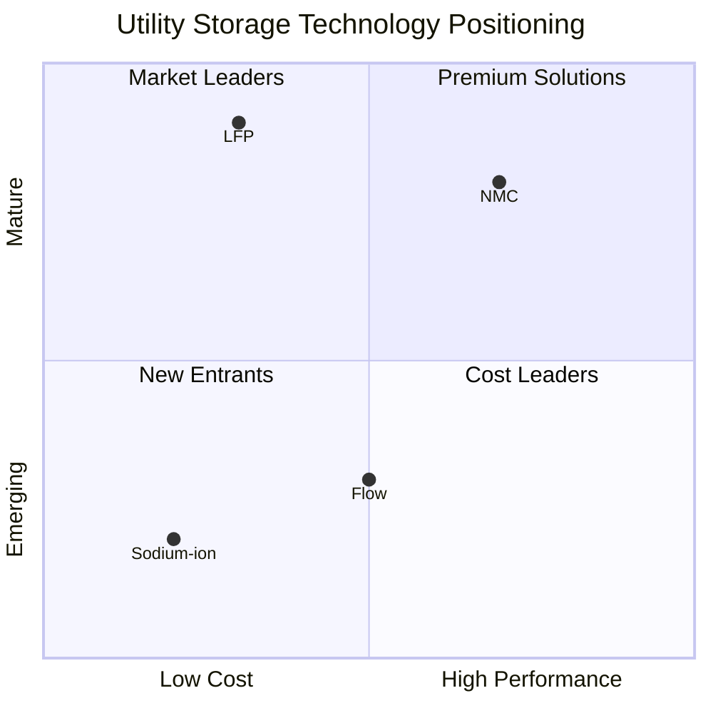

# U.S. Utility-Scale Energy Storage Market Analysis

## Executive Summary

The U.S. utility-scale energy storage market has emerged as one of the fastest-growing segments in the energy sector, reaching **$106.7 billion in 2024** with projections to expand to **$1.49 trillion by 2034** - a 14x increase representing a 29.1% CAGR. This explosive growth is driven by declining battery costs (reaching record lows of $115/kWh), supportive federal policies through the Inflation Reduction Act, and increasing grid needs for flexibility to integrate renewable energy. The market deployed a record 12.3 GW/37.14 GWh in 2024, with expectations for continued acceleration as storage transitions from emerging technology to essential grid infrastructure.

## Research Context

This comprehensive analysis examines the utility-scale energy storage market in the United States across multiple dimensions: market size and total addressable market (TAM), policy landscape, value chain dynamics, growth trajectories, technology options, applications, and competitive supplier landscape. The research addresses critical questions about market opportunity, technology selection, regulatory drivers, and competitive positioning for stakeholders considering entry or expansion in this rapidly evolving market.

## Key Findings

### Market Opportunity

The U.S. utility-scale energy storage market presents one of the most compelling growth opportunities in the energy sector:

- **Current Market (2024)**: $106.7 billion market value, 26 GW cumulative installed capacity
- **Near-term Growth (2025-2030)**: Expected to reach 131.75 GW by 2030, with 81 GW of new installations
- **Long-term Potential (2034)**: TAM projected at $1.49 trillion, representing massive expansion opportunity
- **Geographic Concentration**: California and Texas account for 60% of deployments, but growth spreading nationwide

### Policy Drivers

The Inflation Reduction Act has fundamentally transformed the market economics:

- **Base ITC**: 30% tax credit for standalone storage (first time eligible without solar pairing)
- **Stackable Bonuses**: Up to 70% total credits with domestic content, energy community, and low-income adders
- **State Leadership**: New York doubled target to 6 GW by 2030; California continues aggressive procurement
- **FERC Order 2023**: Streamlining interconnection process, addressing 2.6 TW queue backlog

### Technology Landscape

Lithium Iron Phosphate (LFP) batteries dominate with >60% market share due to optimal balance of cost ($115/kWh), safety, and lifespan (3,000-10,000 cycles). Flow batteries show promise for long-duration applications with lowest levelized cost at $0.055/kWh, while sodium-ion emerges as potential low-cost alternative.

### Value Chain Dynamics

The value chain reveals concentration in manufacturing (dominated by Chinese firms like CATL with 40% global share) while U.S. players lead in project development and system integration. Revenue stacking through multiple services (capacity, arbitrage, ancillary services) has become essential for project economics.

### Growth Trajectory

Market growth accelerating with 74 GW expected between 2024-2028, driven by:
- Record low battery prices with further reductions anticipated
- 95% of 2.6 TW interconnection queue being renewables/storage
- 571 GW of solar projects proposed as hybrid with storage

### Application Segments

Energy storage serves diverse grid applications with most projects pursuing revenue stacking:

Primary applications include energy arbitrage (leveraging price spreads), ancillary services (frequency regulation, spinning reserve), capacity provision (replacing peaker plants), and renewable integration (53% of solar projects include storage).

### Supplier Landscape

The market features intense competition between international technology leaders and domestic market experts:

**Leading Players by Category:**
- **Cell Manufacturing**: CATL (40% share), BYD (30% Europe share), EVE Energy
- **System Integration**: Tesla (#1 Q1-Q2), Sungrow (#1 Q3-Q4), Fluence
- **Project Development**: NextEra (targeting 81 GW by 2027), Invenergy, LS Power
- **Integrated Players**: Growing trend toward vertical integration

## Detailed Analysis

For comprehensive analysis of specific market aspects, please refer to the detailed reports:

### Table of Contents

1. [Market Size and TAM Analysis](./reports/task-1-market-size-tam.md) - Current market valuation, growth projections, and total addressable market assessment
2. [Policy and Regulatory Landscape](./reports/task-2-policy-regulatory.md) - Federal IRA provisions, state mandates, and FERC regulations
3. [Value Chain and Business Models](./reports/task-3-value-chain.md) - Industry structure, revenue models, and stakeholder roles
4. [Growth Trends and Projections](./reports/task-4-growth-trends.md) - Historical growth, near-term forecasts, and long-term market evolution
5. [Technology Assessment](./reports/task-5-technology-assessment.md) - Comparative analysis of storage technologies, costs, and development trends
6. [Application Segmentation](./reports/task-6-applications-segmentation.md) - Use cases, revenue stacking strategies, and market segments
7. [Supplier Landscape](./reports/task-7-supplier-landscape.md) - Competitive analysis of manufacturers, developers, and integrators

## Market Dynamics Visualization

## Investment Implications

### Opportunities
- **TAM Expansion**: $1.5 trillion market potential by 2034
- **Policy Support**: IRA incentives secured through 2032
- **Technology Cost Decline**: Battery prices continuing downward trajectory
- **Application Diversification**: New revenue streams emerging continuously

### Risks
- **Interconnection Bottlenecks**: 2.6 TW queue with only 19% historical success rate
- **Supply Chain Dependencies**: Reliance on Asian cell manufacturers
- **Policy Uncertainty**: Potential IRA modifications affecting economics
- **Technology Evolution**: Rapid changes potentially stranding assets

## Strategic Recommendations

### For Market Entrants
1. **Partnership Strategy**: Align with established players for market access
2. **Technology Selection**: Focus on LFP for near-term, evaluate flow for long-duration
3. **Geographic Focus**: Target markets beyond California/Texas for less competition
4. **Revenue Model**: Design for multiple revenue streams from day one

### For Existing Players
1. **Vertical Integration**: Consider supply chain control opportunities
2. **Scale Advantages**: Pursue larger projects (>100 MWh) for economics
3. **Technology Portfolio**: Diversify beyond single technology dependence
4. **Market Expansion**: Explore emerging state markets with new mandates

## Conclusion

The U.S. utility-scale energy storage market represents a transformative opportunity in the energy transition, evolving from niche application to essential grid infrastructure. With strong policy support, declining costs, and increasing grid needs, the market is positioned for sustained hypergrowth through 2034. Success will require navigating complex value chains, technology selection, and regulatory landscapes while building capabilities across development, integration, and operations. The winners will be those who can effectively combine technology expertise with local market knowledge and execution capabilities.

## References

- [U.S. Energy Storage Market Forecast 2025-2034](https://www.gminsights.com/industry-analysis/us-energy-storage-market)
- [FERC Interconnection Reform Orders](https://www.ferc.gov/explainer-interconnection-final-rule)
- [IRA Energy Storage Provisions](https://www.mcguirewoods.com/client-resources/alerts/2022/12/inflation-reduction-act-creates-new-tax-credit-opportunities-for-energy-storage-projects/)
- [Berkeley Lab Interconnection Queue Analysis](https://emp.lbl.gov/publications/queued-2024-edition-characteristics)
- [McKinsey Battery Energy Storage Systems Report](https://www.mckinsey.com/industries/automotive-and-assembly/our-insights/enabling-renewable-energy-with-battery-energy-storage-systems)
- [Wood Mackenzie U.S. Storage Market Analysis](https://www.energy-storage.news/2024-energy-storage-installations-surpassed-12gw/)