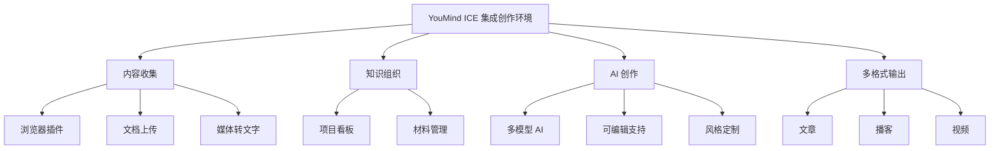
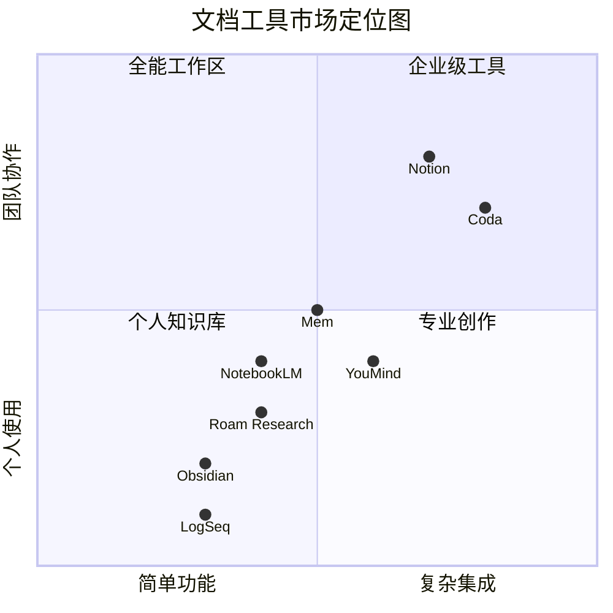
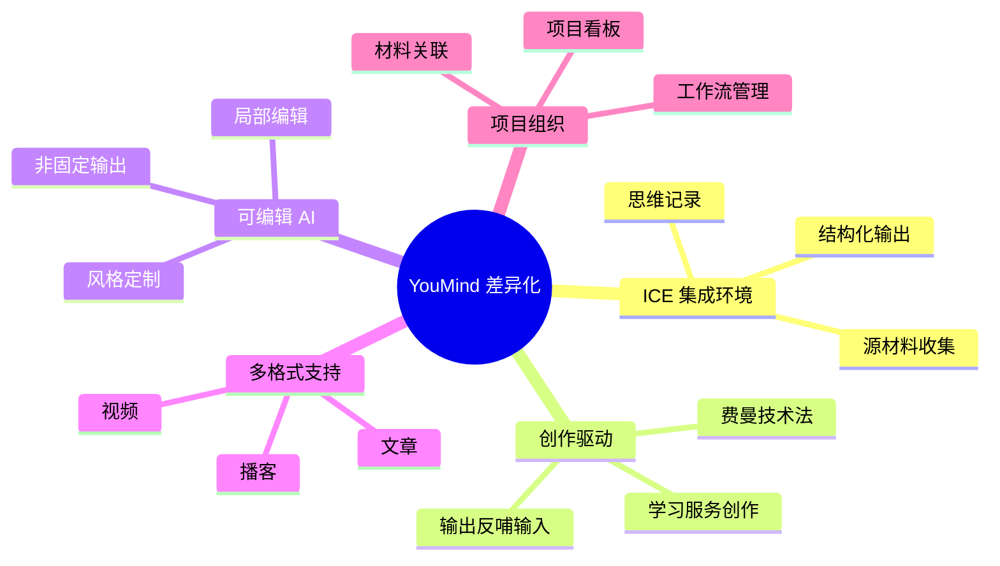

# YouMind 产品调研报告

## 执行摘要

YouMind 是一款于 2025 年在 ProductHunt 发布的 AI 创作工作室（AI Creation Studio），在发布当天获得了第二名的成绩（975 分）。根据 [ProductHunt 页面](https://www.producthunt.com/products/youmind?launch=youmind) 的描述，YouMind 定位为"首个将学习与写作融合的 AI 创作工作室"，旨在帮助用户从灵感捕捉到内容创作的全流程。

## 研究背景

本研究旨在深入了解 YouMind 这款新兴文档工具的：
- 产品定位和目标市场
- 核心功能和技术特点  
- 竞争对手分析
- 差异化优势

## 关键发现

### 1. 产品定位

YouMind 开创了"AI 创作工作室"这一新品类，不同于传统的笔记软件或 AI 写作工具。根据 [YouMind 官网](https://youmind.ai/) 的介绍，其核心理念是"每个人都有值得创造的想法"，但"将这些灵感转化为成品往往很困难"。

### 2. 核心功能架构



### 3. 主要竞品对比



### 4. 竞争优势分析

| 特性维度 | YouMind | Notion | Obsidian | Roam Research | NotebookLM |
|---------|---------|---------|----------|---------------|------------|
| **集成程度** | ⭐⭐⭐⭐⭐ | ⭐⭐⭐⭐ | ⭐⭐⭐ | ⭐⭐⭐ | ⭐⭐ |
| **AI 能力** | ⭐⭐⭐⭐⭐ | ⭐⭐⭐ | ⭐⭐ | ⭐ | ⭐⭐⭐⭐ |
| **多格式输出** | ⭐⭐⭐⭐⭐ | ⭐⭐ | ⭐⭐ | ⭐⭐ | ⭐⭐ |
| **学习曲线** | ⭐⭐⭐⭐ | ⭐⭐⭐⭐⭐ | ⭐⭐ | ⭐⭐ | ⭐⭐⭐⭐ |
| **价格竞争力** | ⭐⭐⭐⭐ | ⭐⭐⭐⭐⭐ | ⭐⭐⭐ | ⭐⭐ | ⭐⭐⭐⭐⭐ |
| **隐私保护** | ⭐⭐⭐⭐ | ⭐⭐⭐ | ⭐⭐⭐⭐⭐ | ⭐⭐⭐ | ⭐⭐⭐ |

### 5. 独特价值主张

根据研究发现，YouMind 的核心差异化体现在：



## 详细分析

### 产品特性深度分析
详见 [Task 1 报告：YouMind 产品定位与功能分析](./reports/task-1-youmind-positioning-features.md)

### 竞争对手全景分析  
详见 [Task 2 报告：文档工具竞品分析](./reports/task-2-competitor-analysis.md)

### 差异化优势分析
详见 [Task 3 报告：YouMind 差异化与独特价值分析](./reports/task-3-differentiators-analysis.md)

## 市场洞察

### 定价策略对比

```mermaid
xychart-beta
    title "主要竞品月度定价对比（美元）"
    x-axis [免费版, 基础版, 专业版, 企业版]
    y-axis "价格（美元/月）" 0 --> 50
    bar [0, 0, 20, 0] "YouMind"
    bar [0, 10, 30, 0] "Coda"  
    bar [0, 8, 0, 0] "Obsidian Sync"
    bar [0, 0, 16, 0] "Tome"
    bar [0, 10, 0, 0] "Guru"
```

### 目标用户群体

根据 [Futurepedia](https://www.futurepedia.io/tool/youmind) 的分析，YouMind 的目标用户包括：

1. **内容创作者**：作家、博主、播客主持人
2. **技术人员**：AI 开发者、程序员、设计师
3. **商业人士**：产品经理、创业者、风险投资人
4. **媒体工作者**：记者、编辑

## 结论与建议

### 核心优势

1. **创新定位**：YouMind 成功开创了"AI 创作工作室"这一新品类，填补了知识管理与内容生产之间的空白。

2. **全流程覆盖**：从材料收集到最终发布的完整工作流，这是大多数竞品只能覆盖 1-2 个环节的痛点。

3. **AI 技术领先**：集成来自 Anthropic、OpenAI、Google、Meta、DeepSeek 的多个 AI 模型，提供了竞品难以匹敌的 AI 能力。

4. **平衡的产品策略**：在功能完整性、易用性、价格和隐私保护之间取得了良好平衡。

### 潜在挑战

1. **市场教育成本**：作为新品类，需要投入资源教育市场理解"AI 创作工作室"概念。

2. **生态系统建设**：相比 Notion、Obsidian 等成熟产品，YouMind 的插件生态和社区还需要时间培养。

3. **功能深度权衡**：全面性可能牺牲了某些垂直功能的深度，如 Notion 的数据库功能或 Obsidian 的双向链接。

### 市场机会

YouMind 的独特定位使其有机会：
- 成为 AI 时代内容创作的标准工具
- 吸引对现有工具不满的用户群体
- 通过持续迭代建立竞争壁垒

## 参考资料

### 主要信息来源
1. [YouMind ProductHunt 发布页](https://www.producthunt.com/products/youmind?launch=youmind)
2. [YouMind 官方网站](https://youmind.ai/)
3. [Futurepedia - YouMind AI 评测](https://www.futurepedia.io/tool/youmind)
4. [Productive.io - 知识管理工具对比](https://productive.io/blog/notion-vs-obsidian/)
5. [TechBullion - 知识管理终极评测](https://techbullion.com/notion-vs-obsidian-vs-roam-research-the-ultimate-knowledge-management-review/)

### 研究报告目录
- [YouMind 产品定位与功能分析](./reports/task-1-youmind-positioning-features.md)
- [文档工具竞品全景分析](./reports/task-2-competitor-analysis.md)
- [YouMind 差异化优势深度剖析](./reports/task-3-differentiators-analysis.md)