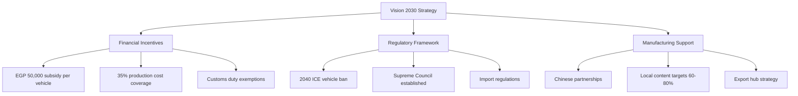
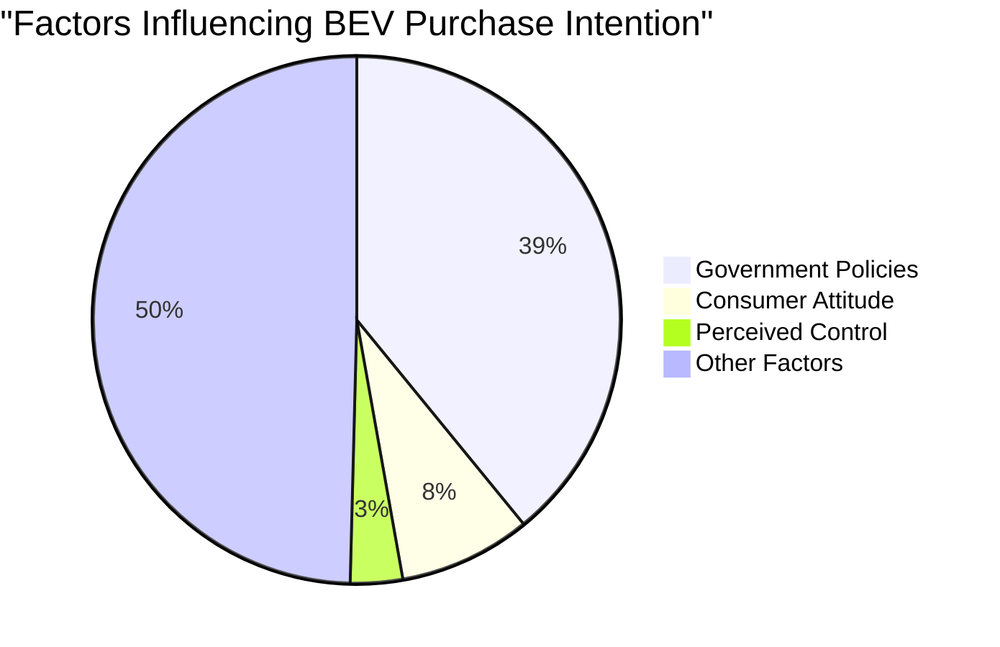
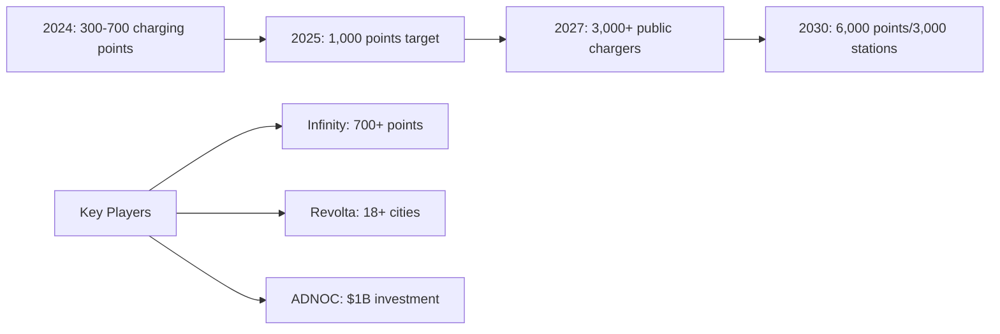

# Egypt Battery Electric Vehicle (BEV) Market Analysis

## Executive Summary

Egypt's Battery Electric Vehicle (BEV) market remains in its nascent stage with penetration rates below 1% of total passenger car sales throughout 2023-2025. Despite ambitious government initiatives including Vision 2030 targets and substantial subsidies, the market faces significant challenges from high vehicle costs, inadequate charging infrastructure, and consumer skepticism. However, strategic partnerships with Chinese manufacturers and growing infrastructure investments signal potential for future growth.

## BEV Sales Penetration Data

### Market Performance Overview

| Period | BEV Sales | Total Car Sales | Penetration Rate | YoY Growth |
|--------|-----------|-----------------|------------------|------------|
| 2023 | <500 units | ~90,359 | <1% | N/A |
| 2024 | ~3,000-4,000 units | ~102,200 | <1% | +45% (9M) |
| Q1 2025 | Data pending | N/A | <1% | N/A |
| H1 2025 | Declined | Growing +43% | <1% | -21.3% |

According to [AMIC data](https://english.ahram.org.eg/News/517188.aspx) and [Hatla2ee's analysis](https://uae.hatla2ee.com/news/هتلاقي-ترصد-نمو-45-في-مبيعات-السيارات-الكهربائية-خلال-2024/84907), while percentage growth appears strong, absolute numbers remain minimal. The [H1 2025 decline of 21.3%](https://www.focus2move.com/egyptian-vehicle-market/) despite overall market growth indicates persistent adoption challenges.

## Market Development Drivers

### Government Policies and Incentives

The Egyptian government has implemented comprehensive support measures as documented by [Egyptian Streets](https://egyptianstreets.com/2025/02/05/egypts-electric-vehicle-future-potential-and-challenges-ahead/):

Key policy highlights:
- **Direct subsidies:** Up to EGP 50,000 per locally produced vehicle (first 100,000 units)
- **Manufacturing support:** 35% production cost coverage for local manufacturers
- **Tax benefits:** Complete customs duty exemption for EVs and components
- **Long-term vision:** Ban on traditional vehicles by 2040

### Consumer Behavior and Adoption Trends

According to [consumer research](https://ideas.repec.org/a/ibn/ijmsjn/v14y2022i2p27.html), government policies influence 39.1% of purchase intentions, while significant barriers persist:

Main adoption barriers identified by [MDPI's 2024 study](https://www.mdpi.com/2032-6653/16/8/423):
- High initial purchase costs
- Limited model availability
- Range anxiety
- Inadequate charging infrastructure
- Behavioral skepticism

### Key Industry Players and Strategies

The market features increasing Chinese dominance through strategic partnerships:

#### Market Leaders (H1 2025)
1. **MG** - Market leader
2. **Citroen** - Second place (-87.3%)
3. **Hyundai** - Third place (+237.5%)

#### Major Manufacturing Partnerships
- **GV Investments-FAW Group:** Low-cost EV production starting early 2025
- **BAIC-Alkan Auto:** 20,000 units/year capacity, launching end-2025

### Infrastructure and Charging Network Development

Current infrastructure status per [New Energy Egypt](https://newenergyeg.com/electric-vehicle-charging-stations-in-egypt-2025-guide-by-new-energy/):

Infrastructure challenges:
- Geographic concentration in affluent suburbs
- No downtown Cairo coverage
- Limited highway charging
- Grid capacity constraints

## Market Outlook

### Growth Projections

According to [Statista forecasts](https://www.statista.com/outlook/mmo/electric-vehicles/egypt):
- 2025 revenue: US$5.3 million
- 2025-2029 CAGR: 9.68%
- 2029 market volume: US$7.6 million

### Critical Success Factors

1. **Infrastructure expansion** beyond affluent areas
2. **Affordable model availability** through local production
3. **Consumer education** on total cost of ownership
4. **Grid modernization** for charging support
5. **Sustained policy support** and incentive programs

## Conclusions

Egypt's BEV market remains in early development stages with sub-1% penetration despite government ambitions. While strategic partnerships and policy frameworks are in place, success depends on addressing fundamental barriers of cost, infrastructure, and consumer acceptance. The market shows promise for long-term growth but requires sustained investment and policy commitment to achieve Vision 2030 goals.

## Detailed Research Reports

For comprehensive analysis of specific aspects:

- [BEV Sales Penetration Data Analysis](./reports/task-1-bev-sales-penetration-data.md)
- [Government Policies and Incentives](./reports/task-2-government-policies-incentives.md)
- [Consumer Behavior and Adoption Trends](./reports/task-3-consumer-behavior-adoption.md)
- [Key Industry Players and Strategies](./reports/task-4-industry-players-strategies.md)
- [Infrastructure and Charging Network Development](./reports/task-5-infrastructure-charging-development.md)

## References

### Primary Data Sources
- [Automotive Marketing Information Council (AMIC)](https://english.ahram.org.eg/News/517188.aspx)
- [IEA Global EV Outlook 2025](https://www.iea.org/reports/global-ev-outlook-2025/trends-in-electric-car-markets-2)
- [Statista Egypt Electric Vehicle Market Forecast](https://www.statista.com/outlook/mmo/electric-vehicles/egypt)
- [Focus2move Egyptian Auto Sales Data](https://www.focus2move.com/egyptian-vehicle-market/)

### Policy and Industry Analysis
- [Egyptian Streets - Egypt's Electric Vehicle Future](https://egyptianstreets.com/2025/02/05/egypts-electric-vehicle-future-potential-and-challenges-ahead/)
- [MDPI - Electric Vehicle Adoption in Egypt: Policy Review](https://www.mdpi.com/2032-6653/16/8/423)
- [Alternative Policy Solutions - AUC](https://aps.aucegypt.edu/en/articles/1013/electric-vehicle-adoption-in-egypt-a-long-way-to-go)

### Market Research
- [Hatla2ee EV Market Analysis](https://uae.hatla2ee.com/news/هتلاقي-ترصد-نمو-45-في-مبيعات-السيارات-الكهربائية-خلال-2024/84907)
- [PwC Voice of the Consumer 2024 Egypt](https://www.pwc.com/m1/en/publications/voice-of-the-consumer-2024-survey-egypt-findings.html)
- [New Energy Egypt Charging Guide 2025](https://newenergyeg.com/electric-vehicle-charging-stations-in-egypt-2025-guide-by-new-energy/)