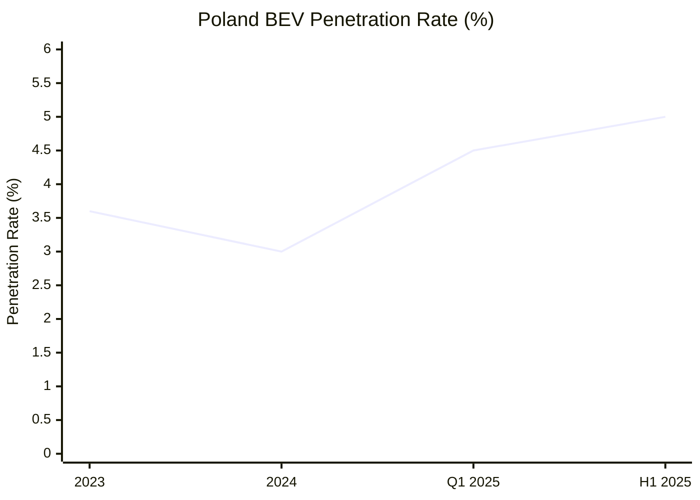
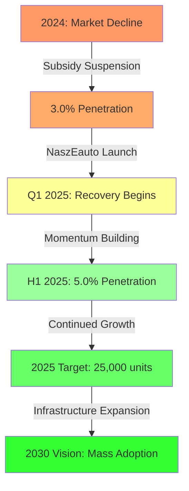

# Battery Electric Vehicle (BEV) Market Analysis: Poland 2023-2025

## Executive Summary

Poland's Battery Electric Vehicle (BEV) market demonstrates a complex trajectory characterized by strong subsidy dependency and significant growth potential. The market experienced a 3% decline in 2024 following subsidy suspension, but shows robust recovery in 2025 with **5.0% penetration rate in H1 2025**, up from **3.0% in 2024**. According to [PZPM data](https://www.pzpm.org.pl/), H1 2025 saw 14,256 BEV registrations (+61% YoY), with June 2025 achieving a record 3,779 units and 7.6% monthly market share.

The market recovery is primarily driven by the **NaszEauto program** launched in February 2025, offering up to 40,000 PLN in subsidies from a 1.6 billion PLN budget. Infrastructure development accelerated to 10,730 public charging points by July 2025, though Poland maintains one of the EU's lowest BEV penetration rates, ahead of only Croatia and Slovakia.

## Research Context

This comprehensive analysis examines Poland's BEV passenger car market dynamics, focusing on:
- Precise sales penetration rates for 2023, 2024, Q1 2025, and H1 2025
- Government policy effectiveness and subsidy programs
- Consumer adoption patterns and barriers
- Industry ecosystem and competitive landscape
- Charging infrastructure development trajectory

## Key Findings

### 1. BEV Sales Penetration Evolution

| Period | BEV Sales | Total Car Sales | Penetration Rate |
|--------|-----------|-----------------|------------------|
| 2023 | 17,086 | 475,032 | 3.6% |
| 2024 | 16,563 | 551,568 | 3.0% |
| Q1 2025 | ~6,000-7,000 | ~140,000 | ~4.5% |
| H1 2025 | 14,256 | 285,311 | 5.0% |

*Source: [PZPM](https://www.pzpm.org.pl/), [European Alternative Fuels Observatory](https://alternative-fuels-observatory.ec.europa.eu/)*

### 2. Market Development Drivers

#### Government Policies - Primary Catalyst
The **NaszEauto program** (February 2025) with 1.6 billion PLN budget revolutionized market dynamics:
- Base subsidy: 18,750-30,000 PLN depending on beneficiary category
- Additional benefits up to 40,000 PLN total
- Resulted in 61% H1 2025 growth versus prior year

The suspension of the **Mój elektryk program** in September 2024 directly caused the 2024 market decline, demonstrating extreme subsidy sensitivity. [Fleet.com.pl analysis](https://fleet.com.pl/) confirms the 25% immediate drop in registrations following suspension.

#### Consumer Behavior - Evolving Acceptance
According to [PSNM research](https://psnm.org/):
- **91% satisfaction rate** among current BEV owners
- **76% of prospects** cite range anxiety, dropping to 59% among owners
- **Price remains primary barrier** for 65% of potential buyers
- **Gender-balanced adoption** with nearly 50% female ownership

#### Industry Ecosystem - International Dominance
Market leadership concentrated among international brands:
- **Tesla**: 26.9% market share (4,461 units in 2024)
- **Mercedes-Benz**: 17.2% share in premium segment
- **No domestic BEV manufacturers**, complete import dependency

#### Infrastructure Progress - Accelerating Development
Charging network expanded to **10,730 public points** by July 2025:
- 69% AC slow chargers, 31% DC fast chargers
- **GreenWay Polska** leads with 1,633 network points
- 6 billion PLN government funding allocated through 2027
- Still **68% below EU average** density per capita

## Detailed Analysis

### Market Dynamics and Penetration
For comprehensive sales data and penetration analysis across all periods, see [BEV Sales Penetration Data Report](./reports/task-1-bev-sales-penetration-data.md)

### Policy Framework and Incentives
Detailed examination of government programs, EU regulations, and local initiatives available in [Government Policies and Incentives Report](./reports/task-2-government-policies-incentives.md)

### Consumer Insights and Adoption Patterns
In-depth analysis of buyer demographics, satisfaction metrics, and adoption barriers in [Consumer Behavior and Adoption Report](./reports/task-3-consumer-behavior-adoption.md)

### Competitive Landscape
Complete overview of market players, strategies, and industry transformation in [Industry Players and Strategies Report](./reports/task-4-industry-players-strategies.md)

### Infrastructure Development
Comprehensive infrastructure analysis including network growth, operators, and challenges in [Infrastructure and Charging Network Report](./reports/task-5-infrastructure-charging-network.md)

## Market Trajectory Visualization

## Critical Success Factors

### Accelerators
1. **Subsidy Continuity**: Market critically dependent on government support
2. **Infrastructure Density**: 50,000 charging points needed by 2030
3. **Price Parity**: BEVs must reach ICE vehicle pricing
4. **Consumer Education**: Overcoming psychological barriers

### Barriers
1. **High Initial Costs**: Primary obstacle for mainstream adoption
2. **Rural Infrastructure Gaps**: Only 2% of charging in rural areas
3. **Grid Limitations**: 30% of planned sites need major upgrades
4. **Battery Industry Risk**: EU carbon regulations threaten production advantage

## Conclusions and Implications

### Current State Assessment
Poland's BEV market exhibits **high growth potential constrained by structural challenges**. The 5.0% H1 2025 penetration represents significant progress but remains among Europe's lowest. The market's extreme sensitivity to subsidies indicates immaturity, while infrastructure development, though accelerating, lags population needs.

### Future Outlook
The market trajectory depends critically on:
- **Policy Stability**: Maintaining subsidy programs beyond 2026
- **Infrastructure Investment**: Achieving 15 billion PLN investment by 2030
- **Industry Transformation**: Managing transition of 300,000 automotive jobs
- **Consumer Confidence**: Building trust through positive ownership experiences

### Strategic Recommendations
Based on research findings:
1. **Extend NaszEauto** beyond June 2026 to maintain momentum
2. **Prioritize rural infrastructure** to enable nationwide adoption
3. **Support battery production** sector against EU regulatory challenges
4. **Accelerate grid modernization** for charging capacity
5. **Implement comprehensive consumer education** campaigns

## Table of Contents - Detailed Reports

1. [BEV Sales Penetration Data (2023-2025)](./reports/task-1-bev-sales-penetration-data.md)
   - Precise penetration rates and sales volumes
   - Period-by-period comparative analysis
   - Market trajectory visualization

2. [Government Policies and Incentives](./reports/task-2-government-policies-incentives.md)
   - NaszEauto and Mój elektryk program details
   - Tax incentives and EU regulatory framework
   - Local government initiatives

3. [Consumer Behavior and Adoption Trends](./reports/task-3-consumer-behavior-adoption.md)
   - Demographics and satisfaction metrics
   - Adoption barriers and purchase behavior
   - Regional patterns and usage statistics

4. [Key Industry Players and Strategies](./reports/task-4-industry-players-strategies.md)
   - Market share analysis and brand strategies
   - Charging operator landscape
   - Polish automotive industry transformation

5. [Infrastructure and Charging Network Development](./reports/task-5-infrastructure-charging-network.md)
   - Current infrastructure status and growth
   - Technology standards and operator analysis
   - Investment requirements and future roadmap

---

*Research compiled from Polish and English sources including [PZPM](https://www.pzpm.org.pl/), [European Alternative Fuels Observatory](https://alternative-fuels-observatory.ec.europa.eu/), [Polish Association for New Mobility](https://psnm.org/), [Ministry of Climate and Environment](https://www.gov.pl/web/klimat/), and industry reports. All data current as of H1 2025.*