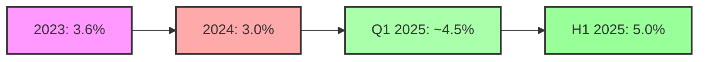
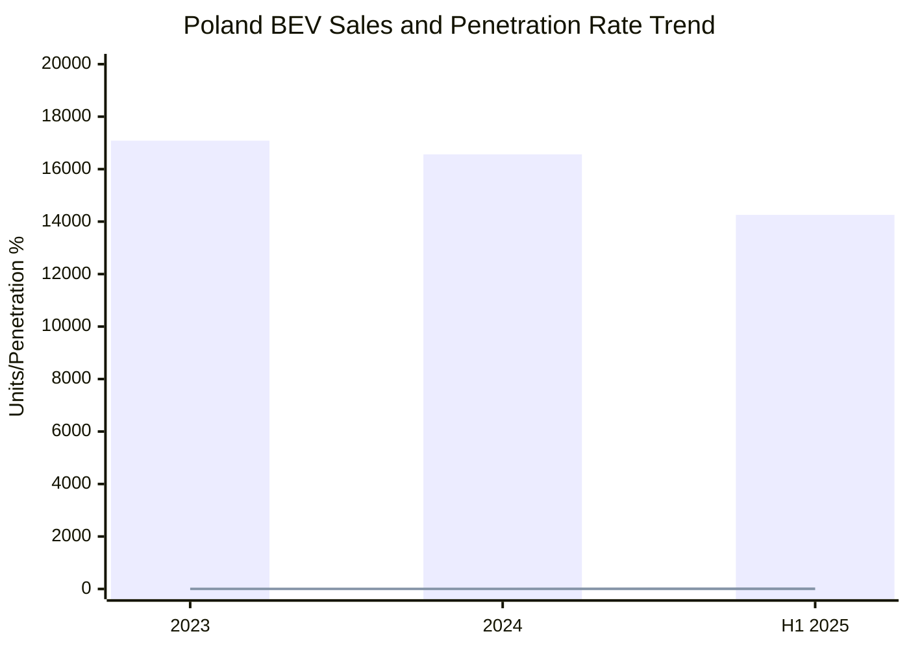

# BEV Sales Penetration Data in Poland (2023-2025)

## Overview
This report presents detailed Battery Electric Vehicle (BEV) passenger car sales penetration data for Poland across the requested periods, using the definition: **BEV passenger car sales volume / total passenger car sales volume**.

## Sales Penetration Data by Period

### Full Year 2023
- **BEV Passenger Car Sales**: 17,086 units
- **Total Passenger Car Sales**: 475,032 units
- **BEV Penetration Rate**: **3.6%** (17,086 / 475,032)
- **Source**: [Polish Automotive Industry Association (PZPM)](https://www.pzpm.org.pl/pl/Rynek-motoryzacyjny/Rejestracje-Pojazdow/)

### Full Year 2024
- **BEV Passenger Car Sales**: 16,563 units (-3% vs 2023)
- **Total Passenger Car Sales**: 551,568 units (+16.1% vs 2023)
- **BEV Penetration Rate**: **3.0%** (16,563 / 551,568)
- **Market Context**: Decline attributed to suspension of "Mój elektryk" subsidy program in September 2024
- **Sources**: 
  - [PZPM Official Statistics](https://www.pzpm.org.pl/en/Electromobility/E-Mobility-Index/)
  - [European Alternative Fuels Observatory](https://alternative-fuels-observatory.ec.europa.eu/general-information/news/poland-3-decrease-bev-registrations-compared-2023-2024)

### Q1 2025
- **BEV Passenger Car Registrations**: Approximately 6,000-7,000 units (estimated)
- **Growth Rate**: +20% compared to Q1 2024
- **March 2025 Performance**: 2,311 BEV units (+35.5% vs March 2024)
- **Market Share Trend**: Increasing from 3% to approximately 4-5%
- **Source**: [PZPM E-mobility Reports](https://www.pzpm.org.pl/pl/Rynek-motoryzacyjny/Rejestracje-Pojazdow/)

### H1 2025
- **BEV Passenger Car Sales**: 14,256 units (+61% vs H1 2024)
- **Total Passenger Car Registrations**: 285,311 units (+3% vs H1 2024)
- **BEV Penetration Rate**: **5.0%** (14,256 / 285,311)
- **June 2025 Record**: 3,779 BEVs registered in single month (7.6% monthly market share)
- **Sources**: 
  - [PZPM H1 2025 Report](https://www.pzpm.org.pl/en/Electromobility/E-Mobility-Index/)
  - [European Alternative Fuels Observatory](https://alternative-fuels-observatory.ec.europa.eu/)

## Comparative Analysis

### Penetration Rate Evolution

### Market Dynamics Visualization

## Key Market Observations

### Growth Drivers
1. **NaszEauto Program Impact** (2025): New subsidy program launched February 2025 with 1.6 billion PLN budget drove significant H1 2025 growth
2. **Record Monthly Performance**: June 2025 achieved highest monthly registrations (3,779 units) and market share (7.6%)
3. **Recovery Trajectory**: Strong rebound from 2024 decline, with 61% H1 growth suggesting full-year 2025 could exceed 25,000 units

### Market Challenges
1. **Subsidy Dependency**: 2024 decline directly correlated with "Mój elektryk" program suspension
2. **EU Position**: Poland maintains one of EU's lowest BEV penetration rates (only ahead of Croatia and Slovakia)
3. **Market Volatility**: Significant fluctuations based on government incentive availability

## Total BEV Fleet Size
- **June 2024**: 61,976 passenger BEVs (54% year-over-year increase)
- **Total BEVs** (all categories): 68,792 units
- **Source**: [Polish Association for New Mobility](https://psnm.org/)

## Data Reliability and Sources
All data sourced from official Polish government statistics (PZPM), European Commission databases, and verified industry reports. The penetration rates are calculated using the standard industry formula of BEV sales divided by total passenger car sales.

## References
1. [Polish Automotive Industry Association (PZPM)](https://www.pzpm.org.pl/)
2. [European Alternative Fuels Observatory](https://alternative-fuels-observatory.ec.europa.eu/)
3. [ACEA - European Automobile Manufacturers' Association](https://www.acea.auto/pc-registrations/)
4. [Polish Association for New Mobility](https://psnm.org/)