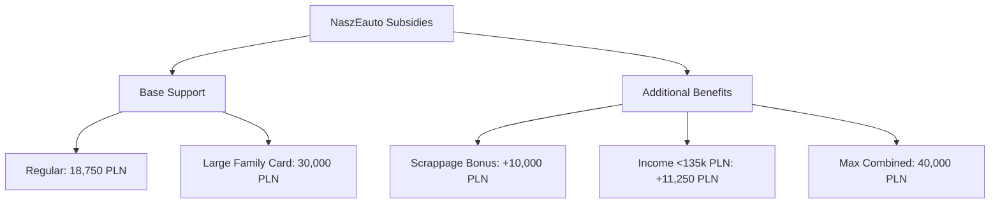
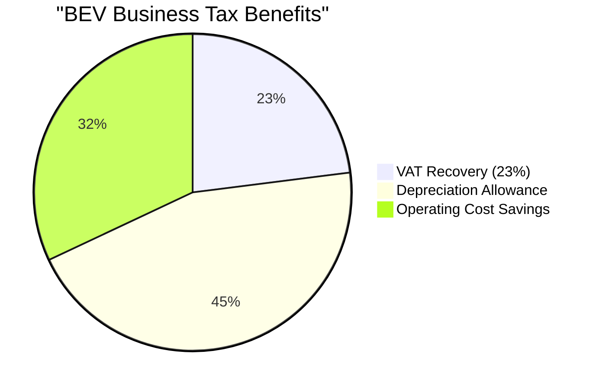
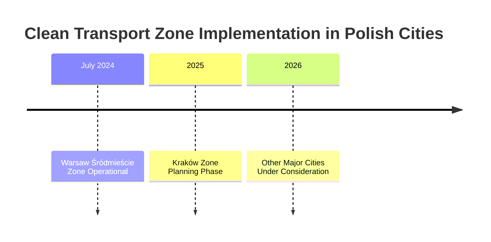
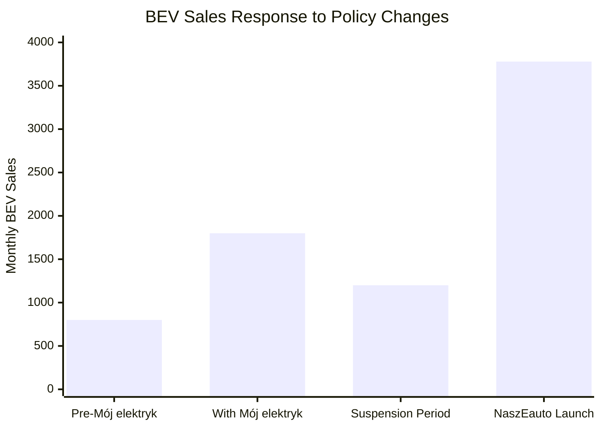

# Government Policies and Incentives for BEV Adoption in Poland

## Current Subsidy Programs

### NaszEauto Program (Active: February 2025 - June 2026)

The flagship government initiative driving BEV adoption in Poland with comprehensive financial support.

#### Program Details
- **Total Budget**: 1.6 billion PLN from National Recovery and Resilience Plan (KPO)
- **Launch Date**: February 3, 2025
- **End Date**: June 30, 2026
- **Target**: Support purchase of approximately 40,000 zero-emission vehicles
- **Source**: [Ministry of Climate and Environment](https://www.gov.pl/web/nfosigw/program-naszeauto-do-40-tys-zl-doplaty-do-samochodu-elektrycznego)

#### Subsidy Structure

#### Eligibility Requirements
- **Vehicle Specifications**: 
  - New BEVs with maximum 6,000 km
  - Maximum price: 225,000 PLN net (excluding VAT)
  - Must be registered in Poland for minimum 2 years
- **Beneficiaries**:
  - Individual consumers
  - Sole proprietors (for leasing only)
  - Large Family Card holders receive enhanced support
- **Source**: [NFOŚiGW Official Guidelines](https://www.gov.pl/web/nfosigw/)

### Mój Elektryk Program (Suspended: September 2024)

#### Program History
- **Launch**: 2021
- **Total Budget**: 960 million PLN
- **Suspension Date**: September 1, 2024
- **Reason for Suspension**: Budget exhaustion (660 million PLN depleted for leasing pathway)
- **Total Vehicles Funded**: Approximately 25,000 BEVs
- **Source**: [Fleet.com.pl Analysis](https://fleet.com.pl/wiadomosci/program-moj-elektryk-zawieszony)

#### Impact of Suspension
- **Immediate Effect**: 25% decrease in October 2024 registrations vs September
- **Market Response**: 3% annual decline in BEV sales for 2024
- **Consumer Behavior**: Demonstrated strong dependency on subsidies for purchase decisions

## Tax Incentives and Benefits

### Business Tax Advantages

- **VAT Benefits**: Full 23% VAT recoverability for businesses purchasing BEVs
- **Depreciation Limits**:
  - BEVs: Up to 225,000 PLN
  - PHEVs (≤50g CO2/km): Up to 150,000 PLN
  - PHEVs (>50g CO2/km): Up to 100,000 PLN
- **Source**: [Polish Tax Law Updates](https://www.gov.pl/web/finanse/)

### Additional Benefits
- **Bus Lane Access**: BEVs permitted in bus lanes in major cities (valid through 2025)
- **Free Parking**: Many municipalities offer free or reduced parking for BEVs
- **Registration Exemptions**: Reduced registration fees in select regions

## EU Regulatory Framework Impact

### Binding Regulations
1. **AFIR Directive** (Alternative Fuels Infrastructure Regulation)
   - Mandatory since: April 2024
   - Requirements: Specific power output targets for publicly accessible charging stations
   - Impact: Accelerated infrastructure deployment requirements
   - **Source**: [European Commission AFIR](https://ec.europa.eu/transport/themes/urban/cpt_en)

2. **2035 ICE Ban**
   - All new cars must have zero CO2 emissions from 2035
   - Intermediate target: 55% lower CO2 emissions by 2030 vs 2021 levels
   - **Source**: [EU Council Decision](https://www.consilium.europa.eu/en/press/)

3. **Battery Carbon Footprint Requirements** (2025)
   - New requirements threatening Poland's battery production sector
   - Poland currently 2nd globally in battery production
   - Risk of falling out of world's top 8 by 2030
   - **Source**: [European Battery Alliance Reports](https://www.eba250.com/)

## Local Government Initiatives

### Clean Transport Zones

#### Warsaw Clean Transport Zone
- **Launch Date**: July 1, 2024
- **Coverage**: Śródmieście district
- **Restrictions**: Limited access for high-emission vehicles
- **Exemptions**: Full access for BEVs and PHEVs
- **Source**: [Warsaw City Council](https://www.um.warszawa.pl/)

### Municipal Fleet Requirements
- **Mandate**: 30% of vehicle fleets in cities >50,000 inhabitants must be electric
- **Compliance Deadline**: Progressive targets through 2025
- **Impact**: Driving institutional BEV adoption

## Infrastructure Support Programs

### NFOŚiGW Infrastructure Fund
- **Budget**: 6 billion PLN for charging infrastructure
- **Launch**: February/March 2025
- **Eligibility**: Municipalities with <1.76 charging points per 1,000 inhabitants
- **Focus**: Expanding coverage in underserved regions
- **Source**: [NFOŚiGW Infrastructure Programs](https://www.nfosigw.gov.pl/)

## Policy Effectiveness Analysis

### Market Response to Policy Changes

### Key Policy Insights
1. **Subsidy Dependency**: Market highly sensitive to incentive availability
2. **Program Design Impact**: NaszEauto's higher subsidies drove stronger growth than predecessor
3. **Business vs Consumer Focus**: Shift to individual consumers in NaszEauto showing positive results
4. **Regional Variations**: Warsaw region shows highest uptake due to combined local and national incentives

## Future Policy Outlook

### Planned Developments
1. **Extended Infrastructure Support**: Continued NFOŚiGW funding through 2027
2. **Clean Zone Expansion**: More cities planning implementation
3. **EU Alignment**: Progressive tightening of emission standards
4. **Battery Industry Support**: Potential new programs to maintain production competitiveness

### Policy Recommendations (Industry Consensus)
- Maintain subsidy continuity to avoid market disruption
- Expand business eligibility in future programs
- Accelerate infrastructure deployment in rural areas
- Harmonize local and national incentive structures

## References
1. [Ministry of Climate and Environment](https://www.gov.pl/web/klimat/)
2. [NFOŚiGW - National Fund for Environmental Protection](https://www.nfosigw.gov.pl/)
3. [European Alternative Fuels Observatory](https://alternative-fuels-observatory.ec.europa.eu/)
4. [Polish Association for New Mobility Policy Analysis](https://psnm.org/)
5. [Fleet.com.pl Market Reports](https://fleet.com.pl/)