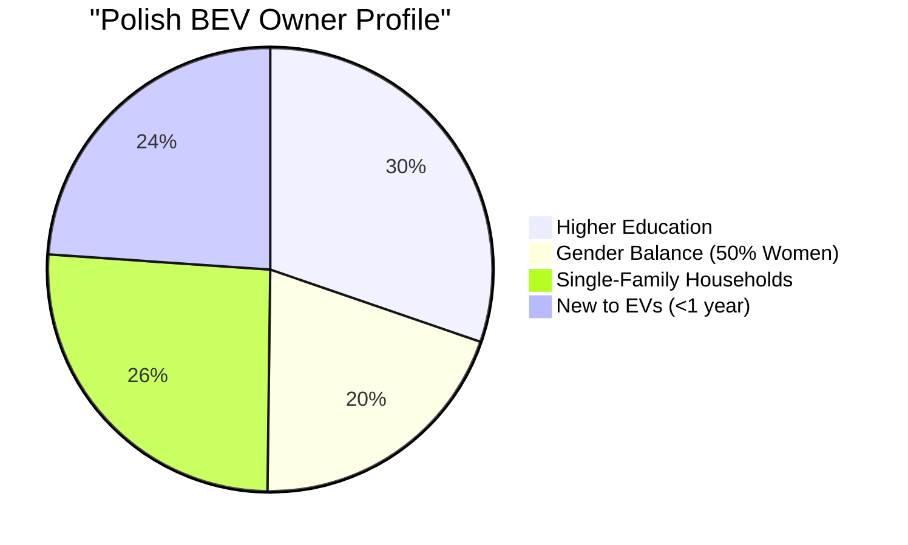
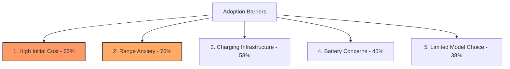
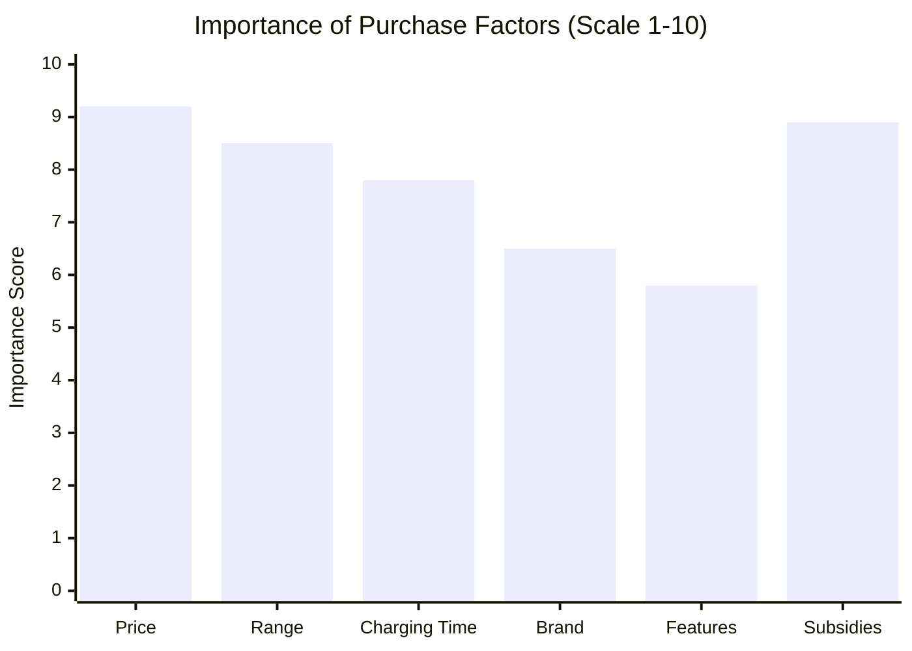
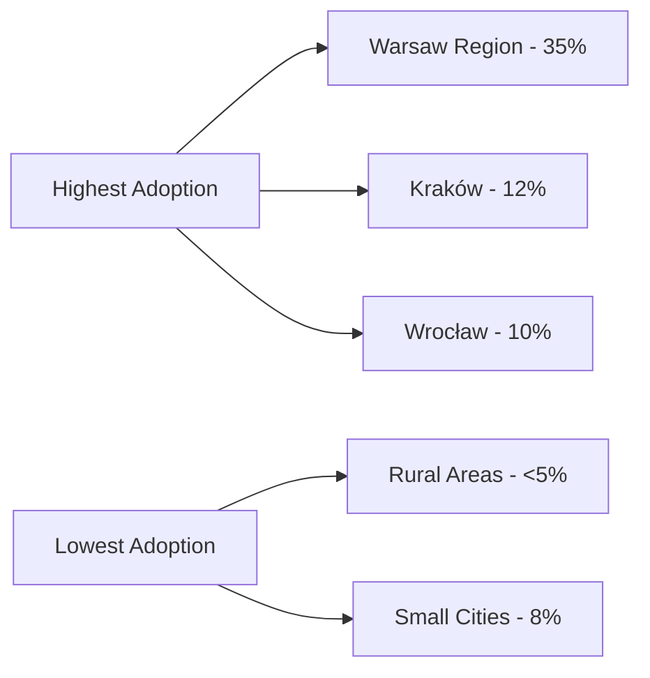
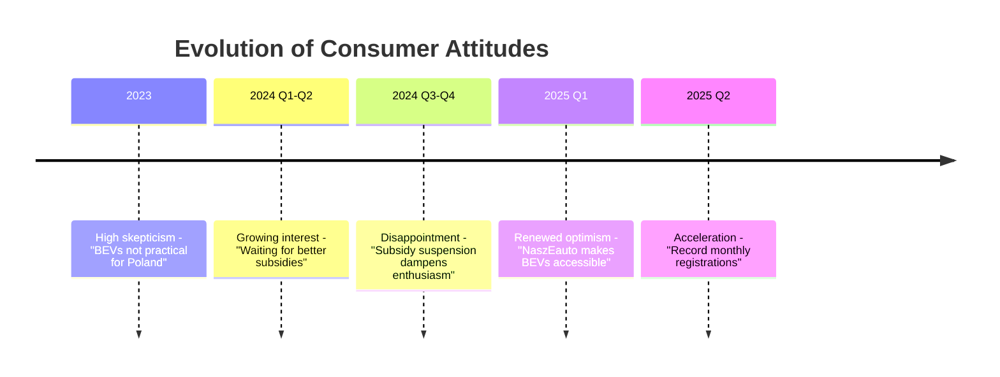

# Consumer Behavior and BEV Adoption Trends in Poland

## Market Adoption Overview

### Current BEV Owner Demographics

According to research from the [Polish Association for New Mobility](https://psnm.org/), Polish BEV owners exhibit distinct demographic characteristics:
- **Education Level**: 76% have higher education (particularly technical backgrounds)
- **Gender Distribution**: Nearly 50% are women, showing gender-balanced adoption
- **Household Type**: Predominantly single-family households
- **Experience Level**: 60% have used EVs for less than one year
- **Source**: [PSNM Consumer Research 2024](https://psnm.org/)

## Consumer Satisfaction and Loyalty

### Ownership Experience Metrics
- **Overall Satisfaction**: 91% of BEV owners report being "very satisfied"
- **Repurchase Intent**: 74% would buy another BEV
- **Recommendation Rate**: High net promoter scores among current owners
- **Experience Impact**: 78% report range anxiety decreases with ownership experience
- **Source**: [Polish EV User Survey 2024](https://psnm.org/)

## Barriers to Adoption

### Primary Adoption Barriers Ranked

### Detailed Barrier Analysis

#### 1. High Initial Purchase Cost
- **Primary Concern**: Nearly two-thirds cite price as main barrier
- **Price Premium**: BEVs average 40-60% higher than comparable ICE vehicles
- **Subsidy Dependency**: Strong correlation between subsidy availability and sales
- **Consumer Expectation**: Majority expect government support for purchase
- **Source**: [Fleet.com.pl Market Analysis](https://fleet.com.pl/)

#### 2. Range Anxiety
- **Prospective Buyers**: 76% express range concerns
- **Current Owners**: Only 59% report ongoing range worries
- **Experience Factor**: 78% see anxiety decrease with usage
- **Psychological vs Practical**: Often cited despite improving battery technology
- **Average Daily Commute**: Only 40km, well within BEV capabilities
- **Source**: [PSNM Range Anxiety Study](https://psnm.org/)

#### 3. Charging Infrastructure Concerns
- **Availability Perception**: Inadequate networks in smaller cities
- **Home Charging**: Limited for apartment dwellers (35% of urban population)
- **Public Charging Reliability**: Concerns about charger availability and functionality
- **Geographic Disparities**: Rural areas significantly underserved

#### 4. Battery Performance Skepticism
- **Longevity Concerns**: Worries about battery degradation
- **Winter Performance**: Significant concern in Polish climate
- **Replacement Costs**: Fear of expensive battery replacements
- **Warranty Understanding**: Limited awareness of 8-year battery warranties

## Consumer Purchase Behavior

### Decision-Making Factors

### Purchase Channel Preferences
- **Business Purchases**: Historically 70% of new vehicle sales
- **Private Buyers**: Growing segment with NaszEauto program
- **Leasing Popularity**: Preferred by entrepreneurs for tax benefits
- **Online Research**: 85% conduct extensive online research before purchase
- **Source**: [PZPM Market Reports](https://www.pzpm.org.pl/)

## Brand Preferences and Market Leaders

### Top BEV Brands by Consumer Preference (2024)

| Rank | Brand | Units Sold | Market Share | Key Model |
|------|-------|------------|--------------|-----------|
| 1 | Tesla | 4,461 | 26.9% | Model Y |
| 2 | Mercedes-Benz | 2,850 | 17.2% | EQE/EQS |
| 3 | Volkswagen | 2,100 | 12.7% | ID.4 |
| 4 | BMW | 1,800 | 10.9% | iX/i4 |
| 5 | Hyundai | 1,500 | 9.1% | Ioniq 5 |

**Source**: [PZPM Registration Data 2024](https://www.pzpm.org.pl/)

### Brand Perception Factors
- **Technology Leadership**: Tesla perceived as innovation leader
- **Traditional Trust**: German brands benefit from established reputation
- **Value Proposition**: Korean brands gaining ground on price-feature ratio
- **Service Network**: Importance of local dealer presence

## Regional Adoption Patterns

### Geographic Distribution of BEV Adoption

### Urban vs Rural Dynamics
- **Metropolitan Areas**: Account for 65% of all BEV registrations
- **Warsaw Dominance**: 35% of national BEV sales
- **Infrastructure Correlation**: Direct link between charging availability and adoption
- **Income Factors**: Higher urban incomes support BEV adoption
- **Source**: [CEPiK Registration Database Analysis](https://www.cepik.gov.pl/)

## Consumer Attitudes Evolution

### Perception Changes 2023-2025

## Usage Patterns of Current Owners

### Daily Usage Statistics
- **Average Daily Distance**: 45km (well within all BEV ranges)
- **Primary Use**: 78% for daily commuting
- **Weekend Travel**: 45% use for longer trips
- **Charging Frequency**: 2-3 times per week average
- **Home Charging**: 65% primarily charge at home
- **Source**: [Polish EV Driver Survey 2024](https://psnm.org/)

### Charging Behavior
- **Preferred Charging**: Overnight at home (when available)
- **Public Charging**: Used primarily for longer journeys
- **Fast Charging Usage**: 25% use DC fast charging weekly
- **Charging Anxiety**: Decreases significantly after first month

## Market Maturity Indicators

### Adoption Lifecycle Stage
Poland's BEV market exhibits characteristics of the **Early Adopter** phase:
- Innovation enthusiasts and early adopters dominate
- Mainstream consumers remain hesitant
- Strong subsidy dependency indicates immature market
- Limited secondary market development

### Future Consumer Trends
1. **Growing Acceptance**: Increasing familiarity reducing psychological barriers
2. **Corporate Influence**: Company car policies driving exposure
3. **Generation Gap**: Younger consumers more BEV-positive
4. **Environmental Awareness**: Growing but not primary driver
5. **Total Cost Focus**: Shift from purchase price to TCO consideration

## Key Consumer Insights

### What Would Accelerate Adoption
According to consumer surveys, the following would most impact purchase decisions:
1. **Purchase Price Parity**: BEVs matching ICE vehicle prices
2. **500km+ Range Standard**: Eliminating range anxiety
3. **Ubiquitous Fast Charging**: 10-minute charging availability
4. **Proven Reliability**: Long-term ownership testimonials
5. **Broader Model Selection**: More options in popular segments

## References
1. [Polish Association for New Mobility (PSNM)](https://psnm.org/)
2. [PZPM Consumer Research](https://www.pzpm.org.pl/)
3. [CEPiK Registration Analysis](https://www.cepik.gov.pl/)
4. [Fleet.com.pl Market Studies](https://fleet.com.pl/)
5. [European Alternative Fuels Observatory - Poland](https://alternative-fuels-observatory.ec.europa.eu/)