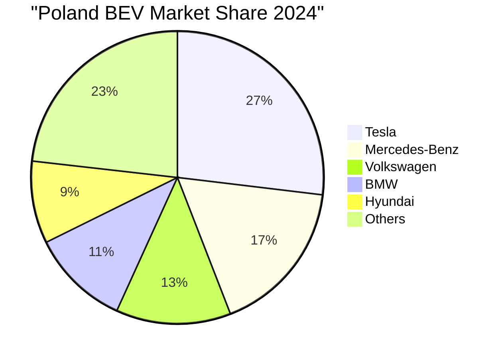
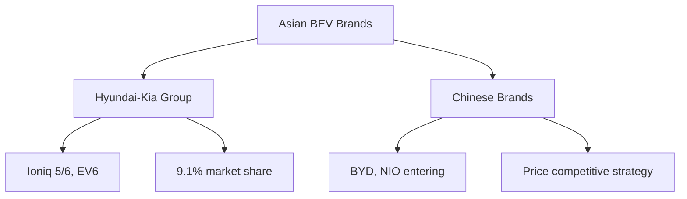
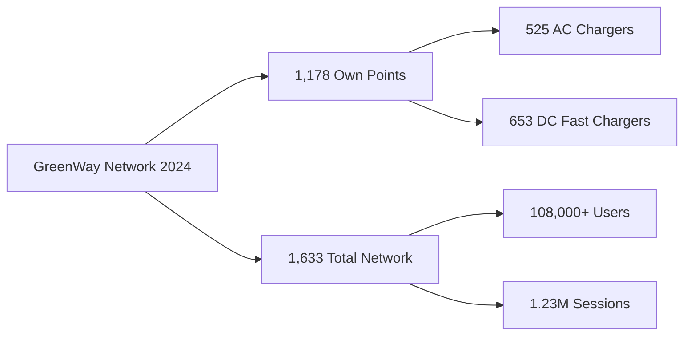
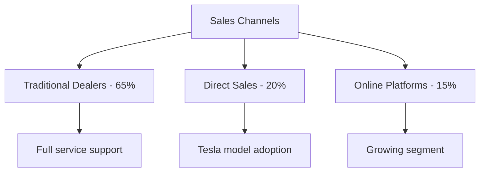
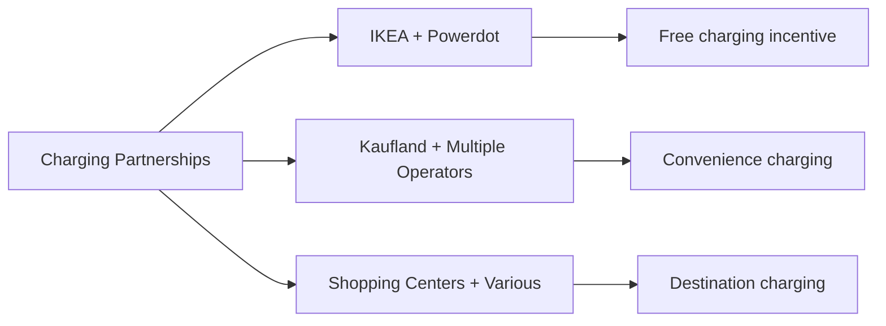
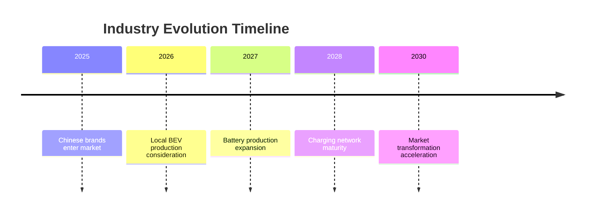

# Key Industry Players and Market Strategies in Poland's BEV Sector

## Market Leadership Overview

### 2024 BEV Market Share Distribution

## Leading BEV Manufacturers

### Tesla - Market Leader

#### Market Position
- **2024 Sales**: 4,461 units (26.9% market share)
- **Best-Selling Model**: Model Y with 2,200+ registrations
- **Growth Trend**: Maintained leadership despite overall market decline
- **Source**: [PZPM Registration Data](https://www.pzpm.org.pl/)

#### Strategy in Poland
- **Direct Sales Model**: Online sales with delivery centers in major cities
- **Supercharger Network**: Expanding proprietary charging infrastructure
- **Price Positioning**: Premium pricing with focus on technology leadership
- **Target Segment**: Tech-savvy early adopters and business customers

### Mercedes-Benz - Premium Segment Leader

#### Market Performance
- **2024 Sales**: ~2,850 units (17.2% market share)
- **Key Models**: EQE, EQS, EQA series
- **Positioning**: Luxury BEV segment domination
- **Source**: [PZPM Market Reports](https://www.pzpm.org.pl/)

#### Strategic Approach
- **Dealer Network Leverage**: Utilizing established premium dealer network
- **Fleet Focus**: Targeting corporate and executive segments
- **Service Infrastructure**: Comprehensive service support through existing centers
- **Brand Trust**: Leveraging established premium brand reputation

### Volkswagen Group

#### Market Presence
- **2024 Performance**: ~2,100 units (12.7% market share)
- **Multi-Brand Strategy**: VW, Audi, Škoda, Porsche
- **Volume Leader**: ID.4 as main volume model
- **Source**: [ACEA Statistics](https://www.acea.auto/)

#### Poland Strategy
- **Local Assembly Consideration**: Exploring local production possibilities
- **Broad Portfolio**: Offering BEVs across multiple price points
- **Dealer Integration**: Training extensive dealer network for BEV sales
- **Charging Partnerships**: Collaborating with Ionity network

## Emerging Players and Challengers

### Asian Manufacturers Rising

#### Hyundai-Kia Group
- **Combined Share**: ~9.1% and growing
- **Models**: Ioniq 5, Ioniq 6, Kia EV6
- **Strategy**: Value proposition with advanced features
- **Warranty Advantage**: 8-year battery warranty emphasis
- **Source**: [Hyundai Motor Group Reports](https://www.hyundai.com/)

#### Chinese Manufacturers
- **BYD Entry**: Planning market entry 2025-2026
- **Strategy**: Aggressive pricing below European competitors
- **Models**: Atto 3, Dolphin, Seal targeting mass market
- **Challenge**: Building brand trust and service network

## Industry Support Ecosystem

### Charging Infrastructure Operators

#### GreenWay Polska - Market Leader

**2024 Achievements**:
- **Network Size**: 1,633 charging points (1,178 own + 455 partner)
- **Growth**: Added 523 new points in 2024
- **User Base**: 108,000+ registered users (33,000 new in 2024)
- **Usage Statistics**: 1.23 million charging sessions (+33% YoY)
- **Green Energy**: 592 stations powered by renewable energy
- **Source**: [GreenWay Polska Annual Report](https://www.isbtech.pl/2025/01/greenway-polska-podsumowuje-2024-rok/)

#### Other Key Infrastructure Players

| Operator | Network Size | Strategy | Key Partnerships |
|----------|-------------|----------|------------------|
| Powerdot | 200+ points | Retail locations | Kaufland, IKEA |
| ChargeIn | 46 points (expanding to 100+) | Urban fast charging | Shopping centers |
| Orlen Charge | 150+ points | Petrol station integration | PKN Orlen network |
| Ionity | 8 stations | Highway corridors | VW, BMW, Mercedes |

**Source**: [Polish Alternative Fuels Infrastructure Report](https://psnm.org/)

### Battery Production Sector

#### Current Position
- **Global Ranking**: 2nd largest battery producer globally (2024)
- **Key Players**: LG Energy Solution (Wrocław), SK Innovation
- **Production Capacity**: Over 65 GWh annually
- **Employment**: 15,000+ direct jobs in battery sector
- **Source**: [Polish Investment and Trade Agency](https://www.paih.gov.pl/)

#### Challenges and Risks
- **EU Regulations**: New carbon footprint requirements from 2025
- **Competition**: Asian manufacturers' advantage in green energy usage
- **Forecast**: Risk of falling out of top 8 producers by 2030
- **Government Response**: Seeking exemptions and transition support

## Distribution and Sales Strategies

### Traditional Dealer Networks

#### Dealer Adaptation Challenges
- **Training Requirements**: Significant investment in technician training
- **Infrastructure Needs**: Charging installations at dealerships
- **Inventory Management**: Lower turnover vs ICE vehicles
- **Customer Education**: Extended consultation requirements

### Corporate Fleet Strategies

#### Business Market Importance
- **Historical Dominance**: 70% of new car sales to businesses
- **Tax Advantages**: Leveraging BEV tax benefits
- **Leasing Focus**: Primary channel for business customers
- **Policy Impact**: NaszEauto exclusion of businesses creating challenges
- **Source**: [Fleet.com.pl Analysis](https://fleet.com.pl/)

## Polish Automotive Industry Response

### Domestic Manufacturing Sector

#### Current State
- **No Domestic BEV Brands**: Unlike other EU countries
- **Component Manufacturing**: Focus on parts and battery production
- **Assembly Operations**: International brands' assembly plants
- **Employment Impact**: 300,000+ jobs in automotive sector at risk

#### Transformation Challenges
1. **Skill Gap**: Need for EV-specific expertise
2. **Investment Requirements**: Billions needed for retooling
3. **Supply Chain Shift**: From engines to batteries and electronics
4. **Timeline Pressure**: 2035 ICE ban deadline approaching

### Industry Association Positions

#### PZPM (Polish Automotive Industry Association)
- **2025 Forecast**: 25,000 BEV units expected
- **Policy Advocacy**: Pushing for extended business incentives
- **Infrastructure Focus**: Calling for accelerated charging deployment
- **EU Negotiations**: Seeking transition period extensions
- **Source**: [PZPM Official Statements](https://www.pzpm.org.pl/)

## Strategic Partnerships and Collaborations

### Retail Integration

### Technology Collaborations
- **InPost Partnership**: Parcel locker locations with charging
- **Mercedes-Strabag**: Premium charging locations
- **Banking Sector**: Financing solutions for BEV purchases
- **Energy Companies**: Grid integration and smart charging

## Market Entry Strategies

### Success Factors for Poland
1. **Competitive Pricing**: Essential given price sensitivity
2. **Charging Access**: Partnerships or proprietary networks
3. **Service Network**: Nationwide coverage requirements
4. **Local Adaptation**: Winter performance optimization
5. **Government Relations**: Subsidy program participation

### Failed Approaches
- **Premium-Only Strategy**: Limited market due to income levels
- **Urban-Only Focus**: Missing broader market opportunity
- **Ignoring Subsidies**: Sales correlation with incentive availability

## Future Industry Outlook

### Expected Developments 2025-2030

### Strategic Imperatives
1. **Cost Reduction**: Achieving price parity with ICE vehicles
2. **Infrastructure Investment**: Collaborative charging expansion
3. **Consumer Education**: Overcoming adoption barriers
4. **Government Engagement**: Ensuring supportive policies
5. **Workforce Transition**: Reskilling for electrification

## References
1. [PZPM - Polish Automotive Industry Association](https://www.pzpm.org.pl/)
2. [GreenWay Polska Reports](https://www.greenway.pl/)
3. [Polish Investment and Trade Agency](https://www.paih.gov.pl/)
4. [ACEA European Statistics](https://www.acea.auto/)
5. [Fleet.com.pl Market Analysis](https://fleet.com.pl/)
6. [European Alternative Fuels Observatory](https://alternative-fuels-observatory.ec.europa.eu/)