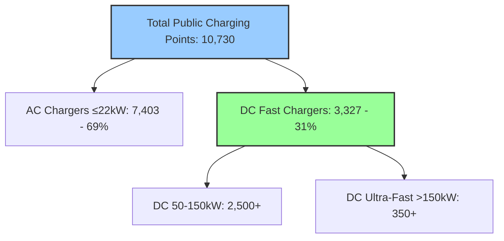
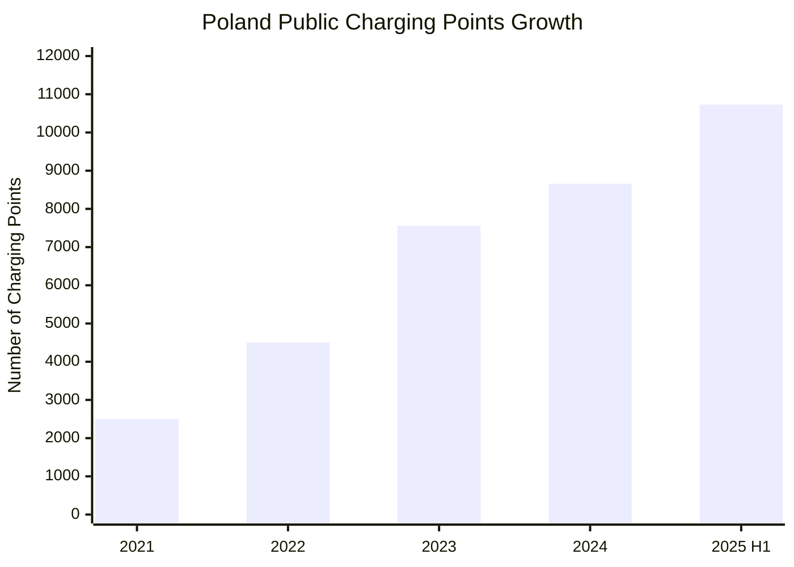
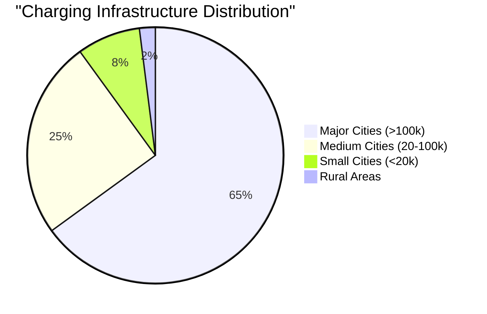
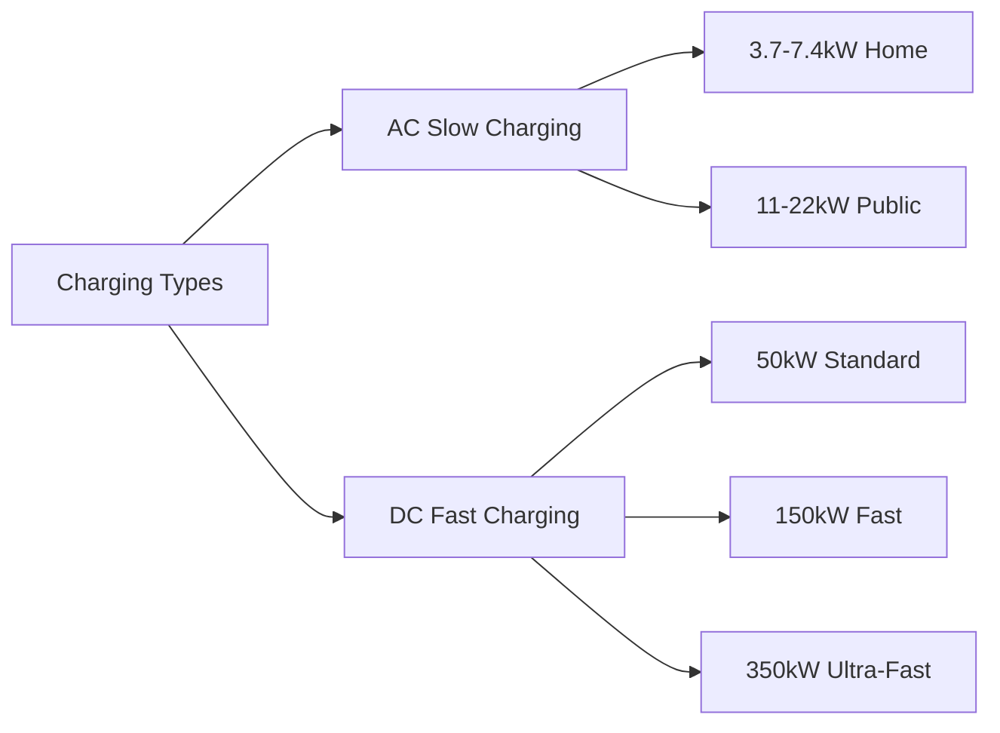
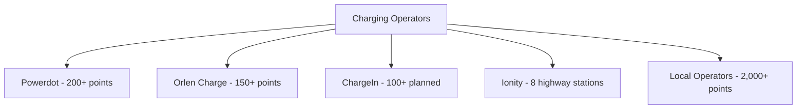
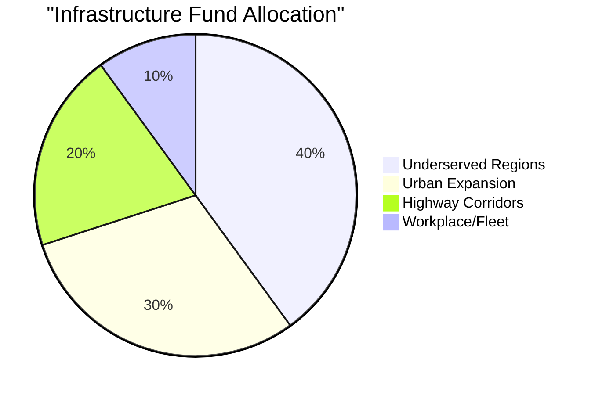
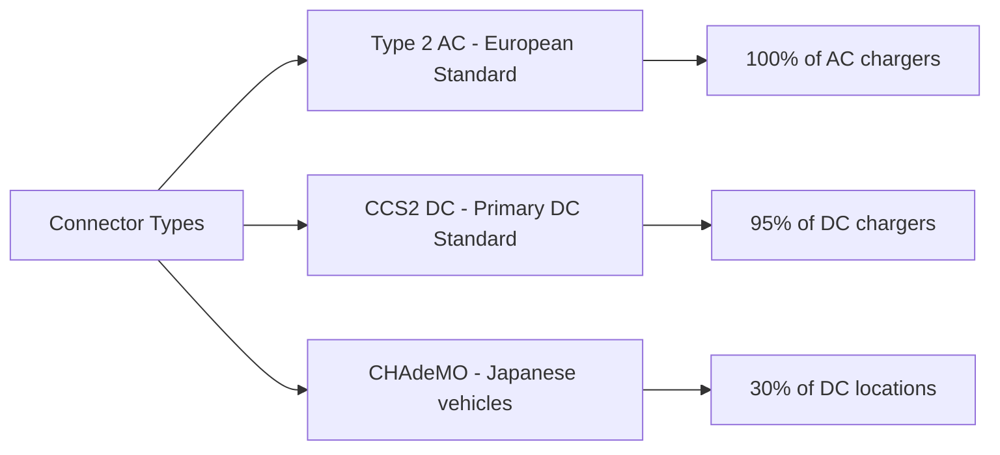
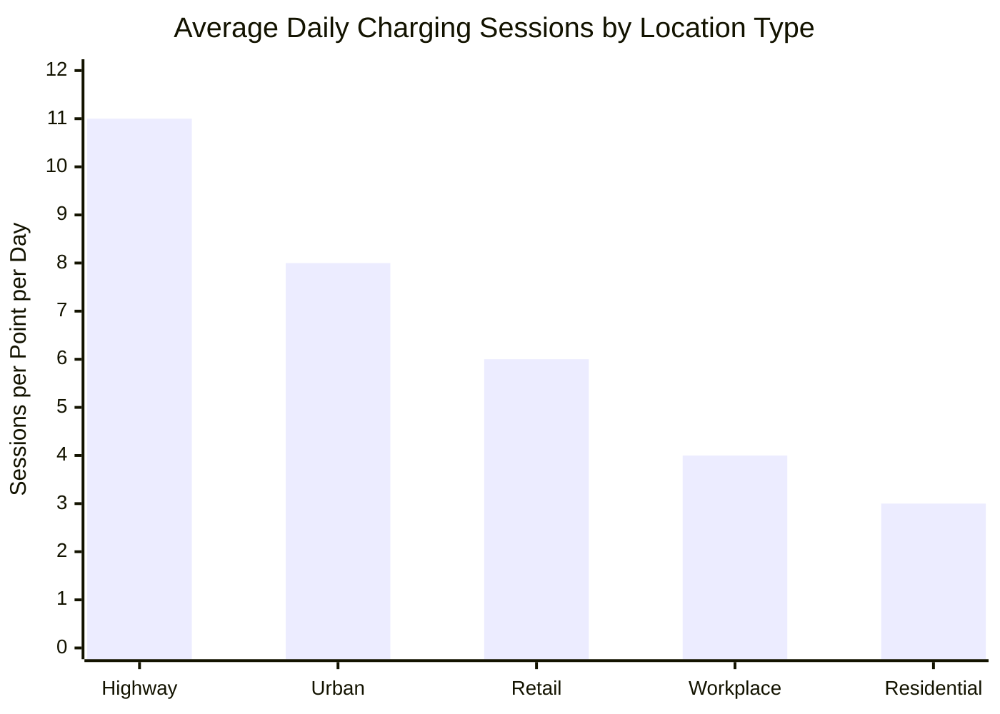
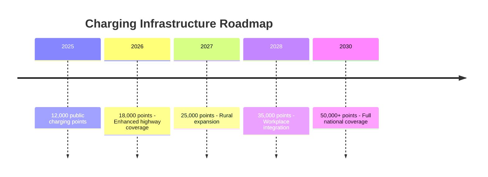

# Charging Infrastructure and Network Development in Poland

## Current Infrastructure Status

### Overall Network Statistics (July 2025)

**Key Metrics**:
- **Total Public Charging Points**: 10,730 (July 2025)
- **Growth from 2024**: +24% (8,659 points in December 2024)
- **AC/DC Distribution**: 69% AC slow chargers, 31% DC fast chargers
- **Ultra-Fast Charging**: 350+ locations with ≥150kW capacity
- **Source**: [European Alternative Fuels Observatory](https://alternative-fuels-observatory.ec.europa.eu/)

## Infrastructure Growth Trajectory

### Historical Development

**Annual Growth Rates**:
- 2021-2022: +80%
- 2022-2023: +68%
- 2023-2024: +15% (slowdown period)
- 2024-2025 H1: +24% (recovery)
- **Source**: [Polish Association for New Mobility](https://psnm.org/)

## Geographic Distribution

### Regional Infrastructure Density

| Region | Charging Points | Points per 100k Population | Leading City |
|--------|----------------|---------------------------|--------------|
| Mazowieckie (Warsaw) | 2,450 | 45.2 | Warsaw (595) |
| Pomorskie | 1,280 | 54.8 | Gdańsk (277) |
| Zachodniopomorskie | 980 | 57.6 | Szczecin (222) |
| Wielkopolskie | 1,150 | 32.8 | Poznań (207) |
| Małopolskie | 890 | 25.9 | Kraków (198) |
| Dolnośląskie | 1,100 | 37.9 | Wrocław (185) |
| Śląskie | 950 | 21.0 | Katowice (125) |
| Other Regions | 2,930 | <20.0 | Various |

**Source**: [CEPiK Infrastructure Database](https://www.cepik.gov.pl/)

### Urban vs Rural Disparities

**Key Observations**:
- **Urban Concentration**: 65% of infrastructure in major cities
- **Rural Challenges**: Only 2% of charging points in rural areas
- **Highway Coverage**: Major routes well-served, secondary roads lacking
- **Border Regions**: Enhanced coverage for international transit

## Types of Charging Infrastructure

### Charging Power Categories

### Technology Distribution
- **AC Chargers (≤22kW)**: 7,403 points (69%)
  - Primary use: Destination charging (shopping, work, home)
  - Average charging time: 4-8 hours for full charge
  - Cost: 0.65-1.89 PLN/kWh

- **DC Fast Chargers (50-150kW)**: ~2,500 points (23%)
  - Primary use: Route charging, urban quick charging
  - Average charging time: 30-60 minutes to 80%
  - Cost: 1.89-2.89 PLN/kWh

- **Ultra-Fast Chargers (>150kW)**: 350+ points (3%)
  - Primary use: Highway corridors, premium charging
  - Average charging time: 15-30 minutes to 80%
  - Cost: 2.49-3.49 PLN/kWh

**Source**: [GreenWay Polska Pricing Data](https://www.greenway.pl/)

## Major Charging Network Operators

### Market Leader: GreenWay Polska

#### Network Statistics (2024)
- **Own Charging Points**: 1,178 (525 AC, 653 DC)
- **Partner Network**: Additional 455 points
- **Total Coverage**: 1,633 accessible points
- **Renewable Energy**: 592 stations powered by green energy
- **Market Share**: ~15% of total public infrastructure
- **Source**: [GreenWay Annual Report 2024](https://www.isbtech.pl/2025/01/greenway-polska-podsumowuje-2024-rok/)

#### User Metrics
- **Registered Users**: 108,000+ (33,000 new in 2024)
- **Charging Sessions**: 1.23 million in 2024 (+33% YoY)
- **Energy Delivered**: 28.5 GWh in 2024
- **App Downloads**: 250,000+ total

### Other Key Operators

| Operator | Points | Strategy | Key Features |
|----------|--------|----------|--------------|
| **Powerdot** | 200+ | Retail integration | Kaufland, IKEA partnerships |
| **Orlen Charge** | 150+ | Petrol station model | Nationwide coverage via Orlen |
| **ChargeIn** | 46 (100+ planned) | Urban fast charging | Norwegian investment backing |
| **Ionity** | 8 stations | Highway corridors | 350kW ultra-fast only |
| **EVBox** | 100+ | B2B focus | Workplace charging solutions |

**Source**: [Polish e-Mobility Observatory](https://obserwatorium.psnm.org/)

## Infrastructure Development Programs

### Government Funding Initiatives

#### NFOŚiGW Infrastructure Program
- **Total Budget**: 6 billion PLN
- **Launch**: February/March 2025
- **Duration**: Through 2027
- **Target**: 15,000+ new charging points
- **Source**: [NFOŚiGW Official Programs](https://www.nfosigw.gov.pl/)

#### Eligibility and Distribution

**Criteria for Support**:
- Municipalities with <1.76 points per 1,000 inhabitants
- Minimum 2 charging points per location
- Public accessibility requirements
- Smart charging capabilities mandatory

### EU Funding Sources
- **CEF Transport**: 100 million EUR allocated for Poland
- **Recovery Fund**: Part of 1.6 billion PLN KPO allocation
- **Regional Development Funds**: Additional 500 million PLN
- **Source**: [European Commission Funding Portal](https://ec.europa.eu/info/funding-tenders/)

## Technological Standards and Requirements

### Mandatory Technical Specifications (from October 2024)

#### AFIR Compliance
- **Smart Charging**: Bi-directional communication capability
- **Payment Systems**: Contactless payment acceptance
- **Roaming**: Interoperability between networks
- **Data Sharing**: Real-time availability information
- **Source**: [EU AFIR Regulation](https://eur-lex.europa.eu/)

### Connector Standards

## Usage Patterns and Statistics

### Charging Session Analytics (2024)

**Key Usage Metrics**:
- **Average Session Duration**: 
  - AC: 3.5 hours
  - DC 50kW: 45 minutes
  - DC 150kW+: 25 minutes
- **Peak Usage Times**: 10:00-14:00 and 16:00-20:00
- **Utilization Rate**: 18% average (EU average: 12%)
- **Source**: [GreenWay Usage Statistics](https://www.greenway.pl/)

## Infrastructure Challenges

### Key Barriers to Expansion

1. **Grid Capacity Limitations**
   - Insufficient power supply in 30% of planned locations
   - Grid upgrades required costing 2-5 million PLN per site
   - Average connection time: 6-12 months

2. **Economic Viability**
   - Low utilization rates affecting profitability
   - High initial investment: 150,000-500,000 PLN per DC station
   - ROI period: 7-10 years currently

3. **Administrative Barriers**
   - Complex permitting process (average 6 months)
   - Multiple authorities involved
   - Inconsistent local regulations

4. **Geographic Challenges**
   - Rural areas economically unviable
   - Seasonal tourist areas underutilized
   - Cross-border coordination needs

**Source**: [PSNM Infrastructure Report 2024](https://psnm.org/)

## Future Development Plans

### Infrastructure Targets

### Strategic Priorities 2025-2030

1. **Highway Corridors**: Ultra-fast chargers every 60km
2. **Urban Hubs**: Minimum 5 points per 10,000 inhabitants
3. **Rural Access**: Basic coverage in all municipalities
4. **Cross-Border Integration**: Seamless European network
5. **Smart Grid Integration**: V2G capabilities deployment

### Investment Requirements
- **Total Investment Needed**: 15 billion PLN by 2030
- **Public Funding**: 6 billion PLN committed
- **Private Investment Gap**: 9 billion PLN required
- **Source**: [Ministry of Climate Estimates](https://www.gov.pl/web/klimat/)

## Comparative European Context

### Poland vs EU Average

| Metric | Poland | EU Average | Gap |
|--------|--------|------------|-----|
| Points per 100k population | 28.3 | 89.5 | -68% |
| DC charger share | 31% | 13% | +138% |
| Points per 100 BEVs | 15.6 | 8.2 | +90% |
| Highway coverage | 65% | 85% | -24% |

**Analysis**: Poland has relatively good infrastructure per BEV but lags in absolute density, indicating preparation for growth.
**Source**: [European Alternative Fuels Observatory](https://alternative-fuels-observatory.ec.europa.eu/)

## Key Success Factors

### Accelerating Development
1. **Streamlined Permitting**: Reducing approval time to 2 months
2. **Grid Investment**: Proactive capacity upgrades
3. **Business Models**: Innovative financing and operations
4. **Technology Standards**: Future-proof specifications
5. **User Experience**: Seamless payment and roaming

## References
1. [European Alternative Fuels Observatory](https://alternative-fuels-observatory.ec.europa.eu/)
2. [GreenWay Polska](https://www.greenway.pl/)
3. [Polish Association for New Mobility](https://psnm.org/)
4. [NFOŚiGW Infrastructure Programs](https://www.nfosigw.gov.pl/)
5. [AFIR EU Regulation](https://eur-lex.europa.eu/)
6. [Ministry of Climate and Environment](https://www.gov.pl/web/klimat/)