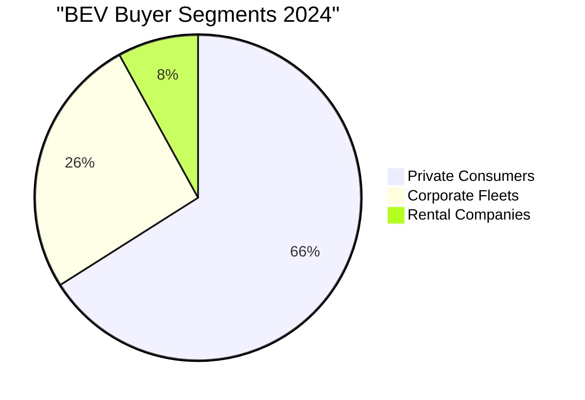
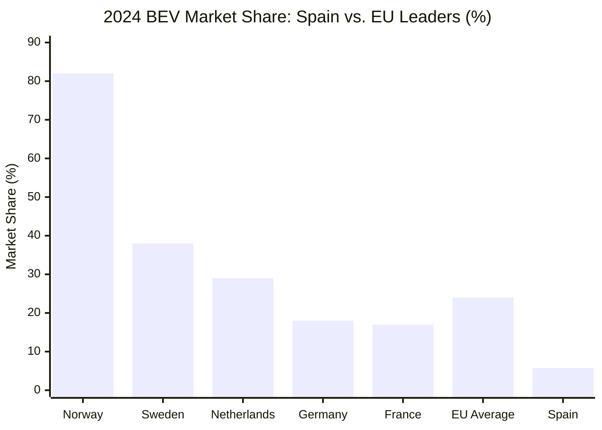

# Battery Electric Vehicle (BEV) Market Analysis: Spain 2023-2025

## Executive Summary

Spain's Battery Electric Vehicle (BEV) passenger car market demonstrates a complex trajectory of steady growth coupled with significant structural challenges. According to [ANFAC](https://anfac.com/) and [European Alternative Fuels Observatory](https://alternative-fuels-observatory.ec.europa.eu/) data, BEV penetration has evolved from **5.2% in 2023** to **5.77% in 2024**, with dramatic acceleration in 2025 reaching **16.8% market share in H1 2025** (total electrified vehicles including PHEVs).

Despite this growth, Spain ranks **20th among 27 EU countries** in BEV adoption, significantly trailing the EU average of 24%. The market's development is driven by substantial government incentives through the **€1.735 billion Plan MOVES III** program, expanding charging infrastructure (40,438 public points), and increasing consumer acceptance, though critical barriers persist including high vehicle costs, charging infrastructure gaps, and consumer range anxiety.

## Key Findings

### 1. Market Penetration Rates

According to official registration data from [ANFAC](https://anfac.com/) and [ACEA](https://www.acea.auto/):

| Period | BEV Market Share | Total Electrified (BEV+PHEV) | Units Sold | Growth Rate |
|--------|-----------------|------------------------------|------------|-------------|
| **2023 Full Year** | 5.2% | 12.0% | ~54,462 BEVs | +31% |
| **2024 Full Year** | 5.77% | 11.4% | 58,675 BEVs | +7.8% |
| **Q1 2025** | - | 14.3% | 19,201 BEVs | +45.1% |
| **H1 2025** | - | 16.8% | ~35,000 BEVs* | +83% |

*Estimated based on electrified vehicle totals

### 2. Government Policy Impact

The [Plan MOVES III](https://www.idae.es/ayudas-y-financiacion/para-movilidad-y-vehiculos/moves-iii-2025) program represents Spain's primary policy intervention:

- **Total Investment**: €1.735 billion (extended to December 2025)
- **Consumer Incentives**: Up to €7,000 for BEV purchases
- **Market Impact**: 65% of buyers cite incentives as decisive factor
- **Challenge**: Only 38% consumer awareness of available subsidies

### 3. Consumer Adoption Dynamics

Based on [ANFAC statistics](https://anfac.com/) and consumer research:

**Key Consumer Trends**:
- Private consumers drive growth (+30% YoY)
- Corporate and rental segments declining (-8% and -44% respectively)
- Primary barriers: High costs (42%), charging concerns (31%), range anxiety (18%)

### 4. Industry Landscape

Market dominated by established players with growing Chinese presence:

- **Tesla leads** with 22.4% BEV market share (13,133 units in 2024)
- **Chinese brands** expanded from 0.1% (2021) to 4.6% market share (2024)
- **Local production** limited to CUPRA Born at SEAT Martorell
- **Future investment**: €7 billion VW-SEAT battery factory in Valencia

### 5. Infrastructure Development

According to [AEDIVE's infrastructure report](https://www.esmartcity.es/2024/03/25/anuario-aedive-refleja-2023-se-instalaron-8777-puntos-recarga-ve-acceso-publico):

- **Public Charging Points**: 40,438 (+33% growth in 2024)
- **Ultra-Fast Charging**: 4,905 points (12.1% of network)
- **Critical Gaps**: <80% highway coverage, only 9.1% accept card payments
- **Investment Need**: €2.5 billion gap to meet 2030 targets

## Detailed Analysis

For comprehensive analysis of specific aspects, please refer to the following detailed reports:

- [BEV Sales Data and Market Penetration Analysis](./reports/task-1-bev-sales-data.md) - Complete sales statistics, penetration rates, and trend analysis for 2023-2025
- [Government Policies and Incentive Programs](./reports/task-2-government-policies.md) - In-depth review of Plan MOVES III, tax incentives, and regulatory framework
- [Consumer Behavior and Adoption Patterns](./reports/task-3-consumer-behavior.md) - Market segmentation, purchase motivations, and adoption barriers
- [Industry Players and Competitive Strategies](./reports/task-4-industry-players.md) - Market leader analysis, Chinese expansion, and strategic positioning
- [Charging Infrastructure Development](./reports/task-5-infrastructure-development.md) - Network growth, technology evolution, and investment requirements

## Market Development Drivers

### Primary Accelerators

1. **Government Support**: €1.735 billion MOVES III funding driving adoption
2. **EU Regulations**: Zero emission zones in cities >50,000 inhabitants by 2025
3. **Infrastructure Expansion**: 33% annual growth in public charging points
4. **Model Availability**: 50+ BEV models now available in Spanish market
5. **Total Cost Parity**: Expected by 2027-2028

### Persistent Barriers

1. **Price Premium**: BEVs average 40% higher than equivalent ICE vehicles
2. **Charging Anxiety**: Inadequate highway coverage and payment fragmentation
3. **Consumer Knowledge**: 45% lack basic EV understanding
4. **Grid Capacity**: Concerns about electrical infrastructure readiness
5. **Residual Values**: Uncertainty affecting lease and financing rates

## Comparative European Context

Spain's position relative to European peers reveals significant gaps:

## Future Outlook 2025-2030

### Growth Projections
Based on current trajectory and policy commitments:
- **2025 Target**: 8-10% BEV market share
- **2027 Milestone**: Price parity with ICE vehicles
- **2030 PNIEC Goal**: 5.5 million electrified vehicles (currently ~600,000)

### Critical Success Factors
1. **Infrastructure**: Must reach 340,000 public charging points by 2030
2. **Manufacturing**: Local battery and vehicle production capacity
3. **Policy Continuity**: Sustained incentives beyond 2025
4. **Consumer Education**: Comprehensive awareness campaigns
5. **Grid Modernization**: Smart charging and V2G implementation

## Conclusions and Implications

Spain's BEV market stands at a critical juncture. The dramatic acceleration in H1 2025 (reaching 20.8% electrified share in June) suggests potential market tipping point, yet structural challenges persist. According to [ANFAC analysis](https://anfac.com/), achieving the 2030 target of 5.5 million electrified vehicles requires:

1. **Sustained Policy Support**: Extension and simplification of MOVES program
2. **Infrastructure Investment**: Additional €2.5 billion for charging network
3. **Manufacturing Localization**: Leveraging planned battery production
4. **Consumer Confidence**: Addressing range and charging concerns
5. **Market Maturation**: Development of second-hand BEV market

The gap between Spain's 5.77% BEV penetration and the EU average of 24% represents both a challenge and opportunity. Success will depend on coordinated action between government, industry, and infrastructure providers to accelerate the transition while addressing consumer concerns and market barriers.

## Data Sources and References

### Primary Statistical Sources
- [ANFAC (Asociación Española de Fabricantes de Automóviles y Camiones)](https://anfac.com/) - Official vehicle registration data
- [AEDIVE (Asociación Empresarial para el Desarrollo e Impulso de la Movilidad Eléctrica)](https://aedive.es/) - EV industry association reports
- [ACEA (European Automobile Manufacturers' Association)](https://www.acea.auto/) - European market comparisons
- [European Alternative Fuels Observatory](https://alternative-fuels-observatory.ec.europa.eu/) - EU-wide EV statistics

### Government and Regulatory Sources
- [IDAE (Instituto para la Diversificación y Ahorro de la Energía)](https://www.idae.es/) - MOVES III program details
- [BOE (Boletín Oficial del Estado)](https://www.boe.es/) - Official government decrees
- [Ministerio para la Transición Ecológica](https://www.miteco.gob.es/) - Climate and energy policies

### Market Analysis Sources
- [El Español Motor](https://www.elespanol.com/motor/) - Market analysis and trends
- [ScienceDirect](https://www.sciencedirect.com/) - Academic research on EV adoption
- Industry reports from Iberdrola, Endesa, Repsol on infrastructure development

---

*Research conducted using both Spanish and English language sources to ensure comprehensive coverage of the Spanish BEV market landscape.*