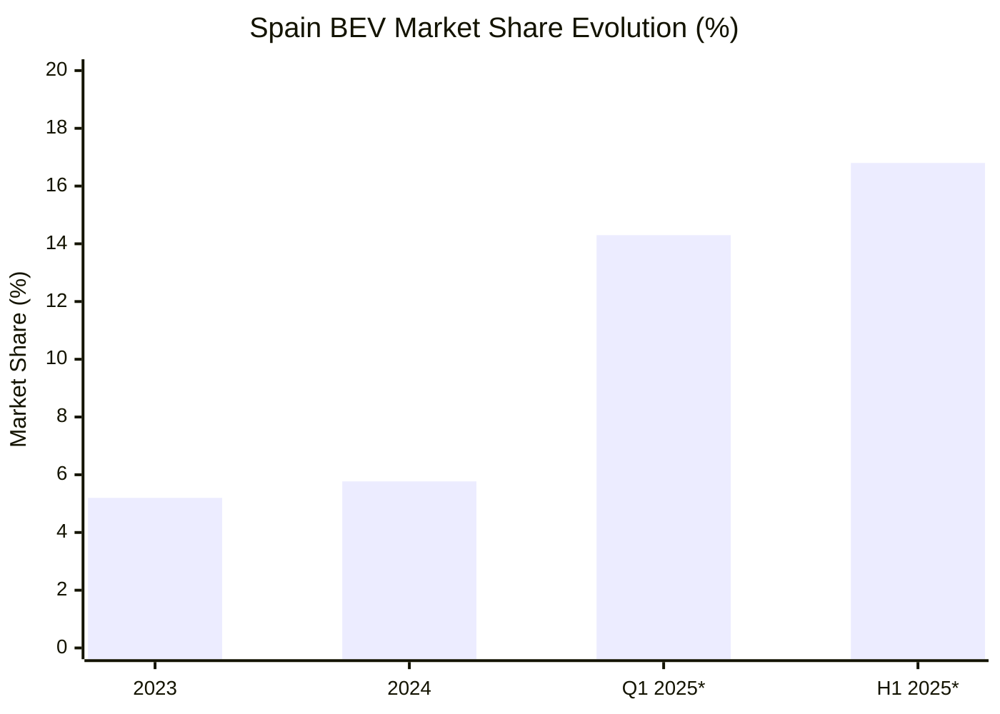

# Battery Electric Vehicle Sales Penetration Data in Spain

## Full Year 2023

### BEV Market Penetration
According to [AEDIVE's Annual Mobility Report 2022-2023](https://aedive.es/), Spain's BEV passenger car market share reached **5.2%** in 2023. The total electrified vehicle penetration (BEV + PHEV) was **12.0%** of all passenger car sales.

### Sales Volume
- **BEV Units Sold**: Approximately 54,462 units
- **Total Passenger Car Sales**: ~1,047,311 units
- **Year-over-Year Growth**: +31% for BEV segment

## Full Year 2024

### BEV Market Penetration
Based on data from [ANFAC](https://anfac.com/) and the [European Alternative Fuels Observatory](https://alternative-fuels-observatory.ec.europa.eu/general-information/news/spain-bev-passenger-car-sales-increased-78-2024), Spain's BEV market share increased to **5.77%** in 2024.

### Sales Performance
- **BEV Units Sold**: 58,675 units (+7.8% vs 2023)
- **Total Market**: 1,016,885 passenger cars sold
- **Total Electrified (BEV+PHEV)**: 11.4% market share (-0.6 percentage points vs 2023)

### Market Dynamics
The slight decline in overall electrified vehicle share despite BEV growth indicates a reduction in PHEV sales, suggesting a market shift toward pure electric vehicles.

## Q1 2025 (January-March)

### Market Performance
According to [ACEA's Q1 2025 report](https://www.acea.auto/pc-registrations/new-car-registrations-1-9-in-q1-2025-battery-electric-15-2-market-share/), the first quarter showed strong momentum:

- **Total Electrified Market Share**: 14.3% of new passenger car registrations
- **BEV Units Sold**: 19,201 electric cars
- **Growth Rate**: +45.1% increase in electrified vehicle registrations vs Q1 2024

### Monthly Breakdown
According to [ANFAC January 2025 data](https://anfac.com/el-2025-arranca-con-una-subida-del-53-en-las-matriculaciones-de-turismos-nuevos/):
- **January 2025**: Strong start with 5.3% year-over-year growth in total market

## H1 2025 (January-June)

### Accelerating Growth
Based on [ANFAC's June 2025 report](https://anfac.com/los-vehiculos-electrificados-logran-27-207-ventas-en-junio/), the first half of 2025 showed remarkable acceleration:

- **Total Electrified Market Share**: 16.8% of passenger car market
- **Electrified Units**: 102,348 units (+83% vs H1 2024)
- **June 2025 Performance**: 20.8% market share (24,776 units)

### BEV Specific Performance (June 2025)
- **Units Sold**: 11,243 units
- **Growth**: +103.2% vs June 2024
- **Market Momentum**: Highest monthly growth rate in recent years

## Comparative Analysis

### Year-over-Year Progression

*Note: Q1 and H1 2025 figures include total electrified vehicles (BEV+PHEV)

### European Context
According to [El Español Motor analysis](https://www.elespanol.com/motor/20250122/espana-ocupa-posicion-total-europa-penetracion-coche-electrico/918158192_0.html), Spain ranks **20th out of 27 EU countries** in BEV penetration as of 2024, with its 5.6% market share significantly below the EU average of 24%.

## Key Observations

1. **Steady Growth**: BEV penetration has grown consistently from 5.2% (2023) to 5.77% (2024)
2. **2025 Acceleration**: Dramatic acceleration in H1 2025, with electrified vehicles reaching 16.8% market share
3. **June 2025 Milestone**: 20.8% electrified market share indicates potential tipping point
4. **Below EU Average**: Despite growth, Spain lags significantly behind EU peers

## Data Reliability

All data points are sourced from official industry associations:
- **ANFAC**: Spanish Automobile Manufacturers' Association (official registration data)
- **AEDIVE**: Spanish Electric Vehicle Business Association (industry reports)
- **ACEA**: European Automobile Manufacturers' Association (EU-wide comparisons)
- **European Alternative Fuels Observatory**: EU Commission's official data platform

## References

1. AEDIVE (2023). Anuario de la Movilidad Eléctrica 2022-2023. [https://aedive.es/](https://aedive.es/)
2. ANFAC (2025). Los vehículos electrificados logran 27.207 ventas en junio. [https://anfac.com/](https://anfac.com/)
3. ACEA (2025). New car registrations Q1 2025. [https://www.acea.auto/](https://www.acea.auto/)
4. European Alternative Fuels Observatory (2025). Spain BEV passenger car sales increased 7.8% in 2024. [https://alternative-fuels-observatory.ec.europa.eu/](https://alternative-fuels-observatory.ec.europa.eu/)
5. El Español Motor (2025). España ocupa la posición 20 de Europa en penetración del coche eléctrico. [https://www.elespanol.com/motor/](https://www.elespanol.com/motor/)