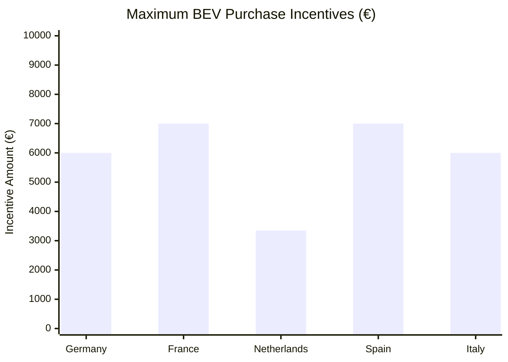

# Government Policies and Incentives for BEV Adoption in Spain

## Plan MOVES III: Spain's Primary EV Incentive Program

### Program Overview
According to [IDAE (Institute for Energy Diversification and Saving)](https://www.idae.es/ayudas-y-financiacion/para-movilidad-y-vehiculos/moves-iii-2025), Plan MOVES III is Spain's flagship electric vehicle incentive program, representing the country's most significant policy intervention in the EV market.

### Total Investment
- **Current Budget**: €1,735 million (as of 2025)
- **2025 Extension**: €400 million allocated specifically for 2025
- **Program Duration**: Extended until December 31, 2025

### Subsidy Structure
Based on [Official Government Decree (BOE-A-2025-6596)](https://www.boe.es/diario_boe/txt.php?id=BOE-A-2025-6596):

#### For Private Consumers
- **BEV Purchase**: Up to €7,000 per vehicle
- **With Vehicle Scrapping**: Additional €2,500 bonus
- **Income Requirements**: Available to all income levels

#### For Commercial and Fleet Purchases
- **Light Commercial Vehicles**: Up to €9,000
- **Taxis and VTC**: Enhanced subsidies available
- **Fleet Limit**: Increased from 50 to 250 vehicles per applicant (2023 modification)

### Key Policy Evolution

#### 2023 Modifications
- **Fleet Expansion**: Vehicle limit per applicant increased from 50 to 250 vehicles
- **Budget Increase**: Additional €300 million allocated
- **Administrative Streamlining**: Simplified application process

#### 2024 Extensions
- **Budget Supplement**: €350 million added to program
- **Duration Extension**: Program extended through 2024
- **Regional Distribution**: Funds allocated based on regional demand

#### 2025 Updates
According to [Real Decreto-ley 3/2025](https://www.boe.es/diario_boe/txt.php?id=BOE-A-2025-6596) (April 1, 2025):
- **Retroactive Application**: Benefits apply from January 1, 2025
- **New Budget**: €400 million specifically for 2025
- **Extended Deadline**: Program continues until December 31, 2025

## Tax Incentives and Fiscal Benefits

### Vehicle Registration Tax
- **BEV Exemption**: 0% registration tax for pure electric vehicles
- **Standard Rate Comparison**: Conventional vehicles pay 0-14.75% based on CO2 emissions

### Annual Road Tax (IVTM)
- **Municipal Discounts**: Up to 75% reduction available (varies by municipality)
- **Madrid**: 75% discount for BEVs
- **Barcelona**: 75% discount for zero-emission vehicles

### Corporate Tax Benefits
- **Accelerated Depreciation**: Enhanced depreciation schedules for company BEVs
- **VAT Deductibility**: Full VAT recovery for business use

## Regional Government Initiatives

### Autonomous Community Programs
Various regional governments offer additional incentives complementing MOVES III:

#### Catalonia
- **Additional subsidies**: Up to €2,000 extra for BEV purchases
- **Infrastructure support**: Grants for private charging installation

#### Madrid
- **Taxi modernization**: Specific programs for taxi fleet electrification
- **Public charging**: Investment in public infrastructure

#### Basque Country
- **EVE Program**: Regional energy agency provides additional €2,500 for BEVs

## National Strategic Framework

### PNIEC 2021-2030 (National Integrated Energy and Climate Plan)
According to government sources, Spain's climate strategy includes:
- **2030 Target**: 5.5 million electrified vehicles
- **Emissions Reduction**: 23% reduction in transport sector emissions
- **Investment Plan**: €13.2 billion for sustainable mobility

### Recovery, Transformation and Resilience Plan
EU NextGenerationEU funds allocation:
- **Total Mobility Investment**: €6.5 billion
- **EV-specific**: €2.9 billion for electric mobility
- **Infrastructure**: €1.5 billion for charging networks

## Infrastructure Development Policies

### Charging Infrastructure Requirements
Based on [Royal Decree 29/2021](https://www.boe.es/):
- **New Buildings**: Mandatory charging pre-installation
- **Public Buildings**: Required charging points for parking >20 spaces
- **Highway Network**: Charging points every 50km on major routes

### Public Investment Programs
- **MOVES Singulares**: €300 million for innovative charging projects
- **MOVES Flotas**: Specific program for fleet electrification

## Policy Effectiveness Analysis

### Strengths
1. **Substantial Funding**: €1.735 billion represents significant commitment
2. **Comprehensive Coverage**: Includes vehicles, infrastructure, and innovation
3. **Regional Flexibility**: Allows autonomous communities to add incentives

### Challenges
According to industry analysis:
1. **Administrative Delays**: Average 6-9 months for subsidy disbursement
2. **Budget Exhaustion**: Some regions exhaust funds quickly
3. **Awareness Gap**: Limited public knowledge of available incentives

## International Comparison

### EU Context
Spain's incentive structure compared to leading EU markets:

## Future Policy Outlook

### Planned Initiatives (2025-2030)
- **Zero Emission Zones**: Mandatory in cities >50,000 inhabitants by 2025
- **Fleet Requirements**: Progressive electrification mandates for public fleets
- **Carbon Pricing**: Potential implementation of carbon tax on fossil fuels

## References

1. IDAE (2025). MOVES III 2025. [https://www.idae.es/ayudas-y-financiacion/para-movilidad-y-vehiculos/moves-iii-2025](https://www.idae.es/ayudas-y-financiacion/para-movilidad-y-vehiculos/moves-iii-2025)
2. BOE (2025). Real Decreto-ley 3/2025. [https://www.boe.es/diario_boe/txt.php?id=BOE-A-2025-6596](https://www.boe.es/diario_boe/txt.php?id=BOE-A-2025-6596)
3. Spanish Government (2021). Plan Nacional Integrado de Energía y Clima 2021-2030
4. European Commission (2021). Spain's Recovery and Resilience Plan
5. Ministry for Ecological Transition (2023). Estrategia de Movilidad Sostenible