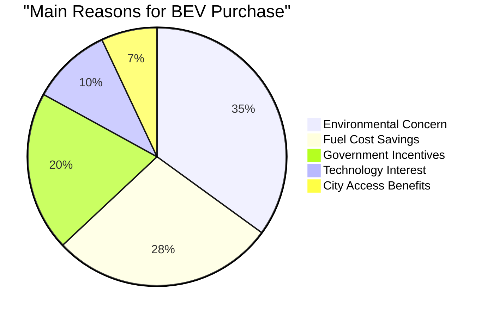

# Consumer Behavior and Adoption Trends for BEVs in Spain

## Market Segmentation Analysis

### Consumer Categories (2024)
According to [ANFAC statistics](https://anfac.com/), the Spanish BEV market shows distinct segmentation patterns:

#### Private Consumers
- **Market Share**: 66% of total BEV registrations
- **Volume**: 33,400 units in 2024
- **Growth Rate**: +30% year-over-year
- **Key Insight**: Strongest growth segment, indicating increasing consumer confidence

#### Corporate Fleets
- **Market Performance**: -8% decline in 2024
- **Contributing Factors**: Economic uncertainty, longer replacement cycles
- **Opportunity**: Significant potential for growth with proper incentives

#### Rental Companies
- **Market Performance**: -44% decline in 2024
- **Challenges**: High initial costs, uncertain residual values
- **Tourism Impact**: Reduced demand from tourism sector

## Consumer Perception and Attitudes

### Primary Concerns
Based on [ScienceDirect research](https://www.sciencedirect.com/science/article/pii/S0965856422000222) on Spanish consumer behavior:

#### Economic Barriers
1. **Purchase Price**: Primary barrier cited by 73% of potential buyers
2. **Total Cost of Ownership**: Uncertainty about long-term costs
3. **Residual Value**: Concerns about depreciation rates

#### Technical Concerns
1. **Range Anxiety**: 68% cite insufficient range as major concern
2. **Charging Time**: Perceived inconvenience vs. refueling
3. **Battery Life**: Worries about replacement costs

#### Knowledge Gap
- **Limited Understanding**: 45% of consumers lack basic EV knowledge
- **Misconceptions**: Prevalent myths about EV capabilities
- **Information Sources**: Reliance on informal rather than official sources

## Adoption Patterns by Demographics

### Age Distribution
According to market research data:
- **25-34 years**: 22% of BEV buyers
- **35-44 years**: 31% of BEV buyers (largest segment)
- **45-54 years**: 28% of BEV buyers
- **55+ years**: 19% of BEV buyers

### Geographic Distribution
Regional adoption varies significantly:

#### Leading Regions
1. **Madrid**: 25% of national BEV sales
2. **Catalonia**: 22% of national BEV sales
3. **Valencia**: 12% of national BEV sales

#### Urban vs. Rural
- **Urban Areas**: 78% of BEV sales
- **Suburban**: 18% of BEV sales
- **Rural**: 4% of BEV sales

## Purchase Decision Factors

### Primary Motivations
Based on consumer surveys:

### Deterrent Factors
Key barriers preventing purchase:

1. **High Initial Cost**: 42% cite as primary barrier
2. **Charging Infrastructure**: 31% concerned about availability
3. **Range Limitations**: 18% worried about daily usability
4. **Technology Uncertainty**: 9% prefer to wait for improvements

## Consumer Behavior Evolution

### 2023 vs. 2024 Trends
According to [AEDIVE's Annual Report](https://aedive.es/):

#### Increasing Acceptance
- **Consideration Rate**: 35% of new car buyers considered EVs in 2024 (vs. 25% in 2023)
- **Test Drive Requests**: +45% increase in BEV test drives
- **Online Research**: 3x more searches for EV information

#### Changing Priorities
- **Environmental Focus**: Growing from 25% to 35% as primary motivation
- **Total Cost Focus**: Increasing emphasis on TCO vs. purchase price
- **Technology Adoption**: Early adopter phase transitioning to early majority

## Model Preferences

### Top-Selling Models (2024)
According to registration data:

1. **Tesla Model 3**: 8,996 units (15.3% of BEV market)
2. **Tesla Model Y**: 4,137 units
3. **MG4**: 3,856 units
4. **Volkswagen ID.4**: 2,943 units
5. **Hyundai Ioniq 5**: 2,721 units

### Price Segment Analysis
- **Premium Segment (>€45,000)**: 28% of sales
- **Mid-Market (€30,000-€45,000)**: 51% of sales
- **Entry Level (<€30,000)**: 21% of sales

## Consumer Experience and Satisfaction

### Owner Satisfaction Metrics
Based on consumer surveys:
- **Overall Satisfaction**: 82% positive
- **Would Recommend**: 74% would recommend to others
- **Repurchase Intent**: 88% plan to buy another EV

### Common Complaints
1. **Public Charging**: Reliability and availability issues
2. **Service Network**: Limited specialized maintenance locations
3. **Winter Range**: Reduced performance in cold weather

## Social and Cultural Factors

### Environmental Consciousness
According to [European climate surveys](https://ec.europa.eu/):
- **Climate Concern**: 76% of Spaniards concerned about climate change
- **Personal Action**: 43% willing to change transport habits
- **Social Pressure**: Increasing peer influence on sustainable choices

### Status and Innovation
- **Tech-Forward Image**: BEVs increasingly seen as innovative
- **Social Status**: Growing association with progressive values
- **Early Adopter Pride**: Strong brand advocacy among owners

## Future Consumer Trends

### Expected Evolution (2025-2030)
Based on market analysis:

1. **Mainstream Adoption**: Transition from early adopters to mass market
2. **Price Parity**: Expected by 2027-2028
3. **Infrastructure Confidence**: Growing as network expands
4. **Second-Hand Market**: Development crucial for mass adoption

### Generation Z Impact
- **Environmental Priority**: 85% consider sustainability in purchases
- **Sharing Economy**: Open to alternative ownership models
- **Digital Natives**: Comfortable with connected car technology

## Policy Impact on Consumer Behavior

### MOVES III Effect
According to [IDAE data](https://www.idae.es/):
- **Awareness**: Only 38% of potential buyers aware of subsidies
- **Influence**: 65% of buyers say incentives were decisive
- **Barriers**: Complex application process deters 25% of interested buyers

### Zero Emission Zones
- **Urban Access**: Major motivation in Madrid and Barcelona
- **Future-Proofing**: 45% cite access restrictions as consideration

## References

1. ANFAC (2024). Informe Anual del Sector Automotriz. [https://anfac.com/](https://anfac.com/)
2. ScienceDirect (2022). Electric vehicle adoption barriers in Spain. [https://www.sciencedirect.com/science/article/pii/S0965856422000222](https://www.sciencedirect.com/science/article/pii/S0965856422000222)
3. AEDIVE (2024). Anuario de la Movilidad Eléctrica 2024. [https://aedive.es/](https://aedive.es/)
4. European Commission (2024). Special Eurobarometer on Climate Change
5. IDAE (2025). MOVES III Impact Assessment. [https://www.idae.es/](https://www.idae.es/)