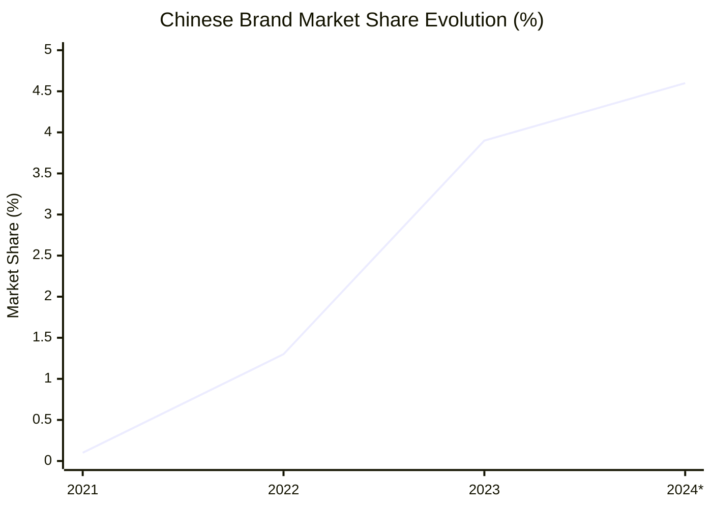
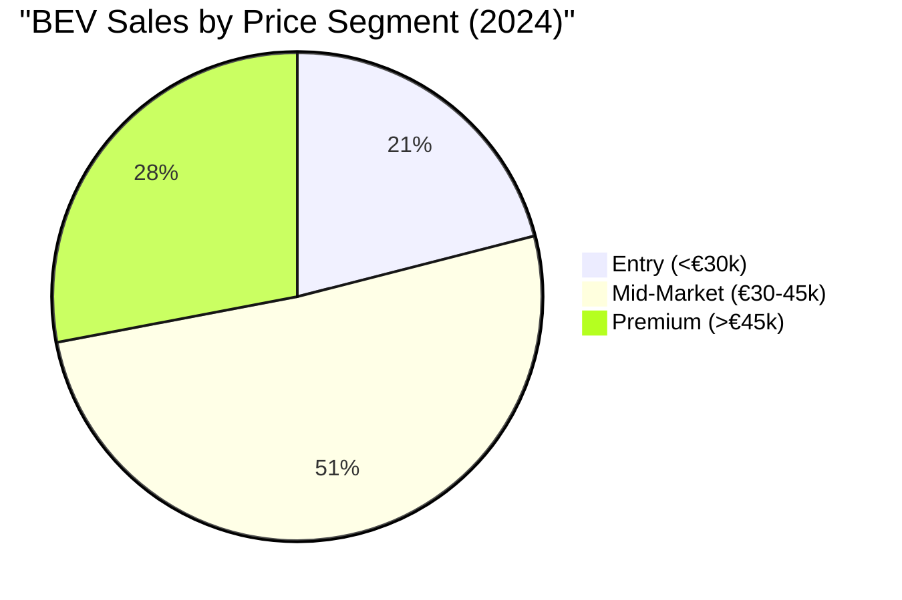

# Key Industry Players and Market Strategies in Spain's BEV Market

## Market Leaders by Sales Volume (2024)

### Tesla - Market Leader
According to [ANFAC registration data](https://anfac.com/), Tesla maintains its dominant position:

#### Performance Metrics
- **Total Units Sold**: 13,133 vehicles (2024)
- **Market Share**: 22.4% of BEV segment
- **Top Models**: 
  - Model 3: 8,996 units (best-selling BEV in Spain)
  - Model Y: 4,137 units

#### Strategy in Spain
- **Direct Sales Model**: No dealerships, online sales only
- **Supercharger Network**: 50+ Supercharger locations across Spain
- **Service Centers**: Madrid, Barcelona, Valencia, Seville

### Volkswagen Group
Strong multi-brand presence:

#### Brand Performance
- **VW Brand**: ID.4 (2,943 units), ID.3 (2,156 units)
- **Audi**: e-tron models combined ~2,100 units
- **SEAT/CUPRA**: Born (1,847 units)
- **Skoda**: Enyaq (1,623 units)

#### Group Strategy
- **Localization**: SEAT/CUPRA Born produced in Spain (Martorell)
- **Dealer Network**: Leveraging extensive existing network
- **Multi-Brand Approach**: Different price points and segments

### Stellantis Group
Diverse portfolio approach:

#### Key Brands and Models
- **Peugeot**: e-208 (2,234 units), e-2008 (1,456 units)
- **Citroën**: ë-C4 (987 units)
- **Opel**: Corsa-e (1,123 units), Mokka-e (876 units)
- **Fiat**: 500e (1,543 units)

#### Market Strategy
- **Electrification of Popular Models**: Focus on familiar nameplates
- **Competitive Pricing**: Targeting mass market segments

## Chinese Manufacturers - Rising Force

### Market Evolution
According to [industry analysis](https://www.elespanol.com/motor/), Chinese brands show rapid growth:

*2024 data through November

### Leading Chinese Brands

#### MG Motor (SAIC)
- **Star Model**: MG4 (3,856 units in 2024)
- **Market Position**: 3rd best-selling BEV
- **Strategy**: Aggressive pricing, 7-year warranty

#### BYD
- **Entry Year**: 2023
- **Models**: Atto 3, Dolphin, Seal
- **Distribution**: Partnership with local dealer groups
- **Growth**: From 0 to ~1,200 units in first full year

#### NIO
- **Premium Positioning**: Competing with German luxury brands
- **Battery-as-a-Service**: Innovative ownership model
- **Expansion Plans**: First showroom in Madrid (2024)

### Chinese Brand Strategies
- **Price Competition**: 15-20% below European equivalents
- **Standard Features**: High equipment levels at base prices
- **Rapid Model Introduction**: Quick adaptation to market demands

## Traditional Manufacturers' EV Strategies

### Renault Group
According to market data:

#### Performance
- **Renault ZOE**: Phasing out but still ~1,200 units (2024)
- **Megane E-Tech**: 1,567 units
- **Twingo Electric**: 543 units

#### Strategy
- **Affordable EVs**: Focus on entry-level segment
- **Battery Leasing**: Alternative financing options

### Hyundai-Kia Group
Strong technology positioning:

#### Sales Performance
- **Hyundai Ioniq 5**: 2,721 units
- **Kia EV6**: 1,923 units
- **Kia Niro EV**: 1,234 units

#### Competitive Advantages
- **800V Architecture**: Ultra-fast charging capability
- **Design Innovation**: Award-winning designs
- **Long Warranty**: 7-year coverage

### BMW Group
Premium segment focus:

#### Model Performance
- **BMW iX**: ~800 units
- **BMW i4**: ~1,100 units
- **MINI Electric**: 876 units

#### Strategy
- **Premium Positioning**: Maintaining brand prestige
- **Technology Leadership**: Advanced driver assistance systems

## Market Entry Strategies

### Direct Sales Models
Companies bypassing traditional dealers:

1. **Tesla**: Pioneer of direct sales
2. **Polestar**: Online-only with experience centers
3. **NIO**: Direct sales with lifestyle centers
4. **Genesis**: Hybrid approach with brand stores

### Traditional Dealership Networks
Leveraging existing infrastructure:

- **Advantage**: Immediate national coverage
- **Challenge**: Dealer training and investment needs
- **Evolution**: Transitioning to "agency model"

## Manufacturing and Assembly in Spain

### Local Production Facilities
According to [ANFAC production data](https://anfac.com/):

#### SEAT Martorell
- **Model**: CUPRA Born
- **Capacity**: 50,000 units/year
- **Investment**: €500 million for electrification

#### Stellantis Vigo
- **Plans**: Electric vans from 2025
- **Investment**: €1 billion commitment

#### Mercedes-Benz Vitoria
- **Future**: Electric vans production
- **Timeline**: Starting 2025-2026

### Battery Manufacturing Plans
- **Volkswagen-SEAT Battery Cell Factory**: Sagunto, Valencia
- **Investment**: €7 billion
- **Capacity**: 40 GWh annually by 2030
- **Jobs**: 3,000+ direct employment

## Charging Infrastructure Players

### Major Operators
According to [AEDIVE infrastructure report](https://aedive.es/):

#### Iberdrola
- **Network Size**: 3,500+ public charging points
- **Investment Plan**: €150 million by 2025
- **Strategy**: Highway corridors and urban hubs

#### Endesa X
- **Public Points**: 2,800+
- **Growth Plan**: 8,000 points by 2025
- **Focus**: Urban areas and shopping centers

#### International Players
- **Ionity**: 23 high-power charging stations
- **Tesla Superchargers**: 50+ locations (opening to other brands)
- **Shell Recharge**: Expanding through acquisition

## Strategic Alliances and Partnerships

### Government-Industry Collaboration
- **PERTE VEC**: Strategic Project for Electric Vehicle
- **Investment**: €4.3 billion public-private partnership
- **Participants**: 62 companies led by SEAT-VW

### Charging Network Agreements
- **Cross-Network Access**: Roaming agreements between operators
- **Payment Integration**: Unified payment systems
- **Location Partnerships**: Agreements with retailers and municipalities

## Competitive Dynamics

### Price Competition
Market positioning by segment:

### Technology Differentiation
Key competitive factors:
1. **Range**: 400+ km becoming standard
2. **Charging Speed**: 800V systems gaining traction
3. **Software**: OTA updates and connectivity
4. **ADAS**: Advanced driver assistance features

## Future Market Outlook

### Expected New Entrants (2025-2026)
- **Xiaomi**: Announced entry plans
- **Vietnamese VinFast**: European expansion
- **Additional Chinese Brands**: Xpeng, Li Auto exploring market

### Market Consolidation Trends
- **Partnership Formation**: Traditional OEMs with tech companies
- **Platform Sharing**: Reducing development costs
- **Charging Network Consolidation**: M&A activity increasing

## References

1. ANFAC (2024). Estadísticas de Matriculaciones. [https://anfac.com/](https://anfac.com/)
2. El Español Motor (2024). Análisis del mercado de vehículos eléctricos. [https://www.elespanol.com/motor/](https://www.elespanol.com/motor/)
3. AEDIVE (2024). Informe de Infraestructura de Recarga. [https://aedive.es/](https://aedive.es/)
4. European Alternative Fuels Observatory (2024). Spain Market Report
5. Ministry of Industry (2024). PERTE VEC Progress Report