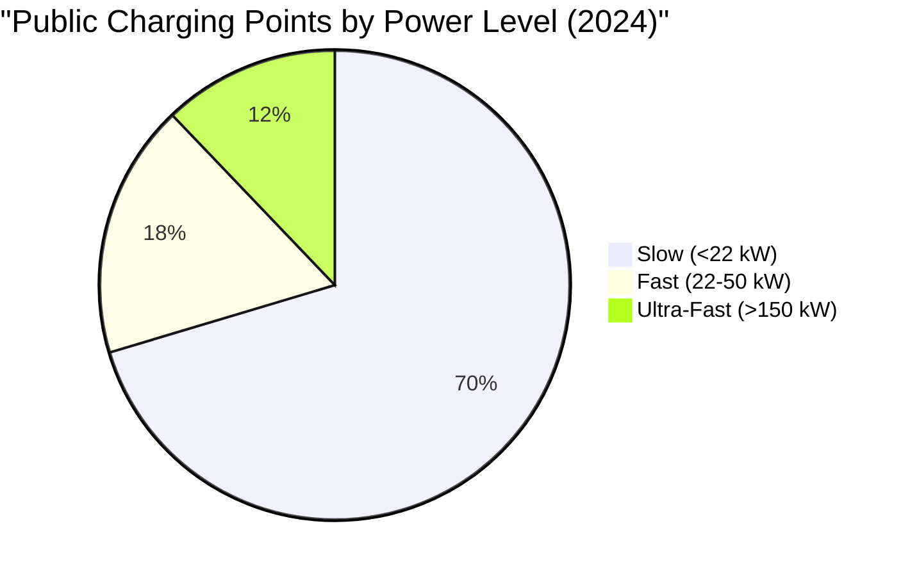
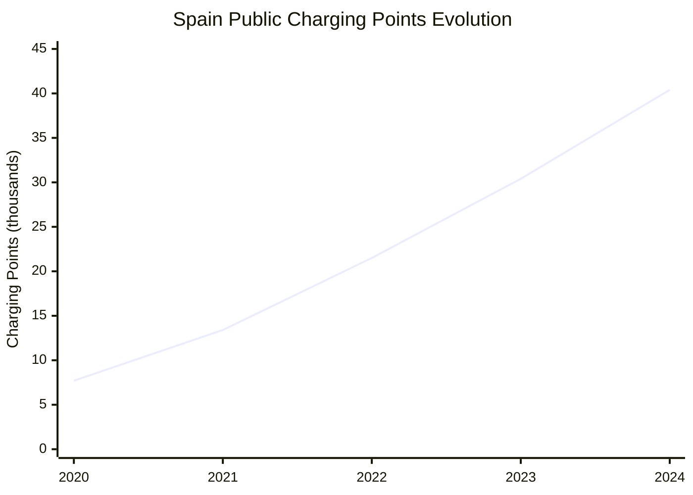
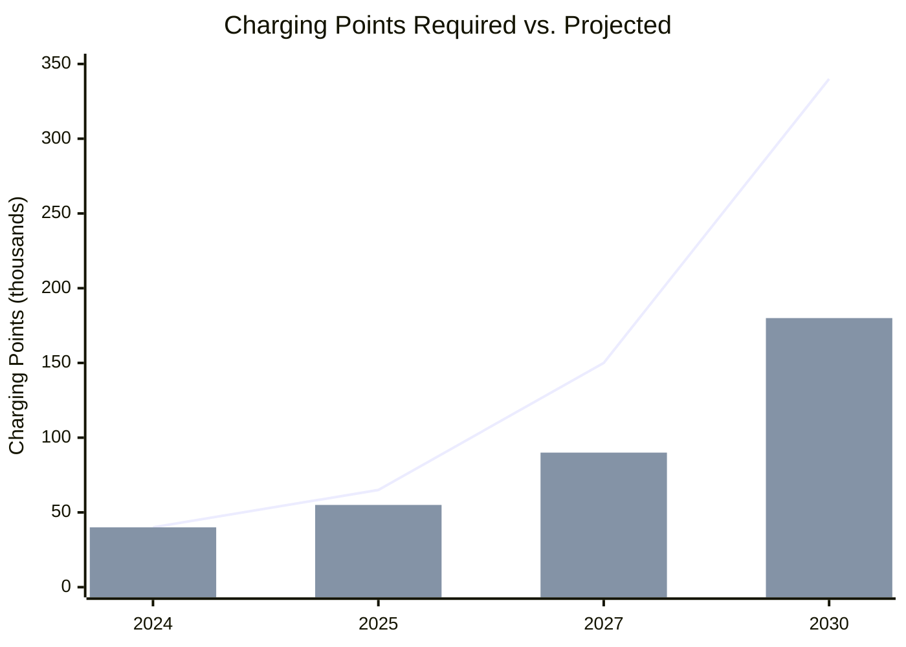

# Charging Infrastructure and Network Development in Spain

## Current Infrastructure Status (2024)

### Overall Network Size
According to [AEDIVE's 2024 Infrastructure Report](https://www.esmartcity.es/2024/03/25/anuario-aedive-refleja-2023-se-instalaron-8777-puntos-recarga-ve-acceso-publico), Spain's public charging infrastructure has shown significant growth:

#### Key Metrics
- **Total Public Charging Points**: 40,438 (end of 2024)
- **Annual Growth**: +33% compared to 2023 (30,350 points)
- **New Installations (2024)**: 10,088 charging points
- **Investment (2023)**: €330 million in charging infrastructure

### Charging Point Distribution by Power

#### Power Category Breakdown
- **Slow Charging (<22 kW)**: 70.4% of total network
- **Fast Charging (22-50 kW)**: 17.5% of network
- **Ultra-Fast Charging (>150 kW)**: 12.1% of network

### Geographic Distribution

#### Regional Coverage
According to infrastructure mapping data:

1. **Madrid**: 6,847 public charging points (16.9%)
2. **Catalonia**: 6,234 points (15.4%)
3. **Andalusia**: 4,892 points (12.1%)
4. **Valencia**: 4,156 points (10.3%)
5. **Basque Country**: 2,743 points (6.8%)

#### Urban vs. Highway Coverage
- **Urban Areas**: 85% of charging infrastructure
- **Highways/Corridors**: 15% of infrastructure
- **Coverage Gap**: <80% of highways have charging every 50km

## Infrastructure Development Trajectory

### Historical Growth Pattern

### Ultra-Fast Charging Expansion
Based on [AEDIVE data](https://aedive.es/):
- **2022**: 1,243 ultra-fast points
- **2023**: 2,510 ultra-fast points (+102%)
- **2024**: 4,905 ultra-fast points (+95%)
- **Growth Focus**: Priority on high-power charging

## Key Infrastructure Challenges

### Technical and Operational Issues
According to industry reports:

#### Reliability Problems
- **Availability Rate**: Only 73% of chargers operational at any time
- **Maintenance Issues**: Average downtime of 12% monthly
- **User Experience**: 31% of sessions encounter technical problems

#### Payment System Fragmentation
- **Card Reader Availability**: Only 9.1% have physical card readers
- **Contactless Payment**: 4.6% allow tap-to-pay
- **App Requirements**: 86% require specific mobile applications
- **Roaming Limitations**: Inconsistent cross-network access

### Coverage Gaps
Based on [European Alternative Fuels Observatory](https://alternative-fuels-observatory.ec.europa.eu/) analysis:

#### Highway Network
- **Current Status**: <80% coverage at 50km intervals
- **EU Requirement**: Charging every 60km on TEN-T network by 2025
- **Investment Needed**: €500 million for complete highway coverage

#### Rural Areas
- **Coverage**: <5% of rural municipalities have public charging
- **Challenge**: Low utilization rates make business case difficult
- **Solution Need**: Public investment required

## Major Infrastructure Operators

### Leading Network Operators

#### Iberdrola
According to company data:
- **Public Points**: 3,500+ operational
- **Investment Plan**: €150 million by 2025
- **Target**: 100,000 charging points by 2030
- **Strategy**: Focus on highways and urban hubs

#### Endesa X
- **Network Size**: 2,800+ public charging points
- **Expansion Plan**: 8,000 points by 2025
- **Investment**: €200 million committed
- **Focus Areas**: Shopping centers, urban areas

#### Repsol
- **Current Network**: 1,800+ charging points
- **2025 Target**: 5,000 public points
- **Strategy**: Leveraging existing gas station network
- **Ultra-Fast Focus**: 1,000 high-power chargers planned

### International Players

#### Tesla Supercharger Network
- **Locations**: 50+ Supercharger stations
- **Chargers**: 500+ individual stalls
- **Opening Strategy**: Progressive opening to non-Tesla vehicles
- **Expansion**: 20 new locations planned for 2025

#### Ionity
- **Stations**: 23 high-power charging locations
- **Network**: Part of European corridor
- **Power Output**: 350 kW capability
- **Partners**: BMW, Mercedes-Benz, Ford, VW Group

## Regulatory Framework for Infrastructure

### National Requirements
Based on [Royal Decree 29/2021](https://www.boe.es/):

#### New Buildings (from 2023)
- **Residential**: Pre-installation for 100% of parking spaces
- **Non-Residential**: 1 charger per 40 parking spaces
- **Public Access**: Minimum 1 fast charger for buildings >20 spaces

#### Existing Buildings
- **Large Parking (>20 spaces)**: Must install by 2025
- **Public Buildings**: Mandatory charging infrastructure
- **Retrofit Support**: Subsidies available through MOVES program

### EU Alternative Fuels Infrastructure Regulation (AFIR)
Requirements for Spain:
- **2025**: Charging every 60km on TEN-T core network
- **2030**: Charging every 60km on comprehensive network
- **Power Requirements**: Minimum 150kW at highway locations

## Investment and Funding

### Public Investment Programs
According to [IDAE](https://www.idae.es/):

#### MOVES Singulares II
- **Budget**: €300 million for innovative projects
- **Focus**: High-power charging, innovative solutions
- **Recipients**: Public-private partnerships

#### Recovery Fund Allocation
- **Total**: €1.5 billion for charging infrastructure
- **Timeline**: 2021-2026
- **Target**: 100,000 public charging points by 2030

### Private Sector Investment
Industry commitments:
- **Total Announced**: €2.5 billion by 2030
- **Major Investors**: Energy companies, oil companies, utilities
- **Business Models**: Evolution from subsidized to commercial

## Technology and Innovation

### Charging Technology Trends

#### Power Output Evolution
- **Current Standard**: 50-150 kW for fast charging
- **Emerging**: 350-400 kW ultra-rapid charging
- **Future**: 500+ kW for commercial vehicles

#### Smart Charging Features
- **V2G Capability**: Pilot projects in Madrid and Barcelona
- **Dynamic Pricing**: Time-of-use rates implementation
- **Load Management**: Grid integration systems

### Payment and Access Innovation
- **Plug & Charge**: ISO 15118 implementation starting
- **Unified Payment**: National roaming platform development
- **Contactless Payment**: Growing adoption of bank card payments

## Infrastructure Adequacy Analysis

### Current Ratio
According to [AEDIVE analysis](https://aedive.es/):
- **Vehicles per Public Charger**: 14.8 BEVs per charging point
- **EU Average**: 10 vehicles per charging point
- **Optimal Ratio**: 7-10 vehicles per public charger

### Future Requirements
Based on PNIEC 2030 targets:

Legend: Line = Required, Bar = Current Trajectory

### Investment Gap
- **Required Investment**: €5 billion by 2030
- **Committed Investment**: €2.5 billion
- **Gap**: €2.5 billion additional investment needed

## Best Practices and Success Stories

### Barcelona Metropolitan Area
- **Integrated Planning**: Coordinated municipal approach
- **Density**: 1 charger per 2.3 km²
- **Utilization**: 65% average daily usage

### Madrid Central District
- **Zero Emission Zone Integration**: Charging linked to access policies
- **Resident Priority**: Reserved charging for local residents
- **Success Metric**: 80% user satisfaction rate

## Key Recommendations from Industry

According to [ANFAC and AEDIVE joint recommendations](https://anfac.com/):

1. **Simplify Permits**: Streamline administrative procedures
2. **Ensure Interoperability**: Mandatory roaming agreements
3. **Improve Reliability**: Minimum 95% uptime requirements
4. **Transparent Pricing**: Clear, comparable pricing across networks
5. **Rural Investment**: Specific programs for underserved areas

## References

1. AEDIVE (2024). Anuario de Infraestructura de Recarga. [https://www.esmartcity.es/2024/03/25/anuario-aedive-refleja-2023-se-instalaron-8777-puntos-recarga-ve-acceso-publico](https://www.esmartcity.es/2024/03/25/anuario-aedive-refleja-2023-se-instalaron-8777-puntos-recarga-ve-acceso-publico)
2. European Alternative Fuels Observatory (2024). Infrastructure Statistics Spain. [https://alternative-fuels-observatory.ec.europa.eu/](https://alternative-fuels-observatory.ec.europa.eu/)
3. IDAE (2024). MOVES Infrastructure Programs. [https://www.idae.es/](https://www.idae.es/)
4. BOE (2021). Real Decreto 29/2021. [https://www.boe.es/](https://www.boe.es/)
5. ANFAC (2024). Infrastructure Development Report. [https://anfac.com/](https://anfac.com/)